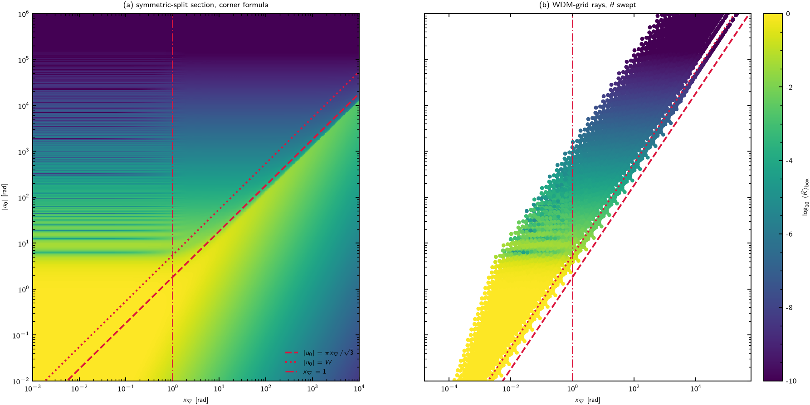

# The flat-SPP PCFM closed form and the $(x_\nabla,|u_0|)$ phase diagram

**Question.** Does the polynomial closed-form model (PCFM) of
Jiang–Poggiolini, specialized to a flat spatial power profile (SPP) and the
locally quadratic dispersion with effective coefficient $\beta_{2,\rm eff}$,
generate the $(x_\nabla,|u_0|)$ phase diagram of
[`lorenzi_fast_method.md`](../../docs/source/lorenzi_fast_method.md) §10.2;
does $\beta_{2,\rm eff}$ act as one of its parameters; does the treatment
extend, through the local $\beta_2$, to phase-matched FWM in the O band; and
does it resolve the $n$-PC sectors or only complete XPM?

**Answers, proved below.**

1. The flat-SPP PCFM core integral equals the rectangle average of the link
   kernel $\hat K(u)=4\sin^2(u/2)/u^2$ under the exact bilinear phase
   (Prop. 1), and this average has the closed form
   $E=\Delta^2\Psi_1/\Delta^2X$, where $\Delta^2$ is the rectangle second
   difference — the alternating sum over the four corners of the
   integration rectangle, defined in Prop. 2 — applied to one special
   function of the corner phases. The four region laws of §10.2, boundaries
   and exponents included, are the four asymptotic regimes of $E$
   (Prop. 4) — in unmasked normalization.
2. $\beta_{2,\rm eff}$ enters only through $\theta=\beta_{2,\rm eff}B^2L$,
   which multiplies both coordinates: each channel pair occupies a fixed ray
   of the $(x_\nabla,u_0)$ plane whose slope $\mu$ is independent of
   dispersion (Prop. 3). Which tuples satisfy the phase-matching necessary
   condition $|u_0|<W$ is therefore grid geometry; $|\beta_{2,\rm eff}|$
   sets only the position along the ray.
3. At $\beta_{2,\rm eff}=0$ inside an island — the phase-matched O-band
   case, where PCFM2 replaces the phase by zero — the exact
   $\beta_3$-truncated phase is trilinear and separable, and the same
   ladder gives a third-difference closed form (Prop. 5).
4. The mask (the acceptance overlay $A_{\rm cond}$, $A(d)$) is not contained
   in the fixed-frequency rectangle closed form; it is reachable as a limit
   in the PCFM2 union-of-rectangles formulation (§6). A PSD-level CFM
   resolves only sector-summed aggregates: exact for strict FWM, complete
   XPM only for pairs; $n$-PC resolution requires fourth-order-moment terms
   outside the model (§7).

References: PCFM1 = [`any_island.pdf`](../../input/papers/any_island.pdf)
(Jiang & Poggiolini, arXiv:2602.03860v1); PCFM2 = Gao, Jiang & Poggiolini,
arXiv:2602.03860v2. Every numbered claim is checked in
[`verify_pcfm_flat_spp.py`](verify_pcfm_flat_spp.py) (§8).

**Notation.** Symbols of `lorenzi_fast_method.md` §1.1 are used unchanged:
$B$ symbol rate, $L$ span length, $u_0=\Delta\beta_0L$,
$\nu_j=\Delta\beta_{1,j}BL$, $x_\nabla=(\sum_j\nu_j^2)^{1/2}$,
$\mu=u_0/x_\nabla$, $W=\pi\sum_j|\nu_j|$, in-channel offsets
$x_j\in(-\pi,\pi)$ (angular offset $Bx_j$), support shift $d$, local GVD
terms $q_j$ with $\bar q$ their common value in (10.5.3), grid ratio
$r=\Delta f/B$, kernel $\hat K$, acceptances $A(d)$, $A_{\rm cond}$,
per-tuple efficiency $N\,T^2\!/L^2=\mathbb E[\hat K(u)\,\mathbf 1_{\rm mask}]$,
carrier detunings $\Delta\omega_j=\omega_j^{\rm c}-\omega_t^{\rm c}$
(§15.2). Note-local symbols, defined at first use: the detuning in
symbol-rate units $\Phi_j=\Delta\omega_j/B$; the dispersion scale
$\theta=\beta_{2,\rm eff}B^2L$ (and $\theta_3=\tfrac12\beta_3B^3L$); the
ladder functions $\Psi_k$; rectangle endpoints $p_i^\pm$, corner phases
$X_{s_1s_2}$, and the difference operators $\Delta^2$, $\Delta^3$. $E$
denotes the unmasked rectangle average of $\hat K$, matching the
equal-split reduction symbol $E$ of the main note (§4.1, §10.2).

## 1. The flat-SPP core integral

PCFM1 Eq. (3) defines, per island and span (single span, $f'_i$ measured
from the CUT frequency, $\mathfrak B\equiv4\pi^2\beta_{2,\rm eff}$; the
rectangle $[p_1^-,p_1^+]\times[p_2^-,p_2^+]$ is PCFM's
$a_k\le f'_1\le b_k$, $c_m\le f'_2\le d_m$),

$$
K_x(f_{\rm CUT})=\int_{p_1^-}^{p_1^+}\!\!\int_{p_2^-}^{p_2^+}
\left|\int_0^{L} p_x(z)\,e^{\,j\mathfrak B f'_1f'_2 z}\,dz\right|^2
df'_1\,df'_2 .
\tag{1}
$$

**Proposition 1.** For the flat SPP $p_x(z)=p_0$,

$$
\left|\,p_0\int_0^L e^{\,j\Theta z}dz\,\right|^2
=p_0^2L^2\,\hat K(\Theta L),
\qquad \Theta=\mathfrak B f'_1f'_2 ,
\tag{2}
$$

so, with $u(f'_1,f'_2)=\mathfrak B f'_1f'_2L$,

$$
K_x(f_{\rm CUT})
=p_0^2L^2\,(p_1^+-p_1^-)(p_2^+-p_2^-)\;
\Big\langle \hat K\big(u(f'_1,f'_2)\big)\Big\rangle_{\rm rect} .
\tag{3}
$$

*Proof.* Direct evaluation of the $z$-integral. $\blacksquare$

The right-hand side is the quantity the Lorenzi Fast method computes per
tuple — a channel-support average of $\hat K$ — with two differences: the
phase is the exact bilinear form rather than its in-channel linearization,
and the average is unmasked, at fixed $f_{\rm CUT}$ (§6). The bilinear form
is not an additional assumption relative to the fast method's variables: by
the exact identity `lorenzi_fast_method.md` (10.5.1), for a dispersion law
truncated at $\beta_3$,

$$
u/L=(\omega_a-\omega_c)(\omega_c-\omega_b)\,\beta_2(\bar\omega),
\qquad \bar\omega=\tfrac12(\omega_a+\omega_b),
\tag{4}
$$

and freezing $\beta_2(\bar\omega)$ at the island center is the
"$\beta_{2,\rm eff}$ per island" prescription of PCFM. §5 treats the case
where the freezing fails.

## 2. The ladder functions and the corner second difference

Define

$$
\Psi_0(X)=\int_0^X\hat K(t)\,dt=2\,{\rm Si}(X)-\frac{2(1-\cos X)}{X},
\qquad
\Psi_{k}(X)=\int_0^X\frac{\Psi_{k-1}(s)}{s}\,ds\quad(k\ge1).
\tag{5}
$$

Each $\Psi_k$ is odd and real-analytic at the origin
($\Psi_{k-1}(s)/s\to1$ as $s\to0$), and

$$
\Psi_1(X)=2\left[J(X)-{\rm Si}(X)+\frac{1-\cos X}{X}\right],
\qquad
J(X)=\int_0^X\frac{{\rm Si}(t)}{t}\,dt ,
\tag{6}
$$

as differentiation confirms term by term. Equivalently,

$$
X\,\Psi_1'(X)=\Psi_0(X),
\qquad
\big(X\,\Psi_1'(X)\big)'=\hat K(X).
\tag{7}
$$

**Proposition 2 (corner formula).** For any rectangle
$[p_1^-,p_1^+]\times[p_2^-,p_2^+]\subset\mathbb R^2$ and any constant
$\theta\ne0$,

$$
\big\langle \hat K(\theta\,p_1p_2)\big\rangle_{\rm rect}
=\frac{\Delta^2\Psi_1}{\Delta^2X} .
\tag{8}
$$

Here $X_{s_1s_2}=\theta\,p_1^{s_1}p_2^{s_2}$, $s_i\in\{+,-\}$, are the
accumulated phases at the four corners, and $\Delta^2$ is the **rectangle
second difference**: for any function $G$,

$$
\Delta^2G \;\equiv\; \sum_{s_1,s_2=\pm1} s_1s_2\,G\big(X_{s_1s_2}\big)
= G(X_{++})-G(X_{+-})-G(X_{-+})+G(X_{--}) .
$$

In particular
$\Delta^2X=\theta\,(p_1^+-p_1^-)(p_2^+-p_2^-)$. ($\Delta^2$ applied to a
function of the form $g(p_1)+h(p_2)$ gives zero; applied to the bilinear
monomial $p_1p_2$ it gives the area — it is the discrete analogue of the
mixed derivative $\partial^2/\partial p_1\partial p_2$, to which it reduces
in the small-rectangle limit used in (19).)

*Proof.* For $p_1\ne0$, the substitution $t=\theta p_1p_2$ and the oddness
of $\Psi_0$ give, for either sign of $p_1$,

$$
\int_{p_2^-}^{p_2^+} \hat K(\theta p_1p_2)\,dp_2
=\frac{\Psi_0(\theta p_1 p_2^+)-\Psi_0(\theta p_1 p_2^-)}{\theta p_1};
\tag{9}
$$

for each fixed endpoint $e\in\{p_2^-,p_2^+\}$, $e\neq0$, the substitution
$s=\theta p_1 e$ and the oddness of $\Psi_1$ give

$$
\int_{p_1^-}^{p_1^+} \frac{\Psi_0(\theta p_1 e)}{\theta p_1}\,dp_1
=\frac{\Psi_1(\theta p_1^+ e)-\Psi_1(\theta p_1^- e)}{\theta}.
\tag{10}
$$

The excluded lines $p_1=0$, $e=0$ have measure zero, the integrand is
bounded ($\hat K\le1$), and both sides of (8) are continuous in the corner
arguments, so the identity extends to rectangles containing them.
$\blacksquare$

**Identification with the PCFM objects.** With $\theta=\mathfrak BL$ and
$\lambda_\ell$ their corner constants ($\lambda_\ell=\mathfrak B\times$ the
four corner products):

| ladder object | PCFM1 | PCFM2 |
|---|---|---|
| $\Delta^2{\rm Si}$ combination | Eq. (12), $F(u)$ | Eq. (18), $F_{a,b;c,d}(t)$ |
| $J(X)$ | $J=X\,{}_2F_3(\ldots)$, after Eq. (17) | Eqs. (45)–(47), $H_0^{(\lambda)}$ |
| $\tfrac L2\Psi_1(\lambda L)$ | $\mathcal I_{0,1}(L;\lambda)$, Eq. (19) | $r=0$ branch of $M_r$, Eq. (55) |
| moment ladder | $\mathcal I_{p,q}$, $S_k$ | $M_r$, $H_r^{(\lambda)}$, $S_n$ |

The PCFM1 SCI case (their Eq. (20)) is the symmetric rectangle: corners
$X=\pm x$, $x=\pi^2\beta_{2,\rm eff}B^2L$, and (8) reduces to

$$
\big\langle\hat K\big\rangle_{\rm SCI}=\frac{\Psi_1(x)}{x}.
\tag{11}
$$

**Asymptotics of $\Psi_1$.** From $\hat K(u)=1-u^2/12+u^4/360-\cdots$,

$$
\Psi_0(X)=X-\frac{X^3}{36}+\frac{X^5}{1800}-\cdots,
\qquad
\Psi_1(X)=X-\frac{X^3}{108}+\frac{X^5}{9000}-\cdots .
\tag{12}
$$

From ${\rm Si}(X)=\frac\pi2-\frac{\cos X}{X}-\frac{\sin X}{X^2}+O(X^{-3})$,

$$
\Psi_0(X)=\pi-\frac2X-\frac{2\sin X}{X^2}+O(X^{-3})
\qquad(X\to+\infty),
\tag{13}
$$

and integrating $\Psi_0/X$,

$$
\Psi_1(X)=\pi\ln X+C_\infty+\frac2X+O(X^{-3}),
\qquad
C_\infty=\pi(\gamma-1)=-1.32823\ldots
\tag{14}
$$

The constant follows from
$J(X)={\rm Si}(X)\ln X-\int_0^X\ln t\,\frac{\sin t}{t}dt$ and
$\int_0^\infty\frac{\sin t}{t}\ln t\,dt=-\frac{\pi\gamma}{2}$, so
$J(X)-\frac\pi2\ln X\to\frac\pi2\gamma$. There is no oscillatory term at
order $X^{-1}$ or $X^{-2}$: the $\pm2\cos X/X$ contributions of ${\rm Si}$
and $(1-\cos X)/X$ cancel identically, so the fringe content of $\Psi_1$
first appears at $O(X^{-3})$.

## 3. Mapping to the normalized tuple variables

Fix the CUT-channel center ($x_t=0$; §6 restores it) and $d=0$. Let
$\Phi_j=\Delta\omega_j/B$ be the carrier detuning in symbol-rate units
($\Phi=2\pi r n$ at index separation $n$) and

$$
\theta\equiv\beta_{2,\rm eff}\,B^2L .
\tag{15}
$$

With pump offsets $x_a,x_b\in(-\pi,\pi)$, (4) reads

$$
u=-\theta\,(\Phi_a+x_a)(\Phi_b+x_b)
=\underbrace{-\theta\Phi_a\Phi_b}_{u_0}
\;\underbrace{-\,\theta\Phi_b\,x_a-\theta\Phi_a\,x_b}_{\text{linear}}
\;\underbrace{-\,\theta\,x_ax_b}_{\text{(10.5.3)}} .
\tag{16}
$$

The three-leg target-frame coefficients are $\nu_a=\theta\Phi_a$,
$\nu_b=\theta\Phi_b$, $\nu_c=\theta(\Phi_a+\Phi_b)$ (verified against
`fwm_tuple_variables` to $2\times10^{-12}$ relative, §8).

**Proposition 3.** Under (16),

$$
x_\nabla=|\theta|\sqrt{\Phi_a^2+\Phi_b^2+(\Phi_a+\Phi_b)^2},
\qquad
u_0=-\theta\,\Phi_a\Phi_b,
\tag{17}
$$

$$
\mu=\frac{u_0}{x_\nabla}
=-\,{\rm sgn}(\theta)\,
\frac{\Phi_a\Phi_b}{\sqrt2\,\sqrt{\Phi_a^2+\Phi_a\Phi_b+\Phi_b^2}} ,
\tag{18}
$$

with the consequences: (i) $\mu$ is independent of $\beta_{2,\rm eff}$, $B$
and $L$ — each channel pair occupies a fixed ray through the origin of the
$(x_\nabla,u_0)$ plane, with $|\theta|$ the position along it; (ii) the
necessary condition $|u_0|<W$ is
$|\Phi_a\Phi_b|<\pi(|\Phi_a|+|\Phi_b|+|\Phi_a+\Phi_b|)$, in which $\theta$
cancels — the set of phase-matching candidates is a property of the channel
grid alone; (iii) the two-dimensional gradient norm of the rectangle (1),
$|\theta|(\Phi_a^2+\Phi_b^2)^{1/2}$, is within the factor $[1/\sqrt3,1]$ of
$x_\nabla$, so region boundaries and exponents are identical in either
coordinatization.

*Proof.* (17), (18) by substitution; (ii) because both sides are
homogeneous of degree one in $\theta$; (iii) from
$\Phi_a\Phi_b/(\Phi_a^2+\Phi_b^2)\in[-\tfrac12,\tfrac12]$. $\blacksquare$

## 4. The region laws

For the channel rectangle the endpoints are $p_i^\pm=\Phi_i\pm\pi$
($i\in\{a,b\}$), so the corner phases are

$$
X_{s_1s_2}=-\theta\,(\Phi_a+s_1\pi)(\Phi_b+s_2\pi),
\qquad s_i=\pm1,
$$

and $E=\Delta^2\Psi_1/\Delta^2X$.

**Proposition 4.** $E$ has the following asymptotics, which are the four
regions of §10.2 in unmasked normalization (the masked laws carry the
acceptance factors $A(d)\le2/3$, $A_{\rm cond}$; §6):

**(R1)** If all $|X_{s_1s_2}|\lesssim1$, then by (12)
$E=1+O(X^2)$.

**(R4)** If the corner spread satisfies $|\Delta^2X|\ll1$ at fixed $u_0$,
the second-difference quotient converges to the mixed derivative:

$$
E\;\longrightarrow\;
\frac{1}{\theta}\,\frac{\partial^2\Psi_1(\theta p_1p_2)}
{\partial p_1\,\partial p_2}
=\big(X\Psi_1'(X)\big)'\Big|_{X=u_0}
\overset{(7)}{=}\hat K(u_0),
\tag{19}
$$

with the exact nulls $u_0=2\pi k$.

**(R3)** If all corners are large and of one sign, insert (14):
$\ln|X|=\ln|\theta|+\ln|p_1|+\ln|p_2|$ is additively separable and
$\Delta^2$ annihilates it together with $C_\infty$; $1/X$ is
multiplicatively separable and its second difference is exact:

$$
E=\frac{2}{\theta^2(\Phi_a^2-\pi^2)(\Phi_b^2-\pi^2)}+O(X^{-3})
\;\xrightarrow{\;\Phi\gg\pi\;}\;\frac{2}{u_0^2},
\tag{20}
$$

i.e. $2/{\rm GM}^2$ with ${\rm GM}$ the geometric mean of the four corner
phases (for a general rectangle,
$E=2/(\theta^2p_1^+p_1^-p_2^+p_2^-)$); the fringe residue is the
$O(X^{-3})$ term of (14), consistent with the contrast decay of §10.2.6.

**(R2)** If the rectangle contains one axis — $|\Phi_b|<\pi$ with
$\Phi_a-\pi>0$, say — and all $|X|$ corners are large, then by the odd
extension of (14) the $C_\infty$ terms cancel and the logarithms add
(written for $\theta<0$; for $\theta>0$ both $\Delta^2\Psi_1$ and
$\Delta^2X$ change sign, leaving $E$ unchanged):

$$
\Delta^2\Psi_1
=\pi\Big[\ln|X_{++}|+\ln|X_{+-}|-\ln|X_{-+}|-\ln|X_{--}|\Big]+\cdots
=2\pi\ln\frac{\Phi_a+\pi}{\Phi_a-\pi}+\cdots ,
\tag{21}
$$

$$
E=\frac{1}{2\pi\,|\theta|}\,\ln\frac{\Phi_a+\pi}{\Phi_a-\pi}
\qquad\Big(\text{general rectangle: }
\frac{2\pi\ln(p_1^+/p_1^-)}{|\theta|(p_1^+-p_1^-)(p_2^+-p_2^-)}\Big).
\tag{22}
$$

For $\Phi_a\gg\pi$, $\ln\frac{\Phi_a+\pi}{\Phi_a-\pi}\simeq2\pi/\Phi_a$ and
(22) reduces to the linear-model sheet
$2\pi\rho_{\mathbf w}(-u_0)\propto x_\nabla^{-1}$ of §10.2.3. For
$\Phi_a\to\pi$ (both pumps near the CUT) the logarithm keeps $E$ finite and
$\le1$; the linearized density diverges there. (22) is therefore the
closed-form replacement for the non-physical output of
`linear_tuple_estimate` at zero leg coefficients (the
$\mathbf u_1,\mathbf u_2,\mathbf u_3$ directions of §10.4.1).

*Proof.* Each case is the stated expansion inserted into the second
difference; the separability cancellations in (R3) hold for every
rectangle because $X_{++}X_{--}=X_{+-}X_{-+}$. $\blacksquare$

The region tests translate to the same lines as §10.2: mixed-sign corners
$\Leftrightarrow|u_0|<W$; corners $O(1)$
$\Leftrightarrow|u_0|+O(x_\nabla)\lesssim\pi$; $|\Delta^2X|\lessgtr1$
separates R4 from R3. The figure below is computed from (8) alone (no
linear-model code).

*The phase diagram computed from (8), colored by
$\log_{10}\langle\hat K\rangle_{\rm box}$. $(x_\nabla,|u_0|)$ is a
two-dimensional projection of the three parameters
$(\Phi_a,\Phi_b,\theta)$, so a dense map requires a section convention, as
the equal split does in the main note's Figure 10.
**(a)** the symmetric-split section $\Phi_a=\Phi_b=\Phi$, covering the full
plane through the inversion of (17): $\Phi=\sqrt6\,|u_0|/x_\nabla$,
$|\theta|=x_\nabla^2/(6|u_0|)$. For this section
$X_{++}X_{--}=X_{+-}^2$ exactly, so in the far zone
$E=2/X_{+-}^2+\Delta^2({\rm osc})/\Delta^2X$ — the law (20) plus the fringe
residue — which also avoids the floating-point cancellation that the
direct corner sum suffers when $\Delta^2X\ll\varepsilon\,\Psi_1$. Visible:
the unit plateau (R1), the sheet band along the rays (R2), the $u_0^{-2}$
decay right of $x_\nabla=1$ (R3), the horizontal fringe structure of
$E=\hat K(u_0)$ left of $x_\nabla=1$ (R4), its contrast decaying across the
coherence line (§10.2.6). **(b)** the physically reachable population:
channel pairs of a WDM grid (both pump-sign families, $r=1.02$,
$1\le n\le400$), each swept along its ray by $\theta\in[10^{-6},10^{2}]$.
Lines in both panels: $|u_0|=\pi x_\nabla/\sqrt3$ (dashed), $|u_0|=W$
(dotted), $x_\nabla=1$ (dash-dotted).*

### 4.1 The in-band curvature in the closed form

The corner formula integrates the exact bilinear phase, so the in-band
curvature is contained in it, not omitted by it. By (10.5.3), at equal
local GVDs and $d=0$ the tuple-frame quadratic terms equal the single
cross-term of (16), $-\theta x_ax_b$, with $\bar q=\theta/2$. Its complete
effect on (8) is one term in the corner phases:

$$
X_{s_1s_2}=-\theta(\Phi_a+s_1\pi)(\Phi_b+s_2\pi)
=u_0-s_1\pi\theta\Phi_b-s_2\pi\theta\Phi_a
-s_1s_2\,\pi^2\theta,
\qquad s_i=\pm1 .
\tag{23}
$$

The first three terms of (23) are the linearized corner phases
($-\theta\Phi_b$, $-\theta\Phi_a$ are the linear coefficients of (16)); the
term $-s_1s_2\pi^2\theta=-s_1s_2\,2\pi^2\bar q$ is the curvature. All
dispersion-independent objects of §3 — $\mu$, the rays, the condition
$|u_0|<W$, the region boundaries — involve only the linear terms. The
curvature term enters the region laws as follows.

- **R1, R4.** The curvature term has zero mean over the four corners, and
  the limit (19) evaluates $\hat K$ at the exact center $u_0$: the
  curvature contributes at $O({\rm spread}^2)$ only. This is consistent
  with the S2 measurement (quadratic-omission shift 0.07% aggregate at
  $q_{\rm eff}\approx2$ rad).
- **R3.** In (20),
  ${\rm GM}^2
  =u_0^2-\pi^2\theta^2\big(\Phi_a^2+\Phi_b^2\big)+(\pi^2\theta)^2$: the
  last term is the curvature contribution, a relative correction of order
  $(\pi^2\theta/u_0)^2$. For the §8 C-band parameters,
  $\pi^2\theta\approx1.3$ rad against the on-grid minimum
  $|u_0|\approx52$ rad: at most parts in $10^3$, parts in $10^5$ for
  well-separated tuples.
- **R2 and the degenerate directions.** When one factor of (16) changes
  sign inside the rectangle, the linearized mismatch density diverges
  while the logarithm of (22) remains finite; the logarithm is produced by
  the curvature of the level sets of (16) across the channel. Here the
  curvature term is leading-order.
- **XPM close spacing.** The factor
  $C_{N_1}(q)=q\,[(q{+}1)\ln(q{+}1)+(q{-}1)\ln(q{-}1)-2q\ln q]$ of
  [`npc_sector_asymptotics.md`](../../docs/source/npc_sector_asymptotics.md)
  is a corner second difference of $X\ln X$, the first moment of the
  logarithm in (21); its limits $2\ln2$ ($q=1$) and $1$ ($q\to\infty$, the
  linear model) follow from the log expansion. This identifies the
  close-spacing deficit of the linear XPM model as the CUT-band–integrated
  form of the same logarithm; the masked derivation is not carried out
  here.

Finally, the product structure that the curvature provides is necessary
for Proposition 2: the substitutions (9)–(10) require $u=\theta p_1p_2$,
and the tangent-plane replacement $u=c_0+c_1p_1+c_2p_2$ admits the first
substitution but not the second. The linear model therefore requires the
density/characteristic-function machinery of the main note §4; the closed
form exists because the curvature is retained.

## 5. Local $\beta_2$ in the O band: the trilinear form

Freezing $\beta_2(\bar\omega)$ per island fails only where it changes sign
inside the island — the phase-matched O-band population, for which PCFM2
takes the degenerate limit (their Eq. (71): zero phase, plain area). The
exact statement uses the full product (4). In the variables
$y_1=x_a-x_c$, $y_2=x_c-x_b$, $y_3=x_a+x_b$ (an invertible linear image of
the offset cube),

$$
u=\theta_3\,(y_1+D_1)(y_2+D_2)(y_3+D_3),
\qquad \theta_3=\tfrac12\beta_3B^3L,
\tag{24}
$$

with $D_1=\Phi_{ac}$, $D_2=\Phi_{cb}$ (leg-to-leg detunings in symbol-rate
units, e.g. $\Phi_{ac}=(\omega_a^{\rm c}-\omega_c^{\rm c})/B$) and
$D_3=2(\bar\omega^{\rm c}-\omega_{\rm ZDW})/B$, since
$\beta_2(\bar\omega)=\beta_3(\bar\omega-\omega_{\rm ZDW})$ for the
$\beta_3$-truncated law. Each factor depends on one variable.

**Proposition 5.** For any axis-aligned box
$\prod_i[y_i^-,y_i^+]$ in $(y_1,y_2,y_3)$,

$$
\big\langle\hat K(\theta_3\,y_1y_2y_3)\big\rangle_{\rm box}
=\frac{\Delta^3\Psi_2}{\Delta^3X},
\qquad
\Psi_2(X)=\int_0^X\frac{\Psi_1(s)}{s}\,ds ,
\tag{25}
$$

where $\Delta^3$ is the box third difference, the three-variable analogue
of the $\Delta^2$ of Prop. 2: with corner phases
$X_{s_1s_2s_3}=\theta_3\,y_1^{s_1}y_2^{s_2}y_3^{s_3}$, $s_i\in\{+,-\}$,

$$
\Delta^3G\;\equiv\;\sum_{s_1,s_2,s_3=\pm1} s_1s_2s_3\,
G\big(X_{s_1s_2s_3}\big),
$$

the alternating sum over the eight corners, and
$\Delta^3X=\theta_3\prod_i(y_i^+-y_i^-)$.

*Proof.* The substitution of Proposition 2, applied once per variable.
$\blacksquare$

The physical domain is a parallelepiped (the image of the cube)
intersected with the mask slab, so the exact O-band efficiency is a finite
signed combination of (25)-type terms and their first-moment analogues on
the boundary pieces. The islands on which $\beta_2(\bar\omega)$ crosses
zero are governed by $\Psi_2$ exactly as the ordinary islands are governed
by $\Psi_1$.

## 6. The mask and the CUT-band average

The fast method's efficiency is the masked three-offset average; (1) is
unmasked at one CUT frequency. By main note §5.2, the masked average is the
CUT-band integral of the fixed-frequency island integral, the island being
the pump rectangle clipped by the strip $f_1+f_2-f_3\in$ CUT support.
Hence:

- **PCFM1** (one rectangle, CUT center) yields the unmasked diagram:
  regions, boundaries and exponents, but no $A(d)$, no $A_{\rm cond}$, no
  $d$-orientation splitting (§10.3–10.4).
- **PCFM2** (arbitrary $f$, union of rectangles covering the exact island)
  reaches the masked diagram as the limit of the covering plus one CUT-band
  integration; the diagonal island edges force a staircase covering, so the
  mask is a limit, not a single closed form.
- Quantitatively, the factorization result of §10.1 (median ratio $1.000$,
  99.7% within $2\times$) supports the overlay
  $E_{\rm masked}\approx A_{\rm cond}\cdot E$; §8 measures the same overlay
  on the corner formula directly, with the expected degradation where mask
  and mismatch correlate (§5.2).

## 7. Complete XPM vs $n$-PC

The GN/PCFM chain evaluates the NLI PSD from second-order signal
statistics; its output per island is the sum over all symbol-index
coincidence patterns. The $n$-PC sectors
([`direct_sector_mc.md`](../../docs/source/direct_sector_mc.md)) are
defined by those patterns and are not functions of the PSD. Precisely:

1. For strict FWM (pairwise-distinct legs) the collision variance contains
   no fourth-order moments (main note §2.1): the sector-summed aggregate is
   the exact answer, and the CFM covers it without EGN correction.
2. For XPM pairs and degenerate sectors, restricting to a sector replaces a
   symbol-index sum by a sub-lattice sum — in frequency, a Dirac-comb
   factor coupling fourth-order moments. No PSD-level closed form,
   PCFM1/PCFM2 included, resolves this.
3. The comb-restricted sums are one-dimensional sums of the same kernel
   primitives and admit closed forms of the same family — $C_{N_1}(q)$
   (§4.1) is one. A sector-resolved CFM is therefore constructible from the
   $\Psi$ ladder plus sector moment weights, as an EGN-level extension.

## 8. Numerical verification

`verify_pcfm_flat_spp.py`, 16/16 checks
(`.venv/bin/python analysis/standalone_analytical/verify_pcfm_flat_spp.py`):

1. **Ladder identities.** $\Psi_1$ of (6) vs quadrature of (5): max
   relative deviation $4.3\times10^{-13}$; $(X\Psi_1')'=\hat K$
   numerically; $C_\infty$ vs $\pi(\gamma-1)$ to $2\times10^{-8}$;
   $\mathcal I_{0,1}(L;\lambda)=\tfrac L2\Psi_1(\lambda L)$ and (11) to
   $10^{-8}$ or better. (The script's large-$X$ path extends (14) two
   orders, $+10\sin X/X^4-52\cos X/X^5$: the second difference in the deep
   gapped region extracts a $\sim10^{-7}$ residue from $O(10)$ corner
   values.)
2. **Proposition 2** vs two-dimensional Gauss–Legendre averages on eight
   rectangles covering all regions, axis-straddling, negative $\theta$,
   and a corner at the origin: worst relative deviation
   $1.0\times10^{-9}$ (tabulated fast path $3.8\times10^{-9}$).
3. **Proposition 4.** Plateau $E=0.999998$; the law (20) to
   $\le1.3\times10^{-6}$ relative on three gapped rectangles; (22) to
   $2.7\times10^{-3}$ relative or better, improving as $1/X$, consistent
   with the neglected $2/X$ terms; (19) at a side lobe to $10^{-4}$
   relative and at the null $u_0=4\pi$ down to $E=4.2\times10^{-6}$ (the
   corner-spread average across the null, not a formula error); ray
   slopes $-1.000$ and $-2.000$.
4. **Proposition 3 / mapping** vs `fwm_tuple_variables` on a 41-channel
   constant-$\beta_2$ grid (25 GBd, $r=1.02$, 100 km,
   $\beta_2=-21\,\mathrm{ps^2/km}$): $u_0$, $\nu_a$ reproduced to
   $2\times10^{-12}$ relative. Masked QMC ground truth (exact bilinear
   phase, mask on) vs the $A(d)\times E$ overlay: ratios $1.002$ (far
   gapped), $1.024$ (near gapped), $1.270$ (sheet-adjacent), consistent
   with §5.2.
5. **Proposition 5** vs three-dimensional quadrature on three boxes (one
   axis-straddling): relative deviation $\le1.5\times10^{-9}$.
6. **The figure of §4**: the dense symmetric-split section and the
   WDM-grid ray population
   ([`exports/pcfm_phase_diagram.png`](exports/pcfm_phase_diagram.png)).
