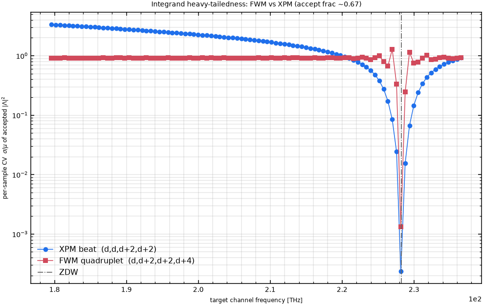
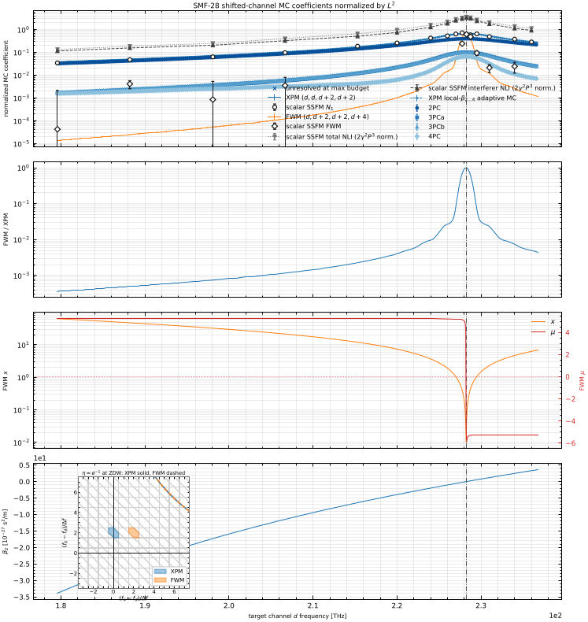
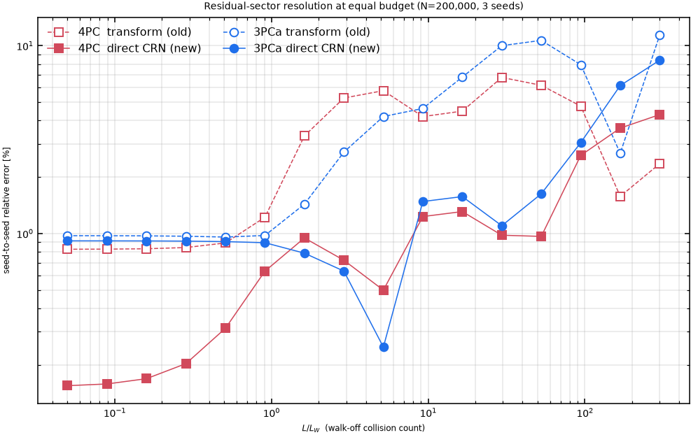
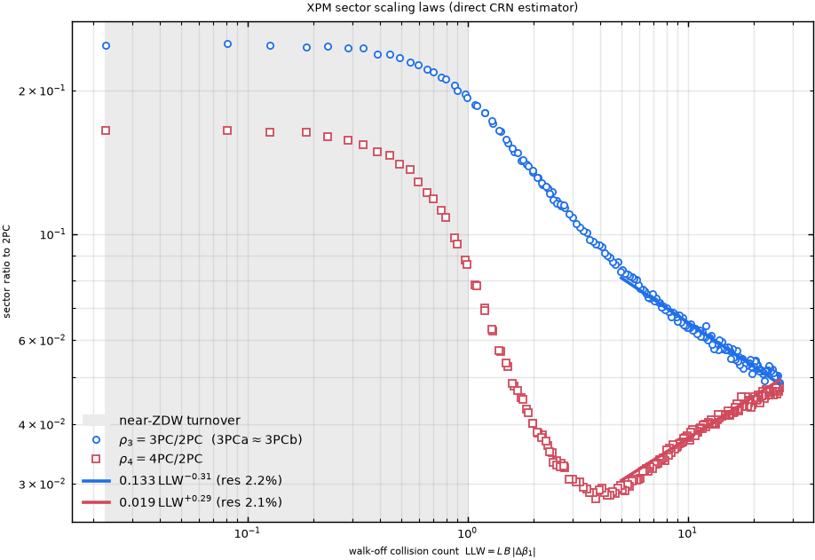
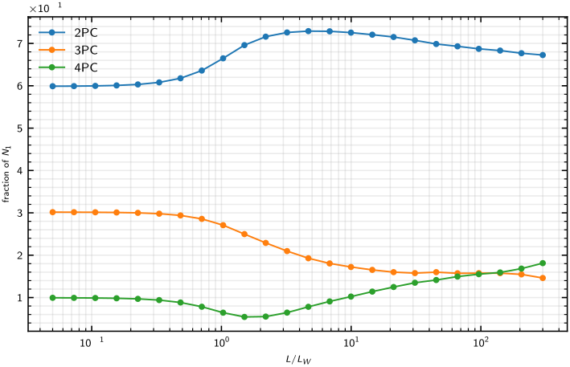
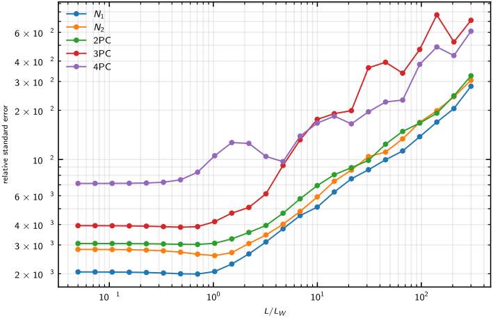

# Frequency-domain Monte Carlo for FWM and the XPM collision sectors

This note is the consolidated record of a body of work on the prefactor-free
Dar-style frequency-domain Monte-Carlo (MC) estimators: the FWM generic-sum
estimator, the XPM $N_1$ estimator, and — the main new result — a direct
estimator for the XPM collision sectors (2PC, 3PCa, 3PCb, 4PC) that replaces an
alternating-difference reconstruction whose variance made the residual sectors
effectively unresolvable. It covers the mathematics and derivations, the
numerical techniques, the validation, the resulting scaling laws, and the
dead-ends and negative results along the way.

Touched code (working tree):

- [`src/pynlin/methods/td/xhkm_mc.py`](../../src/pynlin/methods/td/xhkm_mc.py) — new `estimate_xhkm_sectors_direct_mc`
- [`analysis/standalone_numerical/validate_fwm_mc_real_tuples.py`](../../analysis/standalone_numerical/validate_fwm_mc_real_tuples.py) — real-tuple sector ensemble wired to the new estimator
- [`analysis/standalone_numerical/plot_xhkm_mc_sector_scaling.py`](../../analysis/standalone_numerical/plot_xhkm_mc_sector_scaling.py) — n-PC scaling comparison wired to the new estimator
- [`tests/nlin/test_xhkm_mc.py`](../../tests/nlin/test_xhkm_mc.py) — new estimator tests

Related existing code referenced below:
[`fwm_mc.py`](../../src/pynlin/methods/td/fwm_mc.py),
[`xhkm_sums.py`](../../src/pynlin/methods/td/xhkm_sums.py),
[`xpm_kernel.py`](../../src/pynlin/methods/td/xpm_kernel.py).

---

## 1. The shared Dar frequency-domain MC framework

Both the FWM and XPM estimators are the same kind of object: a finite-band
Monte-Carlo average of $|\Lambda(\Delta\beta)|^2$ over uniformly sampled
normalized frequencies, with an energy-conservation acceptance mask.

**The link/propagator.** The flat-profile $z$-integral of the four-wave phase
mismatch is

$$
\Lambda(\Delta\beta) = \int_0^L e^{(i\Delta\beta-\alpha)z}\,dz
= \frac{e^{(i\Delta\beta-\alpha)L}-1}{i\Delta\beta-\alpha},
$$

evaluated stably with an explicit $\Delta\beta\to0$ limit
([`_propagator`](../../src/pynlin/methods/td/fwm_mc.py#L59),
[`_link_from_delta_beta`](../../src/pynlin/methods/td/xhkm_mc.py#L180)). The
per-channel mismatch uses each channel's local Taylor coefficients through
fourth order, $\beta(\omega)=\beta_0+\beta_1\omega+\tfrac12\beta_2\omega^2
+\tfrac16\beta_3\omega^3+\tfrac1{24}\beta_4\omega^4$.

**Normalized frequencies and the acceptance mask.** Frequencies are normalized
by the baud rate $B$ and sampled uniformly on one band $[-\pi,\pi]$. Energy
conservation fixes the last frequency (FWM: $\Omega_d=\Omega_a+\Omega_b-\Omega_c
+\delta\omega/B$; XPM: the target output frequency), and samples whose derived
frequency falls outside $[-\pi,\pi]$ are rejected. The **support fraction** — the
accepted share — is purely combinatorial: for a sum of three uniform$(-\pi,\pi)$
variables landing back in $(-\pi,\pi)$ it is $\approx 2/3$, identical for FWM and
XPM. The estimator returns the masked mean of $|\Lambda|^2$ and its standard
error.

This common structure is the reason the two estimators can be compared
sample-for-sample (§3.3) and share random draws (§6).

---

## 2. FWM: the generic-sum estimator

[`estimate_fwm_term_sum_dar_mc`](../../src/pynlin/methods/td/fwm_mc.py#L87)
estimates the all-index generic FWM sum for a fixed carrier quadruplet
$(a,b,c\to d)$. It samples three local normalized angular frequencies, enforces
energy conservation for the generated output, and averages the exact flat-profile
propagator with $\Delta\beta = \beta_a+\beta_b-\beta_c-\beta_d$ built from each
channel's local Taylor coefficients. It takes physical inputs only (the tuple and
its local dispersion, baud rate, length); the loudness/detuning diagnostics
$x=LB\lVert\nabla\Delta\beta\rVert$ and $\mu=\Delta\beta_{\text{center}}/(B\lVert
\nabla\Delta\beta\rVert)$ are derived, not parameters.

The real-tuple validation
([`validate_fwm_mc_real_tuples.py`](../../analysis/standalone_numerical/validate_fwm_mc_real_tuples.py))
evaluates physical SMF-28 channel tuples: translation/span sequences, a
zero-dispersion-wavelength (ZDW) scan of the degenerate $(d,d{+}2,d{+}2,d{+}4)$
quadruplet, and a full-band spectrum sweep with the XPM comparison and scalar
SSFM overlays.

### 2.1 The FWM error bars are present but invisible

The starting question was "why are there no error bars on the FWM result?" There
are — they are just far smaller than a pixel. At the production budget
($N=10^5$) the FWM coefficient has a relative standard error of ~0.3–1.3 %
across the band; on a five-decade log axis a 1 % error spans $\sim0.004$ decades,
a fraction of a line width. The SSFM overlays and the sector traces carry visible
error bars only because their relative errors are far larger. So the "missing"
error bars were a rendering fact, not a statistical one.

### 2.2 Why FWM resolves so much more cheaply than XPM

The follow-up question — how can FWM be so much better resolved than XPM at the
same $N$ — has a clean root cause. MC relative error scales as
$\mathrm{CV}/\sqrt{N_{\text{acc}}}$, where $\mathrm{CV}=\sigma/\mu$ is the
coefficient of variation of the accepted per-sample kernel $|\Lambda|^2$. The
acceptance fraction is identical (~2/3) for both, so the difference is entirely
in the CV: the XPM beat integrand is far more heavy-tailed than the degenerate
FWM quadruplet.

*Per-sample CV of the accepted $|\Lambda|^2$ across the band. Away from the ZDW
the XPM beat has CV $\sim2$–$3.3$ (max/mean $\approx17$) versus $\sim0.9$ for FWM
(max/mean $\approx6$); both collapse toward the ZDW where the mismatch vanishes.*

Physically: the two-channel XPM mismatch is dominated by first-order
group-velocity walk-off that sweeps through many radians across the sampled band,
so most draws nearly cancel and a rare few near phase-matching spike — a classic
heavy-tailed oscillatory integrand. The degenerate FWM quadruplet has partial
cancellation of that first-order term (the two repeated middle channels), so its
phase excursion stays smaller and more uniform, giving a lower-variance
integrand at the same channel spacing. Near the ZDW both mismatches vanish and
the CVs converge (the XPM CV even dips below FWM at the exact ZDW). This is not an
unfair sample budget — it is a genuine difference in integrand shape.

### 2.3 FWM/XPM balance across the band

The full-band figure shows the FWM and XPM coefficients, their ratio, the
$(x,\mu)$ natural coordinates, and the $\beta_2$ profile:

FWM is orders of magnitude below XPM across most of the band but climbs sharply to
approach XPM at the ZDW, where the mismatch collapses and $\mu\to0$.

---

## 3. The XPM collision sectors and the estimator problem

The two-channel XPM noise power is $\sum_{h,r,m}|X[h,r,m]|^2$ over the collision
tensor $X[h,r,m]=X_{h,\,m+r,\,m}$. It is decomposed into pulse-collision sectors
by which of the two symbol offsets vanish (see
[`noise_calculations.md`](stale/noise_calculations.md)):

$$
N_{2\mathrm{PC}}=\!\!\sum_{h=0,r=0,m}\!\!|X|^2,\;
N_{3\mathrm{PCa}}=\!\!\sum_{h=0,r\neq0,m}\!\!|X|^2,\;
N_{3\mathrm{PCb}}=\!\!\sum_{h\neq0,r=0,m}\!\!|X|^2,\;
N_{4\mathrm{PC}}=\!\!\sum_{h\neq0,r\neq0,m}\!\!|X|^2 .
$$

The exact contraction
[`compute_xhkm_sums`](../../src/pynlin/methods/td/xhkm_sums.py#L49) computes each
sector as a **direct non-negative sum** over a mask of the tensor. The MC path
[`estimate_xhkm_sums_mc`](../../src/pynlin/methods/td/xhkm_mc.py#L401) never builds
the tensor: it samples four aggregates $(N_1,N_2,N_{2\mathrm{PC}},
N_{2\mathrm{PC}}+N_{3\mathrm{PCa}})$ and reconstructs the sectors through the
linear map [`_SECTOR_TRANSFORM`](../../src/pynlin/methods/td/xhkm_mc.py#L388),

$$
N_{4\mathrm{PC}}=N_1-N_2+N_{2\mathrm{PC}}-\bigl(N_{2\mathrm{PC}}+N_{3\mathrm{PCa}}\bigr).
$$

This is an alternating difference of four comparable aggregates. Sampled on
partly-independent streams, the covariance terms do not cancel and the residual
sectors inherit the full aggregate variance. At a high-walk-off band-edge tuple,
$N=10^5$:

| sector | seed-to-seed scatter (old) | mean bias (old) |
|---|---|---|
| 2PC | 2.0 % | +0.4 % |
| 3PCa | 45 % | −8.5 % |
| 3PCb | 55 % | +0.4 % |
| 4PC | 52 % | +10.1 % |

Even at $N=4\times10^6$ the residual sectors show 10–13 % seed spread. This is the
"unresolved at max budget" behaviour in the original spectrum figure.

---

## 4. Derivation of the direct sector estimator

### 4.1 Frequency representation of $X[h,r,m]$

The time-domain coefficient
([`compute_xpm_time_integrand_direct`](../../src/pynlin/methods/td/xpm_kernel.py#L230))
is

$$
X_{h,k,m}=\int_0^L\!\!dz\int\!dt\;
g_A^*(t)\,g_A(t-hT)\,g_B^*(t-kT-\delta z)\,g_B(t-mT-\delta z),
\quad r=k-m,
$$

with $T=1/B$, walk-off $\delta=\Delta\beta_1$. Inserting spectral representations
and doing the $t$-integral gives energy conservation $\omega_4=\omega_1-\omega_2
+\omega_3$; the $z$-integral gives $\Lambda$ of the mismatch. The four spectral
variables are target-in $\omega_1$, target-out $\omega_2$, and the two interferer
frequencies $\omega_3,\omega_4$. The symbol phase reduces to

$$
\exp\!\Bigl(i\bigl[h\,\omega_2-r\,\omega_3+m(\omega_1-\omega_2)\bigr]T\Bigr).
$$

### 4.2 Sector projections by Poisson summation

Form $|X|^2$ with two independent spectral copies and sum each symbol index. By
Poisson summation each sum imposes a congruence between the copies:

- $\sum_m$ makes them **share** $s=\omega_1-\omega_2$ (the outer variable);
- $\sum_h$ imposes $\omega_2'\equiv\omega_2$ (target-out **diagonal**);
- $\sum_r$ imposes $\omega_3'\equiv\omega_3$ (interferer **diagonal**).

Fixing an index at $0$ leaves the corresponding frequency **free** in each copy —
a *mean projection*. Every sector is one of the four {mean | diagonal}
combinations on $\{\omega_2,\omega_3\}$, sharing the outer $s$ and one kernel

$$
K(a,u)=\mathbb{1}_{|\omega_2|\le\pi}\,\mathbb{1}_{|\omega_4|\le\pi}\;
\Lambda(\Delta\beta),\quad
\omega_1=a,\;\omega_2=s+a,\;\omega_3=u,\;\omega_4=u-s .
$$

With outer $s\sim\mathcal U(-2\pi,2\pi)$ and two independent inner pairs
$(a_1,u_1),(a_2,u_2)$, define

$$
A=K(a_1,u_1),\; B=K(a_2,u_2),\; C=K(a_2,u_1)\;(\text{shared }u),\; D=K(a_1,u_2)\;(\text{shared }a),
$$

and then

$$
\boxed{\;
\begin{aligned}
N_1 &= \langle|A|^2\rangle, & N_{2\mathrm{PC}}&=\langle A\overline B\rangle,\\
N_{3\mathrm{PCa}}&=\langle A\,\overline{(C-B)}\rangle, & N_{3\mathrm{PCb}}&=\langle A\,\overline{(D-B)}\rangle,\\[2pt]
N_{4\mathrm{PC}}&=\langle A\,\overline{(A-C-D+B)}\rangle. &
\end{aligned}\;}
$$

$N_1$ and $N_{2\mathrm{PC}}$ are direct non-negative estimators; the three
residual sectors are common-random-number paired differences whose per-sample
value is $O(\text{sector})$, not $O(\text{aggregate})$. An overall sampling
constant $2$ (the branch-A Jacobian: $s$ over a $4\pi$ range, inner frequencies
over $2\pi$) is factored out as
[`_DIRECT_SECTOR_CONST`](../../src/pynlin/methods/td/xhkm_mc.py#L600). The
implementation is
[`estimate_xhkm_sectors_direct_mc`](../../src/pynlin/methods/td/xhkm_mc.py#L652)
with the masked kernel
[`_direct_sector_kernel`](../../src/pynlin/methods/td/xhkm_mc.py#L603); both the
scalar-$\beta_2$ and channel-local Taylor dispersion models are supported and the
scalar kernel argument is identical to the library's branch-A form, so `nspan`
and `phase_delay` carry over.

---

## 5. Numerical techniques

- **Dar frequency-domain MC** (§1): masked average of $|\Lambda|^2$ over
  normalized frequencies — the shared engine for FWM, XPM $N_1$, and the sectors.
- **Energy-conservation masking / support fraction**: acceptance is combinatorial
  (~2/3), factored out identically for all estimators, so relative errors are
  governed solely by integrand CV.
- **Coefficient-of-variation diagnosis** (§2.2): the variance gap between FWM and
  XPM, and between sectors and aggregates, is read directly off the per-sample CV.
- **Common random numbers, sector differences** (§4): evaluating $A,B,C,D$ from
  one shared draw makes the paired terms strongly correlated. For a difference
  $X-Y$, $\operatorname{Var}=\operatorname{Var}X+\operatorname{Var}Y-2\operatorname{Cov}(X,Y)$;
  CRN drives $\operatorname{Cov}$ up so the variance collapses to the size of the
  difference. Measured effect: 0.45 % relative error paired vs 94 % between
  independent streams (~200×).
- **Poisson-summation projections** (§4.2): mean vs diagonal on $\{\omega_2,
  \omega_3\}$ — the exact route from the tensor definition to a single shared
  kernel, replacing the alternating-difference basis.
- **Common random numbers across the spectrum**: the real-tuple sweep reuses one
  `random_variables` array across all tuples
  ([`compute_dataset`](../../analysis/standalone_numerical/validate_fwm_mc_real_tuples.py#L573)),
  so neighbouring spectral points share sampling noise and the curves are smooth
  rather than jittering point-to-point.
- **Pooled analytic standard error for adaptive stopping**: the ensemble
  [`estimate_xpm_sector_ensemble`](../../analysis/standalone_numerical/validate_fwm_mc_real_tuples.py#L269)
  drives the direct estimator in equal-size batches and combines the reliable
  per-batch stderrs $s_b$ as
  $\hat\sigma_{\text{pooled}}=\sqrt{\sum_b s_b^2}/M=\sigma_{\text{pop}}/\sqrt{M\,n_{\text{batch}}}$
  ([`_pool`](../../analysis/standalone_numerical/validate_fwm_mc_real_tuples.py#L301)),
  more reliable than the variance of ~8 batch means. The resolved-flag and
  `stop_reason` contract of the previous estimator is preserved.

---

## 6. Validation

New tests in
[`test_xhkm_mc.py`](../../tests/nlin/test_xhkm_mc.py#L240):

- [`..._satisfies_sector_identities`](../../tests/nlin/test_xhkm_mc.py#L240) — $N_1=\sum$ sectors, $N_2=2\mathrm{PC}+3\mathrm{PCb}$, non-negative 2PC/$N_1$;
- [`..._scalar_matches_local_taylor`](../../tests/nlin/test_xhkm_mc.py#L267) — scalar and dispersion paths agree on shared draws;
- [`..._agrees_with_transform_at_high_n`](../../tests/nlin/test_xhkm_mc.py#L291) — every sector within $4\sigma$ of the transform estimator;
- [`..._reduces_4pc_variance_vs_transform`](../../tests/nlin/test_xhkm_mc.py#L316) — 4PC stderr below ¼ of the transform's at equal budget.

Head-to-head at $N=10^5$ (30 seeds), high-walk-off tuple:

| sector | old scatter | new scatter | factor |
|---|---|---|---|
| 3PCa | 45 % | 6.3 % | 7× |
| 3PCb | 55 % | 6.3 % | 9× |
| 4PC | 52 % | 2.7 % | 19× |

A 48 M-sample cross-check shows no detectable bias: every offset from the
transform oracle is within $\sim1\sigma$ of the oracle's own (larger) uncertainty,
while the direct 4PC standard error is ~40× smaller.

*Seed-to-seed relative error of 3PCa and 4PC at equal budget. The direct CRN
estimator (solid) stays low across the walk-off range where the transform
estimator (dashed) diverges.*

---

## 7. Sector scaling laws (the n-PC beyond 2PC)

With the residual sectors resolved, their ratios to 2PC collapse onto simple
laws in the single walk-off coordinate $L/L_W=L\,B\,|\Delta\beta_1|$ (the Dar
collision count). For the XPM pair $L/L_W$ and $|\beta_2|$ are perfectly
collinear, so $\beta_2$ is not an independent axis. Empirically
$N_{3\mathrm{PCa}}\approx N_{3\mathrm{PCb}}$ to ~1 %, and on the asymptotic branch
($L/L_W\gtrsim5$)

$$
\rho_3\equiv\frac{N_{3\mathrm{PC}}}{N_{2\mathrm{PC}}}\approx0.133\,(L/L_W)^{-0.31},
\qquad
\rho_4\equiv\frac{N_{4\mathrm{PC}}}{N_{2\mathrm{PC}}}\approx0.019\,(L/L_W)^{+0.29},
$$

each with ~2 % residual scatter (the estimator noise floor). The **opposite
signs** mean 4PC rises while 3PC falls, so 4PC overtakes 3PC at large walk-off.
Near the ZDW ($L/L_W\lesssim1$) both turn over to constants (sector-merge). The
full sector structure thus reduces to 2PC (the classical Dar scaling) times two
one-parameter power laws.

The n-PC comparison plot
([`plot_xhkm_mc_sector_scaling.py`](../../analysis/standalone_numerical/plot_xhkm_mc_sector_scaling.py))
sweeps $L/L_W\in[0.05,300]$; the sector fractions of $N_1$ are now smooth across
the whole range, exhibiting the V-shaped 4PC crossing above 3PC near
$L/L_W\approx100$:

---

## 8. Negative results and dead ends

Recording these because they shaped the final design and would otherwise be
re-attempted.

1. **Nested-quadrature "fast method" for the sectors (abandoned).** The first
   instinct was to build a deterministic quadrature of the sector integrals
   analogous to the fast-NLIN path. This solved the wrong problem: the sectors'
   difficulty is a *basis* problem (alternating differences of aggregates), not
   an integration-cost problem. Recognizing the transform as the culprit
   redirected the effort to a better MC estimator, not a quadrature.

2. **The rank-1 factorization $N_{4\mathrm{PC}}=\rho^2\,N_{2\mathrm{PC}}$ is
   false.** The large-walk-off pulse-overlap factorization suggests the sectors
   might form a rank-1 outer product ($3\mathrm{PCa},3\mathrm{PCb}\sim\rho\cdot
   2\mathrm{PC}$, $4\mathrm{PC}\sim\rho^2\cdot2\mathrm{PC}$, hence
   $4\mathrm{PC}=3\mathrm{PCa}\cdot3\mathrm{PCb}/2\mathrm{PC}$). Tested directly:
   the prediction fails by ~13× (median ratio 12.8). The sectors do **not**
   multiply; $3\mathrm{PCa}\approx3\mathrm{PCb}\approx4\mathrm{PC}$ (all
   $\sim\rho\cdot2\mathrm{PC}$) at high walk-off instead. This falsification is
   what motivated measuring $\rho_3$ and $\rho_4$ as independent scaling laws.

3. **Guessing the sector projection failed.** Before the Poisson derivation, the
   2PC/3PCa split was attempted by trial in the library's branch-B
   parameterization. None of the candidate "2PC" projections reproduced the
   oracle — they collapsed onto $N_{2\mathrm{PC}}+N_{3\mathrm{PCa}}$ instead. The
   reason: branch A draws the outer variable **uniformly** on $(-2\pi,2\pi)$
   while branch B produces it as $u-v$, a **triangular** density; the two
   estimators are reconciled only through analytic prefactors, so a projection
   guessed in the wrong density is simply wrong. The lesson — derive the
   projection from the tensor (§4), do not guess it — is why the rigorous route
   was taken.

4. **The $\beta_2$-only time-domain tensor cannot be the ZDW ground truth.** The
   exact tensor evaluator
   ([`xpm_kernel.py`](../../src/pynlin/methods/td/xpm_kernel.py)) applies only a
   quadratic spectral phase, so near the ZDW — where $\beta_3,\beta_4$ dominate —
   it does not match the $\beta_2/\beta_3/\beta_4$ MC. Ground truth for
   validation therefore had to be the library's own high-$N$ frequency MC, not
   the tensor.

5. **A single power law in $L/L_W$ does not fit $\rho_4$.** $\rho_4$ is
   non-monotonic (V-shaped, minimum near $L/L_W\approx4$), so a global power-law
   fit leaves ~33 % residual; only the asymptotic branch admits the clean
   $(L/L_W)^{+0.29}$ law. $\rho_3$, by contrast, is a clean decreasing power law.

6. **A two-variable $(L/L_W,\beta_2)$ fit is degenerate.** Because
   $\operatorname{corr}(\log L/L_W,\log|\beta_2|)=1.000$ across the band (adjacent-
   channel walk-off $\Delta\beta_1\approx\beta_2\,\Delta\omega$), the two
   predictors are collinear and the least-squares fit returns meaningless
   large coefficients. $L/L_W$ alone is the coordinate.

---

## 9. Summary

- Both FWM and XPM use the same masked $|\Lambda|^2$ Dar MC; the FWM error bars
  were invisible, not absent, and FWM resolves cheaply because its integrand has a
  much smaller coefficient of variation than the heavy-tailed XPM beat (§2).
- The XPM collision sectors were derived as **mean/diagonal projections** of a
  single shared kernel from the Golani/Dar $X[h,r,m]$ definition via Poisson
  summation, and implemented as **common-random-number paired differences** so
  residual-sector variance scales with the sector, not the aggregate (4–19× fewer
  samples for equal precision; ~40× at high $N$) (§4–6).
- The estimator is wired into both the real-tuple and n-PC pipelines with a
  **pooled analytic standard error** preserving the adaptive-stopping contract
  (§5). All 229 real-tuple spectrum points now resolve every sector.
- The resolved sectors obey **simple $L/L_W$ power laws** ($\rho_3$ falling,
  $\rho_4$ V-shaped and rising), reducing the sector structure to 2PC times two
  one-parameter scalings (§7).
- The negative results (§8) fixed the design: the difficulty was the basis not the
  integration; the sectors do not factorize rank-1; the projection had to be
  derived, not guessed; the ZDW oracle had to be the frequency MC; and $L/L_W$ is
  the single scaling coordinate.
