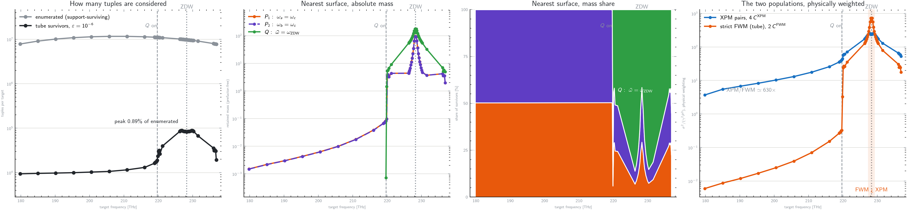
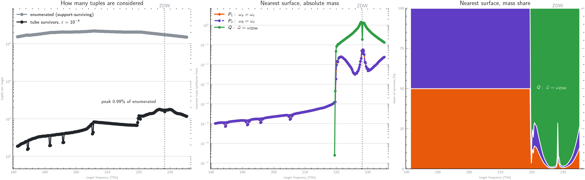
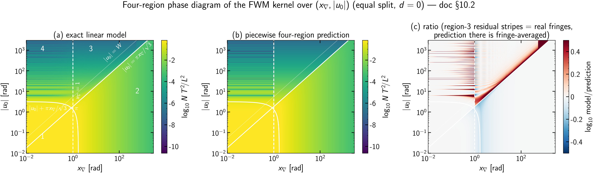
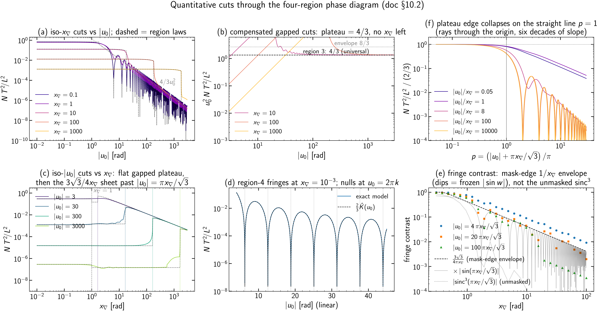
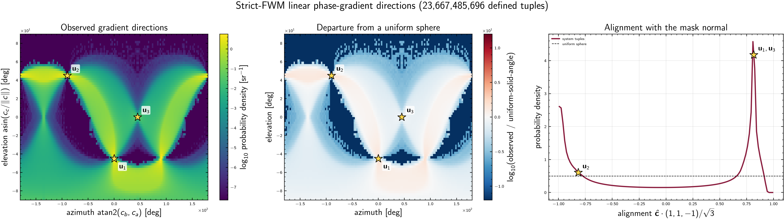
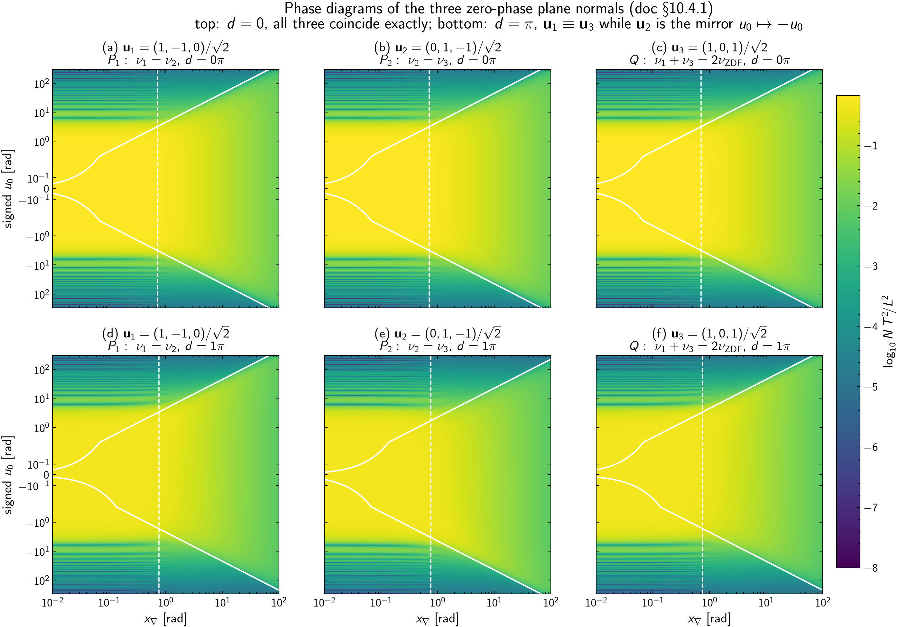
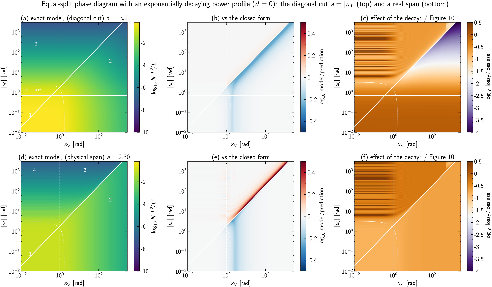

# The Lorenzi Fast method: theory of the S0–S6 pipeline

This note is the scientific record of the *Lorenzi Fast* full-band NLIN
estimator implemented in
[`src/pynlin/methods/td/fast_nlin.py`](../../src/pynlin/methods/td/fast_nlin.py)
and driven by the staged analysis pipeline
[`analysis/fwm/fast_s0_territory.py`](../../analysis/fwm/fast_s0_territory.py) …
[`analysis/fwm/fast_s6_physical.py`](../../analysis/fwm/fast_s6_physical.py).
It states the model precisely, derives every closed form the code uses, and
backs each load-bearing claim with a figure regenerated from the current code
by [`analysis/fwm/plot_fast_theory_figures.py`](../../analysis/fwm/plot_fast_theory_figures.py)
(figures dated 2026-08-24 unless noted).

The method replaces per-tuple Monte Carlo over in-channel frequencies with
analytic, regime-dispatched evaluation of a single scalar efficiency per FWM
tuple, making the full-band strict-FWM + XPM sum tractable at full channel
resolution (2284 channels, $\sim 10^7$ tuples per target).

Notation follows
[`fwm_dispersion_scales_and_coordinates.md`](fwm_dispersion_scales_and_coordinates.md)
(global curve $\beta(\omega)$, per-channel local Taylor coefficients, tuple-level
mismatch) and the single-tuple scaling analysis in
[`fwm_single_tuple_scaling.md`](fwm_single_tuple_scaling.md).

## 0. The pipeline at a glance

| Stage | Script | Question it answers |
|---|---|---|
| S0 | `fast_s0_territory.py` | *Where does FWM mass live* in the normalized variables, by tuple count and by weight? |
| S1+S2 | `fast_s2_collapse.py` | Per-tuple error gate: model vs exact-mask QMC, separated into mask/regime error, quadratic ($\beta_2$) error, and end-to-end production error. |
| S3 | `fast_s3_tube.py` | Post-enumeration tuple pruning with a padded discarded-set bound; retained tuples still use the linear phase model. |
| S4 | `fast_s4_targets.py` | Per-target gate: fast sums vs the repo's exhaustive-support MC at probe targets, with timing. |
| S5 | `fast_s5_fullband.py` | The production full-band sweep (checkpointed, process-parallel), with MC references at probe targets. |
| S6 | `fast_s6_physical.py` | Physical units: NLIN variance and NSR per channel from the S5 prefactor-free sums. |

S3 v1 implements post-enumeration tuple selection. Direct geometric survivor
enumeration and a complete same-model certificate remain planned; see §9 and
§15.

## 1. Terminology

Precise definitions of the recurring terms, in the sense used throughout this
document.

* **NLIN** — *nonlinear interference noise*: the signal-dependent
  perturbation a WDM channel accumulates from Kerr-nonlinear interactions
  with the other channels, treated as an additive noise term with a variance.
* **Target / interferer** — the channel whose noise is being computed ($t$) /
  any other channel contributing to it.
* **XPM** — *cross-phase modulation*: the two-channel Kerr interaction, terms
  of the form $A_t |A_b|^2$; one interferer $b$, contributions indexed by
  pairs $(t, b)$.
* **FWM** — *four-wave mixing*: the Kerr interaction combining three fields
  into a fourth, terms $A_a A_b A_c^*$ radiating at frequency
  $f_a + f_b - f_c$. **Strict FWM**: the sub-population with $a, b, c, t$
  pairwise distinct (no degenerate indices); a **tuple** always means one
  such $(a, b, c) \to t$ combination.
* **Baud rate $B$** — the symbol rate of one channel; with Nyquist pulses the
  channel's spectral support (the frequency interval where its spectrum is
  nonzero) has width exactly $B$.
* **Nyquist / commensurate grid** — channel spacing equal to (or a rational
  multiple of) $B$, so mixing products land at discrete offsets from channel
  centers; the admissible index combinations then form disconnected discrete
  regions, the "isles" (the zero-sum tuple regions visualized by the
  `analysis/standalone_analytical/the-domain-in-freq-space-*.py` scripts).
* **Phase mismatch $\Delta\beta$** — for a tuple, the propagation-constant
  imbalance $\beta_a + \beta_b - \beta_c - \beta_t$ evaluated at the
  participating frequencies; the interaction's build-up over distance $z$
  rotates by $e^{i\Delta\beta z}$.
* **Walk-off** — the group-velocity mismatch between channels, i.e. a
  difference of first-order coefficients $\Delta\beta_1$; it makes pulses in
  different channels slide past each other and is what limits interaction
  build-up away from the zero-dispersion point.
* **ZDW** — *zero-dispersion wavelength*: the wavelength where the
  second-order dispersion coefficient $\beta_2(\omega)$ crosses zero (inside
  the O band for the fiber studied here).
* **Mass** — a tuple's contribution $N\,T^2\!/L^2$ viewed as its weight in the target's
  aggregate sum; "90% of the mass in 400 tuples" means those tuples carry 90%
  of $\sum N\,T^2\!/L^2$. **Heavy-tailed** mass: a small fraction of tuples carries most
  of the sum.
* **Characteristic function** — of a random variable $X$:
  $\varphi_X(t) = \mathbb E[e^{itX}]$ (the Fourier transform of its
  distribution).
* **Irwin–Hall density** — the probability density of a sum of independent
  uniform random variables: a piecewise polynomial of degree $n-1$ for $n$
  terms, obtained by inclusion–exclusion.
* **$\operatorname{sinc}$** — throughout, the unnormalized form
  $\operatorname{sinc}(z) = \sin(z)/z$.
* **Zonotope** — the image of a cube under a linear map: a convex polytope
  (equivalently, a Minkowski sum of line segments). Used here because a
  uniform distribution on a cube maps to a uniform distribution on a
  zonotope.
* **Gauss–Legendre (GL) quadrature** — an $n$-node numerical integration rule
  on an interval, exact for polynomials up to degree $2n-1$; "composite
  panels" means partitioning the interval and applying a fixed-order rule on
  each piece.
* **MC / QMC / scrambled Sobol** — Monte Carlo: integration by averaging over
  random points, error $\propto N^{-1/2}$. Quasi-Monte Carlo: the same with
  *low-discrepancy* deterministic point sets (here Sobol sequences), which
  fill the domain more evenly and converge faster on smooth integrands.
  *Scrambling* randomizes a Sobol set without destroying its uniformity;
  averaging over independently scrambled replicates ("randomized Sobol")
  yields an unbiased estimate *with* an error bar. **Stderr** — standard
  error of the mean over such replicates.
* **Effective samples** — the equivalent number of points doing useful work
  when most points land where the integrand is negligible; if the kernel core
  covers a fraction $p$ of the sampling cube, $N$ points act like $\sim pN$.
* **Support** (of a function/distribution) — the set where it is nonzero.
* **Prefactor-free** — the efficiency sums with all physical constants
  ($\gamma^2$, powers, $L^2$) stripped out; the constants are restored once,
  in S6 (§12).
* **Dar / Golani time-domain picture** — the pulse-collision formulation of
  NLIN in which the noise variance is a sum over symbol-collision integrals;
  the frequency-domain average used here is its per-tuple reduction. See
  [`direct_sector_mc.md`](direct_sector_mc.md) for the collision-sector side
  of this framework.
* **Link / propagator $\Lambda$** — the flat-profile build-up integral
  $\Lambda(\Delta\beta) = \int_0^L e^{(i\Delta\beta-\alpha)z}dz$ of the Dar
  MC estimators; the kernel used here is its lossless normalized square,
  $\hat K = |\Lambda|^2/L^2$ at $\alpha = 0$ (§2).
* **Dar collision count $L/L_W$** — span length over walk-off length,
  $L/L_W = L\,B\,|\Delta\beta_1|$: the number of symbol slots an interferer
  slides past the target over the span. Identical to the XPM pair variable
  $|\nu|$ of this document (§12).
* **Gapped tuple / phase-matched-surface crossing** — the two classes of
  [`fwm_single_tuple_scaling.md`](fwm_single_tuple_scaling.md): a tuple whose
  minimum reachable mismatch is bounded away from zero ($|u_0| > W$ here,
  efficiency scaling $x_\nabla^{-2}$) vs one whose phase-matched surface
  $\Delta\beta = 0$ crosses the admissible spectral domain ($|u_0| < W$,
  scaling $x_\nabla^{-1}$).
* **Decimation** — evaluating on every $k$-th channel of the grid
  ($k$ = decimation factor). See §9 for why this is *not* an innocent
  speed-up for FWM.
* **Checkpointing** — periodically saving completed per-target results so an
  interrupted run resumes without recomputation.
* **NSR** — noise-to-signal ratio: NLIN variance divided by launch power, per
  channel.
* **Guard gap** — an unused spectral interval between adjacent ITU
  transmission bands (O, E, S, C, L, U); "OESCLU" denotes the six-band
  configuration spanning them.

### 1.1 Symbols

Every mathematical symbol used in this document, built up in four levels:
elementary model parameters, per-channel quantities, per-tuple quantities,
and functions/estimator quantities. The level structure follows
[`fwm_dispersion_scales_and_coordinates.md`](fwm_dispersion_scales_and_coordinates.md)
(fiber → channel → tuple).

**Level 0 — elementary model parameters** (properties of the system, before
any channel or tuple is singled out):

| Symbol | Definition | Units |
|---|---|---|
| $L$ | span length | m |
| $\alpha$ | power attenuation coefficient (0 throughout: flat power profile; §10.6 relaxes this) | 1/m |
| $\gamma$ | Kerr nonlinear coefficient; frequency-dependent $\gamma(f)$ in S6 | 1/(W·m) |
| $P$ | per-channel launch power (flat across the band) | W |
| $B$ | baud rate = symbol rate; one channel's spectral support is $B$ wide | Hz |
| $T = 1/B$ | symbol period | s |
| $f$, $\omega = 2\pi f$ | optical frequency / angular frequency | Hz, rad/s |
| $N$ | number of WDM channels (2284 in the OESCLU study) | — |
| $\Delta f$ | channel spacing (25 GHz in the study) | Hz |
| $\beta(\omega)$ | global propagation constant of the fiber | 1/m |
| $\beta_k = d^k\beta/d\omega^k$ | global dispersion derivatives ($k = 1$: inverse group velocity; $k = 2$: group-velocity dispersion) | s$^k$/m |

**Level 1 — per-channel quantities** (channel index $j$; the target is $t$,
the three FWM legs are $a, b, c$, an XPM interferer is $b$):

| Symbol | Definition | Units |
|---|---|---|
| $f_j$ | center frequency of channel $j$ | Hz |
| $\beta_0^{(j)}, \beta_1^{(j)}, \beta_2^{(j)}$ | local Taylor coefficients of $\beta$ at $f_j$ (value, slope, curvature) | 1/m, s/m, s²/m |
| $f_j^{\rm off}$ | in-channel frequency offset from the center of channel $j$ | Hz |
| $x_j = 2\pi f_j^{\rm off}/B$ | normalized in-channel offset, uniform on $(-\pi, \pi)$; one channel spans $2\pi$ rad | rad |

**Level 2 — per-tuple quantities** (one strict FWM tuple $(a,b,c) \to t$,
or one XPM pair $(t,b)$; all phases in radians after multiplying by $L$):

| Symbol | Definition | Introduced |
|---|---|---|
| $\Delta\beta$ | four-channel mismatch $\beta_a + \beta_b - \beta_c - \beta_t$ at the participating frequencies [1/m] | §1 |
| $u = \Delta\beta\,L$ | accumulated phase mismatch over the span | §2 |
| $u_0 = \Delta\beta_0 L$ | center accumulated mismatch phase (target frame: $\beta_1^{(t)}$ subtracted); code `u0` (formerly `mu`; renamed 2026-08-24 so $\mu$ keeps its single-tuple-scaling meaning) | §3 |
| $\nu_j = \Delta\beta_1^{(j)} B L$ | per-leg walk-off across one channel bandwidth; code `nu_a/nu_b/nu_c` | §3 |
| $q_j = \tfrac12 \beta_2^{(j)} B^2 L$ | in-channel quadratic curvature; code `q_a/q_b/q_c/q_t` | §3 |
| $d = 2\pi(f_a{+}f_b{-}f_c{-}f_t)/B$ | support shift of the mixing product; code `d` | §3 |
| $x_d = x_a + x_b - x_c + d$ | output-frequency offset (must satisfy $\lvert x_d\rvert < \pi$) | §3 |
| $m = x_a + x_b - x_c$ | mask variable (the part of $x_d$ that fluctuates) | §5 |
| $w_j = \pi\lvert\nu_j\rvert$ | per-leg width of the linear mismatch range; code `widths` | §3 |
| $W = \sum_{j\in\{a,b,c\}} w_j$ | total width: $u$ ranges over $[u_0 - W, u_0 + W]$ | §3 |
| $\sigma^2 = \tfrac13\sum_{j\in\{a,b,c\}} w_j^2$ | variance of the linear offset; code `sigma`$^2$ | §7 |
| $x_\nabla = \sqrt{\sum_{j\in\{a,b,c\}} \nu_j^2}$ | loudness scale (L2 walk-off norm), $= LB\lVert\nabla\Delta\beta\rVert_2$; code `x_grad` | §3 |
| $\mu = u_0 / x_\nabla$ | pure dimensionless detuning (single-tuple-scaling convention); code `mu`. **Derived** — the phase-matching test, not a plot axis | §3 |
| $s = x_\nabla + \lvert u_0\rvert$ | **Derived** radial coordinate; the phase-diagram abscissa of earlier revisions, retained only for the collapse of [`fwm_single_tuple_scaling.md`](fwm_single_tuple_scaling.md) and the translation table at the end of §10.2.7 | §10.2.7 |
| $p = \left(\lvert u_0\rvert + \pi x_\nabla/\sqrt3\right)/\pi$ | plateau-edge collapse variable (equal split, $d=0$); region 1 is $p\lesssim1$ | §10.2.2 |
| $g_{\rm box} = \max(\lvert u_0\rvert-W,0)$ | distance from zero to the unmasked linear box interval | §9 |
| $g_{\rm mask}$ | distance from zero to the certified mask-aware linear outer interval | §9 |
| $P_q = \pi^2 \sum \lvert q\rvert$ | quadratic padding of the certificate ($g_{\rm mask}\to\max(g_{\rm mask}-P_q,0)$) | §9 |
| $\mathcal M = \lvert u_0\rvert/(3W + 3000)$ | far-dispatch margin; $\mathcal M = 1$ is the far/quadrature switch, $\mathcal M \to 0$ the phase-matched interior. **Derived** | §16.1 |
| $\nu = \Delta\beta_1 B L$ | XPM pair walk-off $=$ Dar collision count $L/L_W$ | §12 |
| $y = x_1 - x_2$ | interferer in/out frequency difference (XPM) | §12 |

**Level 3 — functions, distributions, and estimator quantities:**

| Symbol | Definition | Introduced |
|---|---|---|
| $\Lambda(\Delta\beta) = \int_0^L e^{(i\Delta\beta - \alpha)z} dz$ | link/propagator (build-up integral) | §2 |
| $\hat K(u) = 4\sin^2(u/2)/u^2$ | normalized lossless link kernel $= \lvert\Lambda\rvert^2/L^2$ at $\alpha = 0$; the decaying-profile kernel $K_a$ is (10.6.1) | §2, §10.6 |
| $N\,T^2\!/L^2 = \mathbb E[\hat K(u)\mathbf 1_{\rm mask}]$ | per-tuple efficiency (the quantity the whole method computes) | §2 |
| $\mathbf 1_{\rm mask}$ | indicator of frequency matching, $\lvert x_d\rvert < \pi$ | §2 |
| $\rho_{\mathbf w}(v)$ | Irwin–Hall density of the linear offset $\sum_{j\in\{a,b,c\}} c_j x_j$ | §4 |
| $\varphi_u(t) = \mathbb E[e^{iut}]$ | characteristic function of $u$; $t$ is the normalized autocorrelation lag $\in [0,1]$ | §4 |
| $\operatorname{sinc}(z) = \sin(z)/z$ | unnormalized sinc | §4 |
| $A(d) = \Phi_3(\pi{-}d) - \Phi_3(-\pi{-}d)$ | unconditional mask acceptance; $\Phi_3$ = 3-uniform CDF | §5 |
| $A_{\rm cond}(v) = P(\lvert m{+}d\rvert{<}\pi \mid u)$ | conditional acceptance at mismatch offset $v$ | §5 |
| $M$; $c_u, c_m, c_\xi$ | change-of-basis matrix and its rows (coefficients of $u$, of $m$, and their cross product) in the zonotope density | §6 |
| $\rho(u, m)$ | exact joint density of mismatch and mask variable | §6 |
| $(N\,T^2\!/L^2)_{\rm lin}$ | linear-model ($q_j = 0$) efficiency | §4 |
| $U$ | wide-regime central-window half-width ($48\pi$) | §7 |
| $H(\theta)$ | masked cosine transform of the XPM pair-difference law | §12 |
| $(N\,T^2\!/L^2)_{\rm XPM}(\nu)$ | exact XPM pair efficiency | §12 |
| $\varepsilon$ | minimum admissible efficiency (tuple-selection threshold, S3) | §9 |
| $N(x_\nabla, \mu)$ | tuple population density of a channel plan (S0 census) | §10 |
| $\sigma^2_{\rm XPM}, \sigma^2_{\rm FWM}$ | physical NLIN variances per channel [W] | §13 |
| NSR $= \sigma^2_{{\rm NLI},t}/P$ | noise-to-signal ratio per channel | §13 |

## 2. Physical setting

One target channel $t$ accumulates NLIN from two populations:

* **XPM pairs** $(t, b)$, $b \neq t$: two-channel collisions.
* **Strict FWM tuples** $(a, b, c) \to t$ with $a, b, c, t$ pairwise
  distinct and $f_a + f_b - f_c \approx f_t$.

For each interaction, the time-domain (Dar/Golani) picture reduces the
variance contribution to a *prefactor-free efficiency* $N\,T^2\!/L^2 \in [0, 1]$ — an
average of the squared phase-matching link function over the in-channel
spectral degrees of freedom — multiplied by a purely combinatorial/power
prefactor (§12). The entire method is about evaluating

$$
N\,T^2\!/L^2 \;=\; \mathbb{E}\!\left[\hat K(u)\,\mathbf 1_{\mathrm{mask}}\right],
\qquad
\hat K(u) = \left|\frac1L\int_0^L e^{\,i\,\Delta\beta(x_a,x_b,x_c)\,z}\,dz\right|^2
= \frac{4\sin^2(u/2)}{u^2},
$$

cheaply and controllably for every tuple. Here $u = \Delta\beta\,L$ is the
phase mismatch accumulated over the full span length $L$ (in radians), the
expectation runs over the in-channel frequency offsets of the three
interferer legs (defined in §3), and $\mathbf 1_{\mathrm{mask}}$ is the
indicator of the frequency-matching condition (§5). $\hat K$ — the **link
kernel** — is the squared magnitude of the normalized coherent build-up
integral for a lossless span: $\hat K(0) = 1$ (perfect phase matching),
decaying as $4\sin^2(u/2)/u^2$ with mismatch.

This is the same object as the **link/propagator**
$\Lambda(\Delta\beta) = \int_0^L e^{(i\Delta\beta - \alpha)z}\,dz$ of
[`direct_sector_mc.md`](direct_sector_mc.md): at $\alpha = 0$ (flat power
profile), $\hat K(u) = |\Lambda(\Delta\beta)|^2 / L^2$; for $\alpha\ne0$ the same
normalization gives the decaying-profile kernel of §10.6. Likewise $N\,T^2\!/L^2$ is
exactly the *Dar frequency-domain MC* integrand of that note — the masked
average of $|\Lambda|^2$ over uniformly sampled in-channel frequencies —
evaluated here analytically instead of by sampling. The two documents are the
sampling and the analytic face of one framework.

### 2.1 From the defining collision integrals to the masked kernel average

The identity $N\,T^2\!/L^2 = \mathbb E[\hat K\,\mathbf 1_{\rm mask}]$ is not a
definition — it follows from the integrals that define the noise in the
first place. The chain, for one strict tuple $(a,b,c) \to t$, flat power
($\alpha = 0$), single span:

**(i) Fields and first-order perturbation.** Each channel transmits
unit-energy Nyquist pulses at rate $1/T$,
$A_j(0,t) = \sqrt{P T} \sum_n a^{(j)}_n\, g_j(t - nT)$, with spectrum
$\hat g_j(\omega)$ flat over channel $j$'s band:
$|\hat g_j(\omega)|^2 = T\cdot\mathbf 1_{{\rm band}_j}(\omega)$ (so
$\int |\hat g|^2\, d\omega/2\pi = 1$). First-order (regular-perturbation)
Kerr interaction in the interaction picture: with unit-energy pulses and
dimensionless unit-variance symbols, the target's normalized received symbol
$0$, after matched filtering, is perturbed by

$$
\Delta a_0 \;=\; i\gamma P T \sum_{h,k,m}
a^{(a)}_h\, a^{(b)}_k\, a^{(c)*}_m\; X_{h,k,m},
$$

$$
X_{h,k,m} \;=\; \int_0^L\! dz \int dt\;
g_t^*(z,t)\; g_a(z, t - hT)\, g_b(z, t - kT)\, g_c^*(z, t - mT),
$$

where $g_j(z,\cdot)$ is the pulse dispersed to distance $z$ — the
**collision integral**: the overlap, accumulated along the span, of three
interferer pulses sliding through the target's matched filter. This is the
Golani/Dar tensor of [`direct_sector_mc.md`](direct_sector_mc.md), there
written for the two-channel (XPM) case.

**(ii) Variance.** For i.i.d. zero-mean unit-variance symbols on three
*distinct* channels the products are uncorrelated, so

$$
\sigma^2_{(abc)\to t} = \gamma^2 P^3 T^2
\underbrace{\sum_{h,k,m} \lvert X_{h,k,m}\rvert^2}_{\displaystyle \mathcal N_\tau} .
$$

Here $\sigma^2_{(abc)\to t}$ is physical single-polarization noise power in W
for equal single-polarization channel powers $P$. No fourth-moment terms enter
for pairwise-distinct $a,b,c,t$; the constellation and multiplicity factors
are restored in §13.

**(iii) Frequency form of one $X$.** Writing each dispersed pulse through
its spectrum, the $t$-integral yields $2\pi\delta(\omega_1 + \omega_2 -
\omega_3 - \omega_4)$ (energy conservation) and the $z$-integral yields the
link $\Lambda(\Delta\beta) = \int_0^L e^{i\Delta\beta z} dz$:

$$
X_{h,k,m} = \int \frac{d\omega_1\, d\omega_2\, d\omega_3}{(2\pi)^3}\,
\hat g_a(\omega_1) \hat g_b(\omega_2) \hat g_c^*(\omega_3)
\hat g_t^*(\omega_4)\,
e^{-iT(h\omega_1 + k\omega_2 - m\omega_3)}\,
\Lambda\big(\Delta\beta(\omega_1,\omega_2,\omega_3)\big),
$$

with $\omega_4 = \omega_1 + \omega_2 - \omega_3$ and $\Delta\beta$ the
four-frequency mismatch of §1.

**(iv) The index sums become band averages (Poisson summation).** In
$\mathcal N_\tau = \sum_{h,k,m}|X|^2$ each integer sum acts on the primed/unprimed
frequency pair of the two $X$ copies:

$$
\sum_{h \in \mathbb Z} e^{-ihT(\omega_1 - \omega_1')}
= \frac{2\pi}{T} \sum_{p} \delta\Big(\omega_1 - \omega_1' - \frac{2\pi p}{T}\Big),
$$

and since $\hat g_a$ occupies exactly one Nyquist band (width $2\pi/T$),
only $p = 0$ survives: the three sums *diagonalize* the frequencies,
$\omega_i' = \omega_i$. Collecting constants —
$(2\pi/T)^3$ from the sums, $|\hat g_j|^2 = T$ four times, and band volume
$\int_{\rm band} d\omega/2\pi = 1/T$ per leg —

$$
\mathcal N_\tau = \frac{1}{T^3}\int \frac{d\omega_1 d\omega_2 d\omega_3}{(2\pi)^3}\,
T^4\, \mathbf 1_a \mathbf 1_b \mathbf 1_c\,
\mathbf 1_t(\omega_1{+}\omega_2{-}\omega_3)\, |\Lambda|^2
= \frac{1}{T^2}\,
\mathbb E\big[\,\lvert\Lambda\rvert^2\, \mathbf 1_{\rm mask}\big],
$$

where $\mathbb E$ is the *uniform average over the three in-band
frequencies* — which is exactly where the normalized offsets
$x_j \sim \mathcal U(-\pi,\pi)$ of §3 come from ($x_j = $ offset $\times\,T$)
— and $\mathbf 1_t$ is the output-support mask $|x_a + x_b - x_c + d| < \pi$
of §5: **frequency conservation against finite receiver bandwidth *is* the
mask.**

**(v) The base expression, constants included.** With
$\hat K = |\Lambda|^2/L^2$:

$$
\boxed{\;
\mathcal N_\tau \;=\; \frac{L^2}{T^2}\;
\mathbb E\big[\hat K(u)\,\mathbf 1_{\rm mask}\big]
\quad\Longleftrightarrow\quad
\frac{\mathcal N_\tau T^2}{L^2} = \mathbb E\big[\hat K(u)\,\mathbf 1_{\rm mask}\big]
\;}
$$

with no leftover numerical factor — the $T^2$ is the pulse-normalization
footprint of the four $|\hat g|^2 = T$ factors against the three index sums
and three band volumes, and the $L^2$ is the coherent build-up scale of
$|\Lambda|^2$. The per-tuple physical variance is then
$\sigma^2 = \gamma^2 P^3 T^2 \mathcal N_\tau
= \gamma^2 P^3 (\mathcal N_\tau T^2\!/L^2)\,L^2$, and §13 restores the multiplicity
prefactors. Every expression in §§4–12 and the
region laws of §10.2 are asymptotics of the right-hand side; the collision
sums of [`direct_sector_mc.md`](direct_sector_mc.md) are MC estimates of
the left-hand side; the identity above is what makes their comparison a
like-for-like check.

**Elementary hierarchy.** To distinguish this quantity from the number of WDM
channels, write the raw collision sum as $\mathcal N_\tau$. It is a collision
strength, not a noise power:

$$
\begin{aligned}
\mathcal N_\tau
&=\sum_{h,k,m}|X_{h,k,m}|^2
&&\text{raw collision sum},\\
C_\tau
&=T^2\mathcal N_\tau
&&\text{dimensional collision coefficient in m}^2,\\
F_\tau
&=\frac{C_\tau}{L^2}
=\mathbb E[\hat K(u)\mathbf 1_{\rm mask}]
&&\text{dimensionless interaction efficiency},\\
\sigma^2_\tau
&=\gamma^2P^3C_\tau
&&\text{physical single-polarization noise power in W}.
\end{aligned}
$$

These relations precede the ordered-tuple multiplicity factors of §13. In
words: each symbol collision produces a complex amplitude $X_{h,k,m}$;
$\mathcal N_\tau$ adds their squared magnitudes; $T^2$ converts that raw
pulse-normalized sum into an m$^2$ coefficient; and only $\gamma^2P^3$
converts the coefficient into physical noise power. The dependence on $d$
belongs to $F_\tau$ through the set of accepted frequency combinations, and
consequently propagates to $C_\tau$, $\mathcal N_\tau$, and $\sigma^2_\tau$.
The historical formulas below abbreviate $\mathcal N_\tau$ as $N$ inside
per-tuple expressions; it must not be confused with the channel count.
Sections 4.1, 4.2, and 10.2 write $E$ for the same efficiency in their
equal-split reductions.

Two conditions govern a tuple, and they must not be conflated:

1. **Frequency matching (hard).** The mixing product
   $f_a + f_b - f_c$ (plus in-channel offsets) must land inside the target's
   spectral support. This is a *support* condition: outside it the
   contribution is exactly zero. On a commensurate grid it carves the
   discrete zero-sum isles of admissible index combinations.
2. **Phase matching (soft).** Among frequency-matched tuples, $N\,T^2\!/L^2$ measures
   how efficiently the interaction builds up over the span. It varies over
   roughly ten orders of magnitude across the band and is what changes
   qualitatively between the O band (near the ZDW) and the rest of the
   spectrum.

## 3. Normalized tuple variables

Write the global propagation constant as $\beta(\omega)$ with per-channel
local Taylor coefficients $\beta_0^{(j)}, \beta_1^{(j)}, \beta_2^{(j)}$ (the
value, slope, and curvature of $\beta$ at channel $j$'s center). Normalize
each leg's in-channel offset — its frequency position within its own channel,
relative to the channel center — as
$x_j = 2\pi f^{\rm off}_j / B \in (-\pi, \pi)$, so one channel's spectral
support is exactly $2\pi$ radians wide.

Work in the **target frame**: subtract the target's group delay
$\beta_1^{(t)}$ from all channels. This removes the linear-in-frequency part
of $\beta$ exactly for energy-conserving quadruples
([`fwm_tuple_variables`](../../src/pynlin/methods/td/fast_nlin.py)), and is
what makes $u_0$ below a genuine interaction mismatch rather than a frame
artifact. Expanding $\Delta\beta$ to second order in the offsets gives the
accumulated mismatch

$$
u \;=\; u_0 \;+\; \nu_a x_a + \nu_b x_b - \nu_c x_c
\;+\; q_a x_a^2 + q_b x_b^2 - q_c x_c^2 - q_t x_d^2 ,
$$

with the **normalized tuple variables**

$$
u_0 = \Delta\beta_0\,L \ \ (\text{target frame}), \qquad
\nu_j = \Delta\beta_1^{(j)}\,B\,L, \qquad
q_j = \tfrac12\,\beta_2^{(j)} B^2 L, \qquad
d = \frac{2\pi\,(f_a+f_b-f_c-f_t)}{B},
$$

where $x_d = x_a + x_b - x_c + d$ is the output-frequency offset (the mixing
product's position within the target band). All variables are phases in
radians after multiplying by $L$:

* $u_0$ — the **center mismatch**: accumulated phase mismatch when every leg
  sits at its channel center;
* $\nu_j$ — the **per-leg walk-off**: how much the accumulated mismatch
  changes as leg $j$ scans across its own channel bandwidth;
* $q_j$ — the in-channel **quadratic curvature** (the effect of $\beta_2$
  *within* one channel, distinct from the $\beta_2$ that builds $u_0$ across
  channels);
* $d$ — the **support shift** of the mixing product relative to the target
  center.

The last point is easiest to read through the decomposition

$$
\underbrace{x_d}_{\text{actual landing position}}
=
\underbrace{d}_{\text{carrier-center residual}}
+
\underbrace{(x_a+x_b-x_c)}_{m:\ \text{in-channel spectral displacement}}.
$$

Thus $d$ is **not** the final landing frequency. It is a fixed property of the
carrier tuple $(a,b,c)\to t$:

$$
d=\frac{2\pi(f_a+f_b-f_c-f_t)}{B}.
$$

It states where the mixing product of the three *carrier centers* would fall
relative to the target center. The variable $m=x_a+x_b-x_c$ then moves an
individual combination of spectral components around that carrier-center
location, and $x_d=m+d$ is where that particular combination actually lands.
The output mask keeps only combinations satisfying $|x_d|<\pi$.

For example, when $d=0$, the three carrier centers mix exactly to the target
center, although off-center components still populate the whole accepted
target band. When $d=2\pi$, the carrier centers mix one symbol-rate bandwidth
away from the target center; they do not themselves land in the target, but
spectral combinations with $m\approx-2\pi$ can compensate the residual and
still contribute. At $|d|\ge4\pi$, even the extreme available values
$m\in(-3\pi,3\pi)$ cannot reach the target band except at measure-zero
boundaries.

**Absolute versus relative frequency variables.** Let $f_j$ denote the
absolute ordinary carrier frequency of channel $j$ in Hz, and let
$f_j^{\rm off}$ denote a local offset from that carrier. The actual optical
frequency of one spectral component is

$$
\widetilde f_j=f_j+f_j^{\rm off}.
$$

Equivalently, in angular frequency,

$$
\omega_j=2\pi f_j,
\qquad
\Omega_j=2\pi f_j^{\rm off},
\qquad
\widetilde\omega_j=\omega_j+\Omega_j.
$$

The absolute generated frequency is

$$
\widetilde\omega_{\rm out}
=\widetilde\omega_a+\widetilde\omega_b-\widetilde\omega_c.
$$

Relative to the target carrier $\omega_t$, this becomes

$$
\widetilde\omega_{\rm out}-\omega_t
=
\underbrace{(\omega_a+\omega_b-\omega_c-\omega_t)}_{\delta_\Omega:
\ \text{carrier residual}}
+\Omega_a+\Omega_b-\Omega_c.
$$

Dividing all local angular offsets by the symbol rate $B$ (written $R_s$ in some scripts; `symbol_rate_baud` in code) gives the
dimensionless variables used in this note:

$$
x_j=\frac{\Omega_j}{B},
\qquad
d=\frac{\delta_\Omega}{B},
\qquad
x_d=\frac{\widetilde\omega_{\rm out}-\omega_t}{B}
=d+x_a+x_b-x_c.
$$

The roles can therefore be summarized as follows:

| Variable | Type | Meaning |
|---|---|---|
| $f_j$, $\omega_j$ | Absolute carrier coordinate | Fixed location of channel $j$ on the optical-frequency axis. |
| $\widetilde f_j$, $\widetilde\omega_j$ | Absolute spectral coordinate | Actual frequency of a selected component inside channel $j$. |
| $f_j^{\rm off}$, $\Omega_j$ | Carrier-relative offset | Displacement of that component from its own carrier. |
| $x_j=\Omega_j/B$ | Normalized relative offset | Dimensionless in-channel coordinate in $(-\pi,\pi)$. |
| $\delta_\Omega$ | Relative carrier-combination residual | Angular-frequency difference between the mixed carrier centers and the target carrier. |
| $d=\delta_\Omega/B$ | Normalized carrier residual | Fixed dimensionless shift associated with one tuple. |
| $x_d$ | Normalized target-relative output offset | Actual landing position relative to the target carrier. |

The propagation constant is always evaluated at the absolute component
frequencies. For example, the physical mismatch is

$$
\Delta\beta
=\beta(\widetilde\omega_a)
+\beta(\widetilde\omega_b)
-\beta(\widetilde\omega_c)
-\beta(\widetilde\omega_{\rm out}).
$$

The variables $u_0$, $\nu_j$, and $q_j$ are the coefficients obtained when
this absolute-frequency expression is expanded in the relative coordinates
$x_j$ and then multiplied by the span length. Changing coordinates does not
change the physical frequencies or the mismatch.

**Four-index residual and its target-centered form.** On a uniform grid, write
every absolute carrier frequency against one common reference as

$$
\omega_j=\omega_{\rm ref}+n_j\Omega_0,
\qquad \Omega_0=2\pi\Delta f.
$$

The invariant integer carrier residual is the **four-index** combination

$$
\boxed{
q_{\rm res}=n_a+n_b-n_c-n_t.
}
$$

The common reference cancels. For a uniformly spaced grid with channel
separation $\Delta f$,

$$
\delta_\Omega
=\omega_a+\omega_b-\omega_c-\omega_t
=q_{\rm res}\Omega_0
=2\pi\Delta f\,q_{\rm res},
$$

and therefore, without changing definitions,

$$
\boxed{
d
=2\pi\,q_{\rm res}\,
\frac{\Delta f}{B}
}
$$

The apparently three-index formula is only a target-centered coordinate
version of this identity. Define relative channel indices

$$
\bar n_j=n_j-n_t,
\qquad \bar n_t=0.
$$

Then

$$
q_{\rm res}
=\bar n_a+\bar n_b-\bar n_c,
$$

because the fourth term is now the zero coordinate $\bar n_t=0$; it has not
been physically removed. The frequency-domain plots use the sign convention
$\omega_1-\omega_2+\omega_3=\omega_4$ and display
$\bar n_1-\bar n_2+\bar n_3$, which is the same $q_{\rm res}$ under the map
$(1,2,3,4)=(a,c,b,t)$.

Thus the family $q_{\rm res}=0$ is exactly the $d=0$ carrier-matched family;
$q_{\rm res}=\pm1$ gives
$d=\pm2\pi\Delta f/B$. For the 25 GHz / 24.5 Gbaud grid this is
$d\approx\pm6.41$.

Three different legacy uses of the letter $q$ must not be mixed:

| Symbol used here | Meaning | Relation to $d$ |
|---|---|---|
| $q_{\rm res}$ | Four-index carrier residual; shown in target-centered three-index form in the frequency-domain plots | $d=2\pi q_{\rm res}(\Delta f/B)$ |
| $r=\Delta f/B$ | Spacing-to-baud ratio, called $q$ in some XPM plots | Sets the size of one index step: $\Delta d=2\pi r$ |
| $q_j=\tfrac12\beta_2^{(j)}B^2L$ | In-channel quadratic phase coefficient | No direct identity with $d$ |

The scripts also use $\nu_i$ for an optical-frequency coordinate relative to
the target. That $\nu_i$ is not the walk-off phase coefficient $\nu_j$ used
in this note.

**When is $q_{\rm res}\in\{-1,0,1\}$?** Let

$$
r=\frac{\Omega_0}{B_{\rm ang}}
=\frac{\Delta f}{B},
\qquad B_{\rm ang}=2\pi B,
$$

where $B_{\rm ang}$ is the full angular passband width. Write each selected
absolute frequency as its channel center plus an in-channel offset,

$$
\widetilde\omega_j
=\omega_{\rm ref}+n_j\Omega_0+\epsilon_j,
\qquad
\epsilon_j\in[-B_{\rm ang}/2,B_{\rm ang}/2].
$$

For the four-index family $q_{\rm res}$, the generated frequency relative to
the target carrier is

$$
\widetilde\omega_{\rm out}-\omega_t
=q_{\rm res}\Omega_0
+(\epsilon_a+\epsilon_b-\epsilon_c).
$$

The offset sum ranges over
$[-3B_{\rm ang}/2,3B_{\rm ang}/2]$. Hence the complete output interval of
family $q_{\rm res}$ is

$$
I_q=
\left[
q_{\rm res}\Omega_0-\frac{3B_{\rm ang}}2,
q_{\rm res}\Omega_0+\frac{3B_{\rm ang}}2
\right].
$$

It contributes to the target only if $I_q$ overlaps the target interval
$[-B_{\rm ang}/2,B_{\rm ang}/2]$ with nonzero volume. Two closed intervals
of these half-widths overlap in their interiors exactly when

$$
|q_{\rm res}|\Omega_0<2B_{\rm ang},
\qquad\text{or equivalently}\qquad
\boxed{|q_{\rm res}|<\frac2r}.
$$

Equality gives only a measure-zero boundary contact and therefore zero
integrated contribution. If $r\ge1$, the integer condition
$|q_{\rm res}|<2/r\le2$ proves

$$
q_{\rm res}\in\{-1,0,1\}.
$$

For $1\le r<2$, all three families can have nonzero support; for $r\ge2$,
only $q_{\rm res}=0$ has nonzero support. The claim is **not** true for
sub-Nyquist spacing $r<1$: there $q_{\rm res}=\pm2$
and, for sufficiently small $r$, higher integer families can also overlap.
In general the largest admissible integer magnitude is

$$
|q_{\rm res}|_{\max}
=\left\lceil\frac2r\right\rceil-1.
$$

For the repository grid $r=25/24.5\approx1.0204$, this gives
$|q_{\rm res}|_{\max}=1$.

**Expected ranges and scales.** The offset variables have exact ranges fixed
by the rectangular-Nyquist support. The phase coefficients do not: they depend
on the channel tuple, fiber dispersion, symbol rate, and span length, and can
span many orders of magnitude. The following bounds distinguish these two
cases. Phase values labeled in radians are dimensionless in dimensional
analysis.

| Quantity | Admissible or guaranteed range | Interpretation |
|---|---|---|
| $x_a,x_b,x_c$ | $(-\pi,\pi)$ | Independent in-channel input offsets. |
| $m=x_a+x_b-x_c$ | $(-3\pi,3\pi)$ | Unmasked mixing offset. |
| $x_d=m+d$ before masking | $(d-3\pi,d+3\pi)$ | Possible output offsets generated by the input cube. |
| $x_d$ after masking | $(-\pi,\pi)$ | Only this part contributes to target channel $t$. |
| $d$ | Any real value algebraically; nonzero support only for $\lvert d\rvert<4\pi$ | At $\lvert d\rvert\ge4\pi$, the input cube and target passband do not overlap, apart from measure-zero boundaries. |
| $u_0$ | $(-\infty,\infty)$ | System-dependent accumulated center mismatch. |
| $\nu_j$ | $(-\infty,\infty)$ | Signed walk-off coefficient; one leg contributes an interval of half-width $w_j=\pi\lvert\nu_j\rvert$. |
| $q_j$ | $(-\infty,\infty)$ | Signed local curvature coefficient; within a retained channel, $\lvert q_jx_j^2\rvert\le\pi^2\lvert q_j\rvert$. |
| $w_j$, $W$ | $[0,\infty)$ | Per-leg and total linear mismatch half-ranges. |
| $x_\nabla$ | $[0,\infty)$ | Euclidean scale of the linear mismatch gradient. |
| $\mu=u_0/x_\nabla$ | $(-\infty,\infty)$ for $x_\nabla>0$; undefined at $x_\nabla=0$ | Signed center detuning measured in gradient units. |
| $A(d)$ | $[0,2/3]$ | Marginal support acceptance; the maximum $2/3$ occurs at $d=0$. |
| $N\,T^2\!/L^2$ for one masked tuple | $[0,A(d)]\subseteq[0,2/3]$ | Since $0\le\hat K(u)\le1$. |

Define per-leg **widths** $w_j = \pi|\nu_j|$ and the total width
$W = \sum_{j\in\{a,b,c\}} w_j$: the linear part of $u$ then ranges exactly over
$[u_0 - W,\ u_0 + W]$. $W$ is the tuple's total in-band "tuning range" of its
phase mismatch.

For the full local-quadratic model, define the conservative curvature bound

$$
P_q=\pi^2\left(
|q_a|+|q_b|+|q_c|+|q_t|
\right).
$$

On the accepted domain, where all four offsets lie in $(-\pi,\pi)$, the
complete mismatch is therefore guaranteed to satisfy

$$
u\in[u_0-W-P_q,\ u_0+W+P_q].
$$

These are support bounds, not statements that the endpoints are attained
after applying the correlated output mask. As a scale guide,
$|u|\ll1$ is coherent, $|u|=O(1)$ marks the onset of dephasing, the lossless
kernel has nonzero nulls at $u=2\pi k$, and a mismatch distribution spanning
many $2\pi$ periods is in the strongly dephased regime.

**Code correspondence** (`FWMTupleVariables` in
[`fast_nlin.py`](../../src/pynlin/methods/td/fast_nlin.py)): $u_0 \mapsto$
`u0`, $\nu_j \mapsto$ `nu_a/nu_b/nu_c`, $q_j \mapsto$ `q_a/q_b/q_c/q_t`,
$d \mapsto$ `d`, $A(d) \mapsto$ `acceptance`, $w_j \mapsto$ `widths`, and
`sigma` $= \sqrt{\sum_{j\in\{a,b,c\}} w_j^2/3}$ is the standard deviation of the linear
offset.

**Connection to the natural coordinates** of
[`fwm_dispersion_scales_and_coordinates.md`](fwm_dispersion_scales_and_coordinates.md):
that note's loudness scale is $x_\nabla = L S_\nabla = LB\,\lVert\nabla
\Delta\beta\rVert_2 = \sqrt{\nu_a^2+\nu_b^2+\nu_c^2}$ (the L2 counterpart of
the L1 quantity $W/\pi$), and its dimensionless detuning $\mu$ is used here
with the same meaning: $\mu = u_0 / x_\nabla$, with $u_0 = L\Delta\beta_{\rm center}$
the accumulated phase (that note's boxed identity). The
pair $(x_\nabla, |\mu|)$ decorrelates the tuple population where
$(|u_0|, W)$ does not (§10).

## 4. The linear model and its exact characteristic-function form

Drop the quadratic terms ($q_j = 0$; their effect is measured separately in
S2, §11) and momentarily ignore the mask. With
$x_j \sim \mathcal U(-\pi,\pi)$ independent, write $\hat K$ through its
autocorrelation form: substituting $z = Ls$,

$$
\hat K(u) = \int_0^1\!\!\int_0^1 e^{\,i u (s-s')}\,ds\,ds'
\quad\Longrightarrow\quad
\mathbb E[\hat K(u)] = \int_{-1}^{1} (1-|t|)\,\varphi_u(t)\,dt
= 2\int_0^1 (1-t)\,\mathrm{Re}\,\varphi_u(t)\,dt,
$$

Here $\varphi_u(t)=\mathbb E[e^{iut}]$ is the characteristic function of
$u$.

The triangular factor follows directly from the autocorrelation geometry.
Indeed, the normalized link amplitude is

$$
\lambda(u)=\int_0^1 e^{ius}\,ds,
$$

so its power kernel is the autocorrelation integral

$$
\hat K(u)=|\lambda(u)|^2
=\int_0^1\!\!\int_0^1 e^{iu(s-s')}\,ds\,ds'.
$$

Set $t=s-s'$. For a fixed $t$, the constraints $0\leq s,s'\leq1$ and
$s'=s-t$ restrict $s$ to

$$
\max(0,t)\leq s\leq\min(1,1+t).
$$

This interval is empty for $|t|>1$ and has length $1-|t|$ for
$-1\leq t\leq1$. Consequently, for any integrable function $g$,

$$
\int_0^1\!\!\int_0^1 g(s-s')\,ds\,ds'
=\int_{-1}^{1}(1-|t|)g(t)\,dt.
$$

Applying this identity with $g(t)=e^{iut}$ and interchanging expectation and
integration (the integrand has absolute value at most one) gives

$$
\mathbb E[\hat K(u)]
=\int_{-1}^{1}(1-|t|)\,\mathbb E[e^{iut}]\,dt
=\int_{-1}^{1}(1-|t|)\,\varphi_u(t)\,dt.
$$

Finally, because $u$ is real,
$\varphi_u(-t)=\overline{\varphi_u(t)}$; pairing the positive- and
negative-$t$ contributions yields the last equality above. Thus
$(1-|t|)_+$ is the autocorrelation of the unit-interval indicator, rather
than an additional approximation.

For the linear model it factorizes exactly:

$$
\varphi_u(t) \;=\; e^{iu_0 t}\prod_{j\in\{a,b,c\}} \operatorname{sinc}(w_j t),
\qquad
\boxed{\;
(N\,T^2\!/L^2)_{\rm lin} = 2\int_0^1 (1-t)\,\cos(u_0 t)\prod_{j\in\{a,b,c\}} \operatorname{sinc}(w_j t)\,dt
\;}
$$

([`linear_model_cf`](../../src/pynlin/methods/td/fast_nlin.py)).

**Index range of the product.** The product runs over the three interferer
legs $j\in\{a,b,c\}$ only — three sinc factors, never four. The averaged
variables are the three independent uniforms $x_a,x_b,x_c$; the landing
offset $x_d=x_a+x_b-x_c+d$ is dependent and contributes no factor, and the
output leg's *linear* coefficient vanishes identically in the target frame
of §3 (subtracting $\beta_1^{(t)}$ leaves $\Delta\beta$ invariant for
energy-conserving quadruples and sets the output leg's slope to zero), so
there is no $\nu_t$. The three-sinc form is frame-invariant: reinstating a
fourth term $-\nu_t x_d$ in another frame redistributes into
$\nu_j\mapsto\nu_j-\nu_t$ and a shift of $u_0$. The fourth leg instead
enters as the mask indicator $\mathbf 1_t$ of §2.1(iv) — which correlates
the three legs, so the *masked* characteristic function does not factorize
(§4.2) — and, at quadratic order, as the four-term sum
$q_ax_a^2+q_bx_b^2-q_cx_c^2-q_tx_d^2$ of §3.

This CF form is exact
but its characteristic-function *integrand* is oscillatory: for large $u_0$
or $W$, the factors $\cos(u_0t)$ and $\operatorname{sinc}(w_jt)$ change sign,
and direct $t$-quadrature needs $\mathcal O(u_0 + W)$ nodes with severe
cancellation (large positive and negative lobes whose sum is tiny compared to
either). This does not mean that the expected power kernel is negative. The
equivalent mismatch-space representation

$$
\mathbb E[\hat K(u)]
=\int \hat K(u_0+v)\,\rho_{\mathbf w}(v)\,dv
$$

has a nonnegative integrand, although $\hat K$ itself still has sinc-squared
lobes as its argument varies. Thus three statements must be distinguished:
the $t$-space representation is sign-oscillatory; the $u$-space integrand and
its integral are nonnegative; and the final integral can still show positive
fringes as $u_0$, $W$, or a common system scale is swept.

Whether those fringes survive depends on dephasing across the mismatch
distribution. If its width is much smaller than one kernel period, then
$\hat K$ is nearly constant over the averaging window and
$\mathbb E[\hat K(u)]\approx\hat K(u_0)$, so its nulls and side lobes remain.
If the distribution spans many periods, the average smooths the fringes
toward the local period average. This is exactly the transition plotted in
Figure 12: its region 4 has
$N\,T^2\!/L^2\simeq(2/3)\hat K(u_0)$ and full-contrast coherent fringes, while
region 3 is the dephased, approximately fringe-averaged $4/(3u_0^2)$ regime
(with residual stripes through the crossover). Here *linear model* describes the
affine phase-mismatch model, not a nonoscillatory dependence of the result on
its parameters.

An earlier evaluation path based on inverting the characteristic function in
$t$-space was abandoned because of its cancellation. The production models
below instead use regime-specialized forms whose integrands are *nonnegative*
(no cancellation) or closed-form.

**Near-ZDW note.** The ZDW does not make this channel-local linearization
singular. In the active 100 km, 24.5 Gbaud SMF case, the channel nearest the
ZDW is at about 228.275 THz; its omitted quadratic and cubic phase at
$|x|=\pi$, the rectangular-Nyquist model edge, are only about
$1.2\times10^{-3}$ rad and
$5.4\times10^{-4}$ rad, respectively. What changes near the ZDW is instead
the tuple population: carrier mismatch and group-slowness differences become
small for many tuples, so coherent, phase-matchable interactions proliferate.
The resulting small $x_\nabla$ can make $\mu=u_0/x_\nabla$ ill-conditioned,
which is a coordinate limitation rather than evidence that the local linear
phase model has failed. §10.5 generalizes this example: the omitted
phase is small at the ZDW *because* the dominant quadratic term carries a
factor $\beta_2(\bar\omega)$, which is the same factor that has to vanish for a
tuple to reach the sheet regime at all.

An equivalent, mask-friendly representation goes through the density of $u$.
The linear combination $\sum_{j\in\{a,b,c\}} c_j x_j$ of independent uniforms has the
Irwin–Hall piecewise-polynomial density $\rho_{\mathbf w}$
([`uniform_sum_density`](../../src/pynlin/methods/td/fast_nlin.py)), supported
on $[-W, W]$:

$$
(N\,T^2\!/L^2)_{\rm lin} = \int_{-W}^{W} \hat K(u_0 + v)\,\rho_{\mathbf w}(v)\,dv .
$$

### 4.1 From the linear average to the $(x_\nabla,|u_0|)$ phase diagram

The phase diagram of §10.2 is not a separate model. It is the linear average
above, with the output-support mask restored and then expressed in natural
coordinates. The connection is easiest to see before introducing the general
mask machinery of §§5–6.

The linear model has exactly **two** intrinsic accumulated-phase scales, and
they are the two coordinates used throughout: the walk-off spread sampled
across the interferer legs and the center mismatch,

$$
x_\nabla=\lVert\boldsymbol\nu\rVert_2,
\qquad
|u_0| = |\Delta\beta_0| L ,
$$

with $\boldsymbol\nu$ the signed vector of the three linear mismatch
coefficients. Both are phases in radians accumulated over the span. They are
independent — $x_\nabla$ says how much the mismatch *varies* over the
in-channel band, $|u_0|$ says how far the band center sits *from* phase
matching — and every law, boundary, and fringe below is a statement about one
or the other. In particular the region-3 and region-4 laws turn out to depend
on $|u_0|$ alone, and the region-2 law to decay in $x_\nabla$ alone, its
$|u_0|$ dependence being confined to a bounded factor between $2/3$ and $1$.

Two derived combinations recur and are recorded here once (see the end of
§10.2.7 for their use as alternative coordinates):

$$
|\mu|=\frac{|u_0|}{x_\nabla},
\qquad
s=x_\nabla+|u_0|=x_\nabla(1+|\mu|).
$$

$|\mu|$ is the dimensionless detuning of the single-tuple-scaling convention
(code `mu`) and remains the natural *test* for phase matching; $s$ is the
radial combination used by earlier revisions of this note as the abscissa.
Neither is needed to state the theory.

Figure 12 uses the equal-split direction at zero support shift,

$$
\boldsymbol\nu
=\frac{x_\nabla}{\sqrt3}(1,1,-1),
\qquad d=0.
$$

For this direction the mismatch offset $v$ is proportional to the mask
variable $m=x_a+x_b-x_c$:

$$
v=\frac{x_\nabla}{\sqrt3}m.
$$

The output condition $|m|<\pi$ therefore truncates the mismatch distribution
to $|v|<w$, where

$$
w=\frac{\pi x_\nabla}{\sqrt3}.
$$

$w$ is a function of $x_\nabla$ alone: in this direction the mask
half-width is *proportional* to the walk-off spread, which is what makes the
two coordinates below so clean.

After this specialization, the general linear expectation becomes the single
masked integral

$$
E(x_\nabla,|u_0|)
=\int_{-w}^{w}\hat K(|u_0|+v)\,\rho(v)\,dv,
$$

where $\int_{-w}^{w}\rho(v)\,dv=2/3$. This is the base expression of §10.2
and directly generates its four regions:

| Region | Test in the linear integral | Approximation to $\hat K$ | Result |
|---|---|---|---|
| 1. Coherent plateau | $\lvert u_0\rvert+w\lesssim\pi$ | $\hat K(u)=1-u^2/12+\cdots$ | $E\simeq2/3$ |
| 2. Phase-matched sheet | $\lvert u_0\rvert<w$ and $w\gg2\pi$ | $\hat K(u)\to2\pi\delta(u)$ under the integral | $E\propto x_\nabla^{-1}$ |
| 3. Gapped, dephased | $\lvert u_0\rvert>w$ and $x_\nabla\gg1$ | $\hat K(u)$ replaced by its local period average $2/u^2$ | $E\propto u_0^{-2}$ |
| 4. Gapped, coherent | $\lvert u_0\rvert>w$ and $x_\nabla\lesssim1$ | $\hat K$ nearly constant across the window | $E\simeq(2/3)\hat K(u_0)$ |

Note the exponents are attached to *different* coordinates: the sheet decays
in $x_\nabla$ at fixed $|u_0|$, the gapped regions decay in $|u_0|$ at fixed
$x_\nabla$. This is the structural fact that a single radial coordinate
obscures.

The corresponding demarcation lines are all **straight lines through the
$(x_\nabla,|u_0|)$ plane**, three of them rays through the origin:

$$
\begin{aligned}
\text{plateau edge:}\quad &|u_0|+\frac{\pi x_\nabla}{\sqrt3}=\pi ,\\
\text{sheet/gap:}\quad &|u_0|=w=\frac{\pi x_\nabla}{\sqrt3},\\
\text{coherence:}\quad &x_\nabla=1 .
\end{aligned}
$$

The dotted reference line in Figure 12 is instead the *unmasked* box-crossing
condition $|u_0|=W$. For equal split,
$W=3w=\pi\sqrt3\,x_\nabla$, so this line is the ray
$|u_0|=\pi\sqrt3\,x_\nabla$. Its factor-of-three separation in slope from the
masked boundary $|u_0|=\pi x_\nabla/\sqrt3$ shows why the mask cannot be
appended as an independent acceptance factor in this phase diagram.

Sections 5 and 6 next derive that mask dependence for a general coefficient
direction and support shift. Section 10.2 then returns to the equal-split case
above and derives the constants, expansions, crossover behavior, and fringe
contrast used in Figure 12.

### 4.2 Numerical verification in characteristic-function form

The product-of-sincs expression in §4 is the original *unmasked* linear
expectation. In the equal-split direction its three widths are all equal to
$w$, so it becomes

$$
E_{\rm unmasked}(x_\nabla,|u_0|)
=2\int_0^1(1-t)\cos(u_0t)\operatorname{sinc}^3(wt)\,dt.
$$

This expression cannot directly verify the masked region values above: the
mask and mismatch are perfectly correlated in the equal-split geometry. The
mask retains only $|v|<w$, and the cosine transform of that retained density
is

$$
J_w(t)
=\int_{-w}^{w}\rho(v)\cos(vt)\,dv
=\frac12\left[
\frac{\sin a}{a}-\frac{\cos a}{a^2}+\frac{\sin a}{a^3}
\right],
\qquad a=wt,
$$

with the continuous value $J_w(0)=2/3$. The exact masked
characteristic-function representation is therefore

$$
\boxed{
E_{\rm masked}(x_\nabla,|u_0|)
=2\int_0^1(1-t)\cos(u_0t)J_w(t)\,dt.
}
$$

Figure 1 evaluates this oscillatory integral directly and compares it
pointwise with the independent mismatch-space integral
$\int_{-w}^{w}\hat K(u_0+v)\rho(v)\,dv$. The last panel also plots the
unmasked $\operatorname{sinc}^3$ result, making the effect of the correlated
mask visible in actual values rather than only in the boundary formulas.

*Figure 1 — Numerical verification of the §4-to-§10.2 bridge
([`plot_linear_cf_verification.py`](../../analysis/fwm/plot_linear_cf_verification.py)):
on the $(x_\nabla,|u_0|)$ grid of Figure 12:
(a) the nonnegative mismatch-space reference; (b) the direct oscillatory
characteristic-function quadrature; (c) their pointwise relative error away
from efficiencies below $10^{-10}$; (d) iso-$x_\nabla$ cuts vs $|u_0|$, with
the mask-corrected result shown as solid lines and points and the original
unmasked product-of-sincs integral shown dashed. The white lines are the same
demarcations used in Figure 12. On the plotted grid, restricted to reference
efficiencies above $10^{-10}$, the median relative error between (a) and (b)
is $5.3\times10^{-14}$ and the 99th percentile is $3.2\times10^{-4}$. The
pointwise maximum is $\mathcal O(1)$, attained only on the kernel nulls — the
worst point sits at $u_0/2\pi = 35.998$, where the reference is
$7.5\times10^{-9}$, nine decades below the plateau, and the oscillatory
$t$-space quadrature loses its cancellation. This is the expected near-null
behaviour of the CF representation (§4), visible as the bright horizontal
striping at small $x_\nabla$ in panel (c), not a discrepancy between the two
representations.*

*Figure 2 — (a) The 3-uniform density $\rho_{\mathbf w}$ for equal, generic,
and pathological leg widths; note the near-triangular shape when two legs are
nearly equal and the third is small. (b) The production regime partition in
the $(W, |u_0|)$ plane (§6); the dotted line $|u_0| = W$ is the reachability
boundary of §9.*

These are the *unmasked* densities. Their masked counterparts
$\rho_{\mathbf w}\,A_{\rm cond}$ — and the way the output-support mask
reshuffles this classification (the equal and one-leg extremes collapse onto
one shape, sign alignment becomes decisive) — are derived in closed form in
§10.3.

## 5. Frequency matching: the output-support mask

The mixing product must fall in the target band:
$|x_d| = |x_a + x_b - x_c + d| < \pi$. Since $m = x_a + x_b - x_c$ is a sum
of three uniforms on $(-\pi,\pi)$, its density is Irwin–Hall on
$(-3\pi, 3\pi)$ and the **unconditional acceptance** — the total probability
that a tuple's mixing product lands in-band, irrespective of the mismatch —
is closed-form
([`support_acceptance`](../../src/pynlin/methods/td/fast_nlin.py)):

$$
A(d) = \Phi_3(\pi - d) - \Phi_3(-\pi - d), \qquad A(0) = \tfrac23,
$$

with $\Phi_3$ the 3-uniform cumulative distribution function. $A(d)$ vanishes
at $|d| = 4\pi$ (i.e. $|f_a+f_b-f_c-f_t| = 2B$), which is precisely the
*hard* enumeration cut in `fwm_tuple_variables` — the support pruning loses
nothing, exactly. Figure 3 plots $A(d)$ over its whole support.

*Figure 3 — The unconditional acceptance $A(d)$: the fraction of in-channel
offset space whose mixing product lands inside the target band. The
enumeration keeps all tuples with $|d| < 4\pi$; outside, the contribution is
identically zero.*

The subtlety is that the mask **correlates with the mismatch**: both $u$ and
$m$ are linear functions of the same $(x_a, x_b, x_c)$, so conditioning on a
value of $u$ changes the distribution of $m$. The masked efficiency needs the
*conditional* acceptance $A_{\rm cond}(v) = P(|m + d| < \pi \mid u = u_0 + v)$:

$$
N\,T^2\!/L^2 = \int_{-W}^{W} \hat K(u_0+v)\,\rho_{\mathbf w}(v)\,A_{\rm cond}(v)\,dv .
$$

### 5.1 Why integrating over the landing frequency does not remove $d$

There is no contradiction with the time-domain identity
$\mathcal N_\tau=\sum_{h,k,m}|X_{h,k,m}|^2$ (whose $h,k,m$ are symbol
indices; that dummy $m$ is unrelated to the mask variable
$m=x_a+x_b-x_c$ used below). After Poisson summation, the
frequency representation contains four finite-band spectral indicators,
subject to one frequency-conservation constraint. One may choose *any three*
of the four frequencies as integration variables, but the support condition
for the eliminated frequency remains.

Using the three input offsets gives

$$
F_\tau
=\frac{1}{(2\pi)^3}
\int_{-\pi}^{\pi}\!dx_a
\int_{-\pi}^{\pi}\!dx_b
\int_{-\pi}^{\pi}\!dx_c\;
\hat K\big(u(x_a,x_b,x_c)\big)
\mathbf 1_{\{|x_a+x_b-x_c+d|<\pi\}}.
$$

Here the eliminated frequency is the landing frequency

$$
x_d=x_a+x_b-x_c+d,
$$

so target-band support appears explicitly as the mask. Alternatively, use
$(x_a,x_b,x_d)$ as the three integration variables. Then

$$
x_c=x_a+x_b+d-x_d,
$$

the Jacobian has magnitude one, and the same integral becomes

$$
F_\tau
=\frac{1}{(2\pi)^3}
\int_{-\pi}^{\pi}\!dx_a
\int_{-\pi}^{\pi}\!dx_b
\int_{-\pi}^{\pi}\!dx_d\;
\hat K\big(u(x_a,x_b,x_a+x_b+d-x_d)\big)
\mathbf 1_{\{|x_a+x_b+d-x_d|<\pi\}}.
$$

The landing frequency now explicitly spans the complete target band
$(-\pi,\pi)$, exactly as in the alternative derivation. But the indicator has
not vanished: it now enforces that the reconstructed conjugated input
frequency $x_c$ lies inside channel $c$. The residual $d$ shifts this overlap
condition. Eliminating a different frequency only moves the mask from one
spectral factor to another.

The simplest check is to set $\hat K=1$, so phase matching plays no role. The
integral still gives

$$
F_\tau=A(d),
$$

with $A(0)=2/3$, $A(2\pi)=1/6$, and $A(d)\to0$ as
$|d|\to4\pi$. These values are purely geometrical: although $x_d$ is
integrated over its entire band, fewer triples $(x_a,x_b,x_d)$ reconstruct an
$x_c$ inside its own band as the carrier residual increases.

Thus $d$ does not represent an extra dependence added after the
$X_{h,k,m}$ sum. It is already present in the overlap of the four pulse
spectra inside every $X_{h,k,m}$. It becomes visible as a mask only after the
frequency-conservation delta function is used to eliminate one of those four
frequencies.

### 5.2 Relation to Poggiolini's island geometry

In the rectangular-Nyquist model, the mask is the three-dimensional version
of the familiar GN-model island support. Before imposing output support, the
three independent input offsets fill the cube

$$
C=(-\pi,\pi)^3.
$$

The physical domain contributing to target channel $t$ is instead

$$
D=\left\{
(x_a,x_b,x_c)\in C:
\lvert x_a+x_b-x_c+d\rvert<\pi
\right\}.
$$

Thus the mask intersects the cube with a diagonal slab, producing a
three-dimensional polytope. If one frequency is eliminated using frequency
conservation, or if a fixed-output-frequency section is taken, the same
support condition becomes the two-dimensional lozenges and edge triangles
called **GN islands** in Poggiolini's formulation. The fixed-$t$
sections displayed in
[`fwm_dispersion_scales_and_coordinates.md`](fwm_dispersion_scales_and_coordinates.md)
are examples of exactly this geometry.

The correspondence is therefore:

| Present formulation | GN-island language |
|---|---|
| Cube $C$ without the mask | Rectangular extension beyond the physical island |
| Masked domain $D$ | Exact island support, lifted to three dimensions |
| Fixed-output two-dimensional section of $D$ | Lozenge or edge triangle |
| $A(d)\,\mathbb E_C[\hat K]$ | Volume-corrected rectangular approximation |

This last line is the closest analogue here to a **stretched-island
approximation**, but it is not mathematically identical to any particular
Poggiolini closed form. It preserves the accepted volume through $A(d)$ while
discarding where that volume lies relative to the phase mismatch. In other
words,

$$
\mathbb E_C[\hat K(u)\,\mathbf 1_{\rm mask}]
\ne
A(d)\,\mathbb E_C[\hat K(u)]
$$

in general, because the mask indicator and $u$ depend on the same frequency
offsets. The
right-hand side becomes accurate only when the kernel varies weakly over the
cube or when mask and mismatch are effectively independent. The exact-mask
calculation used above and in the refinement path retains the island geometry;
the unmasked product-of-sincs formula uses the full cube; and multiplication
by the marginal $A(d)$ is the area/volume-corrected cube approximation.

### 5.3 Assumption-level comparison with GN-model FWM calculations

Reference points: the O-band closed-form GN model of Gan et al.
([arXiv:2510.11867](https://arxiv.org/abs/2510.11867), JLT 44, 3961, 2026;
"GN-CFM" below), its companion GPU numerical-integral model
([arXiv:2401.18022](https://arxiv.org/abs/2401.18022); "GN-NI"), and the
underlying Poggiolini GN framework. GN-CFM is the closest published
counterpart of this pipeline: it also fixes a channel of interest,
enumerates FWM channel triplets, linearizes the phase mismatch at channel
centers, and integrates a link kernel over a per-triplet spectral domain in
closed form. The dictionary is: triplet $(j,k,m)$ with
$f_i=f_j+f_k-f_m$ and multiplicity $\tau\in\{1,2\}$ $\leftrightarrow$ tuple
$(a,b,c)\to t$ in the $q_{\rm res}=0$ family with the §13 multiplicities;
their local expansion $\phi\approx\phi_0+\phi_1f_1+\phi_2f_2$
$\leftrightarrow$ $u_0+\nu_ax_a+\nu_bx_b$; their per-triplet window
$\Pi[(f_1+f_2)/B_m]$ $\leftrightarrow$ the fixed-output two-dimensional
section of the mask (the island of §5.2); their
$F(x)=x\arctan x-\tfrac12\ln(1+x^2)$ primitives $\leftrightarrow$ the
sine/cosine-integral primitives of §10.2. The assumption-by-assumption
assessment:

| Layer | GN-CFM | GN-NI | This note |
|---|---|---|---|
| Signal statistics | Gaussian-signal PSD ansatz | same | collision integral, i.i.d. symbols |
| Channel spectra | rectangular PSD | same | rectangular Nyquist (exact pulses) |
| Receiver | NLI PSD at COI center $\times B_i$ | same | exact matched filter $\Rightarrow$ 3-D mask |
| Domain per tuple | $\Pi$ dropped: circumscribed rectangle | exact 2-D integral | exact mask, marginal + conditional acceptance |
| Phase mismatch | global Taylor $\beta_2,\beta_3,\beta_4$; linear in offsets | same $\phi$, no linearization | $\beta$ at absolute frequencies; linear + retained $q_j$ |
| Link kernel | lossy Lorentzian, ISRS-fitted per channel | lossy, ISRS, $z$-quadrature | lossless $\hat K$, $\alpha=0$, single span |
| Multi-span | phased array $\chi$, coherent SPM/XPM | same | single span |
| Evaluation | closed form, $\mu$s | GPU Riemann sums (hyperbolic coords) | regime dispatch + certified bounds + refinement |

**Where this note is strictly stronger.** (i) *Receiver band.* GN evaluates
the NLI PSD only at the COI center (locally-white assumption) — the
$x_d=0$ section of the polytope — so nothing like the conditional
acceptance $A_{\rm cond}$ of §6 or the masked-density classification of
§10.3 exists in the GN chain; the assumption fails exactly where the NLI
spectrum is structured across the COI band. (ii) *Domain.* GN-CFM drops
$\Pi$ and integrates the circumscribed rectangle with a
$1/\max(B_j,B_k,B_m)$ normalization. By the acceptance sum rule (§10.2.9),
at Nyquist spacing the center-family island covers $3/4$ of that rectangle
and the two neighbor-family corner triangles cover $1/8$ each — so the
rectangle conserves total accepted volume while assigning *all* of it the
center family's $\phi_0$. This is the same approximation class as the
marginal rescaling whose failure Figure 15 quantifies: order-of-magnitude
signed errors wherever mask and mismatch correlate (sheet boundaries,
near-ZDW tuples). GN-NI avoids this by brute force and correspondingly
drops from 1.75 dB (GN-CFM) to 0.21 dB mean O-band NLI error against SSFM.
(iii) *Carrier dispersion.* GN expands $\beta(f)$ globally in dispersion
orders; adding $\beta_4$ is GN-CFM's O-band enabler and also its dominant
residual (ripples below 1280 nm). Here $u_0$ and $\nu_j$ evaluate
$\beta$ at the absolute tuple frequencies (§3) — there is no global Taylor
error to control, only the in-channel expansion, which is retained to
quadratic order, certified by $P_q$ (§9), and measured (S2). (iv)
*Statistics.* For pairwise-distinct tuples the collision-integral variance
involves no fourth moments (§2.1), so for strict FWM the Gaussian-signal
ansatz is not an extra GN error and no EGN-type correction is needed on
either side; format corrections concentrate in the degenerate sectors,
handled here by the §13 multiplicities and the sector-resolved XPM
treatment of [`direct_sector_mc.md`](direct_sector_mc.md).

**Where GN is currently ahead.** Loss, ISRS, and multi-span coherence.
This note's kernel is the lossless single-span $\hat K$; GN-CFM carries
per-channel ISRS-fitted effective attenuations and the phased-array factor
$\chi=N_s+2\sum_n(N_s-n)\cos(n\phi L)$, with dedicated coherent SPM/XPM
closed forms — material in the O band, where low dispersion keeps spans
mutually coherent. These are, however, *kernel-level* extensions here, not
geometry-level ones: both loss and $\chi$ depend on the offsets only
through the same accumulated mismatch $u$, so the masked-density machinery
(§6, §10.2, §10.3) applies unchanged with $\hat K(u)$ replaced by the
lossy kernel times $\chi(u)$ — the mask, acceptance, and orientation
analysis do not need to be redone.

**Validation philosophy.** GN validates end-to-end (mean/max NLI SNR error
vs SSFM over a configuration sweep: 0.22 dB mean for GN-CFM in its
supported regime, 0.45 dB worst near zero dispersion). This pipeline
validates per tuple against Sobol/QMC ground truth with certified
envelopes (§9, §11) and mass-weighted aggregates (0.52% bulk). The two are
complementary: the GN numbers bound the *system* answer for one family of
configurations; the per-tuple gates bound every term of the sum and
therefore transfer across configurations without re-validation.

## 6. The conditional acceptance: exact zonotope law vs the cheap model

**Exact statement.** Let $M$ be the $3\times3$ matrix with rows
$c_u = (\nu_a, \nu_b, -\nu_c)$ (the coefficients of $u$), $c_m = (1,1,-1)$
(the coefficients of $m$), and $c_\xi = c_u \times c_m$ (any completion of the
basis; the result does not depend on this choice). The map
$\mathbf x \mapsto M\mathbf x$ sends the cube $(-\pi,\pi)^3$, on which
$\mathbf x$ is uniform, to a zonotope on which $(u_{\rm lin}, m, \xi)$ is
uniform with density $1/((2\pi)^3 |\det M|)$. The joint density of
$(u_{\rm lin}, m)$ is therefore *the length of the feasible interval of the
third coordinate*:

$$
\rho(u_{\rm lin}, m) \;=\;
\frac{\big|\{\,\xi : M^{-1}(u_{\rm lin}, m, \xi)^\top \in (-\pi,\pi)^3\,\}\big|}
     {(2\pi)^3\,|\det M|},
$$

computed in closed form per tuple by
[`_exact_joint_density`](../../src/pynlin/methods/td/fast_nlin.py) as an
interval intersection of six half-space constraints — no Fourier inversion,
no approximation. The conditional acceptance follows by a one-dimensional GL
integral over the mask window in $m$, divided by the marginal density of $u$
([`exact_conditional_acceptance`](../../src/pynlin/methods/td/fast_nlin.py)).
Consistency check: integrating $\rho(u,m)$ over $m$ reproduces the
independently derived Irwin–Hall marginal to 5 significant figures.

**Cheap model.** The bulk pass instead uses
[`pointwise_conditional_acceptance`](../../src/pynlin/methods/td/fast_nlin.py):
a linear regression of $m$ on $u$ (matching the exact conditional mean and
variance), with the conditional law *modeled* as a rescaled 3-uniform sum.
It is exact in both the fully-correlated and independent limits, and cheap
enough to run on every tuple.

**Where the cheap model fails — stably, not statistically.** "Stably wrong"
means the error does not shrink with more quadrature nodes or samples: the
model converges confidently to the wrong value because its *shape assumption*
is wrong. This happens when two leg widths are nearly equal and the third is
small — a geometry *common near the ZDW*, where two legs share nearly the
same walk-off:

*Figure 4 — Conditional acceptance $A_{\rm cond}(u)$, exact (blue) vs cheap model
(dashed orange). (a) Generic legs, signed coefficients $(5, 12, -30)$: the
model is a serviceable smooth approximation. (b) Pathological legs
$(6.2, -6.1, 0.08)$: the true law is V-shaped with boundary spikes; the model
is a constant $2/3$. The resulting masked-$N\,T^2\!/L^2$ errors at $u_0 = W/2$: exact
$0.17\%$ / $0.03\%$ vs Sobol ground truth (i.e. at the reference's own noise
level), cheap model $7.8\%$ / $10.1\%$. Historically this defect reached
$81\%$ on a real near-ZDW tuple before the exact law replaced it in the
refinement tier.*

The production architecture uses the cheap model for the bulk (its errors
concentrate on low-mass tuples and were measured at $0.52\%$ mass-weighted
aggregate, §11) and the exact law in the mass-capped refinement tier (§8),
because the exact law costs roughly 5–8× more per tuple.

The unified treatment of the *product*
$\rho_{\rm masked}=\rho_{\mathbf w}\,A_{\rm cond}$ — closed forms across the
width simplex, the physical reading of the width split, why the shape
assumption above fails where it fails, and which channel geometries realize
which shape — is §10.3.

## 7. Regime dispatch

[`linear_tuple_estimate`](../../src/pynlin/methods/td/fast_nlin.py) partitions
tuples by $(|u_0|, W)$ (Figure 2b) and evaluates each class with a
specialized model:

**Near** ($|u_0| \le 3W + 3000$ and $W \le 3000$): direct $u$-space GL
quadrature of $\hat K(u_0+v)\,\rho_{\mathbf w}(v)\,A_{\rm cond}(v)$ over the compact
support $[-W, W]$. The integrand is *nonnegative* — no oscillatory
cancellation — so the node count only needs to resolve the kernel oscillation
(period $2\pi$) across the support: $n \approx 64 + 1.4\,W$, capped at 9000
(composite GL panels of order 256, since a single `leggauss(n)` call costs
$\mathcal O(n^3)$).

**Far** ($|u_0| > 3W + 3000$): closed form. Writing
$\hat K(u) = (2 - 2\cos u)/u^2$,

$$
\mathbb E[\cos u] = \cos u_0 \prod_{j\in\{a,b,c\}} \operatorname{sinc}(w_j)
\quad\text{(exact)},\qquad
\mathbb E\!\left[\frac1{u^2}\right] \approx \frac1{u_0^2}
\left(1 + \frac{3\sigma^2}{u_0^2}\right),\ \ \sigma^2 = \tfrac13\sum_{j\in\{a,b,c\}} w_j^2 ,
$$

where the first identity follows from the factorized characteristic function
at $t=1$ and the second is a second-order Taylor expansion of $1/u^2$ about
$u_0$, both combined multiplicatively — valid to $\mathcal O((W/u_0)^4)$
([`far_model`](../../src/pynlin/methods/td/fast_nlin.py)). The mask enters
through the plain $A(d)$: at $|u_0| \gg W$ the kernel value barely depends on
where in the cube the sample sits, so the mask–kernel correlation is a
second-order effect.

**Wide** ($W > 3000$, not far): the density spans thousands of kernel
oscillation periods. Split at $U = 48\pi$: the central window $|u| < U$ is
integrated exactly (kernel resolved at 8 nodes per period, with the pointwise
conditional acceptance); the tails use the oscillation-averaged kernel
$\langle\hat K\rangle = 2/u^2$ (the mean of $\hat K$ over one period, valid
because the density is nearly constant across each period there) against the
density on a logarithmically spaced grid
([`wide_model`](../../src/pynlin/methods/td/fast_nlin.py)).

**Optional fringe envelope.** The default `fringe_policy="resolved"` retains
the physical kernel above. Setting `fringe_policy="upper_envelope"` replaces
it throughout the strict-FWM calculation by

$$
\hat K_{\rm env}(u)=\min\!\left(1,\frac{4}{u^2}\right),
\qquad \hat K(u)\le\hat K_{\rm env}(u).
$$

The near and central-wide branches integrate this envelope pointwise; the
wide tails use $4/u^2$ instead of the dephased mean $2/u^2$, and the far
branch drops its cosine factor. This produces a fringe-free upper-envelope
*estimate*, not the physical efficiency: the bulk conditional-acceptance
model, marginal tail acceptance, and far expansion mean the production value
is not by itself a rigorous bound. XPM is unchanged. The active S5 driver
exposes the choice as `--fringe-policy upper_envelope` and keeps its caches and
outputs separate from the default resolved calculation.

**Verification against randomized-Sobol ground truth** (this document's
regeneration run; 60 synthetic tuples spanning $W \in [0.5, 300]$ rad,
$|u_0|/(W{+}50) \in [10^{-2}, 400]$, exact-mask linear-model QMC with
$6\times 2^{16}$ scrambled-Sobol points, reference kept only where its own
relative stderr is below $2\%$):

*Figure 5 — Model/ground-truth ratio per tuple. Bulk near-regime model (open
orange): median $0.89\%$, worst $12.4\%$ on pathological-leg geometries. The
same tuples re-evaluated with the exact conditional acceptance (blue): median
$0.026\%$, worst $0.65\%$. Far closed form (green squares): median $0.39\%$,
worst $6.3\%$ immediately at the regime boundary, where the $(W/u_0)$
expansion is weakest — these are simultaneously the smallest-$N\,T^2\!/L^2$ tuples, so
the error is mass-suppressed in aggregates. Widths are capped at 300 rad
because beyond that the Sobol reference itself loses effective samples (§8)
and cannot serve as ground truth; wide-regime validation is done by the
stratified S2 machinery instead.*

## 8. The refinement tier

Per target, [`target_fast_sums`](../../src/pynlin/methods/td/fast_nlin.py)
runs the cheap bulk pass on *every* support-surviving tuple, then re-evaluates
a selected subset with the exact conditional acceptance
([`refine_tuples_exact`](../../src/pynlin/methods/td/fast_nlin.py)):

* all near-regime tuples, capped to the top `max_near_refine = 16384` ranked
  by cheap value (near-ZDW targets can have $10^5$–$10^6$ near tuples; the
  mass is heavy-tailed enough that the cap retains over $99.9\%$ of near
  mass), plus
* the top `n_refine = 256` remaining narrow tuples ($W \le 300$ rad).

Design notes with their reasons:

* **Refinement is deterministic.** The earlier tier re-sampled selected
  tuples with QMC; it was replaced because for **wide tuples the kernel core
  (the region $|u| \lesssim \pi$ where $\hat K$ is appreciable) covers
  $\sim 10^{-4}$ of the sampling cube** — a 16k-point QMC batch then has
  single-digit effective samples and *corrupts* rather than refines (observed
  as $\pm 35\%$ probe outliers). This is the origin of the
  `REFINE_MAX_WIDTH = 300` rad gate, and equally the reason the Sobol
  reference in Figure 5 is restricted to $W \le 300$.
* **Far tuples are not refined**: the far closed form already uses the plain
  acceptance correctly (mask–kernel correlation is second order there).
* **Known omission**: the exact-acceptance tier evaluates the *linear* model;
  the in-channel quadratic-phase contribution (the $q_j$ terms) that the old
  QMC tier folded in incidentally is omitted. S2 measured this at
  $0.1$–$0.3\%$ aggregate — an order of magnitude below the acceptance defect
  it replaced.
* **Selection-proxy caveat**: the top-$K$ ranking uses the *cheap* values —
  the very model being corrected. Measured cheap-model errors reach tens of
  percent on pathological geometries, so a genuinely heavy tuple can be
  under-ranked by at most that factor; with heavy-tailed mass this is
  unlikely to matter in aggregate, but it is not yet *certified* (proven by
  an inequality rather than suggested by measurement). The selection stage of
  §9 closes this gap.

## 9. Certified efficiency bound and tuple selection (S3 v1)

The enumeration keeps every frequency-matched tuple ($\sim 10^7$ per target);
almost all of them are strongly phase-mismatched and contribute negligibly.
The selection principle: prune on a **certified upper bound** of $N\,T^2\!/L^2$ — an
inequality that holds by construction at its stated linear or local-quadratic
phase-model level, with no statistical assumption — never on an *estimate* of $N\,T^2\!/L^2$, which can be wrong in the
dangerous direction.

### 9.1 What is selected in the current implementation

There are two logically different selections, and only the second is the
"tube" selection.

1. **Exact support enumeration.** For every ordered pair $(a,b)$, the carrier
   relation $f_a+f_b-f_c\approx f_t$ identifies a short interval of possible
   $c$ channels. The code sorts the channel frequencies and finds that interval
   by binary search. It then removes every repeated-index case, so the resulting
   population contains exactly the ordered strict tuples $(a,b,c)\to t$ with
   $|d|<4\pi$. This first cut is lossless under the rectangular Nyquist model:
   $A(d)=0$ outside it. It is a support test, not a phase-matching
   approximation.
2. **Certified phase-mismatch selection.** For every support-surviving tuple,
   `fwm_tuple_variables` constructs $(u_0,\boldsymbol\nu,\mathbf q,d)$.
   `select_tube` then bounds the tuple efficiency from above using the
   mask-aware reachable phase interval and the quadratic padding below. A
   tuple is retained when that upper bound is at least $\varepsilon$; otherwise
   its bound is added to the discarded-set certificate.

Thus S3 v1 does not yet avoid construction of the full support population. It
reduces the number of tuples sent to the expensive evaluator, but it first
materializes the variables needed to test every admissible tuple. In complexity
terms, frequency matching has already reduced a naive three-free-index search
to an ordered $(a,b)$ search with a short $c$ window, but the current selector
still performs work proportional to the complete support-surviving population.

**Baseline theorem (unmasked-box envelope).** For every tuple, in the linear
model,

$$
N\,T^2\!/L^2 \;\le\; A(d)\cdot\min\!\left(1,\ \frac{4}{g_{\rm box}^2}\right),
\qquad g_{\rm box} = |u_0| - W ,
$$

whenever $g_{\rm box} > 0$, and $N\,T^2\!/L^2 \le A(d)$ otherwise.

*Proof.* (i) $\sin^2(u/2) \le 1$ and $|\sin(u/2)| \le |u|/2$ give the
envelope $\hat K(u) \le \min(1, 4/u^2)$. (ii) The linear offset is confined
to $[-W, W]$, so every realization has $u \in [u_0 - W, u_0 + W]$; if
$|u_0| > W$ then $|u| \ge g_{\rm box}$ on the whole support and
$\hat K(u) \le 4/g_{\rm box}^2$. (iii) The mask region has probability $A(d)$ and
$\hat K \ge 0$, so the masked mean is at most the supremum of the integrand
times the mask probability. $\square$

Figure 6 draws the three ingredients of that proof for one gapped tuple.

*Figure 6 — The link kernel, its envelope, and the unmasked-box interval of
one gapped tuple. It illustrates the baseline gap
$g_{\rm box}=|u_0|-W$; the current selector can tighten that interval with
the mask geometry below.*

**Current mask-aware confinement.** Write

$$
\mathbf c_u=(\nu_a,\nu_b,-\nu_c),\qquad
\mathbf c_m=(1,1,-1),\qquad
\kappa=\frac{\mathbf c_u\cdot\mathbf c_m}{3},\qquad
\mathbf c_\perp=\mathbf c_u-\kappa\mathbf c_m.
$$

On the accepted domain, $m=\mathbf c_m\cdot\mathbf x$ lies in
$(-\pi-d,\pi-d)$. Therefore the accepted linear phase is contained in

$$
I_{\rm mask}=[u_0-W,u_0+W]\cap
\left[u_0-\kappa d-H,\ u_0-\kappa d+H\right],
\qquad H=\pi|\kappa|+\pi\|\mathbf c_\perp\|_1.
$$

This interval is exact for mask-aligned coefficients. For a generic
orientation it is a certified outer interval because the parallel and
perpendicular extrema are bounded separately. Let
$g_{\rm mask}=\operatorname{dist}(0,I_{\rm mask})$. Since this interval is no
larger than the unmasked box, $g_{\rm mask}\ge\max(g_{\rm box},0)$, and

$$
N\,T^2\!/L^2\le A(d)\min\left(1,\frac4{g_{\rm mask}^2}\right).
$$

The shift $-\kappa d$ cannot be dropped: tuples with identical
$(u_0,W,A(d))$ but opposite $d$ have different reachable phase intervals. For
$\kappa=0$ the projection adds no narrowing; for zero mismatch coefficients
the interval degenerates safely to the point $u_0$.

Remarks:

* **Cost**: the current bound needs $(u_0,\boldsymbol\nu,d)$ — plain grid
  arithmetic, no
  kernel or density evaluation. It is strictly cheaper than the cheap bulk
  model.
* **Baseline looseness**: the density of $u$ vanishes toward the unmasked
  support endpoints, so
  the bound overestimates the true $N\,T^2\!/L^2$ by a shape factor of order
  $2(u_0/g_{\rm box})^2$ for $u_0 \gg W$. Loose in the safe direction: pruning
  keeps more tuples than strictly needed, and never certifies away a heavy
  one.
* **Quadratic padding**: the confinement argument used the linear model. The
  quadratic terms shift $u$ by at most
  $P_q = \pi^2\,(|q_a| + |q_b| + |q_c| + |q_t|)$ (each $x_j^2 \le \pi^2$, and
  $x_d^2 \le \pi^2$ under the mask), so the certificate valid for the full
  local-quadratic confinement uses
  $g_q=\max(g_{\rm mask}-P_q,0)$. This makes the discarded bound valid at
  that phase-model level. It does not make the retained-tuple evaluator
  local-quadratic; that evaluator remains linear.

**Selection rule.** Fix a minimum admissible efficiency $\varepsilon$; keep a
tuple iff its certified bound is $\ge \varepsilon$, and accumulate the *sum
of discarded bounds* per target as a truncation certificate:

$$
\underbrace{\sum_{\text{discarded}} (N\,T^2\!/L^2)_i}_{\text{loss at the bounded phase-model level}}
\;\le\;
\sum_{\text{discarded}} A(d_i)\min(1, 4/g_{q,i}^2)
\;=\; \text{reported certificate}.
$$

Properties:

* $\varepsilon \to 0$ keeps every tuple — the exhaustive calculation is the
  continuous limit of the pruned one.
* **Band adaptivity is automatic.** Near the ZDW many tuples have low
  mask-aware gaps and survive finite $\varepsilon$. Away
  from the ZDW, $|u_0|$ grows quadratically as $c$ walks off and the $1/g^2$
  collapse discards almost everything — matching the full-grid S0 census of
  §10, where the box-gapped (far) population is 99.3% of all tuples yet
  carries 0.51% of the mass, and a target's top 10 tuples hold 22–67% of its
  mass. One number, no per-band tuning.
* **Every run self-certifies**: the output carries
  `discarded_bound / kept_sum` per target; convergence sweeps in
  $\varepsilon$ then check the *sharpness* of the bound rather than being the
  only source of confidence. Targets whose certificate breaches tolerance are
  rerun locally at $\varepsilon/10$.
* The refinement tier (§8) then ranks within survivors, largely defusing its
  selection-proxy caveat.

The dichotomy $g_{\rm box} > 0$ vs $g_{\rm box} \le 0$ is the unmasked-box
**gapped vs crossing classification** of
[`fwm_single_tuple_scaling.md`](fwm_single_tuple_scaling.md): a tuple with
$|u_0| < W$ has its phase-matched surface $\Delta\beta = 0$ crossing the
unmasked cube, while a box-gapped
tuple ($|u_0| > W$) never reaches phase matching and follows the $x^{-2}$
law. The box-crossing condition $|u_0| < W$ is only a *necessary* condition
for masked-domain phase matching. The current $I_{\rm mask}$ test is tighter
but, for generic orientation, remains an outer-interval test rather than an
exact support-polytope classification. The box test is the condition used in the
natural-coordinates analysis: on the full grid (2026-08-24 S0 run, 7 targets,
per-target normalized) it is satisfied by $\approx 0.0\%$ of tuples but
$99.1\%$ of mass.

### 9.2 Is there room for a more efficient selection?

Yes, at two different levels.

**Streaming selection (same arithmetic, lower memory).** The smallest safe
change is to construct one $a$ row, or one bounded block of ordered $(a,b)$
pairs, compute its candidate $c$ values and tuple variables, apply
`select_tube`, and retain only the survivors. This removes the multi-million
tuple temporary arrays and permits evaluation to overlap enumeration. It does
not change the asymptotic ordered-pair cost, and its discarded certificate is
identical to the current singleton sum, but it is an immediate implementation
improvement with a simple equality test against S3 v1.

**Direct geometric selection (less arithmetic as well as less memory).** On a
commensurate grid, $d$ takes only a small finite set of values. For fixed
target $t$ and one such $d$ family, choosing $(a,b)$ determines $c$; guard
bands enter only through the test that this reconstructed $c$ is occupied.
The admissible tuples can therefore be viewed as a two-dimensional integer
lattice in $(a,b)$, cut by band-occupancy polygons and the strict-FWM
index-exclusion lines. The desired survivor set on that lattice is

$$
T_\varepsilon
=\left\{(a,b,c)\to t:\ |d|<4\pi,\quad
A(d)\min\left(1,\frac{4}{g_q^2}\right)\ge\varepsilon\right\}.
$$

At $g_q=0$ the bound in this expression is understood as $A(d)$.

This set is a tube around the **mask-admissible reachable phase-matching
set** $g_q=0$. It is not, in general, merely a tube around $u_0=0$:
in-channel offsets can bring the mismatch through zero when the carrier-center
mismatch is nonzero, while the output mask can exclude a crossing that is
present in the unmasked cube. Consequently the classical constant-$\beta_2$
axes and the additional ZDW-related line are useful geometric guides, but they
are not by themselves a complete selection predicate.

A direct algorithm must also preserve the discarded-set certificate without
visiting every discarded tuple. One sufficient construction is certified
block subdivision. For a lattice block $R$, bound over every tuple in the
block the quantities entering the mask-aware interval and obtain

$$
0\le g_{q,R}^{\rm lower}\le \min_{i\in R}g_{q,i},
\qquad
A_R^{\rm upper}\ge \max_{i\in R}A(d_i).
$$

Then every tuple in the block obeys

$$
F_i\le B_R,
\qquad
B_R=
\begin{cases}
A_R^{\rm upper}\min\left(1,4/(g_{q,R}^{\rm lower})^2\right),
&g_{q,R}^{\rm lower}>0,\\
A_R^{\rm upper},&g_{q,R}^{\rm lower}=0.
\end{cases}
$$

If $B_R<\varepsilon$, the whole block may be discarded and
$|R|B_R$, where $|R|$ counts admissible strict tuples in the block, added to
the certificate. Otherwise the block is subdivided until it
can be discarded or until its unresolved boundary cells are emitted as
individual survivor candidates. Singleton blocks recover the current
`select_tube` decision exactly. Coarse discarded blocks give a looser but still
rigorous certificate; adaptive subdivision tightens it where needed.

This block construction does not require the complete predicate to be
monotone along an $(a,b)$ row. That matters because $g_q$ depends not only on
$u_0$, but also on the signed coefficient projection $\kappa$, the
perpendicular width, $d$, and $P_q$. A simple bisection around roots of $u_0$
would therefore need an additional monotonicity proof and is not presently a
certified replacement.

The likely outcome is strong empirical sub-quadratic behavior because most
far-from-matching blocks can be rejected high in the subdivision tree. The
worst case remains quadratic, especially for a target near the ZDW where the
reachable tube is broad. No stronger complexity claim is justified until the
block bounds and their subdivision counts have been measured on the full
O–U-band grid.

The expected wall-time gain should also be kept in perspective. Historical
instrumentation with the former selector put support enumeration and tube
selection at only a few seconds per target, while exact-acceptance evaluation
of the retained fallback population cost tens to hundreds of seconds. Direct
enumeration is therefore valuable for memory scaling and for making the
selection genuinely constructive, but it is not by itself the dominant Fast
method speedup. A cheaper retained-tuple bridge remains the larger runtime
opportunity; current mask-aware timings must be measured before assigning a
new percentage to either optimization.

The required validation ladder is:

1. streaming output equals the present post-enumeration selector tuple for
   tuple and certificate for certificate;
2. singleton subdivision reproduces the same survivor set;
3. block certificates dominate the sum of the corresponding singleton bounds;
4. the discarded block certificate covers an independent local-quadratic QMC
   sum over those discarded tuples on tractable grids and probe blocks;
5. full-grid tests include band edges, guard gaps, and targets around the ZDW.

This optimization addresses enumeration and selection only. It does not fix
the separate fact that the retained-tuple evaluator is presently linear while
the discarded confinement includes local-quadratic padding.

**What $\varepsilon$-selection cannot fix: decimation.** Striding the channel
grid (`decimated_frequency_grid`) removes *interferers*, not just targets,
and therefore deletes tuples that would pass any efficiency test — it changes
the physics, not the sampling density. Measured consequence: at decimation 4
a specific window showed a 5-order-of-magnitude FWM collapse-and-recover
spike pattern that is completely smooth at full resolution. **Decimation
$\ge 4$ must not be used to judge FWM/XPM balance, FWM smoothness, or
absolute FWM level.** The two mechanisms are complementary: $\varepsilon$
thins tuples per target with a certificate; decimation may only thin the
*target list*. Figure 7 shows the artifact.

*Figure 7 — Cautionary figure: the S5 spectrum at decimation 4 (2026-07-20
run). The fine structure includes decimation artifacts —
grid-commensurability spikes that do not exist at full resolution — and must
not be read as physics.*

### 9.3 What the tube actually keeps

§9 asserts that band adaptivity is automatic and §15.3 records survivor counts
at four probe targets, but those numbers document the *former unmasked-box*
selector. This section measures the current mask-aware selector across the
band, on the full 2284-channel grid, and additionally asks *which* part of the
phase-matching geometry the survivors occupy.

**Selectivity.** Enumeration is nearly flat at $\sim10^7$ tuples per target —
it is pure grid combinatorics, peaking mid-band only because a mid-band target
has the most channels on both sides. The tube retains between $0.09\%$ and
$0.94\%$ of that, and its profile is entirely different: a floor of
$\sim9.4$–$13$k tuples everywhere below $217$ THz, rising to $89$k at
$226.9$ THz and holding above $83$k across the ZDW. One $\varepsilon$, no
per-band tuning: a $\sim10^3\times$ reduction where nothing is phase-matched, $\sim10^2\times$
where something is. This is the quantitative form of the band-adaptivity claim
in §9.

Against the historical table of §15.3 at the same $\varepsilon=10^{-6}$, the
mask-aware selector is about twice as selective mid-band ($0.10\%$ vs
$0.17\%$ at mid-E) and unchanged to within $8\%$ near the ZDW ($0.86\%$ vs
$0.93\%$ at $227.4$ THz) — the narrowing bites precisely where tuples are
*not* phase matched, which is what the $-\kappa d$ shift and the $\mathbf c_\perp$
confinement of §9 are for.

**Where the survivors sit.** Each survivor is labelled by which of the three
phase-matching surfaces of §10.4 it lies closest to, in the
$(\omega_a,\omega_b,\omega_c)$ coordinates of that section:

| surface | distance tested | character |
|---|---|---|
| $P_1$ | $\lvert\omega_a-\omega_c\rvert$ | degenerate: a leg meets the conjugated leg |
| $P_2$ | $\lvert\omega_b-\omega_c\rvert$ | the other degenerate plane |
| $Q$ | $\lvert\omega_a+\omega_b-2\omega_{\rm ZDW}\rvert$ | genuine FWM: the ZDW sheet |

All three surface normals have the same norm, so these raw distances are
directly comparable and the $\arg\min$ is a fair Euclidean nearest-surface
test. Two caveats on reading it. First, the normals are also *equally
inclined* to the energy-conservation slice
$\omega_a+\omega_b-\omega_c=\omega_t$ — each has
$|\hat{\mathbf n}\cdot\hat{\mathbf s}|=\sqrt{2/3}$, the same constant as in
§10.4.1 — so restricting to a target's accessible plane scales every distance
by $\sqrt3$ and leaves the $\arg\min$ unchanged. But the three surfaces are
*not equally reachable* within that slice: intersecting each with it gives
$\omega_b=\omega_t$ for $P_1$ and $\omega_a=\omega_t$ for $P_2$, both
forbidden for strict FWM, against $\omega_c=2\omega_{\rm ZDW}-\omega_t$ for
$Q$, an ordinary channel. The $Q$ distance can vanish exactly while
$P_1/P_2$ are floored at one channel spacing. Second, the currency is
inhomogeneous: $\Delta\beta$ is the *product*
$(\omega_a-\omega_c)(\omega_c-\omega_b)\beta_2(\bar\omega)$, whose first two
factors are frequencies and whose third is a dispersion, so comparing them as
raw Hz implicitly fixes the conversion. The label is a geometric proximity
statement, not a decomposition of the efficiency.

#### 9.3.1 Analytic landmarks: where the census has structure

Two features of this census are located in closed form, from the fiber and the
channel plan alone, before a single tuple is enumerated. Both are narrow
enough that a uniform target sweep aliases them, so they are worth computing
first and sampling around
([`census_landmarks`](../../analysis/fwm/plot_tube_census.py)).

**1. The $Q$ threshold.** Energy conservation gives
$\bar\omega=(\omega_a+\omega_b)/2=(\omega_c+\omega_t)/2$, so the sheet
condition $\bar\omega=\omega_{\rm ZDW}$ fixes the conjugated leg outright,

$$
f_c^\star=2f_{\rm ZDW}-f_t .
\tag{9.3.1}
$$

That channel exists only while $f_c^\star$ lies in the band, so $Q$ is
reachable exactly on

$$
\boxed{\;2f_{\rm ZDW}-f_{\max}\;\le\;f_t\;\le\;2f_{\rm ZDW}-f_{\min}\;}
\tag{9.3.2}
$$

intersected with the band. Below that edge **no tuple of the target can put
its pump mean on the ZDW**, and the $Q$ population is identically empty — a
hard band-edge fact, not a sampling accident. For the O–U grid this predicts
$219.657$ THz.

The nearest-surface *label* turns on slightly earlier than exact
reachability. The $\arg\min$ calls a tuple $Q$ as soon as
$|\omega_a+\omega_b-2\omega_{\rm ZDW}|$ beats the $P_1/P_2$ distance, and the
latter is floored at one channel spacing because $\omega_a=\omega_c$ is
forbidden for strict FWM (§9.2). Using $\omega_a+\omega_b=\omega_c+\omega_t$
this reads $|\omega_c+\omega_t-2\omega_{\rm ZDW}|<\delta\!f$, so the observable
onset sits one spacing below (9.3.2):

$$
f_t^{\rm label}=2f_{\rm ZDW}-f_{\max}-\delta\!f .
\tag{9.3.3}
$$

Unlike (9.3.2) this edge *is* grid dependent, and that dependence is
measurable: it predicts $219.632$ THz at $k=1$ and $219.456$ THz at $k=8$,
against observed onsets of $219.65$ and $219.43$ THz — both within half a
channel, on grids whose spacings differ by a factor $8$.

**2. The ZDW resonance of the near-degenerate sector.** With $\beta_2$
locally linear, $\beta_2(\bar\omega)=\beta_3(\bar\omega-\omega_{\rm ZDW})$,
the accumulated mismatch of a near-degenerate tuple whose two leg separations
are $m$ and $n$ channels is
$u_0=L(\omega_a-\omega_c)(\omega_c-\omega_b)\beta_3(\bar\omega-\omega_{\rm ZDW})$,
so requiring $|u_0|\lesssim\pi$ bounds the family's detuning by

$$
\left|\bar f-f_{\rm ZDW}\right|
\;\lesssim\;\frac{\Delta_1}{mn},
\qquad
\Delta_1=\frac{\pi}{2\pi L\,(2\pi\,\delta\!f)^2\,|\beta_3|},
\tag{9.3.4}
$$

with $\delta\!f$ the channel spacing. This is a *family* width; the observed
resonance is the envelope over families, so (9.3.4) is a scaling law rather
than an exact width. For this grid $\Delta_1=1.98$ THz, and the dominant
$mn\simeq1$–$10$ gives $0.2$–$2$ THz, bracketing the $0.75$ THz FWHM measured
by direct scan. It is enough to place the sampling: span $\pm\Delta_1$ about
the ZDW with a step $\Delta_1/10\simeq0.2$ THz.

**3. An aliasing guard that needs no prior knowledge.** The two facts above
predict *where* structure is; a resolved sweep also has a signature that
detects structure nobody predicted. Adjacent samples of a resolved curve stay
close — in the $0.25$ THz reference scan no neighbouring pair differs by more
than $2.1\times$ — whereas stepping over a feature produces a jump. Flagging
any adjacent pair beyond $\sim3\times$ and bisecting there catches both
features automatically, and is run after every census
([`aliasing_guard`](../../analysis/fwm/plot_tube_census.py)).

These are cheap: the whole set costs one polynomial fit for $\beta_3$.
Increasing the uniform target count is *not* an adequate substitute — the
resonance is $0.75$ THz wide on a $57$ THz band, so a uniform sweep needs
hundreds of targets to resolve what three closed forms locate for free. Nor
does decimation help: it coarsens the available target frequencies, so it can
only worsen aliasing, and it changes the interferer population besides (§9).

The result is a sharp partition of the band, with the boundary predicted by
(9.3.2) at $219.66$ THz.

* **Below it, $Q$ is empty — exactly $0\%$ of survivors, by count and by
  mass.** The retained set splits $50.4/49.6$ between $P_1$ and $P_2$, which
  is the $a\leftrightarrow b$ relabelling symmetry of the ordered enumeration
  rather than physics (the two absolute masses agree to $1.7\%$ everywhere).
  Everything the tube keeps in the O, E, S and C bands is near-degenerate
  geometry; no tuple there comes close to ZDW phase matching.
* **Across the boundary the retained mass jumps discontinuously** — $P_1+P_2$
  goes from $0.19$ at $219.85$ THz to $6.7$ at $220.05$ THz, a $35\times$
  step over $0.2$ THz — and $Q$ switches on in the same interval, from
  identically zero at $219.45$ to $1.4$ at $219.85$ THz. The two events are one
  transition, not two, and (9.3.2) places it there in advance.
* **Above it $Q$ carries most of the retained mass at most targets**: its
  share over the sampled targets above the threshold runs from $42\%$ to
  $88\%$ with median $69\%$, reaching $86\%$ at $226.3$ THz across the
  plateau and $88\%$ at $219.9$ THz immediately at onset; its absolute
  maximum is $177$ at $228.5$ THz. Its *count* share never exceeds $44\%$,
  so $Q$ tuples are individually heavier than the $P_1/P_2$ ones — which is
  what the sheet regime of §10.2 predicts.

**Why the share panel dips at the ZDW.** Panel (c) shows $Q$ falling to
$42\%$ at $228.3$ THz, between neighbours well above $80\%$. The absolute
panel shows this is *not* a fall in $Q$, which in fact peaks there. It is
$P_1/P_2$ rising by $\sim22\times$ — from $\simeq8.7$ across the plateau to
$189$ at $228.07$ THz — while $Q$ rises $\sim19\times$, from $9.1$ to $177$.
The two rises are comparable in factor; the share dips only because $P_1/P_2$
starts from a slightly lower base and peaks marginally higher. At the ZDW the
local GVD passes through zero, so *every* geometry becomes phase-matchable,
degenerate ones included; the normalized view hides that both classes rise and
only reports which rises faster. This is why the absolute panel is the primary
one and the share panel is a companion.

The $P_1/P_2$ feature is a genuine resonance, not a spike: sampled at the
$0.2$ THz step of (9.3.4) it is smooth and symmetric about the ZDW, with a
FWHM of $0.78$ THz — consistent with the $0.75$ THz of an independent
$0.25$ THz reference scan, and with the $0.2$–$2$ THz bracket that (9.3.4)
predicts for the dominant $mn$. An earlier version of this figure sampled the
same region at $0.7$–$1.65$ THz, comparable to the width itself, and
therefore caught only a flank point ($112$ at $228.7$ THz, understating the
peak by $1.7\times$) with distant neighbours on either side; the resonance
then read as an isolated spike on a jagged plateau. The mechanism is that the
near-degenerate family can *also* sit at the ZDW, so all three factors of
$\Delta\beta=(\omega_a-\omega_c)(\omega_c-\omega_b)\beta_2(\bar\omega)$ are
small at once: the mass-weighted mean leg separation falls from $\sim60$
channels at $226$ THz to $\sim6$ at the peak.

This boundary is independently corroborated: the corrected band sums put the
FWM share of FWM+XPM at $52\%$ at $222$ THz and $1\%$ at $215$ THz, the same
transition seen here in a statistic that never touches the efficiency values.

*Figure 8 — Tube census at $\varepsilon=10^{-6}$, full 2284-channel grid,
46 probe targets placed by the landmarks of §9.3.1 — a uniform sweep plus
refinement at the $Q$ threshold and across the ZDW resonance
([`plot_tube_census.py`](../../analysis/fwm/plot_tube_census.py)). The dashed
line is the predicted threshold (9.3.2), drawn from the fiber alone and not
fitted to the data:
(a) enumerated vs retained tuples per target, log scale, ZDW marked;
(b) absolute retained mass per nearest surface, log scale — $P_2$ is dashed
because it coincides with $P_1$ under the $a\leftrightarrow b$ symmetry, and
$Q$'s line stops below the transition, where it is identically zero rather
than small; (c) the same as a share. (d) the two *disjoint* populations on one
axis, **physically weighted**: the XPM pair sum as $4C^{\rm XPM}$ (blue, all
pairs, no tube) against the tube-retained strict-FWM total as $2C^{\rm FWM}$
(orange), the common $\gamma^2P^3$ cancelling; the shaded band marks
$227.3$–$229.3$ THz, where $2C^{\rm FWM}$ exceeds $4C^{\rm XPM}$.*

Below the $Q$ threshold XPM exceeds strict FWM by up to $630\times$. The
shaded $227.3$–$229.3$ THz window is the only sampled interval in which
strict FWM is the larger of the two, peaking at a $75.4\%$ FWM share at
$228.07$ THz. Panel (d) costs $\sim10$ ms per target against the $\sim27$ s
of the FWM pass.

**The prefactor weighting is not optional.** §13 gives
$\sigma^2_{\rm XPM}=4\gamma^2P^3C^{\rm XPM}$ against
$\sigma^2_{\rm FWM}=2\gamma^2P^3C^{\rm FWM}$ — the XPM pair carries field
multiplicity $2$ once, while the ordered-$(a,b)$ enumeration of strict FWM
halves its coefficient. Comparing the bare sums $C^{\rm XPM}$ and
$C^{\rm FWM}$ therefore overstates FWM by exactly $2\times$, which is not a
cosmetic error: on the prefactor-free sums FWM appears to overtake XPM across
$226$–$232$ THz, roughly three times the width of the true
$227.3$–$229.3$ THz window. Any figure that plots the two sums on one axis, or
forms a share $C^{\rm FWM}/(C^{\rm XPM}+C^{\rm FWM})$, must apply the $4{:}2$
weighting first.

**Panels (b)–(c) contain no XPM.** This census enumerates strict-FWM *triples*
$(a,b,c)\to t$ only; the XPM sector is a disjoint population of *pairs*
$(t,b)$, $\mathcal O(N)$ of them against $\mathcal O(N^3)$ triples, carried by
the separate reduction of §12. The $P_1/P_2$ labels are a geometric statement
about strict-FWM tuples lying near the degenerate planes — near-degenerate
FWM, *not* the XPM sector. The scope note of §10.4 makes the same point from
the other side: the exact planes require two legs to coincide in frequency,
which on a WDM grid means a repeated channel index, so the surfaces themselves
belong to §12 while the tuples clustered near them do not.

Panel (d) is there because the two are easy to conflate, and conflating them
suggests a contradiction that does not exist. The $P_1+P_2$ mass is flat
across $221$–$226$ THz while the XPM spectrum rises monotonically over the
same interval — but these are different populations, differing by more than
two orders of magnitude, and neither statement bears on the other. The
flatness of $P_1+P_2$ is itself a labelling effect rather than a saturation:
as the ZDW is approached, $|\omega_a+\omega_b-2\omega_{\rm ZDW}|$ shrinks for
more and more tuples and the $\arg\min$ migrates them from the $P_1/P_2$
label to $Q$, so $P_1+P_2$ loses members at about the rate the population
grows. The *total* rises continuously — $13.1\to17.8\to63.3$ at $220.5$, $221.2$
and $226.3$ THz — and equals the strict-FWM total to better than $0.1\%$,
because at $\varepsilon=10^{-6}$ the tube retains essentially all of it.

**Resolving the transition: a density-preserving decimation.** Figure 8's
46 probes leave the $220.5$–$226.3$ THz interval coarsely sampled, and full
resolution costs $\sim27$ s per target ($17$ h for all $2284$). Decimating
the target list is not an option here — §9 already establishes that striding
the grid deletes *interferers*, changing the physics rather than the sampling
density.

The usable alternative is not a sampling of this system but a *similarity
scaling* of it. Plain striding divides both the filling factor $B/\Delta f$
and the average power density $P/\Delta f$ by the decimation factor $k$;
holding both fixed under $\Delta f\to k\,\Delta f$ forces

$$
B\to k\,B, \qquad P\to k\,P,
$$

which additionally leaves $d = 2\pi(f_a+f_b-f_c-f_t)/B$ invariant, so $r$,
the support acceptance $A(d)$ and the carrier-residual family structure are
identical across $k$. The normalized variables $(u_0,\boldsymbol\nu,
\mathbf q)$ then scale together as $k^2$. This is implemented as
`decimated_system` in
[`fullband_mc.py`](../../src/pynlin/methods/td/fullband_mc.py); at $k=8$ it
gives $286$ channels at $200.7$ GHz spacing, $196$ GBd and $+4.03$ dBm, with
$B/\Delta f$ and $P/\Delta f$ preserved to $2\times10^{-5}$.

The resulting system is a self-consistent analogue, **not** an approximation
to the full-resolution one: its absolute masses differ by the $k^2$ scaling
and its per-target tuple population is genuinely smaller ($2.2\times10^5$ vs
$1.2\times10^7$). What transfers is the dimensionless structure. §9's
prohibition on judging absolute FWM level or FWM/XPM balance from decimated
runs therefore still stands; what the criterion buys is a cheap, densely
sampled view of *where* the structure sits.

*Figure 9 — The same census on the density- and fill-preserving decimation
$k=8$, all $270$ targets, $19$ min
([`plot_tube_census.py --decimation 8`](../../analysis/fwm/plot_tube_census.py)).
Panels as in Figure 8. Absolute masses are $\sim10^{2}$ below Figure 8's by
the $k^2$ scaling; the shapes are the comparable quantity.*

With $270$ targets the transition is pinned to a $0.2$ THz window, and the ZDW
notch resolves into a single narrow feature:

| | Figure 8 ($k=1$, 46 targets) | Figure 9 ($k=8$, 270 targets) |
|---|---|---|
| survivor fraction | $0.091\%$–$0.940\%$ | $0.090\%$–$1.055\%$ |
| $Q$ onset, observed | between $219.45$ and $219.65$ THz | between $219.22$ and $219.43$ THz |
| $Q$ onset, predicted (9.3.3) | $219.632$ THz | $219.456$ THz |
| $Q$ share maximum | $86\%$ at $226.3$ THz | $98.9\%$ at $226.5$ THz |
| $P_1$ absolute peak | $228.07$ THz | $228.47$ THz |

The two agree on every structural feature — the empty-$Q$ plateau, the
$50/50$ degenerate split below the transition, the onset, the $Q$-dominated
window and the $P_1/P_2$ resonance at the ZDW — which is the check that the
scaling is behaving as intended. Both onsets land within half a channel of
(9.3.3), on grids differing by a factor $8$ in spacing, which is a sharper
test of the closed form than either run alone.

The scaling also predicts the *width* difference. By (9.3.4) the resonance
half-width goes as $\delta\!f^{-2}$, so the $k=8$ grid should show it $64$
times narrower — $0.031$ THz against $1.98$ THz — which is why Figure 9
renders it as a single narrow notch where Figure 8 shows a broad symmetric
peak. The two are the same feature at two spacings, not a discrepancy.

**Two caveats on reading this.** First, the nearest-surface label is a
*geometric guide*, not the selection predicate — the distinction §9.2 draws
when it notes the tube is centred on $g_q=0$ and "not, in general, merely a
tube around $u_0=0$". Survival is decided by $g_q\le2\sqrt{A(d)/\varepsilon}$,
which depends on the signed projection $\kappa$, the support shift
$-\kappa d$, $\lVert\mathbf c_\perp\rVert_1$, $A(d)$ and the quadratic
padding $P_q$. The figures report which surface a survivor sits nearest to;
they do not assert that nearness is why it survived.

Second, in Figure 8 the curve *between* sampled targets is not resolved. The
quantities are exact deterministic sums, not estimates — adjacent-channel
targets agree to $1\%$ ($50.6\%$ vs $51.6\%$ at $228.57$ and $228.60$ THz) —
but they vary on a $\sim1$ THz scale. Figure 9 is the one to read for the
shape; Figure 8 for the full-resolution values.

## 10. Territory: where the mass lives (S0)

*Figure 10 — S0 census (2026-08-27 run: full 2284-channel grid at decimation 1,
3 targets — channel indices $0$, $1141$, $2283$ — $2.72\times10^7$ tuples, mass
per-target normalized so each target weighs equally). Tuple population (left)
and fast-pass mass (right) in three coordinate pairs. **Top**, the raw
$(|u_0|, W)$ axes. **Middle**, the fundamental $(x_\nabla, |u_0|)$ axes of
§4.1, with the Figure 12 demarcations overlaid: the sheet/gap ray
$|u_0|=\pi x_\nabla/\sqrt3$ (solid) and the unmasked reference
$|u_0|=\pi\sqrt3\,x_\nabla$ (dotted). **Bottom**, the derived
$(x_\nabla,|\mu|)$ pair.*

The census sits almost entirely **above** both rays — the population is
overwhelmingly gapped — while the mass concentrates in a band hugging the rays
from above, i.e. at the reachability boundary. The exact unmasked-box test
$|u_0|<W$ is met by only $0.02\%$ of tuples, but those carry $77.8\%$ of the
normalized mass; $|\mu|<\pi/\sqrt3$ carries $24\%$ and $|\mu|<\pi\sqrt3$
carries $91\%$. The mass is concentrated to the point that $50$ tuples carry
half of it and $1833$ ($0.007\%$) carry $90\%$.

Which coordinate pair "decorrelates" needs care. Since $u_0=\mu\,x_\nabla$
and, geometrically, $W=\pi\lVert\hat{\mathbf c}\rVert_1\,x_\nabla$ with
$\lVert\hat{\mathbf c}\rVert_1\in[1,\sqrt3]$, the raw and fundamental axes are
entangled to the *same* degree — measured $\log$-space Pearson $r$ is $0.79$
and $0.81$ by population ($0.95$ and $0.94$ by mass). Only the derived
$(x_\nabla,|\mu|)$ pair genuinely decorrelates ($r=0.32$ population, $0.65$
mass). The fundamental axes are shown not because they decorrelate but because
they are the frame of Figure 12, so the census can be read directly against the
region boundaries; the diagonal band there is physical, and is precisely the
$|\mu|\simeq\text{const}$ structure that the bottom row unfolds.

An earlier decimation-8 version of this census was pixelated and irregular:
interferer decimation biased the surviving population toward exact zero-sum
combinations (59% with $|d| < 0.01$) and a single near-ZDW target carried
99.7% of the unnormalized mass overlay.

Quantitatively, for the run of Figure 10 (full grid, 3 targets, per-target
normalized mass): the **near regime holds 96.9% of the mass in 0.27% of the
tuples**, the far population is 99.3% of the $2.72\times10^7$ tuples but
carries only 0.51% of the mass, and the wide branch takes the remaining 2.6%
in 0.43% of tuples. Half of the equal-weighted mass sits in the top 50 tuples
($1.8\times10^{-6}$ of all), 90% in 1833, 99% in 22807. Per-target top-10
shares run from 21.9% at the O-band edge (index 0) through 36.7% mid-band
(1141) to 67.3% at the far edge (2283) — the spread reflecting how broadly the
phase-matched population is distributed for each target, which is what the
$\varepsilon$-selection of §9 exploits.

Two cautions on comparing runs. (i) The earlier full-grid census
(2026-08-24, 7 targets, $6.95\times10^7$ tuples) reported 99.95% of the mass
in the near regime and 50%/90%/99% of the mass in 380/1962/6547 tuples; those
figures are *not* directly comparable to the ones above, because per-target
normalization makes the aggregate depend on which targets are sampled, and the
concentration is dominated by whichever target sits nearest the ZDW. (ii) The
earlier decimation-8 numbers (50% of one target's mass in $\sim 13$ tuples)
sampled the biased zero-sum-dominated population and are superseded outright.

### 10.1 Factorization of the census: terrain × population

The census admits a factorization that separates interaction physics from
channel-plan combinatorics. Define the **synthetic kernel**
$(N\,T^2\!/L^2)_{\rm syn}(x_\nabla, \mu)$: the fast-model efficiency evaluated
on a by-hand mesh of the natural coordinates with the walk-off split equally
among the three legs and $d = 0$
([`analysis/fwm/fast_s0_synthetic.py`](../../analysis/fwm/fast_s0_synthetic.py)).
This is a property of the *interaction alone* — no channel plan, no
dispersion profile, no tuple population enters it. Validated against
randomized-Sobol ground truth at 0.1–2.5% across regimes, it reproduces the
$x_\nabla^{-1}$ (surface-crossing) and $x_\nabla^{-2}$ (gapped) laws of
[`fwm_single_tuple_scaling.md`](fwm_single_tuple_scaling.md) with fitted
exponents $-0.999$ and $-2.000$.

**Claim.** For the real system, per tuple $i$,

$$
(N\,T^2\!/L^2)_i \;\approx\; (N\,T^2\!/L^2)_{\rm syn}(x_{\nabla,i},\ \mu_{{\rm nat},i})
\cdot \frac{A(d_i)}{A(0)} ,
$$

i.e. the only tuple properties that matter beyond the two natural
coordinates are the discrete support shift $d_i$ (which on a regular grid
takes just a few quantized values — here essentially $\{0, 6.41\}$) — the
walk-off *direction split*, the remaining degree of freedom, is nearly
irrelevant. Measured on 400k sampled tuples of the full-grid census: raw
(uncorrected) real/synthetic ratios scatter around $0.17$–$0.24$ — exactly
the $A(6.41)/A(0)$ suppression of the majority $\lvert d\rvert = 6.41$
population — and after the acceptance correction the ratio collapses to
**median 1.000 with 99.7% of tuples within 2×** (residual tail: the
pathological near-equal-leg geometries of §6).

Consequently the whole S0 mass map factorizes:

$$
\text{mass}(x_\nabla, \mu) \;\approx\;
\underbrace{N(x_\nabla, \mu)}_{\text{population (grid combinatorics)}}
\times
\underbrace{(N\,T^2\!/L^2)_{\rm syn}(x_\nabla, \mu)}_{\text{interaction kernel}}
\times
\underbrace{\langle A(d)/A(0)\rangle}_{\text{support quantization}} .
$$

*Figure 11 — The factorization
([`analysis/fwm/fast_s0_factorization.py`](../../analysis/fwm/fast_s0_factorization.py)),
in the $(x_\nabla,\mu)$ bins of Figure 10: (a) the tuple population histogram
$N(x_\nabla,\mu)$; (b) the synthetic kernel
$(N\,T^2\!/L^2)_{\rm syn}(x_\nabla,\mu)$; (c) the real S0 mass map; (d) the
product of (a), (b) and the closed-form acceptance $\langle A(d)/A(0)\rangle$,
using no per-tuple efficiency of the real system. All four on a common
$\log_{10}$ colour scale.*

Figure 11 verifies the factorization: (d) reproduces (c) feature for feature,
at a bin-level median deviation of $-0.031$ dex with IQR $[-0.07, +0.03]$ dex
on raw unsmoothed bins. The pair to compare is (c) against (d), not (b)
against (c): the kernel is smooth and defined everywhere ("the terrain"),
while the census is that terrain sampled at the discrete, quantized tuple
families the grid happens to generate ("where the rain fell"). The blobbiness
and the inverted brightness ordering of the real map relative to the kernel
are population effects, not kernel structure.

Why this matters: (i) it certifies that the fast model's per-tuple physics
has no hidden dependence on the direction split at the accuracy level that
matters; (ii) it makes the census *predictive* — the mass map of any future
channel plan follows from its population histogram alone, without evaluating
a single kernel; (iii) it explains the qualitative real-map features (the
bright band just below $\lvert u_0\rvert = W$ is where an enormous population
meets a still-order-1 kernel; the isolated bright families at
$\mu \lesssim 10^{-4}$ are exactly-phase-matched zero-sum isles
where the kernel saturates).

### 10.2 The $(x_\nabla, |u_0|)$ phase diagram of the kernel

Following §4.1, plotting the synthetic kernel over the two
intrinsic accumulated-phase scales $x_\nabla$ and $|u_0|$
(`fast_s0_synthetic.py`, dense rectangular grid) exposes a four-region
structure. This subsection derives every law, boundary, and numerical constant
from the base expression of §2, for the equal split at $d = 0$; the summary
table and the assessment figures follow.

Working directly in $(x_\nabla, |u_0|)$ rather than in a radial combination
has three consequences that are worth stating in advance, because they are
what the derivation below keeps exploiting:

1. every region boundary is a straight line (§4.1), three of them rays
   through the origin;
2. the gapped laws lose all prefactor structure — region 3 is $4/(3u_0^2)$
   with $x_\nabla$ absent entirely, and region 4 is $\tfrac23\hat K(u_0)$
   with no expansion of its argument;
3. the region-4 fringe nulls sit at $u_0 = 2\pi k$, i.e. on lines
   *perpendicular to a coordinate axis*, so they can be read off the axis
   directly.

#### 10.2.1 Reduction of the base expression

Start from the general masked average — derived from the defining
collision integrals in §2.1 — in the linear model (§4):

$$
\frac{N T^2}{L^2}
= \mathbb E\big[\hat K(u)\,\mathbf 1_{|x_a+x_b-x_c|<\pi}\big],
\qquad
u = u_0 + \nu_a x_a + \nu_b x_b - \nu_c x_c,
\quad x_j \sim \mathcal U(-\pi, \pi).
$$

**Equal split.** Set $(\nu_a, \nu_b, -\nu_c) = \tfrac{x_\nabla}{\sqrt3}(1,1,-1)$,
so the linear offset $v = u - u_0$ and the mask variable
$m = x_a + x_b - x_c$ obey

$$
v \;=\; \frac{x_\nabla}{\sqrt3}\, m \qquad \text{exactly}
$$

— this is §15.1's degenerate direction ($c_u \parallel c_m$): mask and
mismatch are perfectly correlated, and the mask becomes a **hard cut on the
mismatch itself**,

$$
|m| < \pi \iff |v| < w, \qquad w \equiv \frac{\pi x_\nabla}{\sqrt3}
\;(=\; \text{each leg's width } w_j).
$$

The offset $v$ is a sum of three independent uniforms on $(-w, w)$; its
density is the scaled Irwin–Hall-3 law, whose **central piece** (all that the
mask retains) is

$$
\rho(v) = \frac{1}{2w}\left[\frac34 - \Big(\frac{v}{2w}\Big)^2\right],
\qquad |v| \le w,
$$

obtained from the standard $[1,2]$ piece $f(t) = -t^2 + 3t - \tfrac32$ of
Irwin–Hall via $t = \tfrac32 + v/2w$. The whole object is therefore the
Fourier-dual of the characteristic-function treatment in §4. Before applying
the mask, the sum of the three centered uniforms has

$$
\varphi_v(t)=\mathbb E[e^{itv}]=\operatorname{sinc}^3(wt),
$$

whose inverse Fourier transform is the complete Irwin–Hall-3 density on
$[-3w,3w]$. The mask keeps only its central branch on $[-w,w]$, so the relevant
unnormalized masked characteristic function is instead

$$
\begin{aligned}
\varphi_{v,M}(t)
&\equiv \mathbb E\!\left[e^{itv}\mathbf 1_{|v|<w}\right]
=\int_{-w}^{w}e^{itv}\rho(v)\,dv\\
&=\frac12\left[
\frac{\sin y}{y}-\frac{\cos y}{y^2}+\frac{\sin y}{y^3}
\right],
\qquad y=wt,
\qquad \varphi_{v,M}(0)=\frac23 .
\end{aligned}
$$

Consequently the density-space and masked characteristic-function forms are
exactly equivalent:

$$
\boxed{\;
E(x_\nabla,u_0)
=\int_{-w}^{w}\hat K(u_0+v)\rho(v)\,dv
=2\int_0^1(1-t)\operatorname{Re}\!\left[e^{iu_0t}\varphi_{v,M}(t)\right]dt
\;}.
$$

Thus the **one-dimensional density integral** is

$$
\boxed{\;E(x_\nabla,u_0) = \int_{-w}^{w} \hat K(u_0 + v)\,\rho(v)\,dv\;}
\qquad
w = \frac{\pi x_\nabla}{\sqrt3} ,
$$

(taking $u_0 \ge 0$ w.l.o.g.). The two coordinates enter through disjoint
slots: $x_\nabla$ sets the **integration limits** and the density scale,
$u_0$ sets the **kernel offset**. Two immediate exact facts: the total
retained probability is
$\int_{-w}^{w}\rho = \int_1^2 f(t)\,dt = \tfrac23$ — the mask acceptance
$A(0)$, independent of both coordinates — and the retained second moment is
$\int_{-w}^{w} v^2 \rho\,dv = w^2/5$, a function of $x_\nabla$ alone.
Everything below is asymptotics of this one integral in the four corners of
the $(x_\nabla, |u_0|)$ plane.

**Kernel limits used below.** The four regions follow from three consequences
of the definition

$$
\hat K(u)=\frac{4\sin^2(u/2)}{u^2}
=\frac{2(1-\cos u)}{u^2},
\qquad \hat K(0)=1.
$$

First, at small phase,

$$
\frac{\sin(u/2)}{u/2}
=1-\frac{u^2}{24}+\frac{u^4}{1920}+\mathcal O(u^6),
$$

and hence

$$
\boxed{\;
\hat K(u)=1-\frac{u^2}{12}+\frac{u^4}{360}
+\mathcal O(u^6)
\;}.
$$

This is the pointwise expansion used for the coherent plateau.

Second, the kernel has finite area

$$
\boxed{\;\int_{-\infty}^{\infty}\hat K(u)\,du=2\pi\;},
$$

from
$\int_{-\infty}^{\infty}(\sin au/u)^2du=\pi|a|$ with $a=1/2$. After
changing variables from $v$ to $u=u_0+v$,

$$
E=\int \hat K(u)\rho(u-u_0)\,du.
$$

If $u=0$ lies inside the retained mismatch window and $\rho$ varies slowly
over the order-one kernel core, then

$$
\boxed{\;E\sim2\pi\rho(-u_0)\;}.
$$

This is the sheet limit. It is a convolution asymptotic, not a pointwise
Taylor expansion of $\hat K$. In particular, because
$\hat K(u)\sim u^{-2}$, its second moment is not finite and a naive
higher-order moment expansion of the convolution requires separate control of
the kernel tails.

Both conditions can be quantified in the present equal-split problem. Define
the distance from the kernel center to the nearest retained-support edge,

$$
g_{\rm sheet}=w-|u_0|
=\frac{\pi x_\nabla}{\sqrt3}-|u_0| .
$$

Thus $u=0$ lies strictly inside the retained mismatch window exactly when

$$
\boxed{\;g_{\rm sheet}>0
\iff |u_0|<w
\iff |u_0|<\frac{\pi x_\nabla}{\sqrt3}\;},
$$

a half-plane bounded by a ray through the origin of slope $\pi/\sqrt3$.

To state a controlled sheet approximation, choose a kernel-core half-width
$U<g_{\rm sheet}$. The exact kernel mass inside that core and a simple bound
on the omitted tails are

$$
\int_{-U}^{U}\hat K(u)\,du
=4\left[\operatorname{Si}(U)-\frac{1-\cos U}{U}\right],
\qquad
\int_{|u|>U}\hat K(u)\,du\le\frac{8}{U}.
$$

For the central Irwin–Hall branch used here,

$$
\rho(-u_0)=\frac{3w^2-u_0^2}{8w^3},
$$

and its maximum relative variation over $|u|\le U$ obeys

$$
R_\rho(U)
\equiv
\max_{|u|\le U}
\frac{|\rho(u-u_0)-\rho(-u_0)|}{\rho(-u_0)}
\le
\frac{2|u_0|U+U^2}{3w^2-u_0^2}.
$$

Extending the retained density by zero outside its support then gives the
conservative relative-error bound

$$
\boxed{
\frac{|E-2\pi\rho(-u_0)|}{2\pi\rho(-u_0)}
\le
R_\rho(U)
+\frac{4}{\pi U}
\left(1+\frac{3w^2}{3w^2-u_0^2}\right)
}.
$$

Accordingly, a sufficient asymptotic sheet regime is

$$
1\ll U\ll g_{\rm sheet},
\qquad
\frac{2|u_0|U+U^2}{3w^2-u_0^2}\ll1.
$$

The first inequality keeps nearly all kernel mass away from the support edge;
the second makes the density locally flat across that mass. The bound is
deliberately conservative because it controls the oscillatory tails with the
pointwise envelope $4/u^2$.

Third, in a gapped window the exact decomposition

$$
\begin{aligned}
E
={}&2\int_{-w}^{w}\frac{\rho(v)}{(u_0+v)^2}\,dv\\
&-2\operatorname{Re}\!\left[
e^{iu_0}\int_{-w}^{w}
\frac{e^{iv}\rho(v)}{(u_0+v)^2}\,dv
\right]
\end{aligned}
$$

separates the nonoscillatory mean from the coherent fringe correction. If the
gap is also deep, $u_0\gg w$, define the unnormalized masked characteristic
function

$$
\varphi_{v,M}(1)=\int_{-w}^{w}e^{iv}\rho(v)\,dv
$$

and use

$$
\frac{1}{(u_0+v)^2}
=\frac{1}{u_0^2}\left(1-\frac{2v}{u_0}
+\frac{3v^2}{u_0^2}+\cdots\right)
$$

to obtain

$$
\boxed{\;
E\sim\frac{2}{u_0^2}\left[
\frac23-\operatorname{Re}\!\left(e^{iu_0}\varphi_{v,M}(1)\right)
\right]
\;}.
$$

For a broad mismatch window,
$|\varphi_{v,M}(1)|\ll2/3$ through phase cancellation, leaving the dephased
$4/(3u_0^2)$ law of region 3. For a narrow window,
$\varphi_{v,M}(1)\simeq2/3$, so the two terms recombine into
$(2/3)\hat K(u_0)$, the coherent fringes of region 4. More directly, symmetry
of $\rho$ gives the narrow-window expansion

$$
\begin{aligned}
E
&=\int_{-w}^{w}\left[
\hat K(u_0)+v\hat K'(u_0)
+\frac{v^2}{2}\hat K''(u_0)+\cdots
\right]\rho(v)\,dv\\
&=\boxed{\;\frac23\hat K(u_0)
+\frac{w^2}{10}\hat K''(u_0)+\cdots\;}.
\end{aligned}
$$

The $w^2$ correction here is an absolute expansion; it is not a uniform
relative-error statement near a kernel null, where the leading term vanishes.
Thus regions 3 and 4 do not use different pointwise large-$u$ expansions of
$\hat K$: they retain or suppress the same cosine term according to coherence
across the mismatch distribution.

#### 10.2.2 Region 1 — coherent plateau

If every accumulated phase in the window is small, expand
$\hat K(u) = 1 - u^2/12 + \mathcal O(u^4)$:

$$
E = \frac23 - \frac{1}{12}\int_{-w}^{w}(u_0+v)^2\rho(v)\,dv + \dots
= \frac23\left[1 - \frac{u_0^2 + \tfrac{3}{10}w^2}{12} + \dots\right]
\;\xrightarrow[\;x_\nabla,\,|u_0|\to 0\;]{}\; \frac23 .
$$

The first correction is a sum of one term per coordinate — $u_0^2$ from the
kernel offset, $\tfrac{3}{10}w^2 = \tfrac{\pi^2}{10}x_\nabla^2$ from the
window width — with no cross term, since $\rho$ is symmetric.

The plotted plateau edge uses the order-one-phase criterion
$u_0+w=\pi$ (halfway to the kernel's first nonzero null at $2\pi$), which in
these coordinates is a **straight line**:

$$
\boxed{\;|u_0| + \frac{\pi x_\nabla}{\sqrt3} = \pi\;}
$$

with intercepts $|u_0| = \pi$ at $x_\nabla = 0$ and $x_\nabla = \sqrt3$ at
$u_0 = 0$. It is convenient to name the corresponding collapse variable

$$
p \equiv \frac{1}{\pi}\left(|u_0| + \frac{\pi x_\nabla}{\sqrt3}\right),
$$

so that region 1 is $p \lesssim 1$; Figure 13(f) shows the plateau edge
collapsing on $p = 1$ across four decades of $x_\nabla$.

#### 10.2.3 Region 2 — sheet ($|u_0| < w = \pi x_\nabla/\sqrt3$)

The kernel peak $u = 0$ lies *inside* the window iff $|u_0| < w$, i.e. below
the **masked reachability ray**

$$
|u_0| < \frac{\pi x_\nabla}{\sqrt3} \approx 1.814\,x_\nabla
$$

— a factor 3 steeper than the unmasked $|u_0| < W = \pi\sqrt3\,x_\nabla$ of
§9, because the correlated mask cuts the support at $w = W/3$. When
additionally the window spans many kernel periods ($w \gg 2\pi$, i.e.
$x_\nabla \gg 2\sqrt3$), $\hat K$ acts as a delta under convolution, with
weight $\int_{\mathbb R}\hat K = 2\pi$ (§10.2.1 and §15.1's sheet branch):

$$
E \to 2\pi\,\rho(-u_0)
= \frac{2\pi}{2w}\left[\frac34 - \Big(\frac{u_0}{2w}\Big)^2\right]
= \frac{3\pi}{4w}\left(1 - \frac{u_0^2}{3w^2}\right).
$$

Substituting $w = \pi x_\nabla/\sqrt3$:

$$
\boxed{\;E = \frac{3\sqrt3}{4\,x_\nabla}
\left(1-\frac{u_0^2}{\pi^2 x_\nabla^2}\right)\;}
$$

— the $x_\nabla^{-1}$ law. The decay is carried by $x_\nabla$ alone; $u_0$
enters only through the bracket, which falls from $1$ on the phase-matched
axis to $1 - 1/3 = 2/3$ at the sheet edge $|u_0| = w$. So the whole sheet is
the single curve $3\sqrt3/(4x_\nabla)$ modulated by at most a factor $3/2$,
and at $u_0 = 0$ it is exactly $2\pi\rho(0) = 3\sqrt3/(4x_\nabla)$.

#### 10.2.4 Region 3 — gapped, dephased ($|u_0| > \pi x_\nabla/\sqrt3$, $x_\nabla \gg 1$)

Now $u = u_0 + v \ge u_0 - w > 0$ on the whole window. With $w \gg 2\pi$ the
window smears many kernel oscillations, so replace $\hat K$ by its period
average $\langle\hat K\rangle = 2/u^2$ (§10.2.1 and §7's far/wide tail):

$$
E \approx \int_{-w}^{w} \frac{2\rho(v)}{(u_0+v)^2}\,dv
\;\xrightarrow[\;u_0 \gg w\;]{}\;
\frac{2}{u_0^2}\cdot\frac23
= \boxed{\;\frac{4}{3\,u_0^2}\;}
$$

— the $u_0^{-2}$ law. **The walk-off scale $x_\nabla$ has dropped out
entirely**: the region-3 value is a pure function of the center mismatch,
and the law is manifestly just the mask acceptance $A(0)=2/3$ times the
period-averaged kernel $2/u_0^2$. There is no $\mathcal O(1)$ prefactor left
to explain — the $(1+1/\mu)^2 \in [1, 2.6]$ factor carried by earlier
revisions of this note was an artifact of using a radial abscissa that mixes
the two scales, not a physical modulation. Consequently the compensated
quantity $u_0^2\,N T^2\!/L^2$ collapses on the single constant $4/3$ for
every $x_\nabla$ (Figure 13b).

For $u_0$ comparable to $w$ (just above the boundary ray) the full tail
integral — elementary, since $\rho$ is piecewise quadratic — must be kept;
this is the crossover strip visible in the ratio map (Figure 12c). The
replacement by $2/u^2$ is not a pointwise large-$u$ approximation: the
omitted $-2\cos u/u^2$ term has the same pointwise order and is suppressed
only by averaging over the broad mismatch window — which is the one place
$x_\nabla$ still matters, through the fringe contrast of §10.2.6.

#### 10.2.5 Region 4 — gapped, coherent ($x_\nabla \lesssim 1$)

When $w \lesssim \pi/\sqrt3$ the window is *narrower than one kernel
oscillation*: $\hat K$ is effectively constant across it,

$$
\boxed{\;E = \frac23\,\hat K(u_0)
+\frac{w^2}{10}\hat K''(u_0)+\mathcal O(w^4)\;}
$$

with $w = \pi x_\nabla/\sqrt3$. The leading term depends on $u_0$ **only**,
and needs no reparametrization of its argument: the complete nulls sit at

$$
u_0 = 2\pi k ,
$$

exactly, i.e. on lines *perpendicular to the $|u_0|$ axis* — the horizontal
fringes of Figure 12(a). (Earlier revisions of this note, using a radial
abscissa $s$, had to place the same nulls at $s_k = 2\pi k(1 + 1/\mu)$ and
carry $u_0 = s(1 - 1/\mu + \mathcal O(\mu^{-2}))$; both corrections are
coordinate artifacts and disappear here.) The only role of $x_\nabla$ is the
$w^2$ smoothing correction, i.e. the loss of fringe contrast quantified in
§10.2.6.

The condition $w \lesssim \pi/\sqrt3$ is $x_\nabla \lesssim 1$ rad — a
**vertical line** on the map. Envelope:
$\tfrac23\cdot 4/u_0^2 = \tfrac{8}{3}u_0^{-2}$, exactly twice the region-3
mean (since $\langle 2\sin^2\rangle = 1$), and consistent with §9's
certified $A(d)\cdot 4/g^2$.

The correction above is an absolute small-$w$ expansion. Near a null of
$\hat K(u_0)$ the leading term vanishes, so it does not imply a uniform
relative error of order $w^2$.

#### 10.2.6 Fringe contrast across the 3↔4 crossover

The oscillatory correction in region 3 comes from the $-2\cos u/u^2$ part of
$\hat K$:

$$
E_{\rm osc} \approx -\frac{2}{u_0^2}\,\mathrm{Re}\Big[e^{iu_0}\varphi_{v,M}(1)\Big],
\qquad
\varphi_{v,M}(1) = \int_{-w}^{w} e^{iv}\rho(v)\,dv .
$$

Integrating by parts, the boundary term dominates because the *mask
truncates the density at nonzero height* $\rho(\pm w) = 1/4w$:

$$
\varphi_{v,M}(1) = 2\rho(w)\sin w + \mathcal O(w^{-2}) = \frac{\sin w}{2w} + \dots,
$$

so, dividing by the region-3 mean $4/3u_0^2$:

$$
\boxed{\;\text{contrast} \;=\; \frac{3\,|\sin w|}{4w}
= \frac{3\sqrt3}{4\pi x_\nabla}\,\Big|\sin\frac{\pi x_\nabla}{\sqrt3}\Big|\;}
\qquad (w \gtrsim 1;\ \text{contrast} \to 1 \text{ in region 4}).
$$

Two consequences, both verified in Figure 13e: (i) the envelope decays as
$1/x_\nabla$ — set by the **hard mask edge** — vastly slower than the
$|\!\operatorname{sinc}^3\!(w)| \sim w^{-3}$ of the unmasked $C^1$ density
(the sharp band edges of frequency conservation *preserve* fringe
visibility); (ii) the contrast is a function of $x_\nabla$ alone, so
sweeping the fringes — which means advancing $u_0$ by one period $2\pi$ at
fixed $x_\nabla$ — leaves the edge factor $|\sin w|$ **frozen**. The measured
contrast therefore tracks the full $3|\sin w|/(4w)$ including its dips at
$w = k\pi$, i.e. at

$$
x_\nabla = k\sqrt3 ,\qquad k = 1, 2, \dots
$$

This is a second instance of the coordinate separation: fringe *position* is
governed by $u_0$, fringe *visibility* by $x_\nabla$, and in these axes the
two never mix. (In a radial abscissa the two are swept together, which is why
earlier revisions reported the dips as partially averaged away except at
large detuning.)

#### 10.2.7 Summary table

All formulas verified against `linear_tuple_estimate` (2026-08-27, recast to
the intrinsic coordinates). The last column gives the median and 95th
percentile of the relative error over 600 points sampled log-uniformly in each
region *interior*; errors grow, as expected, in the crossover strips and at
the kernel nulls:

| Region | Domain | Law | Median (p95) error |
|---|---|---|---|
| 1. coherent plateau | $\lvert u_0\rvert + \pi x_\nabla/\sqrt3 \lesssim \pi$ | $N\,T^2\!/L^2 = 2/3$ $(= A(0))$ | 0.3% (5.8%) |
| 2. sheet | $\lvert u_0\rvert < \pi x_\nabla/\sqrt3$, $x_\nabla \gg 2\sqrt3$ | $\dfrac{3\sqrt3}{4x_\nabla}\left(1-\dfrac{u_0^2}{\pi^2 x_\nabla^2}\right)$ | 0.3% (2.7%) |
| 3. gapped, dephased | $\lvert u_0\rvert > \pi x_\nabla/\sqrt3$, $x_\nabla \gg 1$ | $\dfrac{4}{3u_0^2}$ (fringe-averaged) | 1.1% (4.0%) |
| 4. gapped, coherent | $\lvert u_0\rvert > \pi x_\nabla/\sqrt3$, $x_\nabla \lesssim 1$ | $\tfrac23 \hat K(u_0)$: full-contrast fringes, nulls at $u_0 = 2\pi k$ | 0.3% (1.3%) |

Every domain in the middle column is a half-plane cut by a straight line, and
each law depends on **one** coordinate: regions 3 and 4 on $|u_0|$, region 2
on $x_\nabla$ up to the bounded bracket, region 1 on neither.

Notes. (i) All constants above are specific to the equal split at $d = 0$;
§10.2.8 derives the nonzero-$d$ equal-split problem. Generic directions keep
the same broad coherent/sheet/gapped structure, but require the conditional
mask law of §6 rather than a marginal $A(d)$ correction. (ii) In
span-length scaling the regions are $N \propto L^2$ (1: coherent build-up),
$L^1$ (2: coherent within a slice, incoherent between slices), $L^0$ (3, 4:
bounded by one coherence length — parametric back-conversion). (iii)
Cross-references: region 2 is the sheet branch of §15.1, region 3 the far
model of §7, region 4's envelope is consistent with the certified
$A\cdot 4/g^2$ of §9, the 2-vs-(3,4) split is the
$x_\nabla^{-1}$/$x_\nabla^{-2}$ classification of
[`fwm_single_tuple_scaling.md`](fwm_single_tuple_scaling.md), and the
region-4 fringes are the subject of
[`fwm_high_mu_oscillations.md`](stale/fwm_high_mu_oscillations.md).

**Derived coordinates $|\mu|$ and $s$, and the previous form of these laws.**
Earlier revisions of this note used the radial abscissa
$s = x_\nabla + |u_0|$ together with the dimensionless detuning
$|\mu| = |u_0|/x_\nabla$, so that

$$
x_\nabla=\frac{s}{1+|\mu|},
\qquad
|u_0|=\frac{s|\mu|}{1+|\mu|},
\qquad
u_0 = |\mu|\,x_\nabla .
$$

Both remain useful derived quantities — $|\mu|$ is the code property `mu` and
is the natural phase-matching *test* (§9, §10.3, §15), and $s$ is the
collapse variable of the single-tuple scaling study
([`fwm_single_tuple_scaling.md`](fwm_single_tuple_scaling.md)) — so the
translation is recorded here. Substituting the two relations above into the
table gives the previously published forms, which are **algebraically
identical**, not approximations:

| Region | law in $(x_\nabla,|u_0|)$ | equivalent form in $(s,|\mu|)$ |
|---|---|---|
| 1 | $2/3$ for $\lvert u_0\rvert+\pi x_\nabla/\sqrt3\le\pi$ | $2/3$ for $s \le s_1(\mu) = \dfrac{\pi(1+\mu)}{\mu+\pi/\sqrt3} \in [\sqrt3,\pi]$ |
| 2 | $\dfrac{3\sqrt3}{4x_\nabla}\left(1-\dfrac{u_0^2}{\pi^2x_\nabla^2}\right)$ | $\dfrac{3\sqrt3}{4}\dfrac{(1+\mu)(1-\mu^2/\pi^2)}{s}$ |
| 3 | $\dfrac{4}{3u_0^2}$ | $\dfrac{4(1+\mu)^2}{3\mu^2s^2}$ |
| 4 | $\tfrac23\hat K(u_0)$, nulls at $u_0=2\pi k$ | $\tfrac23\hat K(u_0)$ with $u_0=s\left(1-\tfrac1\mu+\mathcal O(\mu^{-2})\right)$, nulls at $s_k=2\pi k(1+1/\mu)$ |

The comparison is the argument for the change of variables: the $(1+\mu)$,
$(1+\mu)^2$ and $(1-1/\mu+\dots)$ factors on the right are Jacobian debris
from mixing the two scales into one abscissa, and all three vanish on the
left. The boundary $s_1(\mu)$, a curve, becomes a straight line; the
region-4 null locus, a $\mu$-dependent family, becomes the fixed set
$u_0 = 2\pi k$.

Section 10.3 recasts these four mechanisms for an arbitrary signed phase-gradient
orientation. It gives the exact masked-domain crossing test, a certified outer
interval and efficiency bound, and then specializes the general framework to
equal-, one-, and two-leg directions.

*Figure 12 — The phase diagram assessed
([`analysis/fwm/plot_xu0_phase_diagram.py`](../../analysis/fwm/plot_xu0_phase_diagram.py)):
(a) exact linear model on a dense $(x_\nabla,|u_0|)$ grid with the region
boundaries — the plateau edge $|u_0| + \pi x_\nabla/\sqrt3 = \pi$ and the
sheet/gap ray $|u_0| = \pi x_\nabla/\sqrt3$ (solid), the coherence line
$x_\nabla = 1$ (dashed), and the unmasked $|u_0| = W = \pi\sqrt3\,x_\nabla$
reference (dotted); all four are straight lines, three of them rays through
the origin. (b) the piecewise four-region closed form — no model evaluation —
which reproduces (a) feature for feature including the fringes; (c) their
ratio: white $\approx$ exact agreement over all region interiors (median
$|\log_{10}|$ ratio $0.0009$–$0.009$, i.e. $0.2$–$2.1\%$), with deviations
confined to the crossover strips and to the near-null fringe lines where the
region-3 prediction is deliberately fringe-averaged. Note the region-4
fringes run **horizontally**, at $u_0 = 2\pi k$.*

*Figure 13 — Line-plot assessment
([`analysis/fwm/plot_xu0_phase_diagram.py`](../../analysis/fwm/plot_xu0_phase_diagram.py)):
(a) iso-$x_\nabla$ cuts vs $|u_0|$ with the region laws overlaid (dashed) —
the plateau, then either the sheet or the $4/3u_0^2$ tail; (b) compensated
$u_0^2\,N\,T^2\!/L^2$ gapped cuts, which collapse on the **single universal
constant $4/3$** for every $x_\nabla$ (envelope $8/3$) — the sharpest
statement of the $x_\nabla$-independence of region 3; (c) iso-$|u_0|$ cuts
vs $x_\nabla$ — a flat gapped plateau, then a step up onto the common
$3\sqrt3/4x_\nabla$ sheet as each cut crosses its ray
$|u_0| = \pi x_\nabla/\sqrt3$; (d) region-4 fringes vs $\tfrac23\hat K(u_0)$
— visually indistinguishable, nulls at exactly $u_0 = 2\pi k$ with no
detuning-dependent correction; (e) fringe contrast vs $x_\nabla$, measured by
advancing $u_0$ through one period $2\pi$ at fixed $x_\nabla$: it follows the
mask-edge $1/x_\nabla$ envelope with the frozen edge factor
$|\sin(\pi x_\nabla/\sqrt3)|$ dipping at $x_\nabla = k\sqrt3$, far above the
unmasked $\operatorname{sinc}^3$; (f) the plateau edge collapsing on
$p = (|u_0| + \pi x_\nabla/\sqrt3)/\pi = 1$ along rays through the origin
whose slope $|u_0|/x_\nabla$ spans six orders of magnitude.*

#### 10.2.8 Moving the support window: the equal split at nonzero $d$

The preceding phase diagram is the center-aligned slice $d=0$. This section
changes only the support shift

$$
d=\frac{2\pi(f_a+f_b-f_c-f_t)}{B}
$$

while holding the linear mismatch parameters $(u_0,\boldsymbol\nu)$ fixed.
This is a controlled variation of the output-support mask, not a claim that a
physical change of carrier tuple leaves $u_0$ and $\boldsymbol\nu$ unchanged.
For a real tuple those quantities generally change together. In the canonical
notation of new code, $d$ is `support_shift` and $B$ here is the rectangular
Nyquist symbol rate `symbol_rate_baud`.

**Exact translated integral.** For the equal split,

$$
\kappa\equiv\frac{x_\nabla}{\sqrt3},\qquad
v=\kappa\,m,\qquad m=x_a+x_b-x_c,\qquad w=\pi\kappa.
$$

The support condition no longer selects $|v|<w$. Instead,

$$
|m+d|<\pi
\iff
-\kappa(\pi+d)<v<\kappa(\pi-d).
$$

The unmasked variable $v$ is supported on $[-3w,3w]$, with full equal-width
Irwin–Hall density

$$
\rho_{\rm full}(v)=
\begin{cases}
\dfrac{3}{8w}-\dfrac{v^2}{8w^3}, & |v|\le w,\\[6pt]
\dfrac{(3w-|v|)^2}{16w^3}, & w<|v|\le3w,\\[6pt]
0, & |v|>3w.
\end{cases}
$$

Define the accepted mismatch interval

$$
I_d=[v_-(d),v_+(d)],
$$

$$
v_-(d)=\max[-3w,-\kappa(\pi+d)],\qquad
v_+(d)=\min[3w,\kappa(\pi-d)].
$$

The exact equal-split, linear-model efficiency is therefore

$$
\boxed{
E_d(u_0,x_\nabla)
=\int_{I_d}\hat K(u_0+v)\rho_{\rm full}(v)\,dv,}
\tag{10.2.8.1}
$$

where the integral is zero when $v_-\ge v_+$. Equation (10.2.8.1), rather than
$E_0A(d)/A(0)$, is the nonzero-$d$ continuation of the integral in §10.2.1.
The interval is
a translated copy of $[-w,w]$ for $|d|\le2\pi$; for $2\pi<|d|<4\pi$ it is
also clipped by an edge of the full $[-3w,3w]$ support.

**Acceptance and exact symmetries.** Integrating the density over $I_d$ gives
the marginal support acceptance of §5. Written explicitly,

$$
A(d)=
\begin{cases}
\dfrac23-\dfrac{\eta^2}{4}+\dfrac{\eta^3}{16},
&0\le\eta\le2,\\[6pt]
\dfrac{(4-\eta)^3}{48},&2<\eta<4,\\[6pt]
0,&\eta\ge4,
\end{cases}
\qquad \eta\equiv\frac{|d|}{\pi}.
\tag{10.2.8.2}
$$

Thus $A(0)=2/3$, $A(d)$ decreases with $|d|$, and every contribution
vanishes exactly at $|d|\ge4\pi$. Reflection of all in-channel coordinates
gives

$$
E_d(u_0,x_\nabla)=E_{-d}(-u_0,x_\nabla),
\tag{10.2.8.3}
$$

but in general $E_d(u_0,x_\nabla)\ne E_d(-u_0,x_\nabla)$. Consequently a
nonzero-$d$ diagram cannot be a function of $(x_\nabla,|u_0|)$ alone: the
absolute value is no longer legitimate, and the required arguments are

$$
\left(x_\nabla,\;u_0,\;d\right),
\qquad u_0 \in \mathbb R ,
\tag{10.2.8.4}
$$

i.e. the same two intrinsic scales with the **signed** center mismatch, plus
the support shift. Only the simultaneous sign reversal
$(u_0,d)\mapsto(-u_0,-d)$ is redundant.

**Region 1: shifted coherent plateau.** Introduce the unnormalized accepted
moments

$$
M_n(d)\equiv\int_{I_d}v^n\rho_{\rm full}(v)\,dv,
\qquad M_0(d)=A(d).
$$

Expanding the link power kernel at small accumulated phase gives

$$
E_d=A(d)-\frac1{12}
\left[A(d)u_0^2+2u_0M_1(d)+M_2(d)\right]
+\mathcal O\!\left(\max_{v\in I_d}|u_0+v|^4\right).
\tag{10.2.8.5}
$$

The plateau height is therefore $A(d)$, not $2/3$. At $d=0$, symmetry gives
$M_1=0$ and $M_2=w^2/5$, recovering §10.2.2. At $d\ne0$, $M_1$ is generally
nonzero, so the first correction contains a signed $u_0d$ coupling. The
order-one-phase edge convention used in §10.2.2 generalizes to

$$
\max\{|u_0+v_-(d)|,|u_0+v_+(d)|\}\simeq\pi.
\tag{10.2.8.6}
$$

This is a practical plateau criterion, not the location of a kernel zero: the
first nonzero null of $\hat K$ is at $|u|=2\pi$. Unlike the straight plateau
edge $|u_0|+\pi x_\nabla/\sqrt3=\pi$ at $d=0$, the criterion (10.2.8.6)
depends on the signs of both $u_0$ and $d$ and changes branch when the
accepted interval is clipped.

**Exact sheet/gap boundary.** A sheet contribution exists when the
phase-matched point $v=-u_0$ lies inside both the unmasked density support and
the translated mask. Since $m=-u_0/\kappa=-\sqrt3\mu$ at that point, the two exact
conditions are

$$
\boxed{
|\mu|<\pi\sqrt3,
\qquad
|d-\sqrt3\mu|<\pi.}
\tag{10.2.8.7}
$$

In the intrinsic coordinates these are again **rays through the origin**,

$$
u_0=\frac{(d\pm\pi)\,x_\nabla}{\sqrt3},
\qquad
|u_0|=\pi\sqrt3\,x_\nabla ,
$$

so the sheet territory is the wedge between two rays whose slopes are set by
$d$. For $d=0$ the wedge is symmetric, $|u_0|<\pi x_\nabla/\sqrt3$, and
automatically implies the first condition. For $d\ne0$ the whole wedge tilts:
positive $d$ rotates it toward positive $u_0$, negative $d$ toward negative
$u_0$, and at $|d|=\pi$ one edge degenerates to the horizontal axis
$u_0 = 0$. This is why taking $|u_0|$ before applying the mask loses physical
information.

**Region 2: translated sheet.** Suppose (10.2.8.7) holds, the phase-matched
point stays away from the mask and density boundaries by many kernel widths,
and $x_\nabla\gg1$. Then the delta-kernel limit remains

$$
E_d\sim2\pi\rho_{\rm full}(-u_0).
\tag{10.2.8.8}
$$

The leading value has no additional factor $A(d)$: in this perfectly
correlated direction, changing $d$ determines whether the phase-matched slice
is accepted, rather than fractionally accepting that slice. In the intrinsic
coordinates, with the signed $u_0$,

$$
E_d\sim
\begin{cases}
\dfrac{3\sqrt3}{4x_\nabla}
\left(1-\dfrac{u_0^2}{\pi^2x_\nabla^2}\right),
&|u_0|\le\dfrac{\pi x_\nabla}{\sqrt3},\\[10pt]
\dfrac{\sqrt3}{8x_\nabla}
\left(3-\dfrac{\sqrt3\,|u_0|}{\pi x_\nabla}\right)^2,
&\dfrac{\pi x_\nabla}{\sqrt3}<|u_0|<\pi\sqrt3\,x_\nabla .
\end{cases}
\tag{10.2.8.9}
$$

Both branches carry the same $x_\nabla^{-1}$ sheet decay; only the shape
factor, a function of the ray slope $|u_0|/x_\nabla$, distinguishes them.

The second branch is absent from the $d=0$ sheet because the centered mask
cannot retain its phase-matched point. A nonzero shift can expose it. Exactly
on a mask boundary the delta peak is only partially retained; within a
kernel-width boundary layer, the finite-width integral (10.2.8.1) must be used.

**Region 3: translated gapped, dephased tail.** If (10.2.8.7) fails but the
accepted interval is nonempty, the kernel has no zero-mismatch point in the
domain. When the accepted interval covers many oscillations and remains away
from $u=0$,

$$
E_d\sim\int_{I_d}
\frac{2\rho_{\rm full}(v)}{(u_0+v)^2}\,dv.
\tag{10.2.8.10}
$$

Far enough that $|u_0|\gg\max_{v\in I_d}|v|$, this becomes

$$
E_d=\frac{2A(d)}{u_0^2}
-\frac{4M_1(d)}{u_0^3}
+\frac{6M_2(d)}{u_0^4}
+\mathcal O(|u_0|^{-5}).
\tag{10.2.8.11}
$$

The leading $u_0^{-2}$ law survives, with $2A(d)$ replacing $4/3$ — and, as
at $d=0$, with no $x_\nabla$ in the leading term. The odd $M_1/u_0^3$
correction vanishes only for the centered mask and is another explicit
manifestation of the signed $(u_0,d)$ dependence.

**Region 4: translated gapped, coherent fringes.** If $x_\nabla\lesssim1$,
the accepted mismatch interval is narrow on the kernel scale. Taylor
expansion across that interval gives

$$
E_d=A(d)\hat K(u_0)
+M_1(d)\hat K'(u_0)
+\frac{M_2(d)}2\hat K''(u_0)+\cdots.
\tag{10.2.8.12}
$$

Hence the limiting fringe law is $A(d)\hat K(u_0)$, but at finite
$x_\nabla$ a nonzero accepted mean

$$
\bar v_d=\frac{M_1(d)}{A(d)}
$$

shifts the fringes already at first order:
$E_d\simeq A(d)\hat K(u_0+\bar v_d)$ up to the conditional-variance
correction. The $d=0$ shift vanishes by symmetry. For large $|u_0|$, coherent
fringe maxima retain the envelope $4A(d)/u_0^2$, twice the dephased mean
$2A(d)/u_0^2$.

The leading relative fringe contrast in the gapped large-$|u_0|$ regime can
be written compactly as

$$
\text{contrast}_d\simeq
\frac{|\varphi_{v,d}(1)|}{A(d)},
\qquad
\varphi_{v,d}(1)=\int_{I_d}e^{iv}\rho_{\rm full}(v)\,dv.
\tag{10.2.8.13}
$$

For a wide interval, integration by parts gives the edge-controlled form

$$
\varphi_{v,d}(1)=
\frac{e^{iv_+}\rho_{\rm full}(v_+)
-e^{iv_-}\rho_{\rm full}(v_-)}{i}
+\mathcal O(w^{-2}).
\tag{10.2.8.14}
$$

At $d=0$, the two edge densities are equal and (10.2.8.14) reduces to
$\sin w/(2w)$, reproducing §10.2.6. At nonzero $d$ the edge densities and
phases differ, so the contrast remains generically of order
$x_\nabla^{-1}$ but no longer follows the single factor $|\sin w|$.

**Interpretation.** For every $|d|<4\pi$, the coherent, sheet, gapped
dephased, and gapped coherent mechanisms remain meaningful, and their
exponents are unchanged: flat, $x_\nabla^{-1}$, and $u_0^{-2}$
respectively. What changes are the
accepted volume, the sheet/gap boundary, the density branch sampled by the
sheet, the plateau edge, and the fringe phase and contrast. None of these
changes is represented exactly by multiplying the $d=0$ phase diagram by
$A(d)/A(0)$. That marginal replacement discards the perfect mask--mismatch
correlation used throughout this equal-split derivation; for generic walk-off
directions the corresponding calculation must instead retain the conditional
acceptance $A_{\rm cond}(v;d,\boldsymbol\nu)$ from §6.

*Figure 14 — Exact nonzero-support-shift phase diagrams
([`plot_support_shift_phase_diagram.py`](../../analysis/fwm/plot_support_shift_phase_diagram.py)).
Each panel evaluates (10.2.8.1) analytically against the full piecewise-quadratic
Irwin–Hall density; it does not use the production estimator's marginal-mask
approximation. Coordinates are $x_\nabla$ (log) against the **signed** $u_0$
(symlog), as required by (10.2.8.4). The solid lines are the translated mask
boundaries, the rays $u_0=(d\pm\pi)x_\nabla/\sqrt3$; the dotted lines are the
unmasked density boundaries $|u_0|=\pi\sqrt3\,x_\nabla$; the dashed line is
$x_\nabla=1$. As $d$ increases, the sheet wedge rotates toward positive
$u_0$ — at $d=\pi$ its lower edge lies exactly on $u_0=0$ — the
negative-$u_0$ side becomes gapped, and the outer Irwin–Hall sheet branch
appears between the two ray families. The coherent plateau also falls from
$A(0)=2/3$ to $A(\pi)=23/48$, $A(2\pi)=1/6$, and $A(3\pi)=1/48$.*

*Figure 15 — Failure of marginal support rescaling for the equal-split
direction, computed as
$\log_{10}\{E_d/[E_0A(d)/A(0)]\}$ using the same analytic evaluator as
Figure 14. White denotes agreement, red means that marginal rescaling
underestimates the exact efficiency, and blue means that it overestimates it;
the color range is clipped at factors $10^{-3}$ and $10^3$. The approximation
is correct on the coherent plateau near the origin of the
$(x_\nabla,u_0)$ plane, because both expressions tend to
$A(d)$, but it cannot rotate the sheet wedge or translate its fringes. It
therefore produces order-of-magnitude errors of opposite sign on the two
sides of the shifted phase-matched territory. The black contour marks exact
equality; white solid, dotted, and dashed lines have the meanings of
Figure 14.*

#### 10.2.9 Grid specialization $1\le r<2$: the three-family noise decomposition

Section 10.2.8 treats $d$ as a free parameter. On a uniform grid, $d$ is
quantized, $d_q=2\pi q_{\rm res}\,r$ with $r=\Delta f/B$, and §3 restricts
the admissible residuals to $|q_{\rm res}|<2/r$. This subsection specializes
the exact machinery to the practically dominant window $1\le r<2$, which
covers every super-Nyquist grid up to the spacing at which the shifted
families disappear. Throughout, exactly three families contribute,

$$
q_{\rm res}\in\{-1,0,1\},
\qquad
d_0=0,\qquad d_{\pm1}=\pm2\pi r,
$$

and by the reflection symmetry (10.2.8.3) the $q_{\rm res}=-1$ family is the
$\mu\mapsto-\mu$ image of the $q_{\rm res}=+1$ family, so only $d=2\pi r$
needs to be analyzed.

**Single-branch collapse.** For $d=2\pi r$ the accepted interval endpoints of
§10.2.8 evaluate to $-\kappa(\pi+d)=-(1+2r)w$ and $\kappa(\pi-d)=-(2r-1)w$
with $w=\pi\kappa$. Since $1+2r\ge3$ exactly when $r\ge1$,

$$
I_{2\pi r}=\bigl[-3w,\ -(2r-1)w\bigr],
\qquad 1\le r<2,
\tag{10.2.9.1}
$$

which is nonempty precisely for $r<2$ and satisfies $v\le-w$ throughout.
The entire accepted interval of a shifted family therefore lies in the
**outer Irwin–Hall branch**: the piecewise density reduces to the single
quadratic $(3w+v)^2/(16w^3)$, vanishing at the lower endpoint $-3w$, and the
exact equal-split efficiency (10.2.8.1) becomes the one-branch integral

$$
\boxed{
E_{2\pi r}(u_0,x_\nabla)
=\int_{-3w}^{-(2r-1)w}
\hat K(u_0+v)\,\frac{(3w+v)^2}{16w^3}\,dv.}
\tag{10.2.9.2}
$$

**Closed-form accepted moments.** With $g\equiv2-r\in(0,1]$, integrating
powers of $v$ against the single quadratic branch gives

$$
A(2\pi r)=\frac{g^3}{6},
\qquad
M_1(2\pi r)=-\frac{r\,g^3}{4}\,w,
\qquad
M_2(2\pi r)=\frac{g^3\,(4g^2-15g+15)}{10}\,w^2,
\tag{10.2.9.3}
$$

so the accepted mean is

$$
\bar v_{2\pi r}=\frac{M_1}{A}=-\frac{3r}{2}\,w .
\tag{10.2.9.4}
$$

These feed directly into the shifted plateau expansion (10.2.8.5), the
first-order fringe shift $E\simeq A\,\hat K(u_0+\bar v)$ of §10.2.8, and the
signed tail correction (10.2.8.11). Two structural simplifications are
specific to this window. First, the **sheet band** from (10.2.8.7) becomes

$$
\frac{\pi(2r-1)}{\sqrt3}<\mu<\pi\sqrt3
\qquad(q_{\rm res}=+1;\ \text{mirrored for }q_{\rm res}=-1),
\tag{10.2.9.5}
$$

whose lower edge exceeds $\pi/\sqrt3$ for every $r>1$: the shifted-family
sheet samples **only** the outer-branch amplitude — the second case of
(10.2.8.9) — which is exactly the branch absent at $d=0$. Second, because
the restricted density vanishes at $v=-3w$, the two-edge fringe formula
(10.2.8.14) loses its lower-edge term; the gapped coherent fringes of a
shifted family are **single-edge**, with relative contrast
$\simeq\rho_{\rm full}(v_+)/A=3/\bigl[2(2-r)\,w\bigr]$, growing as
$r\to2$ while the family's overall weight $g^3/6$ collapses.

**Acceptance sum rule.** Writing
$A(d)=\int\rho_m(m)\,\mathbf1[|m+d|<\pi]\,dm$ with $\rho_m$ the density of the
unmasked offset $m$ and integrating over $d$ by Fubini gives the
distribution-free identity $\int_{-\infty}^{\infty}A(d)\,dd=2\pi$, the mask
width — independent of the shape of $\rho_m$, hence valid for every walk-off
direction's marginal acceptance, not only the equal split. Evaluated on the
grid, the discrete sum counts the coverage multiplicity of the passband bank,
and for $1\le r\le2$ it has the closed form

$$
\sum_{q_{\rm res}}A(2\pi q_{\rm res}r)
=\frac23+\frac{(2-r)^3}{3},
\qquad
1-\sum_{q_{\rm res}}A(2\pi q_{\rm res}r)
=\frac{1-(2-r)^3}{3}.
\tag{10.2.9.6}
$$

At $r=1$ the passbands tile the axis exactly and the sum equals $1$: every
mixing product lands in precisely one channel. For $r>1$ the deficit is the
fraction of product spectrum falling into guard bands, saturating at $1/3$
for $r\ge2$, where only the centered family survives with its $r$-independent
$A(0)=2/3$.

**Projected footprint.** Eliminating the third in-channel offset from the
mask shows that in the $(\nu_1,\nu_2)$ offset plane the $q_{\rm res}=0$
domain is the full $B\times B$ square, while each shifted family occupies a
right isoceles corner triangle with legs $(2-r)B$ (area
$\tfrac12(2-r)^2B^2$), pushed to the signed corner that compensates the
carrier residual — the projected-plane counterpart of the sheet migration in
Figure 14. The mean admissible thickness in the eliminated coordinate is
$A(2\pi r)B^3$ divided by that area, i.e. $\tfrac13(2-r)B$, tapering linearly
to zero at the hypotenuse.

**Consequences for the total noise.** All $r$-dependence of the accepted
geometry is carried by the shifted families: the centered family's mask is
$r$-independent, and $\Delta f$ enters it only through the phase coefficients
$(u_0,\boldsymbol\nu)$ of each tuple. Per shifted family,
$dA/dr=-\tfrac12(2-r)^2$, so near Nyquist a spacing increase of $1\%$ of $B$
removes about $3\%$ of the family's accepted volume; for the repository grid
$r=25/24.5\approx1.0204$ this gives $A(2\pi r)=(2-r)^3/6\approx0.1567$
against $1/6$ at exact Nyquist, and a total accepted volume
$2/3+2\times0.1567\approx0.980$ of the Nyquist unity. These are
acceptance-level statements — upper envelopes on the family noise shares.
The exact contribution of each tuple must be taken from (10.2.9.2) with its
own $(u_0,\boldsymbol\nu)$; per Figure 15, replacing this by the marginal
rescaling $E_0A(d)/A(0)$ fails precisely in these shifted families, whose
sheets live in the signed band (10.2.9.5) that the centered diagram does not
contain.

### 10.3 The masked mismatch density: general orientation and width-simplex anchors

This section is the unified home of an object whose two factors appear
separately earlier in the note. Every per-tuple efficiency is a
one-dimensional average

$$
N\,T^2\!/L^2=\int \hat K(u_0+v)\,\rho_{\rm masked}(v)\,dv,
\qquad
\rho_{\rm masked}(v)=\rho_{\mathbf w}(v)\,
A_{\rm cond}(v;d,\mathbf c),
$$

where $\rho_{\mathbf w}$ is the unmasked Irwin–Hall marginal of Figure 2(a)
and $A_{\rm cond}$ the conditional acceptance of §6; the sheet formula of
§15.1 is this same factorization evaluated at the phase-matched point,
$2\pi\rho_{\mathbf w}(-u_0)
A_{\rm cond}(-u_0;d,\mathbf c)$. Equivalently, the latter factor is the
acceptance conditioned on complete phase $u=0$. This section first gives the
orientation-independent regime structure and bounds, then classifies the
*product* $\rho_{\rm masked}$ across the $d=0$ width simplex. The mask
reshuffles the unmasked classification of Figure 2(a) rather than inheriting
it.

**General orientation and four-regime structure.** Let

$$
\mathbf c=(\nu_a,\nu_b,-\nu_c),
\qquad
\mathbf n=(1,1,-1),
\qquad
v=\mathbf c\cdot\mathbf x,
$$

where $\mathbf n$ is fixed by frequency conservation but $\mathbf c$ is the
signed phase-gradient direction. Define the accepted polytope

$$
D_d=\{\mathbf x\in[-\pi,\pi]^3:
|\mathbf n\cdot\mathbf x+d|\le\pi\}
$$

and write the masked density above equivalently as the pushforward

$$
\rho_{\mathbf c,d}(v)
=\frac{1}{(2\pi)^3}\int_{D_d}
\delta(v-\mathbf c\cdot\mathbf x)\,d^3\mathbf x,
\qquad
\int\rho_{\mathbf c,d}(v)\,dv=A(d).
$$

The equal-split calculation of §10.2 is the special case
$\mathbf c\parallel\mathbf n$. For every orientation, however, the reduced
observable remains

$$
\boxed{\;E=\int\hat K(u_0+v)\rho_{\mathbf c,d}(v)\,dv\;}.
$$

Only the support and shape of the masked density change. Since $D_d$ is
convex, its image under $\mathbf x\mapsto\mathbf c\cdot\mathbf x$ is one exact
interval

$$
I_{\mathbf c,d}=[v_-,v_+],
\qquad
v_-=\min_{\mathbf x\in D_d}\mathbf c\cdot\mathbf x,
\qquad
v_+=\max_{\mathbf x\in D_d}\mathbf c\cdot\mathbf x.
$$

The endpoints follow from two three-variable linear programs, or equivalently
finite vertex enumeration. They give the exact orientation-dependent
classification

$$
\boxed{
-u_0\in[v_-,v_+]\ \Longleftrightarrow\quad
\text{masked-domain crossing},
\qquad
-u_0\notin[v_-,v_+]\ \Longleftrightarrow\quad
\text{gapped}.
}
$$

A closed certified bound is available without solving those programs.
Decompose the gradient relative to the mask normal,

$$
\kappa=\frac{\mathbf c\cdot\mathbf n}{3},
\qquad
\mathbf c_\perp=\mathbf c-\kappa\mathbf n,
\qquad
W=\pi\|\mathbf c\|_1,
$$

and define

$$
H_M=\pi|\kappa|+\pi\|\mathbf c_\perp\|_1.
$$

The mask confines the parallel component while the cube bounds the
perpendicular component, so

$$
I_{\mathbf c,d}
\subseteq I_{\rm out}
\equiv[-W,W]\cap[-\kappa d-H_M,-\kappa d+H_M].
$$

For the equal split this interval is exact; at $d=0$ its half-width is
$w=W/3$. For a generic direction it is a conservative superset. If
$I_{\rm out}$ excludes $-u_0$, let $g_{\rm out}$ be their distance. Every
accepted phase then satisfies $|u_0+v|\ge g_{\rm out}$, and therefore

$$
\boxed{\;E\le A(d)\min\!\left(1,\frac{4}{g_{\rm out}^2}\right)\;}.
$$

Using the exact interval gives the same bound with the exact, generally
larger gap. No comparable positive lower bound exists without additional
phase localization because the kernel has exact nulls.

To state the four limits, define accepted moments

$$
M_r=\int_{v_-}^{v_+}v^r\rho_{\mathbf c,d}(v)\,dv,
\qquad
\bar v=\frac{M_1}{A(d)},
\qquad
\sigma_v^2=\frac{M_2}{A(d)}-\bar v^2.
$$

At $d=0$, inversion symmetry of $D_0$ gives $\bar v=0$ for every orientation.
The four regions of §10.2 then become the following orientation-independent
mechanisms with orientation-dependent boundaries and prefactors:

1. **Coherent plateau.** If
   $U_{\max}=\max(|u_0+v_-|,|u_0+v_+|)\ll1$, then

   $$
   E=A(d)-\frac1{12}
   \left[A(d)u_0^2+2u_0M_1+M_2\right]
   +\mathcal O\!\left(A(d)U_{\max}^4\right).
   $$

   The plateau height $A(d)$ is orientation-independent, while its curvature
   depends on the accepted second moment.

2. **Sheet.** If $-u_0$ is interior to $I_{\mathbf c,d}$ and the masked
   density is locally flat over the kernel core, then

   $$
   E\sim2\pi\rho_{\mathbf c,d}(-u_0).
   $$

   More quantitatively, put

   $$
   \Delta_{\rm edge}=\min(-u_0-v_-,v_++u_0)
   $$

   and choose $U<\Delta_{\rm edge}$. The core-and-tail construction of
   §10.2.1 applies with

   $$
   R_{\mathbf c,d}(U)=
   \max_{|q|\le U}
   \frac{|\rho_{\mathbf c,d}(-u_0+q)
   -\rho_{\mathbf c,d}(-u_0)|}
   {\rho_{\mathbf c,d}(-u_0)}.
   $$

   The sufficient conditions $1\ll U<\Delta_{\rm edge}$ and
   $R_{\mathbf c,d}(U)\ll1$ replace the equal-split inequalities. The sheet
   height is the local cross-sectional area of $D_d$ at phase matching.

3. **Gapped, dephased.** If the exact interval excludes $-u_0$ and the
   accepted phase range spans many kernel periods, the cosine term averages
   away:

   $$
   E\sim\int_{v_-}^{v_+}
   \frac{2\rho_{\mathbf c,d}(v)}{(u_0+v)^2}\,dv.
   $$

   Deep in the gap, with $u_c=u_0+\bar v$ large compared with the accepted
   phase spread, this becomes $E\sim2A(d)/u_c^2$. Orientation enters through
   the accepted mean, higher moments, and residual fringe contrast.

4. **Gapped, coherent.** If the accepted phase spread is narrow on the kernel
   scale, expansion about $u_c=u_0+\bar v$ gives

   $$
   E=A(d)\hat K(u_c)
   +\frac{A(d)\sigma_v^2}{2}\hat K''(u_c)+\cdots.
   $$

   The fringes survive, with their phase shifted by the accepted mean and
   their first smoothing correction controlled by the conditional variance.

Thus the useful structure is still a $2\times2$ classification: crossing
versus gapped, and coherent/narrow versus dephased/broad. What is lost is the
universal straight partition in $(x_\nabla,u_0)$. A normalized generic direction has
two orientation degrees of freedom, and the cube is not rotationally
invariant, so one alignment angle cannot determine the full density shape.
The remainder of this section sets $d=0$ and gives exact width-simplex anchors
for that general framework.

**Physical reading.** A tuple's noise involves two different linear
functionals of the same three in-band frequencies: where the mixing product
*lands* ($m=x_a+x_b-x_c$, coefficients fixed at $(1,1,-1)$ by energy
conservation — the receiver filters on this) and how fast it *dephases*
($u=u_0+\sum_{j\in\{a,b,c\}}\nu_jx_j$, coefficients set by group-velocity
mismatch). The width split $(w_a,w_b,w_c)$ states which channels' walk-off
actually moves the phase: in the collision picture of §2.1, a leg with
$w_j=0$ is frozen to the target's group velocity — its pulses never slide
past the target, so its in-band position influences the landing frequency
but contributes nothing to dephasing. The marginal acceptance is
direction-blind ($A(0)=2/3$ for every split: spectral bookkeeping, blind to
dynamics), so the split controls *how the accepted noise is distributed in
coherence*, not how much is accepted. That is why the effect is invisible in
both limits — fully coherent tuples (plateau $2/3$) have not dephased and
only landing statistics matter; fully dephased tuples (tail $2A/u_0^2$) add
power incoherently and only the total matters — and lives entirely in the
crossover: sheet levels, plateau curvature, fringe visibility.

Concretely, this section varies the width split at fixed gradient scale
$x_\nabla$ and $d=0$, comparing three sign-aligned directions: the **equal
split** $(w,w,w)$ — all legs sliding in lockstep, so landing frequency and
accumulated phase are the same variable and the receiver's band edge is
literally a phase-mismatch cutoff; the **one-leg** direction $(W,0,0)$ —
one far channel sets the phase while two frozen legs supply slack that the
receiver vignettes softly; and the **two-leg** direction $(w,w,0)$ — two
far channels at nearly the same frequency (a quasi-degenerate-pump
geometry) dephase jointly while the single frozen leg compensates,
concentrating accepted combinations at phase matching.

**Three closed-form masked densities.** With per-direction support
half-widths $h$,

$$
\rho_{\rm masked}(v)=
\begin{cases}
\dfrac{3}{8h}-\dfrac{v^2}{8h^3}, & h=\dfrac{\pi x_\nabla}{\sqrt3}
& \text{equal split},\\[8pt]
\dfrac{3}{8h}-\dfrac{v^2}{8h^3}, & h=\pi x_\nabla
& \text{one leg},\\[8pt]
\dfrac{(h-|v|)^2}{h^3}, & h=\sqrt2\,\pi x_\nabla
& \text{two legs},
\end{cases}
\qquad |v|<h.
\tag{10.3.1}
$$

The equal-split entry is the central Irwin–Hall branch of §10.2. The one-leg
entry follows from the uniform marginal times the closed-form conditional
acceptance $A_{\rm cond}(x)=\tfrac34-\tfrac{x^2}{4\pi^2}$ — and is the
**same parabola with half-height hard edges**, only $\sqrt3$ wider. The
consequence is an exact degeneracy: the one-leg efficiency at gradient scale
$x_\nabla$ equals the §10.2 equal-split efficiency with $w\to\pi x_\nabla$,

$$
E_{\rm one\text{-}leg}(u_0,x_\nabla)=E_{\rm equal}(u_0)\big|_{w=\pi x_\nabla},
\tag{10.3.2}
$$

so the entire $(x_\nabla,|u_0|)$ phase diagram of Figure 12 applies verbatim
with the sheet-edge ray at $|u_0|=\pi x_\nabla$ instead of
$\pi x_\nabla/\sqrt3$. The two-leg entry — the
triangular marginal of $x_a+x_b$ times its conditional acceptance
$1-|t|/2\pi$ — is the genuinely different class: **cusped at the center and
vanishing to second order at the edges**, with no hard edge anywhere.

**Moment law and regime consequences.** The accepted second moments at fixed
$x_\nabla$ obey the exact ratio

$$
M_2=\frac{\pi^2x_\nabla^2}{15}\times\{1,\,2,\,3\}
\qquad(\text{equal}:\text{two-leg}:\text{one-leg}),
\tag{10.3.3}
$$

so the plateau *curvature* — the first direction-sensitive quantity in the
expansion $E\simeq\tfrac23-\tfrac1{12}(Au_0^2+M_2)$ — scans a factor 3
across the simplex while the plateau height $2/3$ and the leading dephased
tail $2A/u_0^2$ are direction-invariant. In the sheet regime
$E\sim2\pi\rho_{\rm masked}(-u_0)$, the peak values at $\mu=0$ are
$\{3\sqrt3/4,\ \sqrt2,\ 3/4\}/x_\nabla$ and the sheet extents are
$|\mu|<\{\pi/\sqrt3,\ \sqrt2\pi,\ \pi\}$ for equal, two-leg, and one-leg
respectively: the cusp concentrates mass at phase matching (tallest, widest
sheet, fading smoothly), while the one-leg direction spreads it (lowest
sheet, hard cutoff).

**Fringe-class change.** The truncated-density characteristic functions are,
with $a=ht$,

$$
\varphi_v(t)=\frac12\left[\frac{\sin a}{a}-\frac{\cos a}{a^2}
+\frac{\sin a}{a^3}\right]
\ \ (\text{parabolic class}),
\qquad
\varphi_v(t)=\frac{4\,(a-\sin a)}{a^3}
\ \ (\text{cusped class}).
\tag{10.3.4}
$$

For the parabolic class the gapped coherent fringe contrast
$|\varphi_v(1)|/A$ is edge-controlled and decays as
$\mathcal O(h^{-1})$ with $|\sin h|$ oscillation, per (10.2.8.14). For the
cusped class both edge density and edge slope vanish, the edge terms of
(10.2.8.14) drop out, and the contrast is set by the central cusp: smooth,
$\simeq6/h^2$, one power faster. A width split therefore changes not only
fringe amplitude but the *mechanism* that generates the fringes.

**How the mask reshuffles Figure 2(a).** The unmasked taxonomy of
Figure 2(a) does not survive multiplication by $A_{\rm cond}$, in two
qualitative ways. First, *the extremes swap roles*: unmasked, the equal
split and the one-leg direction are the most different pair — a smooth
three-branch Irwin–Hall bump versus a flat rectangle — yet masked they
collapse onto the same parabola by (10.3.2), while the two-leg triangle
(the "near-triangular" entry of Figure 2(a)) is sharpened into the cusped
class. Second, *signs appear*: $\rho_{\mathbf w}$ depends only on the widths
$|\nu_j|$, so Figure 2(a) cannot distinguish aligned from anti-aligned legs;
$\rho_{\rm masked}$ depends on the orientation of $(\nu_a,\nu_b,-\nu_c)$
relative to the mask normal $(1,1,-1)$. This is exactly why the cheap model
of §6 fails *stably* where it fails: it models the conditional law as a
rescaled 3-uniform — i.e. it assumes the masked density still looks like
Figure 2(a).

**Placement on the simplex, and the anti-aligned axis.** The masked-density
*shape* deviation from the equal split vanishes at the simplex barycenter
and — by (10.3.2) — at its vertices, and is maximal at the edge midpoints
$(w,w,0)$. The mask–mismatch correlation
$c_u\!\cdot\!c_m/(\sqrt3\,x_\nabla)=\{1,\ \sqrt{2/3},\ 1/\sqrt3\}$ is *not*
the classifier: the least-correlated sign-aligned direction (one leg) shares
the most-correlated one's shape. Sign flips open a second axis: anti-aligned
legs push the correlation toward zero, where the masked density tends to the
pure dilution $\tfrac23\rho_{\mathbf w}(v)$; the near-cancelling pair with a
small third leg, $(w,-w,\epsilon)$, is precisely the V-shaped
conditional-acceptance geometry of Figure 4(b) — conditioning on a large
$|x_a-x_b|$ pins $x_a+x_b$ near zero and *raises* the acceptance, the
opposite of the sign-aligned trend. The closed forms (10.3.1) are the
analytic anchors of this family; the near-ZDW tuples where the cheap model
of §6 fails stably live between them.

**Which tuples realize which split.** The split is not a free knob — the
census pins it. Away from the ZDW, where $\beta_1$ is approximately affine
in frequency, $\nu_j\propto f_j-f_t$, and frequency matching then imposes
$\nu_a+\nu_b-\nu_c\propto q_{\rm res}\,\Delta f$: the $q_{\rm res}=0$
population lives on the plane $\nu_c=\nu_a+\nu_b$. On that plane the exact
equal split $(\nu,\nu,\nu)$ is unreachable (it would need three distinct
channels at one frequency); the one-leg limit is approached when two
interferers sit adjacent to the target and one far away, the two-leg limit
when $c$ hugs the target while $a$ and $b$ are far and nearly coincident,
and the anti-aligned axis when $a$ and $b$ are placed symmetrically about
the target. Near the ZDW, $\beta_1$ becomes non-monotonic, distant channels
can share a group velocity, and the whole simplex — including the
$(w,-w,\epsilon)$ geometry of Figure 4(b) — opens up.

**Exhaustive real-system direction census.** The directions do not uniformly
fill that simplex or the unit sphere. A streaming census over all 2284 targets
on the full interferer grid
([`gradient_direction_census.py`](../../analysis/fwm/gradient_direction_census.py))
enumerates 23,667,485,696 support-surviving ordered strict-FWM tuples. For each
tuple it normalizes the signed vector
$\mathbf c=(\nu_a,\nu_b,-\nu_c)$ and bins its azimuth
$\operatorname{atan2}(c_b,c_a)$ and elevation
$\arcsin(c_c/\|\mathbf c\|_2)$. No tuple has a zero gradient. The uniform
reference uses each bin's exact solid angle,

$$
P_{ij}^{\rm unif}
=\frac{\Delta\phi_i}{2\pi}
\frac{\sin e_{j+1}-\sin e_j}{2},
$$

so equal raw counts per elevation bin are not mistaken for spherical
uniformity.

The population is **strongly nonuniform**. On the $144\times72$ angular grid,
the observed distribution has total-variation distance $0.7633$ and
Kullback–Leibler divergence $1.9335$ nats from the uniform-sphere reference;
the most overpopulated bin contains $71.5$ times its uniform expectation. The
eigenvalues of
$\mathbb E[\hat{\mathbf c}\hat{\mathbf c}^{\mathsf T}]$ are
$(0.0551,0.3176,0.6273)$ rather than $(1/3,1/3,1/3)$. The small first-moment
resultant, $0.0550$, does not indicate isotropy: opposite anisotropic
populations partially cancel.

Relative to the equal-split mask axis
$\hat{\mathbf n}=(1,1,-1)/\sqrt3$, half of all tuples satisfy
$|\hat{\mathbf c}\cdot\hat{\mathbf n}|\ge0.8$ (uniform-sphere expectation:
$20\%$). The two signs are not populated identically: the share with
$\hat{\mathbf c}\cdot\hat{\mathbf n}\ge0.95$ is only
$3.1\times10^{-6}$, whereas
$\hat{\mathbf c}\cdot\hat{\mathbf n}\le-0.95$ contains $12.15\%$ of tuples
(uniform expectation: $2.5\%$ per sign). The equal-split axis is therefore a
useful analytic anchor but not a representative random direction.

Figure 16 shows the resulting angular distribution. The census counts
tuples; it does not weight them by efficiency. It states
which directions occur geometrically, and bounds nothing about which
directions carry the efficiency sum — that distribution can be more
concentrated still.

*Figure 16 — Strict-FWM gradient-direction census over all 2284 targets on the
full interferer grid
([`gradient_direction_census.py`](../../analysis/fwm/gradient_direction_census.py)),
$2.37\times10^{10}$ ordered tuples on a $144\times72$ angular grid. Left:
tuple probability density in azimuth $\operatorname{atan2}(c_b,c_a)$ and
elevation $\arcsin(c_c/\lVert\mathbf c\rVert_2)$ of the normalized signed
gradient $\mathbf c=(\nu_a,\nu_b,-\nu_c)$. Center: $\log_{10}$ of the ratio to
the uniform-solid-angle reference $P^{\rm unif}_{ij}$. Stars mark the three
plane normals $\mathbf u_1$, $\mathbf u_2$, $\mathbf u_3$ defined in §10.4.1,
eq. (10.4.7), after the slot permutation stated there. Right: density of the
alignment cosine $\hat{\mathbf c}\cdot\hat{\mathbf n}$ with the mask normal
$\hat{\mathbf n}=(1,1,-1)/\sqrt3$; the horizontal line at $1/2$ is the
uniform-sphere density, and the $\mathbf u_1$ and $\mathbf u_3$ stars coincide
at $+\sqrt{2/3}$.*

Figure 17 compares the three closed-form masked densities (10.3.1), the
efficiencies they produce in the sheet regime, and their gapped fringe
contrast.

*Figure 17 — Mask inhomogeneity at $d=0$
([`plot_mask_inhomogeneity.py`](../../analysis/fwm/plot_mask_inhomogeneity.py)):
(a) the three masked mismatch densities (10.3.1) at fixed $x_\nabla$, with
Monte-Carlo verification (dots); equal and one-leg splits share the
parabolic class with hard half-height edges, the two-leg split is cusped
with soft edges. (b) Exact efficiencies at $x_\nabla=12$ (sheet regime):
the small-$u_0$ levels are the direction-dependent sheet values
$2\pi\rho_{\rm masked}(-u_0)$, each curve drops where $|u_0|$ crosses its
own support half-width $h$, and all three merge into the common dephased
tail $2A/u_0^2$. (c) Gapped fringe contrast $|\varphi_v(1)|/A$: oscillatory
$\mathcal O(x_\nabla^{-1})$ decay for the parabolic class versus smooth
$\mathcal O(x_\nabla^{-2})$ for the cusped class.*

**Orientation phase diagrams.** Because all three masked densities are
piecewise quadratic, the same closed-form kernel primitives that produce
Figures 12 and 14 evaluate the full $(x_\nabla,u_0)$ phase diagram for each
orientation exactly — and the same holds for *any* orientation, since the
zonotope joint density of §6 is piecewise linear and one mask integration
makes the masked marginal piecewise quadratic. Figure 18 shows the three
diagrams in the coordinates of Figure 12, with the signed $u_0$ as ordinate.
The one-leg panel is the equal-split panel under the exact remap (10.3.2) —
the sheet wedge dilates from $|u_0|<\pi x_\nabla/\sqrt3$ to
$|u_0|<\pi x_\nabla$ with no structural change. The two-leg panel is the
cusped class: the widest sheet wedge ($|u_0|<\sqrt2\pi\,x_\nabla$) with
*soft* edges — the sheet fades continuously
because the edge density vanishes to second order, where the parabolic
panels cut off sharply. The ratio panel quantifies the inhomogeneity
effect tuple-by-tuple: order-of-magnitude excess in the wedge
$\pi x_\nabla/\sqrt3<|u_0|<\sqrt2\pi\,x_\nabla$, where a two-leg tuple is
still phase-matched while an equal-split tuple of the same
$(x_\nabla,u_0)$ is already gapped; a mild deficit near $u_0=0$, where the finite kernel width averages the cusp peak
down more than the flatter parabola (the same effect visible at $u_0=0$ in
Figure 17b); and sign-alternating fringe-phase differences beyond the
sheet edges.

*Figure 18 — Exact $d=0$ phase diagrams across walk-off orientations
([`plot_orientation_phase_diagrams.py`](../../analysis/fwm/plot_orientation_phase_diagrams.py)),
in the coordinates of Figure 12, with $x_\nabla$ (log) against the signed
$u_0$ (symlog). Solid white lines are the sheet-edge rays
$|u_0|=h\,x_\nabla$ with slopes $h=\{\pi/\sqrt3,\ \pi,\ \sqrt2\pi\}$;
dashed is $x_\nabla=1$. Panel (b) is panel (a) under the exact remap (10.3.2);
panel (c) is the cusped class with soft sheet edges; panel (d) is
$\log_{10}$ of the two-leg/equal ratio (black contour: equality), showing
the sheet-band mismatch as the dominant orientation effect.*

### 10.4 Which orientations the dispersion actually produces

§10.3 treats the walk-off direction $\mathbf c=(\nu_a,\nu_b,-\nu_c)$ as a free
parameter and classifies the masked density across the width simplex; its
closing paragraph begins to pin that direction down from the census. This
section closes the loop. Within a global dispersion model truncated at
$\beta_3$, the orientation is a deterministic closed-form function of the
tuple, and — the operative result — **it is pinned to the two-leg cusped class
exactly on the phase-matching locus**. Orientation and regime are therefore
correlated rather than independent, and the correlation runs in the direction
that maximizes the inhomogeneity measured in §10.3.

The geometry of the phase-matching locus is developed separately in
[`phase_matching_planes.md`](../../analysis/standalone_analytical/phase_matching_planes.md);
this section uses only its factorization. Every identity below is checked
symbolically, and every density claim by Monte-Carlo, in
[`verify_walkoff_orientation.py`](../../analysis/standalone_analytical/verify_walkoff_orientation.py)
(17 checks).

**Notation.** Write $\beta_2(\omega)=d^2\beta/d\omega^2$ for the local GVD *as
a function of frequency*, so that $\beta_2^{(j)}=\beta_2(\omega_j)$ in the
notation of §1.1; in the cubic model $\beta_2(\omega)=\beta_2+\beta_3\omega$ is
affine. Let $\omega_a,\omega_b$ be the two unconjugated legs, $\omega_c$ the
conjugated one, and

$$
\omega_\ell=\omega_a+\omega_b-\omega_c
$$

the **landing frequency** of the mixing product — the target channel center
$\omega_t$ displaced by the carrier residual and the in-band offset,
$\omega_\ell-\omega_t=B(x_a+x_b-x_c+d)/2\pi$ in the variables of §3. Energy
conservation says the pairs $\{\omega_a,\omega_b\}$ and $\{\omega_c,\omega_\ell\}$
share a mean, so

$$
\bar\omega=\frac{\omega_a+\omega_b}{2}=\frac{\omega_c+\omega_\ell}{2},
\qquad
\Delta_+=\frac{\omega_a-\omega_b}{2},
\qquad
\Delta_-=\frac{\omega_c-\omega_\ell}{2}
$$

are complete coordinates. (These are $S$, $p$, $q$ in the companion note.) The
warning of §3 applies: the $\nu_i$ of the geometry scripts is an optical
frequency, not the walk-off $\nu_j$ used here.

**Step 1: the walk-off vector is a gradient, and the frame convention is
forced.** §1.1 already records $x_\nabla=LB\lVert\nabla\Delta\beta\rVert_2$, so
the identification of $\mathbf c$ with a gradient is not new; what follows is
its evaluation in closed form. Let each leg move within its own channel,
$\omega_j\mapsto\omega_j+\xi_j$. The landing frequency is *not* free — it
follows the legs, $\omega_\ell\mapsto\omega_\ell+(\xi_a+\xi_b-\xi_c)$ — so the
chain rule gives

$$
\frac{\partial\,\Delta\beta}{\partial\xi_a}=\beta_1(\omega_a)-\beta_1(\omega_\ell),
\qquad
\frac{\partial\,\Delta\beta}{\partial\xi_b}=\beta_1(\omega_b)-\beta_1(\omega_\ell),
\qquad
\frac{\partial\,\Delta\beta}{\partial\xi_c}=-\bigl[\beta_1(\omega_c)-\beta_1(\omega_\ell)\bigr].
\tag{10.4.1}
$$

Writing $\nu_j=\Delta\beta_1^{(j)}BL$ as in §3, this is exactly
$\nabla\Delta\beta\propto(\nu_a,\nu_b,-\nu_c)=\mathbf c$. Two conventions that
§3 and §10.3 *state* are here *derived*: the minus sign on the third slot is
the chain rule through the conjugation, and the absence of a $\nu_t$ term is
the statement that differentiation naturally produces walk-offs referred to
the landing frequency. The frame-invariance remark of §4 —
$\nu_j\mapsto\nu_j-\nu_t$ plus a shift of $u_0$ — is the change from this
landing frame to the target-centered one; both are used below and the
difference matters at (10.4.6).

**Step 2: the midpoint law.** The factorization of the companion note reads,
in these coordinates,

$$
\Delta\beta=\bigl(\Delta_+^2-\Delta_-^2\bigr)\,\beta_2(\bar\omega).
\tag{10.4.2}
$$

For the walk-offs there is an equally compact statement. Since $\beta_2$ is
affine in the cubic model, the midpoint rule for a difference of $\beta_1$ is
*exact*, not approximate:

$$
\boxed{\;
\nu_j=\bigl(\omega_j-\omega_\ell\bigr)\;
\beta_2\!\left(\frac{\omega_j+\omega_\ell}{2}\right)BL\;}
\tag{10.4.3}
$$

— each leg's walk-off is its frequency separation from the landing frequency
times the local GVD *at the midpoint of the two*. This is the whole content of
the orientation problem in one line. Reading it out on the three legs:

$$
\nu_a=\Delta_{+-}\,\beta_2\!\left(\bar\omega+\tfrac{\Delta_+-\Delta_-}{2}\right),
\quad
\nu_b=-\Delta_{-+}\,\beta_2\!\left(\bar\omega-\tfrac{\Delta_++\Delta_-}{2}\right),
\quad
\nu_c=2\Delta_-\,\beta_2(\bar\omega),
$$

with $\Delta_{+-}=\Delta_++\Delta_-$ and $\Delta_{-+}=\Delta_+-\Delta_-$, all
times $BL$. Here $\nu_c$ carries no separate $\beta_3$ correction: leg $c$
and the landing frequency are symmetric about $\bar\omega$, so their midpoint
*is* $\bar\omega$.

**Step 3: the orientation on the phase-matching locus.** By (10.4.2),
$\Delta\beta=0$ splits into $\Delta_+=\Delta_-$ (i.e. $\omega_a=\omega_c$),
$\Delta_+=-\Delta_-$ ($\omega_b=\omega_c$), and the sheet
$\beta_2(\bar\omega)=0$. Substituting each into the midpoint law:

| surface | $(\nu_a,\nu_b,\nu_c)\propto$ | width split | $\cos(\mathbf c,\mathbf c_m)$ |
|---|---|---|---|
| $P_1$: $\omega_a=\omega_c$ | $(1,0,1)$ | $(w,0,w)$ | $\sqrt{2/3}$ |
| $P_2$: $\omega_b=\omega_c$ | $(0,1,1)$ | $(0,w,w)$ | $\sqrt{2/3}$ |
| $Q$: $\beta_2(\bar\omega)=0$ | $(1,1,0)$ | $(w,w,0)$ | $\sqrt{2/3}$ |

with, on the sheet, the closed value

$$
\nu_a=\nu_b=\tfrac12\beta_3\,(\omega_a-\omega_\ell)(\omega_\ell-\omega_b)\,BL,
\qquad \nu_c=0 .
\tag{10.4.4}
$$

The $Q$ row is literally the $(w,w,0)$ two-leg direction of §10.3. The other
two are *the same class*, not merely directions with the same correlation: the
group of signed coordinate permutations preserving both the cube $[-\pi,\pi]^3$
and the mask normal $\mathbf c_m=(1,1,-1)$ has 12 elements, and $(1,0,-1)$ and
$(0,1,-1)$ both lie in the orbit of $(1,1,0)$ — for instance
$(x_a,x_b,x_c)\mapsto(x_a,-x_c,-x_b)$ fixes $\mathbf c_m$ and carries the first
to the third. Since $\rho_{\mathbf c,d}$ depends only on the pair
$(\mathbf c,D_d)$, the masked densities coincide identically. Monte-Carlo
confirms it: $\max|\rho-\rho_Q|$ is $0.010$ and $0.008$ for $P_1,P_2$ —
sampling noise — against $0.348$ for the equal split and $0.508$ for one leg.

The correlation $\sqrt{2/3}$ is *not* what does the work here, and §10.3 warns
as much: the one-leg direction has the least correlation but shares the
equal-split shape. The orbit argument is what establishes the identification.

**Step 4: physical reading — the sheet is a group-velocity coincidence.** From
the midpoint law, $\beta_1(\omega_a)-\beta_1(\omega_b)=2\Delta_+\beta_2(\bar\omega)BL$.
So on $Q$ the two unconjugated legs **share a group velocity**, and
simultaneously $\nu_c=0$ makes leg $c$ frozen to the landing frequency. In the
collision picture of §2.1, a phase-matched non-degenerate tuple is one where
two legs slide together while the third rides with the target — which is
precisely the geometry §10.3 names "two far channels at nearly the same
frequency (a quasi-degenerate-pump geometry)". This is the sharp form of the
closing remark of §10.3 that near the ZDW "distant channels can share a group
velocity": that locus *is* the phase-matching sheet.

**Step 5: the $q_{\rm res}=0$ plane and its $\beta_3$ tilt.** §10.3 states
that with $\beta_1$ affine the census puts the $q_{\rm res}=0$ population on
the plane $\nu_c=\nu_a+\nu_b$. The exact statement, in the target-centered
frame that sentence uses, is

$$
\nu_a+\nu_b-\nu_c
=\underbrace{\frac{\beta_3}{\beta_2(\bar\omega)}\,u_0}_{\text{phase-matching tilt}}
\;+\;\underbrace{\bigl[\beta_1(\omega_\ell)-\beta_1(\omega_t)\bigr]BL}_{\text{carrier residual}} .
\tag{10.4.5}
$$

Both terms are exact. The second reduces at $\beta_3=0$ to
$\beta_2\,(\omega_\ell-\omega_t)BL\propto q_{\rm res}\Delta f$, recovering
§10.3's statement and its plane. The first is new and is the point: the
departure from that plane carries a component **strictly proportional to the
center mismatch $u_0$**, with the ratio $\beta_3/\beta_2(\bar\omega)$ set only
by where the pump mean sits relative to the ZDW. Orientation and regime are
the same variable seen twice.

$$
\frac{\nu_a+\nu_b-\nu_c}{u_0}\bigg|_{\text{landing frame}}
=\frac{B\beta_3}{\beta_2(\bar\omega)}
\tag{10.4.6}
$$

**Consequences for §10.3's conclusions.** Four, in order of practical weight.

1. *The orientation is not a nuisance degree of freedom.* §10.3 notes that a
   generic direction has two orientation dof and that one alignment angle
   cannot determine the density shape. That remains true as a statement about
   the general framework, but the dispersion does not deliver generic
   directions: (10.4.3) computes $\mathbf c$ per tuple in closed form. It is
   cheaper to evaluate than to classify.

2. *The largest inhomogeneity is systematically populated, not rare.* Figure 18
   identifies the dominant orientation effect as an order-of-magnitude excess
   in the wedge $\pi x_\nabla/\sqrt3<|u_0|<\sqrt2\pi\,x_\nabla$, where a
   two-leg tuple is still phase-matched while an equal-split tuple of the same
   $(x_\nabla,u_0)$ is already gapped. Step 3 says the sheet-regime tuples *are* the two-leg ones. Using
   the equal-split diagram for them therefore biases low, and does so exactly
   where the mass concentrates — this is the same failure mode as the cheap
   model of §6, which §10.3 already locates at the near-ZDW tuples.

3. *The natural stratification variable is $\beta_2(\bar\omega)$*, the local
   GVD at the pump mean — distance to the sheet — not an orientation angle.
   It controls the interpolation: away from $Q$ the walk-off vector is
   $\mathbf c=\beta_2(\bar\omega)\,(\ldots)+\tfrac12\beta_3(\Delta_+^2-\Delta_-^2)(1,1,0)$,
   so the relative departure from the cusped limit is governed by
   $\beta_2(\bar\omega)$ alone at fixed splittings.

4. *The fringe mechanism changes with it.* Per (10.3.4), the cusped class has
   smooth $\simeq6/h^2$ contrast where the parabolic class has oscillatory
   $\mathcal O(h^{-1})$. Near-sheet tuples therefore have qualitatively
   different gapped-fringe statistics from the equal-split default, one power
   faster in decay and without the $|\sin h|$ modulation.

**Scope and limits.** (i) The closed forms are the cubic global model. With
$\beta_4$ the sheet $Q$ bends into a quadric and (10.4.3) acquires an
$\mathcal O(\beta_4)$ correction, but $P_1$ and $P_2$ survive exactly at every
dispersion order — they follow from the pair structure of $\Delta\beta$ alone,
independently of $\beta$. (ii) $\mathbf c$ is the first-order coefficient
vector; the in-channel quadratic terms $q_j$ of §3, dropped in §4 and measured
separately in S2 (§11), are untouched by this analysis. (iii) The effect is $\beta_3$-driven: at
$\beta_3=0$ there is no ZDW, $Q$ does not exist, and by (10.4.4)
$\lVert\mathbf c\rVert\to0$ on it. (iv) $P_1$ and $P_2$ require two legs to
coincide in frequency, which on a WDM grid means a repeated channel index —
they are the XPM sector of §12, not FWM tuples. For genuine FWM the operative
surface is $Q$ alone, and the statement of Step 3 reduces to: *phase-matched
non-degenerate tuples carry the cusped two-leg orientation.*

#### 10.4.1 The zero-phase plane normals $\mathbf u_1,\mathbf u_2,\mathbf u_3$ and their phase diagrams

§10.3 treated the one-, two-, and three-leg splits as *variants* of the regime
structure, chosen to span the width simplex. Step 3 above removes the choice:
the dispersion delivers three specific surfaces, and the object that
characterizes each is its **unit normal**. Because the surfaces are level sets
of $\Delta\beta$, that normal *is* the walk-off gradient $\nabla\Delta\beta$ —
so a single vector per plane serves both roles, and a tuple sitting on the
locus has $\mathbf c=x_\nabla\mathbf u_i$ exactly.

**Convention.** The normals are most naturally written in the coordinates of
the companion note
([`phase_matching_planes.md`](../../analysis/standalone_analytical/phase_matching_planes.md)),
which uses

$$
\omega_1-\omega_2+\omega_3=\omega_4,
\qquad
\nu_j=\omega_j-\omega_{\rm COI},
$$

so that legs $1$ and $3$ are the unconjugated pumps, leg $2$ is the conjugated
one, and $(\nu_1,\nu_2,\nu_3)$ is a complete unconstrained coordinate system.
The frequency-matching slab is $|\nu_1-\nu_2+\nu_3|<\pi$, i.e. the mask normal
is $\mathbf m=(1,-1,1)$. In that convention

$$
\boxed{\;
\mathbf u_1=\frac{1}{\sqrt2}(1,-1,0),
\qquad
\mathbf u_2=\frac{1}{\sqrt2}(0,1,-1),
\qquad
\mathbf u_3=\frac{1}{\sqrt2}(1,0,1)\;}
\tag{10.4.7}
$$

are the unit normals of $P_1$ ($\nu_1=\nu_2$), $P_2$ ($\nu_2=\nu_3$) and $Q$
($\nu_1+\nu_3=2\nu_{\rm ZDF}$) respectively. Note the ordering: the conjugated
leg occupies the **middle** slot, so translating to the $(x_a,x_b,x_c)$
convention of §§10.2–10.3 is the slot permutation $(1,2,3)\mapsto(a,c,b)$,
under which $\mathbf m\mapsto(1,1,-1)=\mathbf n$ and

$$
\mathbf u_1\mapsto\tfrac{1}{\sqrt2}(1,0,-1),
\qquad
\mathbf u_2\mapsto\tfrac{1}{\sqrt2}(0,-1,1),
\qquad
\mathbf u_3\mapsto\tfrac{1}{\sqrt2}(1,1,0).
$$

Each is a unit vector, $\lVert\mathbf u_i\rVert_2=1$, which is what makes
$x_\nabla$ the scale factor; they further share
$\lVert\mathbf u_i\rVert_1=\sqrt2$ and
$|\cos(\mathbf u_i,\mathbf m)|=\sqrt{2/3}$.

**Why the three masked densities coincide at $d=0$.** The mechanism is
sharper than the orbit argument of Step 3, and it is worth stating because it
also predicts where the three *stop* coinciding. Each $\mathbf u_i$ has
exactly one **zero slot**, and the mask normal has $\pm1$ in *every* slot.
Hence the leg absent from the mismatch always enters the mask linearly with
unit coefficient, and — being uniform and otherwise unconstrained — it
contributes the same acceptance factor whichever leg it happens to be. Writing
$t$ for the unit-scale mismatch ($v=x_\nabla t$) and $S$ for the mask form,

$$
S=(\mathbf m\cdot\mathbf u_i)\,t=\varepsilon_i\sqrt2\,t,
\qquad
\varepsilon_1=\varepsilon_3=+1,
\quad
\varepsilon_2=-1,
\tag{10.4.8a}
$$

and the masked density of $t$ factorizes into the triangular law of the two
active legs times the free leg's acceptance,

$$
\rho_d(t)=
\underbrace{\frac{\sqrt2\left(2\pi-\sqrt2\,|t|\right)}{4\pi^2}}_{\text{active pair}}
\cdot
\underbrace{\frac{\max\!\left(0,\;2\pi-\left|\varepsilon_i\sqrt2\,t+d\right|\right)}{2\pi}}_{\text{free third leg}},
\qquad |t|\le h_1=\sqrt2\,\pi .
\tag{10.4.8b}
$$

At $d=0$ the sign $\varepsilon_i$ drops out of $|\varepsilon_i\sqrt2 t|$, the
two factors combine, and all three collapse onto the single cusped law of
(10.3.1),

$$
\rho_{\mathbf u}(v)=\frac{(h-|v|)^2}{h^3},
\qquad
|v|<h,
\qquad
h=\sqrt2\,\pi x_\nabla ,
\tag{10.4.8}
$$

with $\int\rho_{\mathbf u}=A(0)=2/3$. This is exact, not approximate:
evaluating (10.4.8b) numerically from each $\mathbf u_i$ separately — with no
shared formula assumed — gives densities that agree **bit for bit**, and match
(10.4.8) to $2.5\times10^{-4}$ relative (quadrature discretization). Direct
$3$-D masked Monte-Carlo over the cube confirms the efficiencies agree to
$\le3\times10^{-3}$, i.e. to sampling noise.

**A structural consequence: the mask costs no support.** The unmasked
half-range is $W=\pi\lVert\mathbf c\rVert_1=\sqrt2\,\pi x_\nabla$, so

$$
\boxed{\;h=W\;}
$$

— for the directions the dispersion actually produces, the output-support mask
does **not** shrink the reachable mismatch interval at all. Contrast the equal
split, where $h=W/3$. The reason is visible in (10.4.7): each $\mathbf u_i$ has
a zero slot, and the corresponding frozen leg is free to absorb whatever the
mask demands, so every value of $v$ remains attainable. The mask acts only on
the *shape*, replacing the hard-edged parabola of §10.2 by a density that
vanishes quadratically at $\pm h$. Equivalently, the certified outer interval
$I_{\rm out}$ of §10.3 is **exact** here: $H_M=\sqrt2\pi x_\nabla=W$.

**Region demarcation lines.** Substituting (10.4.8) into the four general
mechanisms of §10.3 — with $\bar v=0$ and the accepted variance

$$
\sigma_v^2=\frac{M_2}{A(0)}=\frac{h^2}{10}
\qquad\text{(cusped)},
\qquad\text{vs}\qquad
\sigma_v^2=\frac{3h^2}{10}
\qquad\text{(parabolic)}
$$

— gives demarcations that are again all straight lines in
$(x_\nabla,|u_0|)$:

$$
\begin{aligned}
\text{plateau edge:}\quad &|u_0|+\sqrt2\,\pi x_\nabla=\pi ,\\
\text{sheet/gap ray:}\quad &|u_0|=\sqrt2\,\pi x_\nabla \;(=W),\\
\text{coherence line:}\quad &x_\nabla=\frac{\sqrt5}{\pi}\simeq0.712 .
\end{aligned}
\tag{10.4.9}
$$

The coherence line deserves a word, because §10.2 fixed it by the convention
$x_\nabla=1$, which is equal-split specific. The orientation-independent
statement is that the gapped fringes survive while the *accepted phase spread*
is under one radian, $\sigma_v\lesssim1$. That criterion reproduces the §10.2
line to within $0.7\%$ — for the equal split $\sigma_v=\pi x_\nabla/\sqrt{10}$,
so $\sigma_v=1$ at $x_\nabla=\sqrt{10}/\pi=1.0066$ — and generalizes without a
new convention. For the $\mathbf u$ class $\sigma_v=\pi x_\nabla/\sqrt5$, giving
(10.4.9).

**General $d$: where the three planes separate.** The three coincide at $d=0$
only. As soon as the support window is shifted, the sign $\varepsilon_i$ of
(10.4.8a) survives in $|\varepsilon_i\sqrt2\,t+d|$ and the diagrams split into
two classes. The reachable set of $t$ is the intersection of the cube support
with the shifted mask,

$$
t\in
\left[\frac{-2\pi-d}{\varepsilon_i\sqrt2},\;\frac{2\pi-d}{\varepsilon_i\sqrt2}\right]
\cap\left[-h_1,\,h_1\right]
\equiv[t_-^{(i)},\,t_+^{(i)}],
\tag{10.4.10}
$$

and, since phase matching needs $-u_0/x_\nabla$ inside it, the sheet wedge is
bounded by the two **rays**

$$
u_0=-t_\mp^{(i)}\,x_\nabla .
\tag{10.4.11}
$$

At $d=0$, $t_\pm=\pm h_1$ for every $i$ and (10.4.11) is the symmetric wedge of
(10.4.9). At $d\ne0$ the wedge tilts, and because
$\varepsilon_1=\varepsilon_3=+1$ while $\varepsilon_2=-1$ it tilts the *other
way* for $P_2$. The exact statement is a reflection:

$$
\boxed{\;
E_{\mathbf u_1}=E_{\mathbf u_3},
\qquad
E_{\mathbf u_2}(x_\nabla,u_0;d)=E_{\mathbf u_1}(x_\nabla,-u_0;d)
\;}
\tag{10.4.12}
$$

verified to $\le8\times10^{-4}$ (Monte-Carlo noise). This is not a small
effect: at $d=\pi$, $x_\nabla=10$, $u_0=+20$ the two classes differ by a factor
of $12$ ($0.070$ against $0.0058$). So the correct reading of "the dispersion
pins the orientation" is that it pins it to **two** distinguishable
diagrams — a signed pair — not one, and which of them applies is decided by
*which* of the two XPM planes, or the sheet, the tuple sits on. This is the
same signed-$u_0$ structure as §10.2.8, arising here from the plane geometry
rather than from the mask translation alone; note also that the accepted mass
is common to all three and reproduces the $A(d)$ of (10.2.8.2) exactly —
$2/3$, $23/48$, $1/6$, $1/48$ at $d/\pi=0,1,2,3$ — so the split is entirely in
the *shape*, never in the acceptance.

**Region laws.** With $h=\sqrt2\pi x_\nabla$,

| Region | Domain | Law for $\mathbf u_1,\mathbf u_2,\mathbf u_3$ | vs equal split |
|---|---|---|---|
| 1. plateau | $\lvert u_0\rvert+\sqrt2\pi x_\nabla\lesssim\pi$ | $\dfrac23\left[1-\dfrac{u_0^2+h^2/10}{12}\right]$ | same height $A(0)$, larger curvature |
| 2. sheet | $\lvert u_0\rvert<\sqrt2\pi x_\nabla$, $x_\nabla\gg\sqrt2$ | $\dfrac{2\pi(h-\lvert u_0\rvert)^2}{h^3}=\dfrac{\sqrt2}{x_\nabla}\left(1-\dfrac{\lvert u_0\rvert}{\sqrt2\pi x_\nabla}\right)^2$ | $2.45\times$ wider, **soft** edge |
| 3. gapped, dephased | $\lvert u_0\rvert>\sqrt2\pi x_\nabla$, $x_\nabla\gtrsim\sqrt5/\pi$ | $\dfrac{4}{3u_0^2}$ | **identical** |
| 4. gapped, coherent | $x_\nabla\lesssim\sqrt5/\pi$ | $\dfrac23\hat K(u_0)+\dfrac{h^2}{30}\hat K''(u_0)$ | identical leading term |

Three of the four laws are orientation-blind at leading order. Regions 3 and 4
depend only on $|u_0|$, and both are *exactly* the equal-split laws — because
the mask acceptance $A(0)=2/3$ and the accepted mean $\bar v=0$ are
orientation-independent at $d=0$. Region 1 has the same plateau height and
differs only in curvature. **The entire orientation effect is region 2**: the
sheet is a factor $\sqrt2\pi/(\pi/\sqrt3)=\sqrt6\simeq2.449$ wider in $|u_0|$,
its on-axis height is $\sqrt2/x_\nabla$ against $3\sqrt3/(4x_\nabla)$ — only
$8.9\%$ higher — and it fades quadratically to zero at its edge instead of
dropping to $2/3$ of peak and cutting off. This is the quantitative form of
§10.3's statement that the split controls *how* the accepted noise is
distributed in coherence, not how much is accepted, and it is the mechanism
behind consequence 2 above: the excess lives in the wedge between the two
sheet edges, which is exactly where §10.4 says the population sits.

*Figure 19 — The three phase diagrams, one per zero-phase plane
([`analysis/fwm/plot_dispersion_direction_phase_diagram.py`](../../analysis/fwm/plot_dispersion_direction_phase_diagram.py)),
over $x_\nabla$ (log) against the **signed** $u_0$ (symlog) — the signed
ordinate is necessary, since (10.4.12) is a reflection in it. Each panel is
computed independently from its own normal (10.4.7) through (10.4.8b); no
shared density is assumed. Solid white lines are the sheet-wedge rays
(10.4.11), dashed is the coherence line $\sigma_v=1$. **Top row, $d=0$:**
$\mathbf u_1$, $\mathbf u_2$, $\mathbf u_3$ are pixel-for-pixel identical, the
symmetric wedge of slope $\pm\sqrt2\pi$ — this is the coincidence proved
above. **Bottom row, $d=\pi$:** the wedge tilts, $\mathbf u_1$ and
$\mathbf u_3$ remaining identical while $\mathbf u_2$ is their mirror image in
$u_0\mapsto-u_0$. The bright sheet migrates to positive $u_0$ on the $P_1$ and
$Q$ planes and to negative $u_0$ on $P_2$; at $x_\nabla=10$, $u_0=+20$ the two
classes differ by a factor $12$.*

**Evaluation note.** The production `linear_tuple_estimate` is *not* used for
these panels. It converges correctly towards the cusped answer as a leg is
switched off — within $0.2\%$ once the third component is below $10^{-3}$ of
the others — but at the exactly degenerate directions (10.4.7) it has a
removable singularity and returns non-physical output (a negative overflow for
two of them, exactly zero for the third). Real tuples never sit exactly on the
locus, so this does not affect production sums; it does mean that (10.4.7)
cannot be used directly as a synthetic test vector without guarding the zero
slot. Figure 19 instead integrates (10.4.8b) by Gauss–Legendre quadrature,
whose integrand is nonnegative and therefore free of the cancellation that
afflicts the piecewise-primitive evaluator at narrow windows.

### 10.5 When the locally linear phase model stops being adequate

§4 drops the quadratic terms $q_j$ and measures their effect separately in S2
(§11); the near-ZDW note of §4 establishes by one numerical example that the
ZDW does not make the channel-local linearization singular. This section
replaces that example with a general statement, and gives a closed-form
accuracy law.

The starting point is that **no approximation is needed at all**. For a global
dispersion model truncated at $\beta_3$, the accumulated phase has an exact
product form, and everything below is a consequence of it. All claims are
checked in
[`verify_linear_phase_validity.py`](../../analysis/standalone_analytical/verify_linear_phase_validity.py)
(18 checks: symbolic identities, exact moment integrals, Monte-Carlo sizes).

**The exact three-factor phase.** Carrying every in-band offset,
$\omega_j\mapsto\omega_j+Bx_j$, the factorization of §10.4 applied to the
*shifted* frequencies gives, with no truncation whatsoever,

$$
\frac{u}{L}=\bigl(\omega_a-\omega_c\bigr)\,\bigl(\omega_c-\omega_b\bigr)\,
\beta_2(\bar\omega),
\qquad
\bar\omega=\frac{\omega_a+\omega_b}{2},
\tag{10.5.1}
$$

and each of the three factors is **exactly affine** in $(x_a,x_b,x_c)$. The
entire nonlinearity of the phase in the in-band variables is therefore the
*product structure* — there is no intrinsic curvature beyond it. That single
observation is the content of this section.

**Reading it additively.** Expanding each of the four $\beta(\cdot)$ about its
own channel center, the Taylor series *terminates*:

$$
u=\underbrace{u_0+\nu_ax_a+\nu_bx_b-\nu_cx_c}_{\text{the model of §4}}
+\underbrace{q_ax_a^2+q_bx_b^2-q_cx_c^2-q_tx_d^2}_{\text{the }q_j\text{ terms of §3}}
+\underbrace{\frac{\beta_3B^3L}{6}\bigl(x_a^3+x_b^3-x_c^3-x_d^3\bigr)}_{\text{one universal cubic term}} .
\tag{10.5.2}
$$

There is no quartic or higher remainder: (10.5.2) is exact. The cubic
coefficient is a single global constant, the same for all four legs, because
$\beta_3$ is a global constant. Moreover the four quadratic terms are not four
independent objects — when the four local GVDs are near-equal,
$q_j\simeq\bar q$, they collapse (at $d=0$) to one product:

$$
q_ax_a^2+q_bx_b^2-q_cx_c^2-q_tx_d^2
\;\longrightarrow\;
-2\bar q\,(x_a-x_c)(x_b-x_c).
\tag{10.5.3}
$$

**Reading it multiplicatively.** Since (10.5.1) is a product of three affine
factors, write each as its center value times a fractional excursion:

$$
u=u_0\,(1+\varepsilon_P)(1+\varepsilon_Q)(1+\varepsilon_G),
\qquad
\begin{aligned}
\varepsilon_P&=\frac{B(x_a-x_c)}{\omega_a-\omega_c},\\
\varepsilon_Q&=\frac{B(x_b-x_c)}{\omega_b-\omega_c},\\
\varepsilon_G&=\frac{B(x_a+x_b)}{2(\bar\omega-\omega_{\rm ZDW})}.
\end{aligned}
\tag{10.5.4}
$$

The linear model of §4 is exactly the first-order truncation
$u\simeq u_0(1+\varepsilon_P+\varepsilon_Q+\varepsilon_G)$; the omitted part is
exactly the three pair products plus the triple product. This form makes the
failure modes visible at a glance, and connects them to §10.4: **each
excursion diverges on one of the three phase-matching surfaces** —
$\varepsilon_P$ on $P_1$ ($\omega_a=\omega_c$), $\varepsilon_Q$ on $P_2$
($\omega_b=\omega_c$), $\varepsilon_G$ on the sheet $Q$
($\beta_2(\bar\omega)=0$).

**The accuracy law.** The dominant omitted term is
$u_0\varepsilon_P\varepsilon_Q$, and in that ratio $\beta_2(\bar\omega)$
*cancels*: the leading relative error is pure grid geometry. Writing $n_j$ for
channel indices, $\Delta n_{ac}=n_a-n_c$, $\Delta n_{cb}=n_c-n_b$ and
$r=\Delta f/B$,

$$
\frac{u-u_{\rm lin}}{u_0}\;\simeq\;\varepsilon_P\varepsilon_Q
=\frac{(x_a-x_c)(x_c-x_b)}{4\pi^2\,r^2\,\Delta n_{ac}\Delta n_{cb}} .
\tag{10.5.5}
$$

For the rectangular-Nyquist model $x_j\sim\mathcal U(-\pi,\pi)$ the three
moments of $(x_a-x_c)(x_c-x_b)$ are exactly $-\pi^2/3$ and $8\pi^4/15$, giving
variance $\tfrac{19}{45}\pi^4$ and hence closed-form constants:

$$
\boxed{
\;\text{bias}=\frac{-1}{12\,r^2\Delta n_{ac}\Delta n_{cb}},\quad
\text{std}=\frac{\sqrt{19/45}}{4\,r^2|\Delta n_{ac}\Delta n_{cb}|},\quad
\text{rms}=\frac{\sqrt{1/30}}{r^2|\Delta n_{ac}\Delta n_{cb}|}\;}
\tag{10.5.6}
$$

i.e. prefactors $0.0833$, $0.1624$, $0.1826$. The linear model therefore
carries a **systematic bias**, not merely a spread: the mean of
$(x_a-x_c)(x_c-x_b)$ is nonzero because both factors share $x_c$. All three
constants are independent of $\beta_2$, $\beta_3$, $L$ and $B$ — only the grid
ratio and the index separations enter. Against exact Monte-Carlo at 100 km,
24.5 Gbaud, $r=1.0204$, the std law is accurate to $1\%$ up to
$|\Delta n_{ac}\Delta n_{cb}|\sim10^2$, to $4\%$ at $7.5\times10^3$, and
degrades to a factor $1.24$ at $4.8\times10^5$ (legs spread over tens of THz),
where the $\varepsilon_G$ cross terms — the legs no longer sharing a local GVD —
contribute the balance.

| $\lvert\Delta n_{ac}\Delta n_{cb}\rvert$ | 1 | 2 | 25 | $10^3$ | $10^5$ |
|---|---|---|---|---|---|
| relative std | $16\%$ | $7.8\%$ | $0.62\%$ | $1.6\times10^{-4}$ | $1.6\times10^{-6}$ |

**Why the estimator survives: the model is self-protecting.** In *absolute*
radians the violation is not small. The omitted quadratic phase is
$\sim\beta_2(\bar\omega)B^2L$ per unit of $(x_a-x_c)(x_c-x_b)$, which for a
C-band tuple at 100 km and 24.5 Gbaud gives $\mathrm{std}|u-u_{\rm lin}|\approx
8\text{–}9$ rad — essentially the intra-channel dispersive phase
$\tfrac12\beta_2(\pi B)^2L\approx6$ rad, and nearly the same for every tuple.
Absolute radians, however, only matter where $\hat K$ varies on a $\sim1$ rad
scale, i.e. the coherent and sheet regimes. Three facts close the loop.

1. *The sheet is unreachable away from the ZDW.* On the grid,
   $|u_0|=L|\beta_2(\bar\omega)|(2\pi\Delta f)^2|\Delta n_{ac}\Delta n_{cb}|$,
   so the smallest attainable $|u_0|$ in the C band — nearest-neighbour indices —
   is $52$ rad. No C-band tuple is anywhere near phase matching.
2. *The only route to $|u_0|\lesssim1$ is $\beta_2(\bar\omega)\to0$*, i.e. the
   pump mean at the ZDW — which is precisely the surface $Q$ of §10.4.
3. *The dominant error term carries the same factor.* Its size is
   $L\beta_2(\bar\omega)B^2(x_a-x_c)(x_c-x_b)$, proportional to
   $\beta_2(\bar\omega)$, so it vanishes on exactly the surface where absolute
   accuracy becomes necessary.

Numerically: moving the pump mean onto the ZDW drops $\mathrm{std}|u-u_{\rm lin}|$
from $8.9$ rad to $0.39$ rad, and putting all three legs there drops it to
$0.008$ rad. This is the structural version of the near-ZDW note of §4: the
$1.2\times10^{-3}$ rad quoted there is small *because* $\beta_2\simeq0$ at that
channel, not incidentally. Deep in the gapped regime, where the absolute error
is largest, $\hat K\sim2/u^2$ varies on the scale $|u|$ itself, so the relevant
figure is (10.5.6) — parts in $10^4$ or better for any tuple with
well-separated indices.

**Where it does degrade.** Two regimes, both real.

* *Near-index tuples.* At $|\Delta n_{ac}|=|\Delta n_{cb}|=1$ the relative std
  is $16\%$ and the bias $-8\%$; with $\hat K\sim2/u^2$ these roughly double in
  the efficiency. This is the geometry adjacent to the XPM planes $P_1,P_2$, and
  it is the quantitative reason the $q_j$ padding $P_q$ of §9 cannot be
  dropped for compact tuples.
* *Wide-span UWB tuples.* Once the legs span tens of THz the
  $\varepsilon_P\varepsilon_Q$ term no longer accounts for the whole error —
  at $|\Delta n_{ac}\Delta n_{cb}|=4.8\times10^5$ the measured std exceeds
  (10.5.6) by a factor $1.24$ — because the $\varepsilon_G$ cross terms grow
  with the leg separation. The relative error is nonetheless $4\times10^{-7}$
  there: the growth is far slower than the $1/|\Delta n_{ac}\Delta n_{cb}|$
  decay it rides on.

**Scope.** (i) The termination at cubic order and the cancellation in (10.5.5)
are specific to a global model truncated at $\beta_3$; with $\beta_4$ the
expansion runs to quartic order and $\beta_2(\bar\omega)$ no longer cancels
exactly, though the near-ZDW argument survives because the leading term still
carries $\beta_2(\bar\omega)$. (ii) The constants in (10.5.6) assume the
rectangular-Nyquist uniform model for $x_j$; a shaped spectrum changes the three
prefactors but not the $1/(r^2|\Delta n_{ac}\Delta n_{cb}|)$ law, which is
geometric. (iii) The statement is about the phase model only; the mask and
regime errors of S1+S2 are separate and are not addressed here.

### 10.6 An additional effect: a decaying power profile

Everything above assumes the **flat** longitudinal power profile of §2,
$\alpha=0$, for which the link kernel is $\hat K(u)=4\sin^2(u/2)/u^2$. That is
a modelling choice, not a property of the method, and it is the one remaining
assumption of §§4–10 that changes the *kernel* rather than the mask or the
density. This section records what relaxing it does to the phase diagram. It
is a scoping result, not a change to the production path: the estimator still
evaluates $\int\hat K(u_0+v)\rho(v)\,dv$ with $\alpha=0$.

**The lossy kernel.** For an arbitrary longitudinal profile the kernel is the
squared Fourier transform of the field amplitude along the span (§2 and the
open extension listed at the end of §13). For an exponential profile, amplitude
$e^{-az}$ over the normalized span $z\in[0,1]$ with

$$
a=\frac{\alpha L}{2}
$$

the accumulated **amplitude** decay in nepers, this is

$$
\boxed{\;
K_a(u)=\left|\int_0^1 e^{-az}e^{iuz}\,dz\right|^2
=\frac{1-2e^{-a}\cos u+e^{-2a}}{u^2+a^2}\;}
\tag{10.6.1}
$$

— the standard lossy FWM efficiency. Two structural remarks. First,
$K_a\to\hat K$ as $a\to0$, so the whole of §10.2 is the $a=0$ edge of a
one-parameter family. Second, and more usefully, **the loss is an imaginary
part of the mismatch**: $K_a(u)$ is the flat-profile kernel continued to
$u\mapsto u+ia$. Every regime statement of §10.2 can therefore be re-read as a
statement about a complex $u$, with $a$ controlling how far off the real axis
the kernel is evaluated — which is why the effects below are all *smoothing*
effects.

Two slices of that family are worth looking at, and Figure 20 shows both: the
diagonal $a=|u_0|$ (top row) and a fixed, physical $a$ (bottom row). In both,
the mask and the density are untouched — only the kernel changes — so each map
is directly comparable with Figure 12 and the differences are the effect of
the profile alone.

**The diagnostic cut $a=|u_0|$.** Here the accumulated decay is set equal to
the accumulated center mismatch at every point of the map,
$\alpha L=|\Delta\beta_0|L$. It is the natural one-parameter cut, because
$\alpha$ and $\Delta\beta$ enter (10.6.1) as the real and imaginary parts of
the same complex propagation constant, so this diagonal is where loss and
dephasing terminate the interaction at the same scale.

Three things change, and the four regions collapse to three.

*(i) The fringes disappear.* The oscillatory part of (10.6.1) carries a factor
$e^{-a}$, so the fringe contrast of §10.2.6 is replaced by the closed form

$$
\text{contrast}=\frac{2e^{-a}}{1+e^{-2a}}=\operatorname{sech}(a)
=\operatorname{sech}(|u_0|).
\tag{10.6.2}
$$

At the first lossless null $u_0=2\pi$ this is $3.7\times10^{-3}$. The
region-4 fringes are therefore gone, the coherence line $x_\nabla=1$ ceases to
separate anything, and regions 3 and 4 merge.

*(ii) The plateau edge becomes horizontal.* For a window narrow on the kernel
scale the kernel is constant across it and

$$
E=\tfrac23\,K_{u_0}(u_0)
=\frac23\cdot\frac{1-2e^{-u_0}\cos u_0+e^{-2u_0}}{2u_0^2},
\tag{10.6.3}
$$

a single law that is $2/3$ as $u_0\to0$ and $1/(3u_0^2)$ at large $u_0$,
covering the old regions 1, 3 and 4 at once. The lossless plateau therefore
survives only while $K_{u_0}(u_0)\gtrsim\tfrac12$, i.e.

$$
|u_0|\lesssim0.694 ,
$$

a **horizontal** cut in $|u_0|$ alone, replacing the slanted lossless edge
$|u_0|+\pi x_\nabla/\sqrt3=\pi$ of §10.2.2. With loss it is the decay, not the
window width, that ends the coherent build-up.

*(iii) The gapped tail loses exactly a factor four, and the sheet acquires the
effective-length ratio.* In the gap the pole moves from $u^2$ to $u^2+u_0^2$,
so

$$
\frac{4}{3u_0^2}\;\longrightarrow\;\frac{1}{3u_0^2}
\qquad\text{(measured suppression }0.2492\text{ against }1/4).
\tag{10.6.4}
$$

On the sheet the delta-limit weight is no longer $2\pi$. By Parseval,

$$
\int_{-\infty}^{\infty}K_a(u)\,du
=2\pi\int_0^1 e^{-2az}\,dz
=2\pi\,\frac{1-e^{-2a}}{2a}
=2\pi\,\frac{L_{\rm eff}}{L},
$$

so the phase-matched sheet is reduced by **exactly the effective-length
ratio**,

$$
E_{\rm sheet}=2\pi\,\frac{L_{\rm eff}}{L}\,\rho(-u_0)
\;\xrightarrow[\;|u_0|\gg1\;]{}\;
\frac{3\sqrt3}{8\,|u_0|\,x_\nabla}.
\tag{10.6.5}
$$

The factor is $1$ at $a=0$, recovering §10.2.3, and $\sim1/(2|u_0|)$ once the
span is many attenuation lengths. The qualitative consequence is that the
sheet, flat in $u_0$ in the lossless map, now **decays along both axes**.

**The physically relevant slice: constant $a$.** On a real span $a$ is a
number fixed by the fiber, not a function of the tuple: $100$ km at
$0.2$ dB/km is $\alpha L=4.61$ Np in power, so $a=2.30$. Holding $a$ fixed
gives a qualitatively *different* answer from the diagonal cut, and it is the
one to use for a link budget. The general laws are

$$
\begin{aligned}
\text{plateau:}\quad &\tfrac23K_a(0)=\tfrac23\frac{(1-e^{-a})^2}{a^2}, \\
\text{sheet:}\quad &2\pi\frac{L_{\rm eff}}{L}\rho(-u_0), \\
\text{gapped, fringe-averaged:}\quad
&\frac23\,\frac{1+e^{-2a}}{u_0^2+a^2}
\;\xrightarrow[\;|u_0|\gg a\;]{}\;
\frac{4}{3u_0^2}\cdot\frac{1+e^{-2a}}{2},
\end{aligned}
\tag{10.6.6}
$$

with coherent fringes of contrast $\operatorname{sech}(a)$ retained for
$x_\nabla\lesssim1$. Every region of §10.2 therefore **survives**, each
rescaled by its own constant: at $a=2.30$ the plateau falls
$2/3\to0.102$, the sheet is multiplied by $L_{\rm eff}/L=0.215$ (measured
$0.2147$), the gapped tail by $(1+e^{-2a})/2=0.505$ (measured $0.4986$), and
the fringes survive at $\operatorname{sech}(2.30)=0.198$ contrast rather than
being erased. The four-region structure of Figure 12 is intact; only its
levels move, and they move *differently* in each region — which is exactly why
loss cannot be absorbed into a single overall efficiency factor.

| Region | Lossless (§10.2) | $a=\lvert u_0\rvert$ (diagonal cut) | $a$ constant ($=2.30$) |
|---|---|---|---|
| 1. plateau | $2/3$ for $\lvert u_0\rvert+\pi x_\nabla/\sqrt3\lesssim\pi$ | $2/3$, edge now **horizontal** at $\lvert u_0\rvert\simeq0.69$ | $\tfrac23K_a(0)=0.102$, lossless edge shape |
| 2. sheet | $\dfrac{3\sqrt3}{4x_\nabla}\left(1-\dfrac{u_0^2}{\pi^2x_\nabla^2}\right)$ | $2\pi\dfrac{L_{\rm eff}}{L}\rho(-u_0)\to\dfrac{3\sqrt3}{8\lvert u_0\rvert x_\nabla}$, decays in $u_0$ too | same $\times\,L_{\rm eff}/L=0.215$, still flat in $u_0$ |
| 3. gapped, dephased | $\dfrac{4}{3u_0^2}$ | $\dfrac{1}{3u_0^2}$ (factor $1/4$) | $\times\,(1+e^{-2a})/2=0.505$ |
| 4. gapped, coherent | $\tfrac23\hat K(u_0)$, full-contrast fringes | merged into region 3, fringes erased | survives, contrast $\operatorname{sech}(a)=0.198$ |

*Figure 20 — The equal-split, $d=0$ phase diagram with an exponentially
decaying power profile
([`analysis/fwm/plot_lossy_phase_diagram.py`](../../analysis/fwm/plot_lossy_phase_diagram.py)),
in the $(x_\nabla,|u_0|)$ coordinates of §4.1. **Top row** is the diagonal cut
$a=|u_0|$, **bottom row** a real span, $a=2.30$. (a, d) the exact model; solid
white lines are the sheet/gap ray $|u_0|=\pi x_\nabla/\sqrt3$, unchanged by
loss, and — for the diagonal cut only — the loss-limited plateau edge
$|u_0|=0.69$; the dotted curve is the lossless plateau edge of Figure 12, and
the dashed vertical is the coherence line $x_\nabla=1$, which is meaningless in
the top row (no fringes) but still separates regions 3 and 4 in the bottom.
(b, e) ratio to the closed form of the table: median $|\log_{10}|$ over the
region interiors is $0.0002$–$0.0113$ for the diagonal cut and
$0.0001$–$0.0038$ for the constant-$a$ slice, the residual being the crossover
strip at the sheet edge where the closed form steps. (c, f) the ratio to the
lossless Figure 12, i.e. the effect of the profile. In the top row the
horizontal striping at small $x_\nabla$ is the lossless fringe pattern being
erased and the uniform $\simeq-0.6$ dex over the gap is the factor-four
suppression (10.6.4); in the bottom row the striping persists — the fringes are
damped, not removed — and the gap sits at a uniform $\simeq-0.3$ dex, the
$0.505$ of (10.6.6).*

**Scope.** (i) This is a single-span statement; multispan coherent
accumulation is outside the model of §2 throughout. (ii) The two rows of
Figure 20 are different cuts through the same $(x_\nabla,|u_0|,a)$ family and
answer different questions: $a=|u_0|$ is a diagnostic diagonal that isolates
what happens when loss and dephasing terminate the interaction at the same
scale, while constant $a$ is what a real link does. Only the latter should be
used for a budget. (iii) Nothing here changes the
mask, the density, or the orientation analysis of §§5–10.4: loss acts only
through the kernel, so §10.3's four mechanisms and §10.4.1's plane normals
carry over with $\hat K$ replaced by $K_a$. (iv) Implementing the non-flat
profile in production is the open extension listed at the end of §13 — the kernel is
$|\widehat{\rho_{\rm amp}}|^2$ for any profile, so ISRS-shaped or
distributed-amplification profiles enter the same way, without touching the
$\rho_{\mathbf c,d}$ machinery.

## 11. Validation gates (S2, S4) and production status (S5)

Recorded gate results (S2/S4 at decimation 8, OESCLU 1200-channel
configuration; these predate the 2026-07-20 band-alignment fix and are
scheduled for re-measurement on the corrected 2284-channel grid, but the
*structure* of the errors is grid-independent):

| Gate | Quantity | Result |
|---|---|---|
| S2 (a) | mask/regime model error, mass-weighted aggregate | $0.52\%$ |
| S2 (b) | quadratic ($\beta_2$) omission, aggregate shift | $0.07\%$ (despite $q_{\rm eff} \approx 2$ rad) |
| S2 (c) | end-to-end production per-tuple error | dominated by (a); no additional pathology |
| S4 | fast vs exhaustive-support MC, per-target ratio | $0.94$–$1.04$, deviations traced to MC noise (the MC converges onto the fast value at 5000 samples) |
| this doc | per-tuple Sobol sweep (60 tuples, $W \le 300$) | bulk median $0.89\%$; exact-refined median $0.026\%$, max $0.65\%$ |

Production S5 status: the full-resolution run (2284 channels, decimation 1)
is checkpointed at 735/2284 targets (2026-07-21, healthy, resumable); cost
about 1 minute per target, dominated by the near-ZDW zone. The preliminary
full-resolution finding from the earlier 1200-channel run — strict FWM
*exceeding* XPM over most of the band (up to 72% of the total), with deep
notches at the guard gaps — awaits confirmation on the corrected grid.

## 12. XPM pairs: exact one-dimensional reduction

For an XPM pair the mismatch involves only the interferer's frequency
*difference*: with target-in offset $x_{\rm in}$ and interferer pair
$(x_1, x_2)$, the output offset is $x_{\rm out} = x_{\rm in} - x_1 + x_2$,
the mask is $|x_{\rm out}| < \pi$, and $u = \nu\,(x_1 - x_2)$ with
$\nu = \Delta\beta_1 B L$ the pair walk-off. Integrating the mask over
$x_{\rm in}$ first gives the exact weight $1 - |y|/(2\pi)$ on
$y = x_1 - x_2$; the density of $y$ itself is triangular, so the masked law
of $y$ is $(2\pi - |y|)^2/(2\pi)^3$ on $(-2\pi, 2\pi)$, with the closed-form
cosine transform

$$
H(\theta) = \int_{-2\pi}^{2\pi} \frac{(2\pi-|y|)^2}{(2\pi)^3}\cos(\theta y)\,dy
= \frac{1}{\pi^2\theta^2} - \frac{\sin(2\pi\theta)}{2\pi^3\theta^3},
\qquad H(0) = \tfrac23,
$$

and the pair efficiency is the exact one-dimensional integral

$$
(N\,T^2\!/L^2)_{\rm XPM}(\nu) = 2\int_0^1 (1-t)\,H(\nu t)\,dt
$$

(Figure 21;
[`_xpm_mass_transform`](../../src/pynlin/methods/td/fast_nlin.py),
[`xpm_fast_batch`](../../src/pynlin/methods/td/fast_nlin.py); the smooth
$1/(\pi\nu t)^2$ tail is integrated analytically). Substituting $\theta = \nu t$
and using $\int_0^\infty H = \tfrac12$ gives the **sheet limit** (the
strong-walk-off asymptote, where the collision "sheet" sweeps through many
symbols):

$$
(N\,T^2\!/L^2)_{\rm XPM}(\nu) \xrightarrow{|\nu| \to \infty} \frac{1}{|\nu|},
$$

confirmed numerically: $\nu\,(N\,T^2\!/L^2)_{\rm XPM} = 0.9981$ at $\nu = 10^3$ and $0.99977$ at
$\nu = 10^4$.

This connects directly to the collision-sector language of
[`direct_sector_mc.md`](direct_sector_mc.md): the pair walk-off coincides
with the **Dar collision count**, $|\nu| = L\,B\,|\Delta\beta_1| = L/L_W$.
The sheet limit $(N\,T^2\!/L^2)_{\rm XPM} \to 1/|\nu| = L_W/L$ is the classic
leading-order Dar scaling — total XPM per pair decays inversely with the
number of walked-through symbols, and (per the corrected asymptotics of
2026-08-24, see [`publication_novelty.md`](stale/publication_novelty.md) Claim A)
*every* collision sector individually shares this $1/|\nu|$ law at high
walk-off, the sector ratios tending to constants set by the
spacing-to-baud ratio $r$ — the earlier fitted $\mp 1/3$ ratio exponents
were pre-asymptotic transients of a short fit range. What this document
computes is the pair's *total* efficiency (all sectors summed, Gaussian
symbols); the sector-resolved decomposition 2PC/3PCa/3PCb/4PC of the same
quantity — needed for non-Gaussian constellations — is exactly the subject of
that note.

*Figure 21 — (a) The exact masked transform $H(\theta)$ against $\theta$, with
its $1/(\pi\theta)^2$ tail (dashed). (b) The pair efficiency
$(N\,T^2\!/L^2)_{\rm XPM}(\nu)$ against $\nu$, with the $1/|\nu|$ sheet limit
(dashed). Both axes logarithmic in (b).*

Neither panel involves sampling or regime dispatch: within the linear model
the XPM side of the method is exact.

## 13. From interaction efficiencies to channel noise (S6)

For a fixed target channel $t$, first compute one dimensionless efficiency for
every interaction that lands in that channel:

$$
F_{tb}^{\rm XPM}
=\mathbb E[\hat K(u_{tb})\mathbf 1_{{\rm mask},tb}],
\qquad
F_{abc\to t}^{\rm FWM}
=\mathbb E[\hat K(u_{abc\to t})\mathbf 1_{{\rm mask},abc\to t}].
$$

Every tuple carries its own carrier residual $d_\tau$ inside this expectation.
There is no additional $d$ operation at the channel level: after each
$F_\tau$ has been evaluated, sum the interactions,

$$
S_t^{\rm XPM}=\sum_{b\ne t}F_{tb}^{\rm XPM},
\qquad
S_t^{\rm strict\ FWM}
=\sum_{(a,b,c)\in\mathcal T_t^{\rm strict}}F_{abc\to t}^{\rm FWM}.
$$

These are dimensionless efficiency sums. For the flat longitudinal profile
used in this note, convert them to dimensional collision coefficients by

$$
C_t^{\rm XPM}=L^2S_t^{\rm XPM},
\qquad
C_t^{\rm strict\ FWM}=L^2S_t^{\rm strict\ FWM},
$$

with units m$^2$. This is exactly the frequency-domain counterpart of first
forming $T^2\sum|X_{h,k,m}|^2$ in the time domain and then summing over the
relevant channel interactions.

The prefactor-free coefficients convert to physical NLI variances with the
SSFM-validated coefficient counting of
[`physical_nlin_spectrum`](../../src/pynlin/methods/td/fast_nlin.py)
(conventions of `analysis/methods/ssfm_interface.py`; SSFM = split-step
Fourier method, the direct numerical solver used as end-to-end truth). With
flat launch power $P$ per channel, Gaussian symbols (so the constellation
factor — the fourth-moment correction for non-Gaussian modulation — is
unity), and nonlinear coefficient $\gamma$:

$$
\sigma^2_{{\rm XPM},t} = 4\,\gamma^2 P^3 C_t^{\rm XPM},
\qquad
\sigma^2_{{\rm strict\ FWM},t}
= 2\,\gamma^2 P^3 C_t^{\rm strict\ FWM}.
$$

where the XPM factor 4 is the squared field multiplicity 2 of the cross term
in the expansion of $|A|^2A$, and the FWM coefficient is $4\gamma^2P^3$ per
*unordered* $\{a,b\}$ pair — the fast path enumerates ordered pairs, halving
it to 2. The contribution predicted by this fast path is therefore

$$
\boxed{
\sigma^2_{{\rm NLI,fast},t}
=\sigma^2_{{\rm XPM},t}
+\sigma^2_{{\rm strict\ FWM},t}
}
$$

and its NLI-only noise-to-signal ratio is

$$
{\rm NSR}_{{\rm NLI,fast},t}
=\frac{\sigma^2_{{\rm NLI,fast},t}}{P},
\qquad
{\rm NSR}_{{\rm NLI,fast},t,{\rm dB}}
=10\log_{10}{\rm NSR}_{{\rm NLI,fast},t}.
$$

**Scope of "final".** This is the final channel-level output of the present
fast XPM + strict-FWM model, not yet the complete noise seen by a receiver.
The current interaction population omits SCI and degenerate-FWM terms such as
$a=b$; the displayed formula also assumes equal single-polarization launch
powers, Gaussian symbols, a flat longitudinal power profile, and the stated
ordered-tuple convention. ASE and other transceiver noise sources are outside
this calculation. A complete receiver-noise denominator would need those
missing Kerr sectors and independent noise sources added under reconciled
power and polarization conventions; only then should it be called
`snr_total_db`.

Documented extension points: per-channel launch powers, non-Gaussian
constellations (sector-resolved $X_{hkm}$ moments,
[`direct_sector_mc.md`](direct_sector_mc.md)), non-flat power profile along
the span via $\hat K = |\mathcal F[\sqrt{\rho(z)}]|^2$ with $\rho(z)$ the
normalized *power* profile — the transform is of the field **amplitude**
$\sqrt{\rho}$, worked out for the exponential case in §10.6 — and the degenerate-FWM sector $a = b$ (currently in neither
the XPM nor the strict-FWM population).

## 14. Summary of guarantees

* Frequency matching is handled **exactly** (hard support cut, closed-form
  acceptance, and the exact zonotope conditional law in the refinement tier).
* Phase matching is handled by regime-specialized models whose errors are
  **measured** (S2, and the per-tuple sweep here: sub-percent in bulk, below
  $0.1\%$ refined) and, for the far population, **bounded** by a certified
  envelope.
* Tuple pruning is governed by one physical number — the minimum admissible
  efficiency $\varepsilon$ — with a per-target truncation certificate and the
  exhaustive calculation as its $\varepsilon \to 0$ limit. S3 v1 (§9.1)
  applies this after enumeration; the direct geometric enumeration of §9.2
  and §15.2 is not implemented.
* The one operation with no certificate is interferer decimation; it is
  banned from physical conclusions and should be restructured to thin targets
  only.

## 15. Outlook: an analytical production path (proposed)

The pipeline above *evaluates* every tuple (cheap quadrature bulk +
exact-acceptance refinement) after *enumerating* every frequency-matched
combination. This section records a proposed redesign in which both steps
become analytical: a closed-form/fitted function computes the production
per-tuple noise directly, and the tuple set itself is obtained from the
geometry of the phase map rather than by exhaustive enumeration. The
factorization result of §10.1 is what makes this credible: per-tuple mass is
already known to depend, to within 2× for 99.7% of tuples, on just
$(x_\nabla, \mu)$ and the quantized acceptance factor.

### 15.1 The per-tuple function $\hat N\,T^2\!/L^2$

Target: a function $\hat N\,T^2\!/L^2(u_0, w_a, w_b, w_c, d)$ (equivalently
$(x_\nabla, \mu$, split, $d)$) returning the production per-tuple
efficiency with a stated accuracy budget (proposed: $\le 5\%$ per tuple,
$\le 1\%$ mass-weighted), built from three **anchored branches** — each an
exact limit, no fitting — plus one fitted bridge:

**(i) Sheet branch** ($W \gg 2\pi$; the phase-matched surface crosses the
domain). Because $\int \hat K(u)\,du = 2\pi$ and the mismatch density is
locally flat over the kernel core, the masked average collapses to a
*density evaluation*:

$$
(\hat N\,T^2\!/L^2)_{\rm sheet} \;=\; 2\pi \; \rho_{\rm joint}(u = 0)
\;=\; 2\pi\,\rho_{\mathbf w}(-u_0)\; A_{\rm cond}(u = 0),
$$

with $\rho_{\mathbf w}$ the closed-form Irwin–Hall marginal (§4) and
$A_{\rm cond}$ the closed-form zonotope conditional acceptance (§6) — both
already implemented. Numerically verified (2026-08-24): for wide equal-split
tuples the ratio $(N\,T^2\!/L^2)/(\hat N\,T^2\!/L^2)_{\rm sheet}$ is $1.0$ to three digits once the
*conditional* acceptance is used. A cautionary measurement worth recording:
with the naive marginal factor $A(d)$ instead, the same test is off by
exactly $3/2$ at $d=0$ and by $\sim 250\times$ at $|d| = 6.41$ — the equal
split is the degenerate direction ($c_u \parallel c_m$, §6) where mask and
mismatch are perfectly correlated, so the conditional law is maximally far
from the marginal. The exact XPM sheet limit $(N\,T^2\!/L^2)_{\rm XPM} \to 1/|\nu|$ (§12)
is this same formula evaluated on the pair geometry, which it reproduces
exactly.

**(ii) Gapped branch** ($|u_0| > W$, the $x_\nabla^{-2}$ class): the far
closed form of §7,
$(\hat N\,T^2\!/L^2)_{\rm far} = 2A(d)\,\mathbb E[1/u^2]\,(1 - \cos u_0\prod_{j\in\{a,b,c\}}
\operatorname{sinc} w_j)$, already exact to $\mathcal O((W/u_0)^4)$, with
the certified envelope $A\cdot 4/g^2$ (§9) as its rigorous ceiling.

**(iii) Narrow branch** ($W \lesssim$ a few rad): the exact
characteristic-function integral (§4) truncates to a short series — cheap
enough to count as closed form.

**(iv) Fitted bridge**: only the crossover region ($W \sim \pi$–$10^2$,
$|u_0| \sim W$) lacks an exact form. There, fit a correction factor
$C(x_\nabla, \mu)$ — constrained to $C \to 1$ on every anchored
limit — against the quadrature kernel, once. §10.1 bounds the neglected
split-dependence; the S2 protocol (per-tuple Sobol ground truth, stratified
by mass) is the acceptance gate for the fitted region.

The production value is then
$\hat N\,T^2\!/L^2 \cdot$ (acceptance handling as above) per tuple, with the
$q_j$ quadratic effect either ignored (measured $0.07$–$0.3\%$, §11) or
folded into the bridge fit.

### 15.2 Tuple sets from the stationary lines of the phase map

For a fixed target $t$ on a (near-)uniform grid, frequency matching leaves
two free indices: parametrize a tuple by the leg detunings
$\Delta\omega_a = \omega_a - \omega_t$, $\Delta\omega_b = \omega_b - \omega_t$ (then
$\omega_c \approx \omega_a + \omega_b - \omega_t$ up to the quantized $d$).
The center mismatch is a smooth field on this plane; in the constant-$\beta_2$
limit it is the classical Dar hyperbola,

$$
u_0(\Delta\omega_a, \Delta\omega_b) \;=\; -\,\beta_2\,\Delta\omega_a\,\Delta\omega_b\,L ,
$$

whose zero set — the **phase-matched (stationary) lines** — is the two axes
$\Delta\omega_a = 0$, $\Delta\omega_b = 0$. With the real $\beta(\omega)$ (global curve,
$\beta_3/\beta_4$, ZDW inside the O band) the effective $\beta_2$ is
frequency-dependent and an additional stationary line appears where the
tuple's mean frequency crosses the ZDW (approximately
$\Delta\omega_a + \Delta\omega_b = 2(\omega_{\rm ZDW} - \omega_t)$) — these lines are
precisely the bright zero-sum families ("isles") of the S0 census and the
per-band structure of §10.1's O-vs-C comparison.

The computational objective is to avoid enumerating all $\mathcal O(N^2)$
ordered pairs before filtering. The $\varepsilon$-selection of §9 defines the
relevant tube, but the current mask-aware selector is not a function of
$(u_0,W)$ alone. With $g_q=\max(g_{\rm mask}-P_q,0)$, keep iff
$A(d)\ge\varepsilon$ and $g_q\le2\sqrt{A(d)/\varepsilon}$, i.e.

$$
T_\varepsilon \;=\; \Big\{(\Delta\omega_a, \Delta\omega_b):\;
A(d)\ge\varepsilon,\quad
g_q(\Delta\omega_a,\Delta\omega_b)\le2\sqrt{A(d)/\varepsilon}\Big\},
$$

so geometric construction must track the signed coefficient projection,
support shift, acceptance, and quadratic padding along each row. The earlier
claim that monotonicity of $u_0$ alone permits bisection does not establish
monotonicity of this complete predicate. Direct sub-quadratic enumeration
therefore remains a proposal requiring a separate proof or algorithm; v1
still enumerates all support-surviving tuples before selection. Section 9.2
gives a certificate-preserving route based on adaptive lattice blocks: reject
a complete block only from a uniform upper bound on all its tuple efficiencies,
and add the block-count-weighted bound to the discarded certificate. The
stationary lines guide the initial partition and refinement, while the block
bound, rather than proximity to those lines alone, establishes completeness.

### 15.3 Historical v1 gate measurements (2026-08-24)

The v1 implementation
([`src/pynlin/methods/td/fast_analytic.py`](../../src/pynlin/methods/td/fast_analytic.py):
certified tube + sheet/far closed forms + exact-acceptance quadrature
fallback for the bridge; gate script
[`analysis/fwm/fast_s3_tube.py`](../../analysis/fwm/fast_s3_tube.py))
measured against the reference pipeline on full-grid probe targets. These
measurements predate the mask-aware interval selector and have not been rerun;
they document the former unmasked-box selector, not current survivor counts or
timings:

| Target | $\varepsilon$ | kept / total | sum ratio | certificate / kept |
|---|---|---|---|---|
| O edge (236.9 THz) | $10^{-6}$ | 23.7k / 7.79M ($3.0\times10^{-3}$) | 0.9999 | $4.7\times10^{-4}$ |
| near-ZDW (227.4 THz) | $10^{-6}$ | 92.2k / 9.93M ($9.3\times10^{-3}$) | 0.9999 | $1.7\times10^{-4}$ |
| mid-E (208.3 THz) | $10^{-6}$ | 19.5k / 11.7M ($1.7\times10^{-3}$) | 0.9997 | $8.2\times10^{-4}$ |
| mid-C (193.8 THz) | $10^{-6}$ | 18.4k / 10.7M ($1.7\times10^{-3}$) | 0.9998 | $9.3\times10^{-4}$ |
| mid-C | $10^{-8}$ | 31.9k | 0.9999 | $1.1\times10^{-4}$ |
| mid-C | $10^{-10}$ | 204k | 0.9999 | $8.4\times10^{-6}$ |
| near-ZDW | $10^{-10}$ | 1.18M ($1.2\times10^{-1}$) | 1.0000 | $1.5\times10^{-7}$ |

Findings:

* **In that run, the certificate machinery behaved as designed**: the kept sum plus
  the reported certificate always covers the exhaustive sum, the certificate
  tightens monotonically with $\varepsilon$, and at $\varepsilon = 10^{-6}$
  one tuple in $\sim$300–600 reproduces the full sum to $\le 3\times10^{-4}$
  relative with a self-certified truncation bound below $10^{-3}$.
* **The v1 economics are dominated by the fallback branch.** In practice the
  sheet branch fires rarely (0–200 tuples per target: the surviving
  population hugs the $|u_0| = W$ boundary, where the sheet validity margin
  excludes it) and $\sim$99.8% of kept mass flows through the
  exact-acceptance quadrature fallback at $\sim$5–15 ms per tuple. Net v1
  timing at $\varepsilon = 10^{-6}$: 1.2–7× faster than the reference on
  mid-band and band-edge targets (fastest on mid-E, 23 s vs 157 s at
  $\varepsilon = 10^{-4}$), but *slower* on the near-ZDW target (209 s vs a
  47 s reference — there the survivor set is largest at 92k while the
  reference's cheap bulk pass is at its cheapest); at
  $\varepsilon \le 10^{-8}$ the fallback cost overtakes the reference
  everywhere. The
  fitted bridge of §15.1(iv) — replacing the fallback — is therefore *the*
  optimization that converts the certified count reduction ($\sim$500×) into
  wall-time, together with the geometric enumeration of §15.2 (the
  enumeration itself is now a fixed $\sim$10–20 s/target overhead both paths
  share).
* Two library-level facts surfaced during implementation: the exact
  conditional acceptance was singular on the degenerate direction
  $c_u \parallel c_m$ (now handled in closed form: there $u$ determines $m$,
  so the conditional law is an indicator), and the sheet formula must demote
  tuples whose mask excludes the phase-matched point ($A_{\rm cond}(0)
  \approx 0$: kernel-tail dominated, unbounded relative error at negligible
  absolute mass).

### 15.4 Division of labor and validation

Nothing in §§4–13 is discarded: the quadrature pipeline becomes the
*reference implementation* against which the analytical path is gated
(S2-style stratified per-tuple checks for $\hat N\,T^2\!/L^2$; per-target sum
comparisons at S4 probes for the tube + $\hat N\,T^2\!/L^2$ combination), and the
refinement tier's exact conditional acceptance is *reused* inside
$(\hat N\,T^2\!/L^2)_{\rm sheet}$ rather than bypassed. The endpoint, if the gates pass,
is a production path whose per-target cost is dominated by rasterizing a
1-D contour — plausibly milliseconds — with every discarded contribution
covered by the $\varepsilon$ certificate and every kept contribution by a
measured error budget.

## 16. Extending the kernel and the phase (proposed)

Two modelling restrictions remain between §§4–13 and a realistic link: the
**flat longitudinal power profile** ($\alpha = 0$, single span, no Raman
tilt), scoped in §10.6 but never taken into the production path, and the
**in-channel curvature** $q_j$, which §9 carries only as the certificate
padding $P_q$ and which no evaluator puts into the returned value. This
section records what each is worth, how they interact, and the
representation in which both are cheap. It is a design record, not an
implemented change.

### 16.1 What each restriction costs

Measured by the fast-vs-MC campaign of 2026-08-31
([`analysis/fwm/fast_mc_validation_campaign.py`](../../analysis/fwm/fast_mc_validation_campaign.py),
figures under `media/lorenzi-fast/campaign_summary_*`). Define the
**far-dispatch margin**

$$
\mathcal M = \frac{\lvert u_0\rvert}{\texttt{FAR\_MARGIN\_FACTOR}\cdot W + \texttt{FAR\_MARGIN\_OFFSET}}
= \frac{\lvert u_0\rvert}{3W + 3000},
$$

so that $\mathcal M = 1$ is exactly where `analytic_tuple_values` switches to
the far closed form and $\mathcal M \to 0$ is the phase-matched interior.

The controlling parameter for both effects below is the in-channel
quadratic strength $L/L_D = \lvert\beta_2\rvert B^2 L$ — twice the target's
$\lvert q_t\rvert$ — which for the OESCLU study config
(`input/studies.toml`: SMF-28, $L = 100$ km, $B = 24.5$ GBaud, 25 GHz pitch,
2284 channels) runs over two orders of magnitude across the comb:

| band | channels | wavelength [nm] | $L/L_D$ min | median | max |
|---|---|---|---|---|---|
| O | 657 | 1265.6–1359.8 | 0.000 | 0.111 | 0.223 |
| E | 602 | 1360.2–1459.7 | 0.225 | 0.466 | 0.738 |
| S | 374 | 1460.3–1529.7 | 0.741 | 0.929 | 1.135 |
| C | 174 | 1530.1–1564.7 | 1.137 | 1.239 | 1.345 |
| L | 281 | 1565.3–1624.7 | 1.349 | 1.532 | 1.730 |
| U | 196 | 1625.1–1669.2 | 1.733 | 1.880 | 2.035 |

The zero-dispersion channel (index 344, 1313.3 nm, 228.28 THz) has
$L/L_D = 2\times10^{-4}$; the comb spans $L/L_D \in [2\times10^{-4}, 2.04]$.
Per-band *distributions* of $L/L_D$ and $L/L_W$ for an arbitrary config are
produced by
[`analysis/plot_band_histograms.py`](../../analysis/plot_band_histograms.py).

Since $L/L_D \propto B^2$, a symbol-rate change moves the whole comb by a
fixed factor. At 100 GBaud on a 102 GHz grid — same fiber, same span, same
ITU band anchors, same spacing-to-baud ratio $r = 1.02$, 561 channels
([`input/studies_100gbd.toml`](../../input/studies_100gbd.toml)) — the table
scales by $(100/24.5)^2 = 16.7$:

| band | channels | wavelength [nm] | $L/L_D$ min | median | max |
|---|---|---|---|---|---|
| O | 161 | 1265.8–1359.5 | 0.005 | 1.837 | 3.684 |
| E | 148 | 1360.1–1459.4 | 3.735 | 7.738 | 12.262 |
| S | 92 | 1460.1–1529.2 | 12.328 | 15.448 | 18.851 |
| C | 43 | 1530.0–1564.2 | 18.929 | 20.610 | 22.366 |
| L | 70 | 1565.0–1624.7 | 22.451 | 25.517 | 28.825 |
| U | 47 | 1625.6–1668.1 | 28.925 | 31.285 | 33.775 |

ZDW channel (index 84): $L/L_D = 4.6\times10^{-3}$; the comb spans
$[4.6\times10^{-3}, 33.8]$. Every band above O sits at $L/L_D > 1$, and C–U
at $L/L_D > 18$ — a regime the $q_j = 0$ evaluators have never been tested in.
The XPM consequence is quantified at the end of this subsection; note however
that the *walk-off* scales with $B^2$ as well, so the operating point moves
diagonally rather than vertically across the $(\nu, L/L_D)$ error surface of
§16.6.

Dropping $q_j$ from the value costs, per tuple, a median of $0.06\%$ over the
whole sampled population but is concentrated entirely at $\mathcal M \lesssim
0.1$: the tuples with quadratic error above $2\%$ (median $3.9\%$, maximum
$10.8\%$) all lie in $\mathcal M \in [0,0.06]$, and their *model* error is
$0.09\%$. The concentration is a property of the kernel: at $\mathcal M \to
0$ the phase-matched point lies inside the support and $\hat K$ is at its
maximum, so a quadratic phase displaces a stationary point; at large
$\mathcal M$ the kernel is in its $4/u^2$ tail, where the same shift
perturbs an already small number. Because that interior contains few tuples
but most of the mass, the channel-level effect is not small:

| target | $L/L_D = \lvert\beta_2\rvert B^2 L$ | $\mathcal M<0.1$: tuples / mass share | channel-sum effect of dropping $q_j$ |
|---|---|---|---|
| ZDW channel | 0.000 | 24 894 / 0.9998 | $-0.010\%$ |
| C | 1.216 | 140 / 0.7224 | $+2.353\%$ |
| U | 1.825 | 76 / 0.6185 | $+2.278\%$ |

For XPM the same term is the *only* error source: the §12 closed form
reproduces the linear-model reference to $\le 0.03\%$ over eight decades of
$\nu$ and four of $L/L_D$, with no $L/L_D$ dependence. Since the pair
efficiency falls as $1/\lvert\nu\rvert$, the near neighbours dominate
$S_t^{\rm XPM}$ and the residual propagates to the channel sum: re-evaluating
every pair with $\lvert\nu\rvert < 200$ against a converged reference moves
it by the amounts tabulated below — monotone in $L/L_D$, and moving the sum in
the *opposite* direction to the FWM effect above.

| target band | 24.5 GBaud: $L/L_D$ / effect | 100 GBaud: $L/L_D$ / $\nu_{\rm NN}$ / effect |
|---|---|---|
| ZDW | 0.000 / $-0.013\%$ | 0.005 / 0.0 / $-0.073\%$ |
| O | 0.011 / $-0.011\%$ | 0.188 / 1.2 / $-0.214\%$ |
| E | 0.466 / $-0.751\%$ | 7.767 / 49.8 / $-3.736\%$ |
| S | 0.930 / $-1.406\%$ | 15.484 / 99.2 / $-4.089\%$ |
| C | 1.240 / $-1.721\%$ | 20.610 / 132.1 / $-4.332\%$ |
| L | 1.532 / $-1.938\%$ | 25.564 / 163.8 / $-4.489\%$ |
| U | 1.881 / $-2.290\%$ | 31.285 / 200.5 / $-4.968\%$ |

One target per band (the band's middle channel), all pairs with
$\lvert\nu\rvert$ below the cut re-evaluated against a convergence-checked
reference (cut 200 at 24.5 GBaud, 8000 at 100 GBaud). The untouched tail
carries $\le0.2\%$ of $S_t^{\rm XPM}$ at 24.5 GBaud and $4.5$–$32\%$ at 100
GBaud; spot checks there give per-pair deviations of $0.1$–$0.7\%$ against a
$2^{23}$-point reference, so the 100 GBaud figures are mild underestimates.
Beyond $\nu \approx 10^4$ the reference itself is not converged at affordable
budgets and no statement is made.

**A factor 16.7 in $L/L_D$ buys only a factor $\sim2$ in error**, because
$\nu_{\rm NN} = 2\pi r\,(L/L_D)$ grows with $B^2$ too: the near-neighbour pairs
move to larger walk-off, where the closed form is better, and the two effects
partly cancel. The operating point tracks the diagonal $\nu \approx 6.4\,L/L_D$
of the $(\nu, L/L_D)$ surface rather than a vertical cut through it. This is
the reason a naive $B^2$ extrapolation of the 24.5 GBaud numbers overstates the
100 GBaud penalty by roughly eightfold.

### 16.2 The separation, and exactly how far it goes

Write the per-tuple efficiency as a one-dimensional integral against the
masked law of the mismatch,

$$
N\,T^2\!/L^2 = \mathbb E\big[\hat K(u)\,\mathbf 1_{\rm mask}\big]
= \int \hat K(v)\, p(v)\,dv,
\qquad
p(v) = \rho_{\mathbf w}(v - u_0)\,A_{\rm cond}(v - u_0)
$$

in the linear model. In this form the two extensions act on different
factors: **the profile changes the function $\hat K$; the curvature changes
the law $p$**, because $q_j$ enters only through the map
$x \mapsto u(x) = u_0 + \sum_j \nu_j x_j + \sum_j q_j x_j^2$ whose pushforward
$p$ is. The mask, $A_{\rm cond}$, the orientation analysis of §10.3–10.4 and
the tube certificate of §9 depend on neither.

**This is a statement about representation, not about independence, and it is
easy to over-read.** Three qualifications, all of which constrain the
implementation:

1. *The curvature does enter the kernel's argument.* $\hat K$ is unchanged as
   a **function**; $\hat K(u(x))$ is not. Saying the kernel is untouched is
   only meaningful in the pushforward form above, where every appearance of
   $q_j$ has been collected into $p$. Any formulation that keeps the
   $x$-integral explicit will see the curvature inside the kernel.

2. *The closed-form evaluators mix the two.* The far model rests on
   $\mathbb E[\cos u] = \cos u_0 \prod_j \operatorname{sinc}(w_j)$, which uses
   both the single-harmonic structure of the flat kernel *and* the linearity
   of $u$. A general profile replaces the single $\cos u$ by a finite set of
   harmonics with $u$-dependent envelopes (§16.3), and the curvature replaces
   each $\operatorname{sinc}$ by a Fresnel factor (§16.4). The two extensions
   therefore **cannot be composed as independent multiplicative corrections**
   to the present closed forms: each profile-induced harmonic would have to be
   averaged under the curved law. **This coupling is an artifact of working in
   $u$-space and dissolves in the lag representation of §16.4**; it is a
   reason to change representation, not an obstacle.

3. *The tolerance is set by the kernel.* Whether $q_j$ may be dropped is
   governed by the curvature-induced spread in $u$, of order
   $\pi^2\sum_j\lvert q_j\rvert$, measured against the scale on which
   $\hat K$ varies — and that scale is a property of the profile. A kernel
   with finer structure (many coherent spans) would tighten the $\mathcal M$
   threshold; a smoother one (strong loss) would relax it. §16.6 measures how
   large this coupling actually is.

One case breaks the separation outright rather than qualifying it: a profile
that varies across a single channel bandwidth, $A = A(s; x)$, as ISRS gain
formally does. Then $\hat K$ is no longer a fixed function of $u$ and the
reduction to a one-dimensional integral fails. The tilt across $B = 24.5$ GHz
against the $\sim13$ THz Raman scale is $\sim2\times10^{-3}$, so this is a
second-order effect here, but it is the assumption that would have to be
revisited first for a wideband Raman link.

### 16.3 Power profile: polynomial in the amplitude, Legendre basis

The kernel is the squared transform of the field **amplitude** along the span
(§10.6, and the extension point at the end of §13),
$\hat K(u) = \lvert\int_0^1 A(s)e^{ius}ds\rvert^2$ with $A = \sqrt{\rho}$ and
$\rho$ the normalized *power* profile. Expand the amplitude — not the power —
in shifted Legendre polynomials, $A(s) = \sum_n a_n P_n(2s-1)$. The Rayleigh
expansion of a plane wave gives, exactly,

$$
\int_0^1 P_n(2s-1)\,e^{ius}\,ds = e^{iu/2}\, i^n j_n(u/2)
\qquad\Longrightarrow\qquad
\boxed{\;\hat K(u) = \Big\lvert \sum_n a_n\, i^n j_n(u/2) \Big\rvert^2\;}
\tag{16.3.1}
$$

with $j_n$ the spherical Bessel functions. Four properties, all verified
numerically:

* **Order 0 is the present kernel.** $a_0 = 1$ gives
  $j_0(u/2)^2 = 4\sin^2(u/2)/u^2$, reproducing §2's $\hat K$ to machine
  precision at every $u$ tested. The whole of §§4–13 is the $N=0$ member of
  (16.3.1).
* **A polynomial amplitude is exact, not approximated.** A cubic amplitude is
  reproduced at $N=3$ to $6\times10^{-10}$ (the quadrature floor) with no
  further gain from higher $N$. A degree-$N$ polynomial amplitude yields a
  kernel that is a *finite* bilinear form in $j_0\ldots j_N$.
* **Exponential loss converges geometrically.** With $a = \alpha L/2$:
  $N=4$ gives $3.0\times10^{-3}$ and $N=8$ gives $1.1\times10^{-7}$ at
  $a=2.3$ (SMF, 100 km); $N=8$ gives $3.3\times10^{-5}$ at $a=5$. The limit
  agrees with the closed form (10.6.1) to $4\times10^{-12}$.
* **The certificate survives with one constant.**
  $\hat K(u) \le 4\big(\sum_n \lvert a_n\rvert\big)^2/u^2$ (attained ratios
  $0.30$ for the exponential profile, $0.78$ for a tilted one), so the §9
  envelope $\min(1, 4/g^2)$ becomes
  $\min\big(\hat K_{\max},\, 4(\sum_n\lvert a_n\rvert)^2/g^2\big)$ and the
  $\varepsilon$-tube reasoning is unchanged in structure.

Because every $j_n$ is an elementary combination of $\sin u$, $\cos u$ and
powers of $1/u$, the products $j_n j_m$ expand into exactly the primitive
types §10.2 and the far model already integrate (sine and cosine integrals):
the asymptotics extend term by term rather than needing re-derivation.

Two implementation notes.

*The square-root trap.* Published ISRS-GN work fits the **power** profile;
$\sqrt{\text{polynomial}}$ is not a polynomial, so a polynomial fit of $\rho$
does not give a finite (16.3.1). Fit $A$, or $\log A$, and the exactness is
preserved.

*Four profiles per tuple.* The amplitude relevant to a strict tuple is
$f_a f_b f_c\, f_t(1)/f_t(s)$ — the product-and-ratio structure that appears
as $f_B/f_A$ in the coupled equations of the JLT collision model. Expanding
$\log f_j$ once per channel makes the per-tuple effective profile a **vector
sum** of coefficient vectors; one exponentiation on $\sim16$ Gauss nodes
recovers its Legendre coefficients. That is $O(1)$ per tuple against an
$O(N^3)$-scale tuple count, so the profile never re-enters the tuple loop as
an integral. This is the structural difference from the time-domain collision
form $X_{0,m,m} = \int dz\, f_B(z)\int dt\,\lvert g^{(0)}\rvert^2
\lvert g^{(0)}\rvert^2$, where the profile is coupled to the pulse shape and
the collision index and every (pair, $m$) needs a fresh two-dimensional
numerical integral.

### 16.4 Lag space: the representation in which the two extensions commute

The kernel is a squared transform, so by the autocorrelation theorem it is
*always* the transform of the amplitude autocorrelation, whatever the profile:

$$
R_A(t) = \int A(s)\,A(s-t)\,ds \quad\text{on } t\in[-1,1],
\qquad
\hat K(u) = \int_{-1}^{1} R_A(t)\,e^{iut}\,dt
= 2\,\mathrm{Re}\!\int_0^1 R_A(t)\,e^{iut}\,dt .
\tag{16.4.1}
$$

Verified to $2\times10^{-7}$ (nested-quadrature limited) for the flat,
exponential and cubic-tilt profiles, splitting the $t$ integral at the kink at
$t=0$. For the flat profile $R_A(t) = 1-\lvert t\rvert$ — the triangle weight
§4 already carries — and $R_A(0) = \int_0^1 A^2 ds = L_{\rm eff}/L$.

Substituting (16.4.1) into the definition and exchanging the order of
integration gives the master form

$$
\boxed{\;
N\,T^2\!/L^2 = 2\,\mathrm{Re}\!\int_0^1 R_A(t)\,\Psi(t)\,dt,
\qquad
\Psi(t) = \mathbb E\big[e^{iut}\,\mathbf 1_{\rm mask}\big] .
\;}
\tag{16.4.2}
$$

**In this representation the two extensions do not merely act on different
factors — they multiply.** The profile enters only through $R_A$, a real, even,
compactly supported weight; the curvature enters only through $\Psi$, which by
§16.5 remains a product of closed-form per-leg factors. The qualification of
§16.2(2) therefore does not survive the change of representation: it was a
property of having derived the far model in $u$-space against one specific
kernel, where a general profile turns the single harmonic $\cos u$ into many.
In lag space there is one weight and one characteristic function, and neither
knows about the other.

**Why this does not resurrect the route abandoned in §4.** The oscillatory
cancellation that killed the $t$-space integral is a *large-$\mathcal M$*
pathology: there the integrand has amplitude $O(1)$, oscillates $\sim\lvert
u_0\rvert$ times over $t\in[0,1]$, and the answer is $O(4/u_0^2)$ — the result
is a near-total cancellation. In the region where the curvature is needed the
per-leg factors decay as $\prod_j 1/(w_j t)$ and confine the integrand to
$t \lesssim 1/W$, over which the phase $u_0 t \lesssim \lvert u_0\rvert/W$ is a
few radians. Lag space is well conditioned exactly where $u$-space is not, and
badly conditioned exactly where the $u$-space asymptotics already hold to
$\mathcal O((W/u_0)^4)$. The two representations are complementary, and the
region split of §16.7 assigns each to its own.

### 16.5 In-channel curvature: the mechanism and the per-leg law

The campaign localizes the need to $\mathcal M \lesssim 0.1$ (FWM,
$O(10^2)$ tuples per target) and $\lvert\nu\rvert \lesssim 200$ (XPM). Those
tuples already take the quadrature tier, so the constraint is the correctness
of $p$, not cost.

**The mechanism is support relocation, not broadening.** Of the sampled
tuples whose quadratic error exceeds $2\%$, the ratio $\lvert u_0\rvert/W$ has
median $1.020$ (p10 $0.68$, p90 $1.72$), against $1.23$ for the whole
$\mathcal M<0.1$ stratum and $6.39$ for the sample as a whole. They sit at the
**support edge of $\rho_{\mathbf w}$**, where the phase-matched point $u=0$ is
only marginally reachable and the Irwin–Hall density vanishes as
$(W-\lvert u_0\rvert)^2$. Their median $P_q = \pi^2\sum_j\lvert q_j\rvert$ is
$8.6$ rad, larger than their distance to that edge — so the quadratic term
does not perturb the value, it decides whether the phase-matched point lies
inside the reachable range at all. That is consistent with the observed
relative errors being large while the affected tuples are individually small.

This has a direct consequence for the fix, and a pleasing internal
consistency: §9 already pads the certificate by exactly $P_q$ for exactly this
reason. The certificate knows the curvature moves the edge; the evaluator does
not. The cheapest correction is therefore to give the evaluator the same
quantity, exactly rather than as a bound:

1. **Exact support relocation (closed form, $O(1)$).** The range of
   $\nu_j x + q_j x^2$ over $x\in(-\pi,\pi)$ is the two endpoints
   $\pm\nu_j\pi + q_j\pi^2$ together with the vertex value at
   $x = -\nu_j/2q_j$ whenever that lies inside the interval; the target leg
   contributes the range of $-q_t x_d^2$ over the masked $x_d$. Summing the
   per-leg ranges gives the exact $[u_{\min}, u_{\max}]$ of the curved model.
   Re-place the Irwin–Hall support on those endpoints (and, at next order,
   correct the edge exponent). This addresses the measured mechanism directly
   and is the natural production candidate.

2. **Per-leg density convolution (reference).** The map
   $x \mapsto \nu_j x + q_j x^2$ has a closed-form density with an
   inverse-square-root turning point at $-\nu_j^2/4q_j$; convolve the three
   numerically on a one-dimensional grid (one short FFT, $\sim10\,\mu$s per
   tuple) and feed the existing $u$-space quadrature and $A_{\rm cond}$
   unchanged. At $O(10^2)$ tuples per target this is $\sim1$ ms, negligible
   against that tier's present $3.9$–$24$ ms per tuple.
3. **Moment-corrected linear model.** Shift
   $u_0 \to u_0 + \sum_j q_j \langle x_j^2\rangle$ and inflate $w_j$ to match
   $\operatorname{Var}[u]$, keeping every closed form. Cheap, and plausibly
   sufficient for a 3–4% correction — but not to be adopted on argument: the
   mean shift alone is $\tfrac{\pi^2}{3}\sum_j\lvert q_j\rvert \approx 7$–13
   rad against $W \sim 5\times10^3$ on the affected tuples, so if the measured
   effect is instead carried by the broadening or the skew, a mean shift will
   not reproduce it. Option 2 settles this in one sweep.

The factorization over legs survives the quadratic term, which is what keeps
all three options one-dimensional. For $x \sim \mathcal U(-\pi,\pi)$,

$$
\varphi_j(t) = \mathbb E\big[e^{it(\nu_j x + q_j x^2)}\big]
= \frac{e^{-it\nu_j^2/4q_j}}{2\pi}\,\frac{\sqrt\pi}{2b}
\Big[\operatorname{erf}(b\,y_2) - \operatorname{erf}(b\,y_1)\Big],
\qquad
b = \sqrt{-i t q_j},\quad y_{1,2} = \mp\pi + \frac{\nu_j}{2q_j},
\tag{16.5.1}
$$

verified against direct quadrature to $\sim10^{-11}$ for $t \in [0.05, 1]$ over
the observed $(\nu_j, q_j)$ range; the $\operatorname{sinc}$ of §4 is the
$q_j \to 0$ limit. The characteristic function of $u$ is therefore still a
product of three closed-form per-leg factors, and the quadratic term costs no
extra integration dimension. This does **not** revive the $t$-space route
abandoned in §4 for oscillatory cancellation — it only shows that the
factorization is not what is lost there.

### 16.6 How strongly the two extensions actually couple

§16.2(3) predicts that the size of the curvature correction should depend on
the kernel. Measured directly, on the same $\mathcal M<0.1$ tuples and the
same $q_j$, by re-evaluating the mass-weighted
$(\text{linear}-\text{full})/\text{full}$ under five kernels:

| kernel | C band, $\mathcal M<0.1$ (140 tuples) | U band, $\mathcal M<0.1$ (76 tuples) |
|---|---|---|
| flat, $\hat K = 4\sin^2(u/2)/u^2$ (present) | $+3.301\%$ | $+3.642\%$ |
| lossy, $a = \alpha L/2 = 0.5$ | $+3.295\%$ | $+3.646\%$ |
| lossy, $a = \alpha L/2 = 2.3$ | $+3.206\%$ | $+3.642\%$ |
| 4 spans, coherent ($\chi_4/16$) | $+3.342\%$ | $+3.764\%$ |
| 10 spans, coherent ($\chi_{10}/100$) | $+3.166\%$ | $+3.762\%$ |

Across a factor-20 change in the kernel's finest structure ($2\pi$ for one
span down to $2\pi/10$ for ten) and $\alpha L/2$ from 0 to 2.3, the
curvature correction moves by at most $4\%$ *of itself* ($3.17$–$3.34\%$ in
C, $3.64$–$3.76\%$ in U). To the accuracy of this test the correction is a
property of the map $x \mapsto u(x)$ and the mask, not of the kernel shape.

The coupling is therefore real but weak over the range tested. It does not
license implementing the extensions as independent multiplicative
corrections — §16.2(2) still applies at the level of the closed forms — but
it does mean the $\mathcal M$ threshold established on the lossless
single-span kernel can be carried into the lossy and few-span cases without
re-derivation, subject to re-measurement.

### 16.7 Order of work and acceptance criteria

0. Resolve the two campaign defects that are independent of both extensions
   (last paragraph of this section), or they will contaminate every gate below.
1. Replace the hard-coded $\hat K = 4\sin^2(u/2)/u^2$ by the amplitude
   autocorrelation $R_A$ — equivalently the Legendre-coefficient form
   (16.3.1) — with $R_A(t) = 1-\lvert t\rvert$ reproducing the present numbers
   bit-for-bit as the regression test. This single change also unlocks loss,
   ISRS and the multi-span factor $\chi$, and it is the change that makes
   (16.4.2) available.
2. Regenerate the far model and the §10.2 primitives for general $\{a_n\}$ —
   mechanical, same primitive types. Only the $\mathcal M\gtrsim1$ region needs
   them, and there the curvature is measured negligible, so §16.2(2) does not
   bite: the interior is handled in lag space instead (§16.4).
3. Build the lag-space interior evaluator (16.4.2) with the per-leg Fresnel
   factors (16.5.1) as the *reference* on the $\mathcal M<0.1$ stratum, gated
   against the campaign's QMC references. Then test the exact support
   relocation (option 1 of §16.5) against it; adopt it only if it holds.
4. Revisit `SHEET_CORE_MARGIN`. The sheet closed form currently fires on no
   tuple of any probe, because the curvature-sensitive population fails
   $\lvert u_0\rvert < W - 200$ by sitting at $\lvert u_0\rvert/W \approx 1$.
   The exact curved support of §16.5 is the right quantity to test against
   instead of the linear $W$. In the interior the sheet form also carries the
   profile for free: $N\,T^2\!/L^2 \to 2\pi R_A(0)\,\rho_{\mathbf w}(-u_0)\,
   A_{\rm cond}(0)$ with $R_A(0) = L_{\rm eff}/L$, so the profile collapses to
   the single effective-length scalar anticipated in §10.6.
5. Re-run the campaign. The acceptance criteria are the §16.1 channel-sum
   figures: $-0.01\%$ to $+2.35\%$ (FWM) and $-0.013\%$ to $-2.22\%$ (XPM).

Two findings of the same campaign are independent of both extensions and
should be resolved first, or they will contaminate the validation: the
systematic deviation at the far-dispatch boundary $\mathcal M \approx 1$
(up to $\pm32\%$ per tuple, traced to the unconditional acceptance
factorization rather than to the phase model) and the regime-2 routing
discrepancy (up to $+807\%$ per tuple, $+0.95\%$ and $+1.58\%$ on the L- and
U-band FWM sums).
