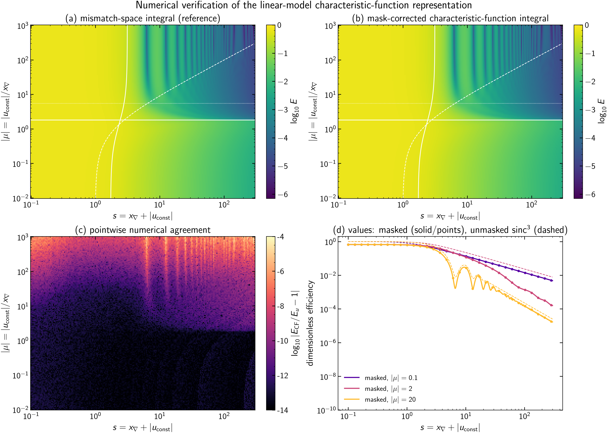
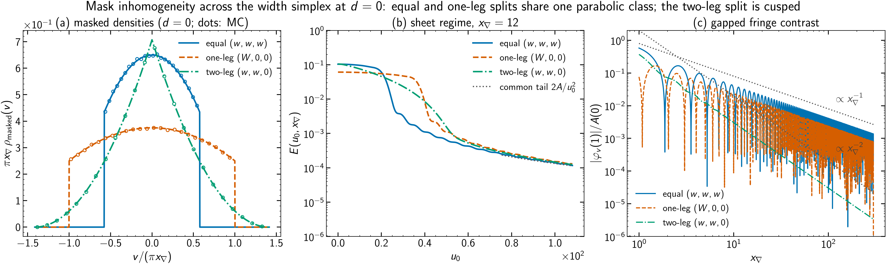
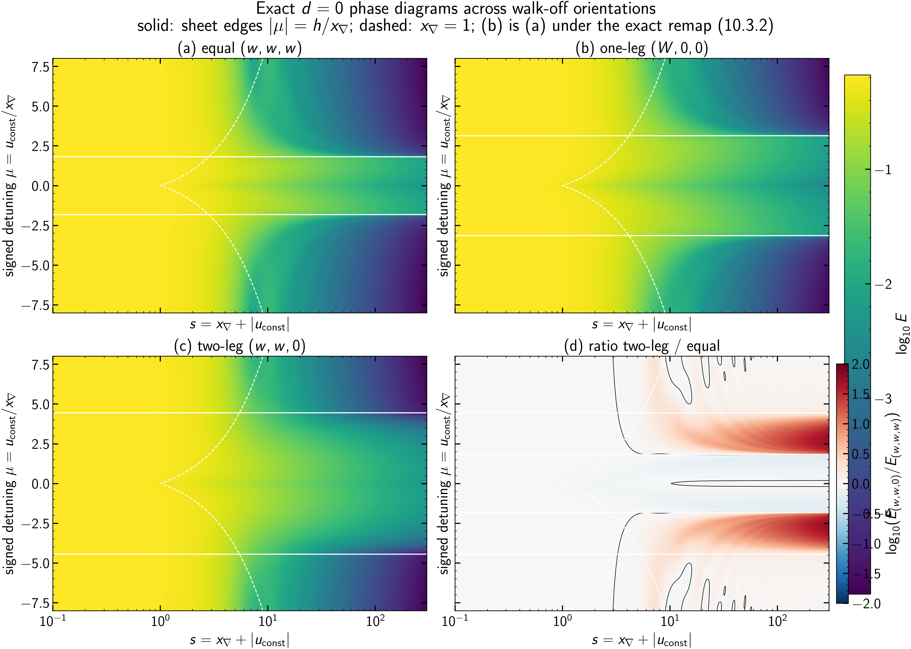

# The Lorenzi Fast method: theory of the S0–S6 pipeline

This note is the scientific record of the *Lorenzi Fast* full-band NLIN
estimator implemented in
[`src/pynlin/methods/td/fast_nlin.py`](../../src/pynlin/methods/td/fast_nlin.py)
and driven by the staged analysis pipeline
[`analysis/fwm/fast_s0_territory.py`](../../analysis/fwm/fast_s0_territory.py) …
[`analysis/fwm/fast_s6_physical.py`](../../analysis/fwm/fast_s6_physical.py).
It states the model precisely, derives every closed form the code uses, and
backs each load-bearing claim with a figure regenerated from the current code
by [`analysis/fwm/plot_fast_theory_figures.py`](../../analysis/fwm/plot_fast_theory_figures.py)
(figures dated 2026-08-24 unless noted).

The method replaces per-tuple Monte Carlo over in-channel frequencies with
analytic, regime-dispatched evaluation of a single scalar efficiency per FWM
tuple, making the full-band strict-FWM + XPM sum tractable at full channel
resolution (2284 channels, $\sim 10^7$ tuples per target).

Notation follows
[`fwm_dispersion_scales_and_coordinates.md`](fwm_dispersion_scales_and_coordinates.md)
(global curve $\beta(\omega)$, per-channel local Taylor coefficients, tuple-level
mismatch) and the single-tuple scaling analysis in
[`fwm_single_tuple_scaling.md`](fwm_single_tuple_scaling.md).

## 0. The pipeline at a glance

| Stage | Script | Question it answers |
|---|---|---|
| S0 | `fast_s0_territory.py` | *Where does FWM mass live* in the normalized variables, by tuple count and by weight? |
| S1+S2 | `fast_s2_collapse.py` | Per-tuple error gate: model vs exact-mask QMC, separated into mask/regime error, quadratic ($\beta_2$) error, and end-to-end production error. |
| S3 | `fast_s3_tube.py` | Post-enumeration tuple pruning with a padded discarded-set bound; retained tuples still use the linear phase model. |
| S4 | `fast_s4_targets.py` | Per-target gate: fast sums vs the repo's exhaustive-support MC at probe targets, with timing. |
| S5 | `fast_s5_fullband.py` | The production full-band sweep (checkpointed, process-parallel), with MC references at probe targets. |
| S6 | `fast_s6_physical.py` | Physical units: NLIN variance and NSR per channel from the S5 prefactor-free sums. |

S3 v1 implements post-enumeration tuple selection. Direct geometric survivor
enumeration and a complete same-model certificate remain planned; see §9 and
§15.

## 1. Terminology

Precise definitions of the recurring terms, in the sense used throughout this
document.

* **NLIN** — *nonlinear interference noise*: the signal-dependent
  perturbation a WDM channel accumulates from Kerr-nonlinear interactions
  with the other channels, treated as an additive noise term with a variance.
* **Target / interferer** — the channel whose noise is being computed ($t$) /
  any other channel contributing to it.
* **XPM** — *cross-phase modulation*: the two-channel Kerr interaction, terms
  of the form $A_t |A_b|^2$; one interferer $b$, contributions indexed by
  pairs $(t, b)$.
* **FWM** — *four-wave mixing*: the Kerr interaction combining three fields
  into a fourth, terms $A_a A_b A_c^*$ radiating at frequency
  $f_a + f_b - f_c$. **Strict FWM**: the sub-population with $a, b, c, t$
  pairwise distinct (no degenerate indices); a **tuple** always means one
  such $(a, b, c) \to t$ combination.
* **Baud rate $B$** — the symbol rate of one channel; with Nyquist pulses the
  channel's spectral support (the frequency interval where its spectrum is
  nonzero) has width exactly $B$.
* **Nyquist / commensurate grid** — channel spacing equal to (or a rational
  multiple of) $B$, so mixing products land at discrete offsets from channel
  centers; the admissible index combinations then form disconnected discrete
  regions, the "isles" (the zero-sum tuple regions visualized by the
  `analysis/standalone_analytical/the-domain-in-freq-space-*.py` scripts).
* **Phase mismatch $\Delta\beta$** — for a tuple, the propagation-constant
  imbalance $\beta_a + \beta_b - \beta_c - \beta_t$ evaluated at the
  participating frequencies; the interaction's build-up over distance $z$
  rotates by $e^{i\Delta\beta z}$.
* **Walk-off** — the group-velocity mismatch between channels, i.e. a
  difference of first-order coefficients $\Delta\beta_1$; it makes pulses in
  different channels slide past each other and is what limits interaction
  build-up away from the zero-dispersion point.
* **ZDW** — *zero-dispersion wavelength*: the wavelength where the
  second-order dispersion coefficient $\beta_2(\omega)$ crosses zero (inside
  the O band for the fiber studied here).
* **Mass** — a tuple's contribution $N\,T^2\!/L^2$ viewed as its weight in the target's
  aggregate sum; "90% of the mass in 400 tuples" means those tuples carry 90%
  of $\sum N\,T^2\!/L^2$. **Heavy-tailed** mass: a small fraction of tuples carries most
  of the sum.
* **Characteristic function** — of a random variable $X$:
  $\varphi_X(t) = \mathbb E[e^{itX}]$ (the Fourier transform of its
  distribution).
* **Irwin–Hall density** — the probability density of a sum of independent
  uniform random variables: a piecewise polynomial of degree $n-1$ for $n$
  terms, obtained by inclusion–exclusion.
* **$\operatorname{sinc}$** — throughout, the unnormalized form
  $\operatorname{sinc}(z) = \sin(z)/z$.
* **Zonotope** — the image of a cube under a linear map: a convex polytope
  (equivalently, a Minkowski sum of line segments). Used here because a
  uniform distribution on a cube maps to a uniform distribution on a
  zonotope.
* **Gauss–Legendre (GL) quadrature** — an $n$-node numerical integration rule
  on an interval, exact for polynomials up to degree $2n-1$; "composite
  panels" means partitioning the interval and applying a fixed-order rule on
  each piece.
* **MC / QMC / scrambled Sobol** — Monte Carlo: integration by averaging over
  random points, error $\propto N^{-1/2}$. Quasi-Monte Carlo: the same with
  *low-discrepancy* deterministic point sets (here Sobol sequences), which
  fill the domain more evenly and converge faster on smooth integrands.
  *Scrambling* randomizes a Sobol set without destroying its uniformity;
  averaging over independently scrambled replicates ("randomized Sobol")
  yields an unbiased estimate *with* an error bar. **Stderr** — standard
  error of the mean over such replicates.
* **Effective samples** — the equivalent number of points doing useful work
  when most points land where the integrand is negligible; if the kernel core
  covers a fraction $p$ of the sampling cube, $N$ points act like $\sim pN$.
* **Support** (of a function/distribution) — the set where it is nonzero.
* **Prefactor-free** — the efficiency sums with all physical constants
  ($\gamma^2$, powers, $L^2$) stripped out; the constants are restored once,
  in S6 (§12).
* **Dar / Golani time-domain picture** — the pulse-collision formulation of
  NLIN in which the noise variance is a sum over symbol-collision integrals;
  the frequency-domain average used here is its per-tuple reduction. See
  [`direct_sector_mc.md`](direct_sector_mc.md) for the collision-sector side
  of this framework.
* **Link / propagator $\Lambda$** — the flat-profile build-up integral
  $\Lambda(\Delta\beta) = \int_0^L e^{(i\Delta\beta-\alpha)z}dz$ of the Dar
  MC estimators; the kernel used here is its lossless normalized square,
  $\hat K = |\Lambda|^2/L^2$ at $\alpha = 0$ (§2).
* **Dar collision count $L/L_W$** — span length over walk-off length,
  $L/L_W = L\,B\,|\Delta\beta_1|$: the number of symbol slots an interferer
  slides past the target over the span. Identical to the XPM pair variable
  $|\nu|$ of this document (§12).
* **Gapped tuple / phase-matched-surface crossing** — the two classes of
  [`fwm_single_tuple_scaling.md`](fwm_single_tuple_scaling.md): a tuple whose
  minimum reachable mismatch is bounded away from zero ($|u_0| > W$ here,
  efficiency scaling $x_\nabla^{-2}$) vs one whose phase-matched surface
  $\Delta\beta = 0$ crosses the admissible spectral domain ($|u_0| < W$,
  scaling $x_\nabla^{-1}$).
* **Decimation** — evaluating on every $k$-th channel of the grid
  ($k$ = decimation factor). See §9 for why this is *not* an innocent
  speed-up for FWM.
* **Checkpointing** — periodically saving completed per-target results so an
  interrupted run resumes without recomputation.
* **NSR** — noise-to-signal ratio: NLIN variance divided by launch power, per
  channel.
* **Guard gap** — an unused spectral interval between adjacent ITU
  transmission bands (O, E, S, C, L, U); "OESCLU" denotes the six-band
  configuration spanning them.

### 1.1 Symbols

Every mathematical symbol used in this document, built up in four levels:
elementary model parameters, per-channel quantities, per-tuple quantities,
and functions/estimator quantities. The level structure follows
[`fwm_dispersion_scales_and_coordinates.md`](fwm_dispersion_scales_and_coordinates.md)
(fiber → channel → tuple).

**Level 0 — elementary model parameters** (properties of the system, before
any channel or tuple is singled out):

| Symbol | Definition | Units |
|---|---|---|
| $L$ | span length | m |
| $\alpha$ | power attenuation coefficient (0 throughout: flat power profile) | 1/m |
| $\gamma$ | Kerr nonlinear coefficient; frequency-dependent $\gamma(f)$ in S6 | 1/(W·m) |
| $P$ | per-channel launch power (flat across the band) | W |
| $B$ | baud rate = symbol rate; one channel's spectral support is $B$ wide | Hz |
| $T = 1/B$ | symbol period | s |
| $f$, $\omega = 2\pi f$ | optical frequency / angular frequency | Hz, rad/s |
| $N$ | number of WDM channels (2284 in the OESCLU study) | — |
| $\Delta f$ | channel spacing (25 GHz in the study) | Hz |
| $\beta(\omega)$ | global propagation constant of the fiber | 1/m |
| $\beta_k = d^k\beta/d\omega^k$ | global dispersion derivatives ($k = 1$: inverse group velocity; $k = 2$: group-velocity dispersion) | s$^k$/m |

**Level 1 — per-channel quantities** (channel index $j$; the target is $t$,
the three FWM legs are $a, b, c$, an XPM interferer is $b$):

| Symbol | Definition | Units |
|---|---|---|
| $f_j$ | center frequency of channel $j$ | Hz |
| $\beta_0^{(j)}, \beta_1^{(j)}, \beta_2^{(j)}$ | local Taylor coefficients of $\beta$ at $f_j$ (value, slope, curvature) | 1/m, s/m, s²/m |
| $f_j^{\rm off}$ | in-channel frequency offset from the center of channel $j$ | Hz |
| $x_j = 2\pi f_j^{\rm off}/B$ | normalized in-channel offset, uniform on $(-\pi, \pi)$; one channel spans $2\pi$ rad | rad |

**Level 2 — per-tuple quantities** (one strict FWM tuple $(a,b,c) \to t$,
or one XPM pair $(t,b)$; all phases in radians after multiplying by $L$):

| Symbol | Definition | Introduced |
|---|---|---|
| $\Delta\beta$ | four-channel mismatch $\beta_a + \beta_b - \beta_c - \beta_t$ at the participating frequencies [1/m] | §1 |
| $u = \Delta\beta\,L$ | accumulated phase mismatch over the span | §2 |
| $u_0 = \Delta\beta_0 L$ | center accumulated mismatch phase (target frame: $\beta_1^{(t)}$ subtracted); code `u0` (formerly `mu`; renamed 2026-08-24 so $\mu$ keeps its single-tuple-scaling meaning) | §3 |
| $\nu_j = \Delta\beta_1^{(j)} B L$ | per-leg walk-off across one channel bandwidth; code `nu_a/nu_b/nu_c` | §3 |
| $q_j = \tfrac12 \beta_2^{(j)} B^2 L$ | in-channel quadratic curvature; code `q_a/q_b/q_c/q_t` | §3 |
| $d = 2\pi(f_a{+}f_b{-}f_c{-}f_t)/B$ | support shift of the mixing product; code `d` | §3 |
| $x_d = x_a + x_b - x_c + d$ | output-frequency offset (must satisfy $\lvert x_d\rvert < \pi$) | §3 |
| $m = x_a + x_b - x_c$ | mask variable (the part of $x_d$ that fluctuates) | §5 |
| $w_j = \pi\lvert\nu_j\rvert$ | per-leg width of the linear mismatch range; code `widths` | §3 |
| $W = \sum_{j\in\{a,b,c\}} w_j$ | total width: $u$ ranges over $[u_0 - W, u_0 + W]$ | §3 |
| $\sigma^2 = \tfrac13\sum_{j\in\{a,b,c\}} w_j^2$ | variance of the linear offset; code `sigma`$^2$ | §7 |
| $x_\nabla = \sqrt{\sum_{j\in\{a,b,c\}} \nu_j^2}$ | loudness scale (L2 walk-off norm), $= LB\lVert\nabla\Delta\beta\rVert_2$; code `x_grad` | §3 |
| $\mu = u_0 / x_\nabla$ | pure dimensionless detuning (single-tuple-scaling convention); code `mu` | §3 |
| $g_{\rm box} = \max(\lvert u_0\rvert-W,0)$ | distance from zero to the unmasked linear box interval | §9 |
| $g_{\rm mask}$ | distance from zero to the certified mask-aware linear outer interval | §9 |
| $P_q = \pi^2 \sum \lvert q\rvert$ | quadratic padding of the certificate ($g_{\rm mask}\to\max(g_{\rm mask}-P_q,0)$) | §9 |
| $\nu = \Delta\beta_1 B L$ | XPM pair walk-off $=$ Dar collision count $L/L_W$ | §12 |
| $y = x_1 - x_2$ | interferer in/out frequency difference (XPM) | §12 |

**Level 3 — functions, distributions, and estimator quantities:**

| Symbol | Definition | Introduced |
|---|---|---|
| $\Lambda(\Delta\beta) = \int_0^L e^{(i\Delta\beta - \alpha)z} dz$ | link/propagator (build-up integral) | §2 |
| $\hat K(u) = 4\sin^2(u/2)/u^2$ | normalized lossless link kernel $= \lvert\Lambda\rvert^2/L^2$ at $\alpha = 0$ | §2 |
| $N\,T^2\!/L^2 = \mathbb E[\hat K(u)\mathbf 1_{\rm mask}]$ | per-tuple efficiency (the quantity the whole method computes) | §2 |
| $\mathbf 1_{\rm mask}$ | indicator of frequency matching, $\lvert x_d\rvert < \pi$ | §2 |
| $\rho_{\mathbf w}(v)$ | Irwin–Hall density of the linear offset $\sum_{j\in\{a,b,c\}} c_j x_j$ | §4 |
| $\varphi_u(t) = \mathbb E[e^{iut}]$ | characteristic function of $u$; $t$ is the normalized autocorrelation lag $\in [0,1]$ | §4 |
| $\operatorname{sinc}(z) = \sin(z)/z$ | unnormalized sinc | §4 |
| $A(d) = \Phi_3(\pi{-}d) - \Phi_3(-\pi{-}d)$ | unconditional mask acceptance; $\Phi_3$ = 3-uniform CDF | §5 |
| $A_{\rm cond}(v) = P(\lvert m{+}d\rvert{<}\pi \mid u)$ | conditional acceptance at mismatch offset $v$ | §5 |
| $M$; $c_u, c_m, c_\xi$ | change-of-basis matrix and its rows (coefficients of $u$, of $m$, and their cross product) in the zonotope density | §6 |
| $\rho(u, m)$ | exact joint density of mismatch and mask variable | §6 |
| $(N\,T^2\!/L^2)_{\rm lin}$ | linear-model ($q_j = 0$) efficiency | §4 |
| $U$ | wide-regime central-window half-width ($48\pi$) | §7 |
| $H(\theta)$ | masked cosine transform of the XPM pair-difference law | §12 |
| $(N\,T^2\!/L^2)_{\rm XPM}(\nu)$ | exact XPM pair efficiency | §12 |
| $\varepsilon$ | minimum admissible efficiency (tuple-selection threshold, S3) | §9 |
| $N(x_\nabla, \mu)$ | tuple population density of a channel plan (S0 census) | §10 |
| $\sigma^2_{\rm XPM}, \sigma^2_{\rm FWM}$ | physical NLIN variances per channel [W] | §13 |
| NSR $= \sigma^2_{{\rm NLI},t}/P$ | noise-to-signal ratio per channel | §13 |

## 2. Physical setting

One target channel $t$ accumulates NLIN from two populations:

* **XPM pairs** $(t, b)$, $b \neq t$: two-channel collisions.
* **Strict FWM tuples** $(a, b, c) \to t$ with $a, b, c, t$ pairwise
  distinct and $f_a + f_b - f_c \approx f_t$.

For each interaction, the time-domain (Dar/Golani) picture reduces the
variance contribution to a *prefactor-free efficiency* $N\,T^2\!/L^2 \in [0, 1]$ — an
average of the squared phase-matching link function over the in-channel
spectral degrees of freedom — multiplied by a purely combinatorial/power
prefactor (§12). The entire method is about evaluating

$$
N\,T^2\!/L^2 \;=\; \mathbb{E}\!\left[\hat K(u)\,\mathbf 1_{\mathrm{mask}}\right],
\qquad
\hat K(u) = \left|\frac1L\int_0^L e^{\,i\,\Delta\beta(x_a,x_b,x_c)\,z}\,dz\right|^2
= \frac{4\sin^2(u/2)}{u^2},
$$

cheaply and controllably for every tuple. Here $u = \Delta\beta\,L$ is the
phase mismatch accumulated over the full span length $L$ (in radians), the
expectation runs over the in-channel frequency offsets of the three
interferer legs (defined in §3), and $\mathbf 1_{\mathrm{mask}}$ is the
indicator of the frequency-matching condition (§5). $\hat K$ — the **link
kernel** — is the squared magnitude of the normalized coherent build-up
integral for a lossless span: $\hat K(0) = 1$ (perfect phase matching),
decaying as $4\sin^2(u/2)/u^2$ with mismatch.

This is the same object as the **link/propagator**
$\Lambda(\Delta\beta) = \int_0^L e^{(i\Delta\beta - \alpha)z}\,dz$ of
[`direct_sector_mc.md`](direct_sector_mc.md): at $\alpha = 0$ (flat power
profile), $\hat K(u) = |\Lambda(\Delta\beta)|^2 / L^2$. Likewise $N\,T^2\!/L^2$ is
exactly the *Dar frequency-domain MC* integrand of that note — the masked
average of $|\Lambda|^2$ over uniformly sampled in-channel frequencies —
evaluated here analytically instead of by sampling. The two documents are the
sampling and the analytic face of one framework.

### 2.1 From the defining collision integrals to the masked kernel average

The identity $N\,T^2\!/L^2 = \mathbb E[\hat K\,\mathbf 1_{\rm mask}]$ is not a
definition — it follows from the integrals that define the noise in the
first place. The chain, for one strict tuple $(a,b,c) \to t$, flat power
($\alpha = 0$), single span:

**(i) Fields and first-order perturbation.** Each channel transmits
unit-energy Nyquist pulses at rate $1/T$,
$A_j(0,t) = \sqrt{P T} \sum_n a^{(j)}_n\, g_j(t - nT)$, with spectrum
$\hat g_j(\omega)$ flat over channel $j$'s band:
$|\hat g_j(\omega)|^2 = T\cdot\mathbf 1_{{\rm band}_j}(\omega)$ (so
$\int |\hat g|^2\, d\omega/2\pi = 1$). First-order (regular-perturbation)
Kerr interaction in the interaction picture: with unit-energy pulses and
dimensionless unit-variance symbols, the target's normalized received symbol
$0$, after matched filtering, is perturbed by

$$
\Delta a_0 \;=\; i\gamma P T \sum_{h,k,m}
a^{(a)}_h\, a^{(b)}_k\, a^{(c)*}_m\; X_{h,k,m},
$$

$$
X_{h,k,m} \;=\; \int_0^L\! dz \int dt\;
g_t^*(z,t)\; g_a(z, t - hT)\, g_b(z, t - kT)\, g_c^*(z, t - mT),
$$

where $g_j(z,\cdot)$ is the pulse dispersed to distance $z$ — the
**collision integral**: the overlap, accumulated along the span, of three
interferer pulses sliding through the target's matched filter. This is the
Golani/Dar tensor of [`direct_sector_mc.md`](direct_sector_mc.md), there
written for the two-channel (XPM) case.

**(ii) Variance.** For i.i.d. zero-mean unit-variance symbols on three
*distinct* channels the products are uncorrelated, so

$$
\sigma^2_{(abc)\to t} = \gamma^2 P^3 T^2
\underbrace{\sum_{h,k,m} \lvert X_{h,k,m}\rvert^2}_{\displaystyle \mathcal N_\tau} .
$$

Here $\sigma^2_{(abc)\to t}$ is physical single-polarization noise power in W
for equal single-polarization channel powers $P$. No fourth-moment terms enter
for pairwise-distinct $a,b,c,t$; the constellation and multiplicity factors
are restored in §13.

**(iii) Frequency form of one $X$.** Writing each dispersed pulse through
its spectrum, the $t$-integral yields $2\pi\delta(\omega_1 + \omega_2 -
\omega_3 - \omega_4)$ (energy conservation) and the $z$-integral yields the
link $\Lambda(\Delta\beta) = \int_0^L e^{i\Delta\beta z} dz$:

$$
X_{h,k,m} = \int \frac{d\omega_1\, d\omega_2\, d\omega_3}{(2\pi)^3}\,
\hat g_a(\omega_1) \hat g_b(\omega_2) \hat g_c^*(\omega_3)
\hat g_t^*(\omega_4)\,
e^{-iT(h\omega_1 + k\omega_2 - m\omega_3)}\,
\Lambda\big(\Delta\beta(\omega_1,\omega_2,\omega_3)\big),
$$

with $\omega_4 = \omega_1 + \omega_2 - \omega_3$ and $\Delta\beta$ the
four-frequency mismatch of §1.

**(iv) The index sums become band averages (Poisson summation).** In
$\mathcal N_\tau = \sum_{h,k,m}|X|^2$ each integer sum acts on the primed/unprimed
frequency pair of the two $X$ copies:

$$
\sum_{h \in \mathbb Z} e^{-ihT(\omega_1 - \omega_1')}
= \frac{2\pi}{T} \sum_{p} \delta\Big(\omega_1 - \omega_1' - \frac{2\pi p}{T}\Big),
$$

and since $\hat g_a$ occupies exactly one Nyquist band (width $2\pi/T$),
only $p = 0$ survives: the three sums *diagonalize* the frequencies,
$\omega_i' = \omega_i$. Collecting constants —
$(2\pi/T)^3$ from the sums, $|\hat g_j|^2 = T$ four times, and band volume
$\int_{\rm band} d\omega/2\pi = 1/T$ per leg —

$$
\mathcal N_\tau = \frac{1}{T^3}\int \frac{d\omega_1 d\omega_2 d\omega_3}{(2\pi)^3}\,
T^4\, \mathbf 1_a \mathbf 1_b \mathbf 1_c\,
\mathbf 1_t(\omega_1{+}\omega_2{-}\omega_3)\, |\Lambda|^2
= \frac{1}{T^2}\,
\mathbb E\big[\,\lvert\Lambda\rvert^2\, \mathbf 1_{\rm mask}\big],
$$

where $\mathbb E$ is the *uniform average over the three in-band
frequencies* — which is exactly where the normalized offsets
$x_j \sim \mathcal U(-\pi,\pi)$ of §3 come from ($x_j = $ offset $\times\,T$)
— and $\mathbf 1_t$ is the output-support mask $|x_a + x_b - x_c + d| < \pi$
of §5: **frequency conservation against finite receiver bandwidth *is* the
mask.**

**(v) The base expression, constants included.** With
$\hat K = |\Lambda|^2/L^2$:

$$
\boxed{\;
\mathcal N_\tau \;=\; \frac{L^2}{T^2}\;
\mathbb E\big[\hat K(u)\,\mathbf 1_{\rm mask}\big]
\quad\Longleftrightarrow\quad
\frac{\mathcal N_\tau T^2}{L^2} = \mathbb E\big[\hat K(u)\,\mathbf 1_{\rm mask}\big]
\;}
$$

with no leftover numerical factor — the $T^2$ is the pulse-normalization
footprint of the four $|\hat g|^2 = T$ factors against the three index sums
and three band volumes, and the $L^2$ is the coherent build-up scale of
$|\Lambda|^2$. The per-tuple physical variance is then
$\sigma^2 = \gamma^2 P^3 T^2 \mathcal N_\tau
= \gamma^2 P^3 (\mathcal N_\tau T^2\!/L^2)\,L^2$, and §13 restores the multiplicity
prefactors. Every expression in §§4–12 and the
region laws of §10.2 are asymptotics of the right-hand side; the collision
sums of [`direct_sector_mc.md`](direct_sector_mc.md) are MC estimates of
the left-hand side; the identity above is what makes their comparison a
like-for-like check.

**Elementary hierarchy.** To distinguish this quantity from the number of WDM
channels, write the raw collision sum as $\mathcal N_\tau$. It is a collision
strength, not a noise power:

$$
\begin{aligned}
\mathcal N_\tau
&=\sum_{h,k,m}|X_{h,k,m}|^2
&&\text{raw collision sum},\\
C_\tau
&=T^2\mathcal N_\tau
&&\text{dimensional collision coefficient in m}^2,\\
F_\tau
&=\frac{C_\tau}{L^2}
=\mathbb E[\hat K(u)\mathbf 1_{\rm mask}]
&&\text{dimensionless interaction efficiency},\\
\sigma^2_\tau
&=\gamma^2P^3C_\tau
&&\text{physical single-polarization noise power in W}.
\end{aligned}
$$

These relations precede the ordered-tuple multiplicity factors of §13. In
words: each symbol collision produces a complex amplitude $X_{h,k,m}$;
$\mathcal N_\tau$ adds their squared magnitudes; $T^2$ converts that raw
pulse-normalized sum into an m$^2$ coefficient; and only $\gamma^2P^3$
converts the coefficient into physical noise power. The dependence on $d$
belongs to $F_\tau$ through the set of accepted frequency combinations, and
consequently propagates to $C_\tau$, $\mathcal N_\tau$, and $\sigma^2_\tau$.
The historical formulas below abbreviate $\mathcal N_\tau$ as $N$ inside
per-tuple expressions; it must not be confused with the channel count.
Sections 4.1, 4.2, and 10.2 write $E$ for the same efficiency in their
equal-split reductions.

Two conditions govern a tuple, and they must not be conflated:

1. **Frequency matching (hard).** The mixing product
   $f_a + f_b - f_c$ (plus in-channel offsets) must land inside the target's
   spectral support. This is a *support* condition: outside it the
   contribution is exactly zero. On a commensurate grid it carves the
   discrete zero-sum isles of admissible index combinations.
2. **Phase matching (soft).** Among frequency-matched tuples, $N\,T^2\!/L^2$ measures
   how efficiently the interaction builds up over the span. It varies over
   roughly ten orders of magnitude across the band and is what changes
   qualitatively between the O band (near the ZDW) and the rest of the
   spectrum.

## 3. Normalized tuple variables

Write the global propagation constant as $\beta(\omega)$ with per-channel
local Taylor coefficients $\beta_0^{(j)}, \beta_1^{(j)}, \beta_2^{(j)}$ (the
value, slope, and curvature of $\beta$ at channel $j$'s center). Normalize
each leg's in-channel offset — its frequency position within its own channel,
relative to the channel center — as
$x_j = 2\pi f^{\rm off}_j / B \in (-\pi, \pi)$, so one channel's spectral
support is exactly $2\pi$ radians wide.

Work in the **target frame**: subtract the target's group delay
$\beta_1^{(t)}$ from all channels. This removes the linear-in-frequency part
of $\beta$ exactly for energy-conserving quadruples
([`fwm_tuple_variables`](../../src/pynlin/methods/td/fast_nlin.py)), and is
what makes $u_0$ below a genuine interaction mismatch rather than a frame
artifact. Expanding $\Delta\beta$ to second order in the offsets gives the
accumulated mismatch

$$
u \;=\; u_0 \;+\; \nu_a x_a + \nu_b x_b - \nu_c x_c
\;+\; q_a x_a^2 + q_b x_b^2 - q_c x_c^2 - q_t x_d^2 ,
$$

with the **normalized tuple variables**

$$
u_0 = \Delta\beta_0\,L \ \ (\text{target frame}), \qquad
\nu_j = \Delta\beta_1^{(j)}\,B\,L, \qquad
q_j = \tfrac12\,\beta_2^{(j)} B^2 L, \qquad
d = \frac{2\pi\,(f_a+f_b-f_c-f_t)}{B},
$$

where $x_d = x_a + x_b - x_c + d$ is the output-frequency offset (the mixing
product's position within the target band). All variables are phases in
radians after multiplying by $L$:

* $u_0$ — the **center mismatch**: accumulated phase mismatch when every leg
  sits at its channel center;
* $\nu_j$ — the **per-leg walk-off**: how much the accumulated mismatch
  changes as leg $j$ scans across its own channel bandwidth;
* $q_j$ — the in-channel **quadratic curvature** (the effect of $\beta_2$
  *within* one channel, distinct from the $\beta_2$ that builds $u_0$ across
  channels);
* $d$ — the **support shift** of the mixing product relative to the target
  center.

The last point is easiest to read through the decomposition

$$
\underbrace{x_d}_{\text{actual landing position}}
=
\underbrace{d}_{\text{carrier-center residual}}
+
\underbrace{(x_a+x_b-x_c)}_{m:\ \text{in-channel spectral displacement}}.
$$

Thus $d$ is **not** the final landing frequency. It is a fixed property of the
carrier tuple $(a,b,c)\to t$:

$$
d=\frac{2\pi(f_a+f_b-f_c-f_t)}{B}.
$$

It states where the mixing product of the three *carrier centers* would fall
relative to the target center. The variable $m=x_a+x_b-x_c$ then moves an
individual combination of spectral components around that carrier-center
location, and $x_d=m+d$ is where that particular combination actually lands.
The output mask keeps only combinations satisfying $|x_d|<\pi$.

For example, when $d=0$, the three carrier centers mix exactly to the target
center, although off-center components still populate the whole accepted
target band. When $d=2\pi$, the carrier centers mix one symbol-rate bandwidth
away from the target center; they do not themselves land in the target, but
spectral combinations with $m\approx-2\pi$ can compensate the residual and
still contribute. At $|d|\ge4\pi$, even the extreme available values
$m\in(-3\pi,3\pi)$ cannot reach the target band except at measure-zero
boundaries.

**Absolute versus relative frequency variables.** Let $f_j$ denote the
absolute ordinary carrier frequency of channel $j$ in Hz, and let
$f_j^{\rm off}$ denote a local offset from that carrier. The actual optical
frequency of one spectral component is

$$
\widetilde f_j=f_j+f_j^{\rm off}.
$$

Equivalently, in angular frequency,

$$
\omega_j=2\pi f_j,
\qquad
\Omega_j=2\pi f_j^{\rm off},
\qquad
\widetilde\omega_j=\omega_j+\Omega_j.
$$

The absolute generated frequency is

$$
\widetilde\omega_{\rm out}
=\widetilde\omega_a+\widetilde\omega_b-\widetilde\omega_c.
$$

Relative to the target carrier $\omega_t$, this becomes

$$
\widetilde\omega_{\rm out}-\omega_t
=
\underbrace{(\omega_a+\omega_b-\omega_c-\omega_t)}_{\delta_\Omega:
\ \text{carrier residual}}
+\Omega_a+\Omega_b-\Omega_c.
$$

Dividing all local angular offsets by the symbol rate $B$ (written $R_s$ in some scripts; `symbol_rate_baud` in code) gives the
dimensionless variables used in this note:

$$
x_j=\frac{\Omega_j}{B},
\qquad
d=\frac{\delta_\Omega}{B},
\qquad
x_d=\frac{\widetilde\omega_{\rm out}-\omega_t}{B}
=d+x_a+x_b-x_c.
$$

The roles can therefore be summarized as follows:

| Variable | Type | Meaning |
|---|---|---|
| $f_j$, $\omega_j$ | Absolute carrier coordinate | Fixed location of channel $j$ on the optical-frequency axis. |
| $\widetilde f_j$, $\widetilde\omega_j$ | Absolute spectral coordinate | Actual frequency of a selected component inside channel $j$. |
| $f_j^{\rm off}$, $\Omega_j$ | Carrier-relative offset | Displacement of that component from its own carrier. |
| $x_j=\Omega_j/B$ | Normalized relative offset | Dimensionless in-channel coordinate in $(-\pi,\pi)$. |
| $\delta_\Omega$ | Relative carrier-combination residual | Angular-frequency difference between the mixed carrier centers and the target carrier. |
| $d=\delta_\Omega/B$ | Normalized carrier residual | Fixed dimensionless shift associated with one tuple. |
| $x_d$ | Normalized target-relative output offset | Actual landing position relative to the target carrier. |

The propagation constant is always evaluated at the absolute component
frequencies. For example, the physical mismatch is

$$
\Delta\beta
=\beta(\widetilde\omega_a)
+\beta(\widetilde\omega_b)
-\beta(\widetilde\omega_c)
-\beta(\widetilde\omega_{\rm out}).
$$

The variables $u_0$, $\nu_j$, and $q_j$ are the coefficients obtained when
this absolute-frequency expression is expanded in the relative coordinates
$x_j$ and then multiplied by the span length. Changing coordinates does not
change the physical frequencies or the mismatch.

**Four-index residual and its target-centered form.** On a uniform grid, write
every absolute carrier frequency against one common reference as

$$
\omega_j=\omega_{\rm ref}+n_j\Omega_0,
\qquad \Omega_0=2\pi\Delta f.
$$

The invariant integer carrier residual is the **four-index** combination

$$
\boxed{
q_{\rm res}=n_a+n_b-n_c-n_t.
}
$$

The common reference cancels. For a uniformly spaced grid with channel
separation $\Delta f$,

$$
\delta_\Omega
=\omega_a+\omega_b-\omega_c-\omega_t
=q_{\rm res}\Omega_0
=2\pi\Delta f\,q_{\rm res},
$$

and therefore, without changing definitions,

$$
\boxed{
d
=2\pi\,q_{\rm res}\,
\frac{\Delta f}{B}
}
$$

The apparently three-index formula is only a target-centered coordinate
version of this identity. Define relative channel indices

$$
\bar n_j=n_j-n_t,
\qquad \bar n_t=0.
$$

Then

$$
q_{\rm res}
=\bar n_a+\bar n_b-\bar n_c,
$$

because the fourth term is now the zero coordinate $\bar n_t=0$; it has not
been physically removed. The frequency-domain plots use the sign convention
$\omega_1-\omega_2+\omega_3=\omega_4$ and display
$\bar n_1-\bar n_2+\bar n_3$, which is the same $q_{\rm res}$ under the map
$(1,2,3,4)=(a,c,b,t)$.

Thus the family $q_{\rm res}=0$ is exactly the $d=0$ carrier-matched family;
$q_{\rm res}=\pm1$ gives
$d=\pm2\pi\Delta f/B$. For the 25 GHz / 24.5 Gbaud grid this is
$d\approx\pm6.41$.

Three different legacy uses of the letter $q$ must not be mixed:

| Symbol used here | Meaning | Relation to $d$ |
|---|---|---|
| $q_{\rm res}$ | Four-index carrier residual; shown in target-centered three-index form in the frequency-domain plots | $d=2\pi q_{\rm res}(\Delta f/B)$ |
| $r=\Delta f/B$ | Spacing-to-baud ratio, called $q$ in some XPM plots | Sets the size of one index step: $\Delta d=2\pi r$ |
| $q_j=\tfrac12\beta_2^{(j)}B^2L$ | In-channel quadratic phase coefficient | No direct identity with $d$ |

The scripts also use $\nu_i$ for an optical-frequency coordinate relative to
the target. That $\nu_i$ is not the walk-off phase coefficient $\nu_j$ used
in this note.

**When is $q_{\rm res}\in\{-1,0,1\}$?** Let

$$
r=\frac{\Omega_0}{B_{\rm ang}}
=\frac{\Delta f}{B},
\qquad B_{\rm ang}=2\pi B,
$$

where $B_{\rm ang}$ is the full angular passband width. Write each selected
absolute frequency as its channel center plus an in-channel offset,

$$
\widetilde\omega_j
=\omega_{\rm ref}+n_j\Omega_0+\epsilon_j,
\qquad
\epsilon_j\in[-B_{\rm ang}/2,B_{\rm ang}/2].
$$

For the four-index family $q_{\rm res}$, the generated frequency relative to
the target carrier is

$$
\widetilde\omega_{\rm out}-\omega_t
=q_{\rm res}\Omega_0
+(\epsilon_a+\epsilon_b-\epsilon_c).
$$

The offset sum ranges over
$[-3B_{\rm ang}/2,3B_{\rm ang}/2]$. Hence the complete output interval of
family $q_{\rm res}$ is

$$
I_q=
\left[
q_{\rm res}\Omega_0-\frac{3B_{\rm ang}}2,
q_{\rm res}\Omega_0+\frac{3B_{\rm ang}}2
\right].
$$

It contributes to the target only if $I_q$ overlaps the target interval
$[-B_{\rm ang}/2,B_{\rm ang}/2]$ with nonzero volume. Two closed intervals
of these half-widths overlap in their interiors exactly when

$$
|q_{\rm res}|\Omega_0<2B_{\rm ang},
\qquad\text{or equivalently}\qquad
\boxed{|q_{\rm res}|<\frac2r}.
$$

Equality gives only a measure-zero boundary contact and therefore zero
integrated contribution. If $r\ge1$, the integer condition
$|q_{\rm res}|<2/r\le2$ proves

$$
q_{\rm res}\in\{-1,0,1\}.
$$

For $1\le r<2$, all three families can have nonzero support; for $r\ge2$,
only $q_{\rm res}=0$ has nonzero support. The claim is **not** true for
sub-Nyquist spacing $r<1$: there $q_{\rm res}=\pm2$
and, for sufficiently small $r$, higher integer families can also overlap.
In general the largest admissible integer magnitude is

$$
|q_{\rm res}|_{\max}
=\left\lceil\frac2r\right\rceil-1.
$$

For the repository grid $r=25/24.5\approx1.0204$, this gives
$|q_{\rm res}|_{\max}=1$.

**Expected ranges and scales.** The offset variables have exact ranges fixed
by the rectangular-Nyquist support. The phase coefficients do not: they depend
on the channel tuple, fiber dispersion, symbol rate, and span length, and can
span many orders of magnitude. The following bounds distinguish these two
cases. Phase values labeled in radians are dimensionless in dimensional
analysis.

| Quantity | Admissible or guaranteed range | Interpretation |
|---|---|---|
| $x_a,x_b,x_c$ | $(-\pi,\pi)$ | Independent in-channel input offsets. |
| $m=x_a+x_b-x_c$ | $(-3\pi,3\pi)$ | Unmasked mixing offset. |
| $x_d=m+d$ before masking | $(d-3\pi,d+3\pi)$ | Possible output offsets generated by the input cube. |
| $x_d$ after masking | $(-\pi,\pi)$ | Only this part contributes to target channel $t$. |
| $d$ | Any real value algebraically; nonzero support only for $\lvert d\rvert<4\pi$ | At $\lvert d\rvert\ge4\pi$, the input cube and target passband do not overlap, apart from measure-zero boundaries. |
| $u_0$ | $(-\infty,\infty)$ | System-dependent accumulated center mismatch. |
| $\nu_j$ | $(-\infty,\infty)$ | Signed walk-off coefficient; one leg contributes an interval of half-width $w_j=\pi\lvert\nu_j\rvert$. |
| $q_j$ | $(-\infty,\infty)$ | Signed local curvature coefficient; within a retained channel, $\lvert q_jx_j^2\rvert\le\pi^2\lvert q_j\rvert$. |
| $w_j$, $W$ | $[0,\infty)$ | Per-leg and total linear mismatch half-ranges. |
| $x_\nabla$ | $[0,\infty)$ | Euclidean scale of the linear mismatch gradient. |
| $\mu=u_0/x_\nabla$ | $(-\infty,\infty)$ for $x_\nabla>0$; undefined at $x_\nabla=0$ | Signed center detuning measured in gradient units. |
| $A(d)$ | $[0,2/3]$ | Marginal support acceptance; the maximum $2/3$ occurs at $d=0$. |
| $N\,T^2\!/L^2$ for one masked tuple | $[0,A(d)]\subseteq[0,2/3]$ | Since $0\le\hat K(u)\le1$. |

Define per-leg **widths** $w_j = \pi|\nu_j|$ and the total width
$W = \sum_{j\in\{a,b,c\}} w_j$: the linear part of $u$ then ranges exactly over
$[u_0 - W,\ u_0 + W]$. $W$ is the tuple's total in-band "tuning range" of its
phase mismatch.

For the full local-quadratic model, define the conservative curvature bound

$$
P_q=\pi^2\left(
|q_a|+|q_b|+|q_c|+|q_t|
\right).
$$

On the accepted domain, where all four offsets lie in $(-\pi,\pi)$, the
complete mismatch is therefore guaranteed to satisfy

$$
u\in[u_0-W-P_q,\ u_0+W+P_q].
$$

These are support bounds, not statements that the endpoints are attained
after applying the correlated output mask. As a scale guide,
$|u|\ll1$ is coherent, $|u|=O(1)$ marks the onset of dephasing, the lossless
kernel has nonzero nulls at $u=2\pi k$, and a mismatch distribution spanning
many $2\pi$ periods is in the strongly dephased regime.

**Code correspondence** (`FWMTupleVariables` in
[`fast_nlin.py`](../../src/pynlin/methods/td/fast_nlin.py)): $u_0 \mapsto$
`u0`, $\nu_j \mapsto$ `nu_a/nu_b/nu_c`, $q_j \mapsto$ `q_a/q_b/q_c/q_t`,
$d \mapsto$ `d`, $A(d) \mapsto$ `acceptance`, $w_j \mapsto$ `widths`, and
`sigma` $= \sqrt{\sum_{j\in\{a,b,c\}} w_j^2/3}$ is the standard deviation of the linear
offset.

**Connection to the natural coordinates** of
[`fwm_dispersion_scales_and_coordinates.md`](fwm_dispersion_scales_and_coordinates.md):
that note's loudness scale is $x_\nabla = L S_\nabla = LB\,\lVert\nabla
\Delta\beta\rVert_2 = \sqrt{\nu_a^2+\nu_b^2+\nu_c^2}$ (the L2 counterpart of
the L1 quantity $W/\pi$), and its dimensionless detuning $\mu$ is used here
with the same meaning: $\mu = u_0 / x_\nabla$, with $u_0 = L\Delta\beta_{\rm center}$
the accumulated phase (that note's boxed identity). The
pair $(x_\nabla, |\mu|)$ decorrelates the tuple population where
$(|u_0|, W)$ does not (§10).

## 4. The linear model and its exact characteristic-function form

Drop the quadratic terms ($q_j = 0$; their effect is measured separately in
S2, §11) and momentarily ignore the mask. With
$x_j \sim \mathcal U(-\pi,\pi)$ independent, write $\hat K$ through its
autocorrelation form: substituting $z = Ls$,

$$
\hat K(u) = \int_0^1\!\!\int_0^1 e^{\,i u (s-s')}\,ds\,ds'
\quad\Longrightarrow\quad
\mathbb E[\hat K(u)] = \int_{-1}^{1} (1-|t|)\,\varphi_u(t)\,dt
= 2\int_0^1 (1-t)\,\mathrm{Re}\,\varphi_u(t)\,dt,
$$

Here $\varphi_u(t)=\mathbb E[e^{iut}]$ is the characteristic function of
$u$.

The triangular factor follows directly from the autocorrelation geometry.
Indeed, the normalized link amplitude is

$$
\lambda(u)=\int_0^1 e^{ius}\,ds,
$$

so its power kernel is the autocorrelation integral

$$
\hat K(u)=|\lambda(u)|^2
=\int_0^1\!\!\int_0^1 e^{iu(s-s')}\,ds\,ds'.
$$

Set $t=s-s'$.  For a fixed $t$, the constraints $0\leq s,s'\leq1$ and
$s'=s-t$ restrict $s$ to

$$
\max(0,t)\leq s\leq\min(1,1+t).
$$

This interval is empty for $|t|>1$ and has length $1-|t|$ for
$-1\leq t\leq1$.  Consequently, for any integrable function $g$,

$$
\int_0^1\!\!\int_0^1 g(s-s')\,ds\,ds'
=\int_{-1}^{1}(1-|t|)g(t)\,dt.
$$

Applying this identity with $g(t)=e^{iut}$ and interchanging expectation and
integration (the integrand has absolute value at most one) gives

$$
\mathbb E[\hat K(u)]
=\int_{-1}^{1}(1-|t|)\,\mathbb E[e^{iut}]\,dt
=\int_{-1}^{1}(1-|t|)\,\varphi_u(t)\,dt.
$$

Finally, because $u$ is real,
$\varphi_u(-t)=\overline{\varphi_u(t)}$; pairing the positive- and
negative-$t$ contributions yields the last equality above.  Thus
$(1-|t|)_+$ is the autocorrelation of the unit-interval indicator, rather
than an additional approximation.

For the linear model it factorizes exactly:

$$
\varphi_u(t) \;=\; e^{iu_0 t}\prod_{j\in\{a,b,c\}} \operatorname{sinc}(w_j t),
\qquad
\boxed{\;
(N\,T^2\!/L^2)_{\rm lin} = 2\int_0^1 (1-t)\,\cos(u_0 t)\prod_{j\in\{a,b,c\}} \operatorname{sinc}(w_j t)\,dt
\;}
$$

([`linear_model_cf`](../../src/pynlin/methods/td/fast_nlin.py)).

**Index range of the product.** The product runs over the three interferer
legs $j\in\{a,b,c\}$ only — three sinc factors, never four. The averaged
variables are the three independent uniforms $x_a,x_b,x_c$; the landing
offset $x_d=x_a+x_b-x_c+d$ is dependent and contributes no factor, and the
output leg's *linear* coefficient vanishes identically in the target frame
of §3 (subtracting $\beta_1^{(t)}$ leaves $\Delta\beta$ invariant for
energy-conserving quadruples and sets the output leg's slope to zero), so
there is no $\nu_t$. The three-sinc form is frame-invariant: reinstating a
fourth term $-\nu_t x_d$ in another frame redistributes into
$\nu_j\mapsto\nu_j-\nu_t$ and a shift of $u_0$. The fourth leg instead
enters as the mask indicator $\mathbf 1_t$ of §2.1(iv) — which correlates
the three legs, so the *masked* characteristic function does not factorize
(§4.2) — and, at quadratic order, as the four-term sum
$q_ax_a^2+q_bx_b^2-q_cx_c^2-q_tx_d^2$ of §3.

This CF form is exact
but its characteristic-function *integrand* is oscillatory: for large $u_0$
or $W$, the factors $\cos(u_0t)$ and $\operatorname{sinc}(w_jt)$ change sign,
and direct $t$-quadrature needs $\mathcal O(u_0 + W)$ nodes with severe
cancellation (large positive and negative lobes whose sum is tiny compared to
either). This does not mean that the expected power kernel is negative. The
equivalent mismatch-space representation

$$
\mathbb E[\hat K(u)]
=\int \hat K(u_0+v)\,\rho_{\mathbf w}(v)\,dv
$$

has a nonnegative integrand, although $\hat K$ itself still has sinc-squared
lobes as its argument varies. Thus three statements must be distinguished:
the $t$-space representation is sign-oscillatory; the $u$-space integrand and
its integral are nonnegative; and the final integral can still show positive
fringes as $u_0$, $W$, or a common system scale is swept.

Whether those fringes survive depends on dephasing across the mismatch
distribution. If its width is much smaller than one kernel period, then
$\hat K$ is nearly constant over the averaging window and
$\mathbb E[\hat K(u)]\approx\hat K(u_0)$, so its nulls and side lobes remain.
If the distribution spans many periods, the average smooths the fringes
toward the local period average. This is exactly the transition plotted in
Figure 10: its region 4 has
$N\,T^2\!/L^2\simeq(2/3)\hat K(u_0)$ and full-contrast coherent fringes, while
region 3 is the dephased, approximately fringe-averaged $s^{-2}$ regime (with
residual stripes through the crossover). Here *linear model* describes the
affine phase-mismatch model, not a nonoscillatory dependence of the result on
its parameters.

An earlier evaluation path based on inverting the characteristic function in
$t$-space was abandoned because of its cancellation. The production models
below instead use regime-specialized forms whose integrands are *nonnegative*
(no cancellation) or closed-form.

**Near-ZDW note.** The ZDW does not make this channel-local linearization
singular. In the active 100 km, 24.5 Gbaud SMF case, the channel nearest the
ZDW is at about 228.275 THz; its omitted quadratic and cubic phase at
$|x|=\pi$, the rectangular-Nyquist model edge, are only about
$1.2\times10^{-3}$ rad and
$5.4\times10^{-4}$ rad, respectively. What changes near the ZDW is instead
the tuple population: carrier mismatch and group-slowness differences become
small for many tuples, so coherent, phase-matchable interactions proliferate.
The resulting small $x_\nabla$ can make $\mu=u_0/x_\nabla$ ill-conditioned,
which is a coordinate limitation rather than evidence that the local linear
phase model has failed.

An equivalent, mask-friendly representation goes through the density of $u$.
The linear combination $\sum_{j\in\{a,b,c\}} c_j x_j$ of independent uniforms has the
Irwin–Hall piecewise-polynomial density $\rho_{\mathbf w}$
([`uniform_sum_density`](../../src/pynlin/methods/td/fast_nlin.py)), supported
on $[-W, W]$:

$$
(N\,T^2\!/L^2)_{\rm lin} = \int_{-W}^{W} \hat K(u_0 + v)\,\rho_{\mathbf w}(v)\,dv .
$$

### 4.1 From the linear average to the $(s,|\mu|)$ phase diagram

The phase diagram of §10.2 is not a separate model. It is the linear average
above, with the output-support mask restored and then expressed in natural
coordinates. The connection is easiest to see before introducing the general
mask machinery of §§5–6.

Let $\boldsymbol\nu$ be the signed vector of the three linear mismatch
coefficients and define

$$
x_\nabla=\lVert\boldsymbol\nu\rVert_2,
\qquad
|\mu|=\frac{|u_0|}{x_\nabla},
\qquad
s=x_\nabla+|u_0|=x_\nabla(1+|\mu|).
$$

Thus

$$
x_\nabla=\frac{s}{1+|\mu|},
\qquad
|u_0|=\frac{s|\mu|}{1+|\mu|}.
$$

Here $x_\nabla$ controls how much mismatch variation is sampled across the
channels, while $|\mu|$ compares the center mismatch with that variation.
The radial coordinate $s$ increases both accumulated scales together; it is
therefore the convenient coordinate for distinguishing coherent,
surface-crossing, and gapped behavior.

Figure 10 uses the equal-split direction at zero support shift,

$$
\boldsymbol\nu
=\frac{x_\nabla}{\sqrt3}(1,1,-1),
\qquad d=0.
$$

For this direction the mismatch offset $v$ is proportional to the mask
variable $m=x_a+x_b-x_c$:

$$
v=\frac{x_\nabla}{\sqrt3}m.
$$

The output condition $|m|<\pi$ therefore truncates the mismatch distribution
to $|v|<w$, where

$$
w=\frac{\pi x_\nabla}{\sqrt3}
=\frac{\pi s}{\sqrt3(1+|\mu|)}.
$$

After this specialization, the general linear expectation becomes the single
masked integral

$$
E(s,|\mu|)
=\int_{-w}^{w}\hat K(|u_0|+v)\,\rho(v)\,dv,
$$

where $\int_{-w}^{w}\rho(v)\,dv=2/3$. This is the base expression of §10.2
and directly generates its four regions:

| Region | Test in the linear integral | Approximation to $\hat K$ | Result |
|---|---|---|---|
| 1. Coherent plateau | $\lvert u_0\rvert+w\lesssim\pi$ | $\hat K(u)=1-u^2/12+\cdots$ | $E\simeq2/3$ |
| 2. Phase-matched sheet | $\lvert u_0\rvert<w$ and $w\gg2\pi$ | $\hat K(u)\to2\pi\delta(u)$ under the integral | $E\propto s^{-1}$ |
| 3. Gapped, dephased | $\lvert u_0\rvert>w$ and $x_\nabla\gg1$ | $\hat K(u)$ replaced by its local period average $2/u^2$ | $E\propto s^{-2}$ |
| 4. Gapped, coherent | $\lvert u_0\rvert>w$ and $x_\nabla\lesssim1$ | $\hat K$ nearly constant across the window | $E\simeq(2/3)\hat K(u_0)$ |

The corresponding demarcation lines also follow immediately:

$$
\begin{aligned}
|u_0|+w=\pi
&\quad\Longrightarrow\quad
s=s_1(|\mu|)
=\frac{\pi(1+|\mu|)}{|\mu|+\pi/\sqrt3},\\
|u_0|=w
&\quad\Longrightarrow\quad
|\mu|=\frac{\pi}{\sqrt3},\\
x_\nabla=1
&\quad\Longrightarrow\quad
s=1+|\mu|.
\end{aligned}
$$

The dotted reference line in Figure 10 is instead the *unmasked* box-crossing
condition $|u_0|=W$. For equal split,
$W=3w=\pi\sqrt3\,x_\nabla$, so this line is
$|\mu|=\pi\sqrt3$. Its factor-of-three separation from the masked boundary
$|\mu|=\pi/\sqrt3$ shows why the mask cannot be appended as an independent
acceptance factor in this phase diagram.

Sections 5 and 6 next derive that mask dependence for a general coefficient
direction and support shift. Section 10.2 then returns to the equal-split case
above and derives the constants, expansions, crossover behavior, and fringe
contrast used in Figure 10.

### 4.2 Numerical verification in characteristic-function form

The product-of-sincs expression in §4 is the original *unmasked* linear
expectation. In the equal-split direction its three widths are all equal to
$w$, so it becomes

$$
E_{\rm unmasked}(s,|\mu|)
=2\int_0^1(1-t)\cos(u_0t)\operatorname{sinc}^3(wt)\,dt.
$$

This expression cannot directly verify the masked region values above: the
mask and mismatch are perfectly correlated in the equal-split geometry. The
mask retains only $|v|<w$, and the cosine transform of that retained density
is

$$
J_w(t)
=\int_{-w}^{w}\rho(v)\cos(vt)\,dv
=\frac12\left[
\frac{\sin a}{a}-\frac{\cos a}{a^2}+\frac{\sin a}{a^3}
\right],
\qquad a=wt,
$$

with the continuous value $J_w(0)=2/3$. The exact masked
characteristic-function representation is therefore

$$
\boxed{
E_{\rm masked}(s,|\mu|)
=2\int_0^1(1-t)\cos(u_0t)J_w(t)\,dt.
}
$$

The following figure evaluates this oscillatory integral directly and compares
it pointwise with the independent mismatch-space integral
$\int_{-w}^{w}\hat K(u_0+v)\rho(v)\,dv$. The last panel also plots the
unmasked $\operatorname{sinc}^3$ result, making the effect of the correlated
mask visible in actual values rather than only in the boundary formulas.

*Figure 1 — Numerical verification of the §4-to-§10.2 bridge
([`plot_linear_cf_verification.py`](../../analysis/fwm/plot_linear_cf_verification.py)):
(a) the nonnegative mismatch-space reference; (b) the direct oscillatory
characteristic-function quadrature; (c) their pointwise relative error away
from efficiencies below $10^{-10}$; (d) representative values, with the
mask-corrected result shown as solid lines and points and the original
unmasked product-of-sincs integral shown dashed. The white lines are the same
demarcations used in Figure 10. On the plotted grid, the median relative error
between (a) and (b) is $1.27\times10^{-13}$ and the maximum is
$4.89\times10^{-5}$ after excluding reference efficiencies below $10^{-10}$.*

*Figure 2 — (a) The 3-uniform density $\rho_{\mathbf w}$ for equal, generic,
and pathological leg widths; note the near-triangular shape when two legs are
nearly equal and the third is small. (b) The production regime partition in
the $(W, |u_0|)$ plane (§6); the dotted line $|u_0| = W$ is the reachability
boundary of §9.*

These are the *unmasked* densities. Their masked counterparts
$\rho_{\mathbf w}\,A_{\rm cond}$ — and the way the output-support mask
reshuffles this classification (the equal and one-leg extremes collapse onto
one shape, sign alignment becomes decisive) — are derived in closed form in
§10.3.

## 5. Frequency matching: the output-support mask

The mixing product must fall in the target band:
$|x_d| = |x_a + x_b - x_c + d| < \pi$. Since $m = x_a + x_b - x_c$ is a sum
of three uniforms on $(-\pi,\pi)$, its density is Irwin–Hall on
$(-3\pi, 3\pi)$ and the **unconditional acceptance** — the total probability
that a tuple's mixing product lands in-band, irrespective of the mismatch —
is closed-form
([`support_acceptance`](../../src/pynlin/methods/td/fast_nlin.py)):

$$
A(d) = \Phi_3(\pi - d) - \Phi_3(-\pi - d), \qquad A(0) = \tfrac23,
$$

with $\Phi_3$ the 3-uniform cumulative distribution function. $A(d)$ vanishes
at $|d| = 4\pi$ (i.e. $|f_a+f_b-f_c-f_t| = 2B$), which is precisely the
*hard* enumeration cut in `fwm_tuple_variables` — the support pruning loses
nothing, exactly.

*Figure 3 — The unconditional acceptance $A(d)$: the fraction of in-channel
offset space whose mixing product lands inside the target band. The
enumeration keeps all tuples with $|d| < 4\pi$; outside, the contribution is
identically zero.*

The subtlety is that the mask **correlates with the mismatch**: both $u$ and
$m$ are linear functions of the same $(x_a, x_b, x_c)$, so conditioning on a
value of $u$ changes the distribution of $m$. The masked efficiency needs the
*conditional* acceptance $A_{\rm cond}(v) = P(|m + d| < \pi \mid u = u_0 + v)$:

$$
N\,T^2\!/L^2 = \int_{-W}^{W} \hat K(u_0+v)\,\rho_{\mathbf w}(v)\,A_{\rm cond}(v)\,dv .
$$

### 5.1 Why integrating over the landing frequency does not remove $d$

There is no contradiction with the time-domain identity
$\mathcal N_\tau=\sum_{h,k,m}|X_{h,k,m}|^2$ (whose $h,k,m$ are symbol
indices; that dummy $m$ is unrelated to the mask variable
$m=x_a+x_b-x_c$ used below). After Poisson summation, the
frequency representation contains four finite-band spectral indicators,
subject to one frequency-conservation constraint. One may choose *any three*
of the four frequencies as integration variables, but the support condition
for the eliminated frequency remains.

Using the three input offsets gives

$$
F_\tau
=\frac{1}{(2\pi)^3}
\int_{-\pi}^{\pi}\!dx_a
\int_{-\pi}^{\pi}\!dx_b
\int_{-\pi}^{\pi}\!dx_c\;
\hat K\big(u(x_a,x_b,x_c)\big)
\mathbf 1_{\{|x_a+x_b-x_c+d|<\pi\}}.
$$

Here the eliminated frequency is the landing frequency

$$
x_d=x_a+x_b-x_c+d,
$$

so target-band support appears explicitly as the mask. Alternatively, use
$(x_a,x_b,x_d)$ as the three integration variables. Then

$$
x_c=x_a+x_b+d-x_d,
$$

the Jacobian has magnitude one, and the same integral becomes

$$
F_\tau
=\frac{1}{(2\pi)^3}
\int_{-\pi}^{\pi}\!dx_a
\int_{-\pi}^{\pi}\!dx_b
\int_{-\pi}^{\pi}\!dx_d\;
\hat K\big(u(x_a,x_b,x_a+x_b+d-x_d)\big)
\mathbf 1_{\{|x_a+x_b+d-x_d|<\pi\}}.
$$

The landing frequency now explicitly spans the complete target band
$(-\pi,\pi)$, exactly as in the alternative derivation. But the indicator has
not vanished: it now enforces that the reconstructed conjugated input
frequency $x_c$ lies inside channel $c$. The residual $d$ shifts this overlap
condition. Eliminating a different frequency only moves the mask from one
spectral factor to another.

The simplest check is to set $\hat K=1$, so phase matching plays no role. The
integral still gives

$$
F_\tau=A(d),
$$

with $A(0)=2/3$, $A(2\pi)=1/6$, and $A(d)\to0$ as
$|d|\to4\pi$. These values are purely geometrical: although $x_d$ is
integrated over its entire band, fewer triples $(x_a,x_b,x_d)$ reconstruct an
$x_c$ inside its own band as the carrier residual increases.

Thus $d$ does not represent an extra dependence added after the
$X_{h,k,m}$ sum. It is already present in the overlap of the four pulse
spectra inside every $X_{h,k,m}$. It becomes visible as a mask only after the
frequency-conservation delta function is used to eliminate one of those four
frequencies.

### 5.2 Relation to Poggiolini's island geometry

In the rectangular-Nyquist model, the mask is the three-dimensional version
of the familiar GN-model island support. Before imposing output support, the
three independent input offsets fill the cube

$$
C=(-\pi,\pi)^3.
$$

The physical domain contributing to target channel $t$ is instead

$$
D=\left\{
(x_a,x_b,x_c)\in C:
\lvert x_a+x_b-x_c+d\rvert<\pi
\right\}.
$$

Thus the mask intersects the cube with a diagonal slab, producing a
three-dimensional polytope. If one frequency is eliminated using frequency
conservation, or if a fixed-output-frequency section is taken, the same
support condition becomes the two-dimensional lozenges and edge triangles
usually called **GN islands** in Poggiolini's formulation. The fixed-$t$
sections displayed in
[`fwm_dispersion_scales_and_coordinates.md`](fwm_dispersion_scales_and_coordinates.md)
are examples of exactly this geometry.

The correspondence is therefore:

| Present formulation | GN-island language |
|---|---|
| Cube $C$ without the mask | Rectangular extension beyond the physical island |
| Masked domain $D$ | Exact island support, lifted to three dimensions |
| Fixed-output two-dimensional section of $D$ | Lozenge or edge triangle |
| $A(d)\,\mathbb E_C[\hat K]$ | Volume-corrected rectangular approximation |

This last line is the closest analogue here to a **stretched-island
approximation**, but it is not mathematically identical to any particular
Poggiolini closed form. It preserves the accepted volume through $A(d)$ while
discarding where that volume lies relative to the phase mismatch. In other
words,

$$
\mathbb E_C[\hat K(u)\,\mathbf 1_{\rm mask}]
\ne
A(d)\,\mathbb E_C[\hat K(u)]
$$

in general, because the mask indicator and $u$ depend on the same frequency
offsets. The
right-hand side becomes accurate only when the kernel varies weakly over the
cube or when mask and mismatch are effectively independent. The exact-mask
calculation used above and in the refinement path retains the island geometry;
the unmasked product-of-sincs formula uses the full cube; and multiplication
by the marginal $A(d)$ is the area/volume-corrected cube approximation.

### 5.3 Assumption-level comparison with GN-model FWM calculations

Reference points: the O-band closed-form GN model of Gan et al.
([arXiv:2510.11867](https://arxiv.org/abs/2510.11867), JLT 44, 3961, 2026;
"GN-CFM" below), its companion GPU numerical-integral model
([arXiv:2401.18022](https://arxiv.org/abs/2401.18022); "GN-NI"), and the
underlying Poggiolini GN framework. GN-CFM is the closest published
counterpart of this pipeline: it also fixes a channel of interest,
enumerates FWM channel triplets, linearizes the phase mismatch at channel
centers, and integrates a link kernel over a per-triplet spectral domain in
closed form. The dictionary is: triplet $(j,k,m)$ with
$f_i=f_j+f_k-f_m$ and multiplicity $\tau\in\{1,2\}$ $\leftrightarrow$ tuple
$(a,b,c)\to t$ in the $q_{\rm res}=0$ family with the §13 multiplicities;
their local expansion $\phi\approx\phi_0+\phi_1f_1+\phi_2f_2$
$\leftrightarrow$ $u_0+\nu_ax_a+\nu_bx_b$; their per-triplet window
$\Pi[(f_1+f_2)/B_m]$ $\leftrightarrow$ the fixed-output two-dimensional
section of the mask (the island of §5.2); their
$F(x)=x\arctan x-\tfrac12\ln(1+x^2)$ primitives $\leftrightarrow$ the
sine/cosine-integral primitives of §10.2. The assumption-by-assumption
assessment:

| Layer | GN-CFM | GN-NI | This note |
|---|---|---|---|
| Signal statistics | Gaussian-signal PSD ansatz | same | collision integral, i.i.d. symbols |
| Channel spectra | rectangular PSD | same | rectangular Nyquist (exact pulses) |
| Receiver | NLI PSD at COI center $\times B_i$ | same | exact matched filter $\Rightarrow$ 3-D mask |
| Domain per tuple | $\Pi$ dropped: circumscribed rectangle | exact 2-D integral | exact mask, marginal + conditional acceptance |
| Phase mismatch | global Taylor $\beta_2,\beta_3,\beta_4$; linear in offsets | same $\phi$, no linearization | $\beta$ at absolute frequencies; linear + retained $q_j$ |
| Link kernel | lossy Lorentzian, ISRS-fitted per channel | lossy, ISRS, $z$-quadrature | lossless $\hat K$, $\alpha=0$, single span |
| Multi-span | phased array $\chi$, coherent SPM/XPM | same | single span |
| Evaluation | closed form, $\mu$s | GPU Riemann sums (hyperbolic coords) | regime dispatch + certified bounds + refinement |

**Where this note is strictly stronger.** (i) *Receiver band.* GN evaluates
the NLI PSD only at the COI center (locally-white assumption) — the
$x_d=0$ section of the polytope — so nothing like the conditional
acceptance $A_{\rm cond}$ of §6 or the masked-density classification of
§10.3 exists in the GN chain; the assumption fails exactly where the NLI
spectrum is structured across the COI band. (ii) *Domain.* GN-CFM drops
$\Pi$ and integrates the circumscribed rectangle with a
$1/\max(B_j,B_k,B_m)$ normalization. By the acceptance sum rule (§10.2.9),
at Nyquist spacing the center-family island covers $3/4$ of that rectangle
and the two neighbor-family corner triangles cover $1/8$ each — so the
rectangle conserves total accepted volume while assigning *all* of it the
center family's $\phi_0$. This is the same approximation class as the
marginal rescaling whose failure Figure 13 quantifies: order-of-magnitude
signed errors wherever mask and mismatch correlate (sheet boundaries,
near-ZDW tuples). GN-NI avoids this by brute force and correspondingly
drops from 1.75 dB (GN-CFM) to 0.21 dB mean O-band NLI error against SSFM.
(iii) *Carrier dispersion.* GN expands $\beta(f)$ globally in dispersion
orders; adding $\beta_4$ is GN-CFM's O-band enabler and also its dominant
residual (ripples below 1280 nm). Here $u_0$ and $\nu_j$ evaluate
$\beta$ at the absolute tuple frequencies (§3) — there is no global Taylor
error to control, only the in-channel expansion, which is retained to
quadratic order, certified by $P_q$ (§9), and measured (S2). (iv)
*Statistics.* For pairwise-distinct tuples the collision-integral variance
involves no fourth moments (§2.1), so for strict FWM the Gaussian-signal
ansatz is not an extra GN error and no EGN-type correction is needed on
either side; format corrections concentrate in the degenerate sectors,
handled here by the §13 multiplicities and the sector-resolved XPM
treatment of [`direct_sector_mc.md`](direct_sector_mc.md).

**Where GN is currently ahead.** Loss, ISRS, and multi-span coherence.
This note's kernel is the lossless single-span $\hat K$; GN-CFM carries
per-channel ISRS-fitted effective attenuations and the phased-array factor
$\chi=N_s+2\sum_n(N_s-n)\cos(n\phi L)$, with dedicated coherent SPM/XPM
closed forms — material in the O band, where low dispersion keeps spans
mutually coherent. These are, however, *kernel-level* extensions here, not
geometry-level ones: both loss and $\chi$ depend on the offsets only
through the same accumulated mismatch $u$, so the masked-density machinery
(§6, §10.2, §10.3) applies unchanged with $\hat K(u)$ replaced by the
lossy kernel times $\chi(u)$ — the mask, acceptance, and orientation
analysis do not need to be redone.

**Validation philosophy.** GN validates end-to-end (mean/max NLI SNR error
vs SSFM over a configuration sweep: 0.22 dB mean for GN-CFM in its
supported regime, 0.45 dB worst near zero dispersion). This pipeline
validates per tuple against Sobol/QMC ground truth with certified
envelopes (§9, §11) and mass-weighted aggregates (0.52% bulk). The two are
complementary: the GN numbers bound the *system* answer for one family of
configurations; the per-tuple gates bound every term of the sum and
therefore transfer across configurations without re-validation.

## 6. The conditional acceptance: exact zonotope law vs the cheap model

**Exact statement.** Let $M$ be the $3\times3$ matrix with rows
$c_u = (\nu_a, \nu_b, -\nu_c)$ (the coefficients of $u$), $c_m = (1,1,-1)$
(the coefficients of $m$), and $c_\xi = c_u \times c_m$ (any completion of the
basis; the result does not depend on this choice). The map
$\mathbf x \mapsto M\mathbf x$ sends the cube $(-\pi,\pi)^3$, on which
$\mathbf x$ is uniform, to a zonotope on which $(u_{\rm lin}, m, \xi)$ is
uniform with density $1/((2\pi)^3 |\det M|)$. The joint density of
$(u_{\rm lin}, m)$ is therefore *the length of the feasible interval of the
third coordinate*:

$$
\rho(u_{\rm lin}, m) \;=\;
\frac{\big|\{\,\xi : M^{-1}(u_{\rm lin}, m, \xi)^\top \in (-\pi,\pi)^3\,\}\big|}
     {(2\pi)^3\,|\det M|},
$$

computed in closed form per tuple by
[`_exact_joint_density`](../../src/pynlin/methods/td/fast_nlin.py) as an
interval intersection of six half-space constraints — no Fourier inversion,
no approximation. The conditional acceptance follows by a one-dimensional GL
integral over the mask window in $m$, divided by the marginal density of $u$
([`exact_conditional_acceptance`](../../src/pynlin/methods/td/fast_nlin.py)).
Consistency check: integrating $\rho(u,m)$ over $m$ reproduces the
independently derived Irwin–Hall marginal to 5 significant figures.

**Cheap model.** The bulk pass instead uses
[`pointwise_conditional_acceptance`](../../src/pynlin/methods/td/fast_nlin.py):
a linear regression of $m$ on $u$ (matching the exact conditional mean and
variance), with the conditional law *modeled* as a rescaled 3-uniform sum.
It is exact in both the fully-correlated and independent limits, and cheap
enough to run on every tuple.

**Where the cheap model fails — stably, not statistically.** "Stably wrong"
means the error does not shrink with more quadrature nodes or samples: the
model converges confidently to the wrong value because its *shape assumption*
is wrong. This happens when two leg widths are nearly equal and the third is
small — a geometry *common near the ZDW*, where two legs share nearly the
same walk-off:

*Figure 4 — Conditional acceptance $A_{\rm cond}(u)$, exact (blue) vs cheap model
(dashed orange). (a) Generic legs, signed coefficients $(5, 12, -30)$: the
model is a serviceable smooth approximation. (b) Pathological legs
$(6.2, -6.1, 0.08)$: the true law is V-shaped with boundary spikes; the model
is a constant $2/3$. The resulting masked-$N\,T^2\!/L^2$ errors at $u_0 = W/2$: exact
$0.17\%$ / $0.03\%$ vs Sobol ground truth (i.e. at the reference's own noise
level), cheap model $7.8\%$ / $10.1\%$. Historically this defect reached
$81\%$ on a real near-ZDW tuple before the exact law replaced it in the
refinement tier.*

The production architecture uses the cheap model for the bulk (its errors
concentrate on low-mass tuples and were measured at $0.52\%$ mass-weighted
aggregate, §11) and the exact law in the mass-capped refinement tier (§8),
because the exact law costs roughly 5–8× more per tuple.

The unified treatment of the *product*
$\rho_{\rm masked}=\rho_{\mathbf w}\,A_{\rm cond}$ — closed forms across the
width simplex, the physical reading of the width split, why the shape
assumption above fails where it fails, and which channel geometries realize
which shape — is §10.3.

## 7. Regime dispatch

[`linear_tuple_estimate`](../../src/pynlin/methods/td/fast_nlin.py) partitions
tuples by $(|u_0|, W)$ (Figure 2b) and evaluates each class with a
specialized model:

**Near** ($|u_0| \le 3W + 3000$ and $W \le 3000$): direct $u$-space GL
quadrature of $\hat K(u_0+v)\,\rho_{\mathbf w}(v)\,A_{\rm cond}(v)$ over the compact
support $[-W, W]$. The integrand is *nonnegative* — no oscillatory
cancellation — so the node count only needs to resolve the kernel oscillation
(period $2\pi$) across the support: $n \approx 64 + 1.4\,W$, capped at 9000
(composite GL panels of order 256, since a single `leggauss(n)` call costs
$\mathcal O(n^3)$).

**Far** ($|u_0| > 3W + 3000$): closed form. Writing
$\hat K(u) = (2 - 2\cos u)/u^2$,

$$
\mathbb E[\cos u] = \cos u_0 \prod_{j\in\{a,b,c\}} \operatorname{sinc}(w_j)
\quad\text{(exact)},\qquad
\mathbb E\!\left[\frac1{u^2}\right] \approx \frac1{u_0^2}
\left(1 + \frac{3\sigma^2}{u_0^2}\right),\ \ \sigma^2 = \tfrac13\sum_{j\in\{a,b,c\}} w_j^2 ,
$$

where the first identity follows from the factorized characteristic function
at $t=1$ and the second is a second-order Taylor expansion of $1/u^2$ about
$u_0$, both combined multiplicatively — valid to $\mathcal O((W/u_0)^4)$
([`far_model`](../../src/pynlin/methods/td/fast_nlin.py)). The mask enters
through the plain $A(d)$: at $|u_0| \gg W$ the kernel value barely depends on
where in the cube the sample sits, so the mask–kernel correlation is a
second-order effect.

**Wide** ($W > 3000$, not far): the density spans thousands of kernel
oscillation periods. Split at $U = 48\pi$: the central window $|u| < U$ is
integrated exactly (kernel resolved at 8 nodes per period, with the pointwise
conditional acceptance); the tails use the oscillation-averaged kernel
$\langle\hat K\rangle = 2/u^2$ (the mean of $\hat K$ over one period, valid
because the density is nearly constant across each period there) against the
density on a logarithmically spaced grid
([`wide_model`](../../src/pynlin/methods/td/fast_nlin.py)).

**Optional fringe envelope.** The default `fringe_policy="resolved"` retains
the physical kernel above. Setting `fringe_policy="upper_envelope"` replaces
it throughout the strict-FWM calculation by

$$
\hat K_{\rm env}(u)=\min\!\left(1,\frac{4}{u^2}\right),
\qquad \hat K(u)\le\hat K_{\rm env}(u).
$$

The near and central-wide branches integrate this envelope pointwise; the
wide tails use $4/u^2$ instead of the dephased mean $2/u^2$, and the far
branch drops its cosine factor. This produces a fringe-free upper-envelope
*estimate*, not the physical efficiency: the bulk conditional-acceptance
model, marginal tail acceptance, and far expansion mean the production value
is not by itself a rigorous bound. XPM is unchanged. The active S5 driver
exposes the choice as `--fringe-policy upper_envelope` and keeps its caches and
outputs separate from the default resolved calculation.

**Verification against randomized-Sobol ground truth** (this document's
regeneration run; 60 synthetic tuples spanning $W \in [0.5, 300]$ rad,
$|u_0|/(W{+}50) \in [10^{-2}, 400]$, exact-mask linear-model QMC with
$6\times 2^{16}$ scrambled-Sobol points, reference kept only where its own
relative stderr is below $2\%$):

*Figure 5 — Model/ground-truth ratio per tuple. Bulk near-regime model (open
orange): median $0.89\%$, worst $12.4\%$ on pathological-leg geometries. The
same tuples re-evaluated with the exact conditional acceptance (blue): median
$0.026\%$, worst $0.65\%$. Far closed form (green squares): median $0.39\%$,
worst $6.3\%$ immediately at the regime boundary, where the $(W/u_0)$
expansion is weakest — these are simultaneously the smallest-$N\,T^2\!/L^2$ tuples, so
the error is mass-suppressed in aggregates. Widths are capped at 300 rad
because beyond that the Sobol reference itself loses effective samples (§8)
and cannot serve as ground truth; wide-regime validation is done by the
stratified S2 machinery instead.*

## 8. The refinement tier

Per target, [`target_fast_sums`](../../src/pynlin/methods/td/fast_nlin.py)
runs the cheap bulk pass on *every* support-surviving tuple, then re-evaluates
a selected subset with the exact conditional acceptance
([`refine_tuples_exact`](../../src/pynlin/methods/td/fast_nlin.py)):

* all near-regime tuples, capped to the top `max_near_refine = 16384` ranked
  by cheap value (near-ZDW targets can have $10^5$–$10^6$ near tuples; the
  mass is heavy-tailed enough that the cap retains over $99.9\%$ of near
  mass), plus
* the top `n_refine = 256` remaining narrow tuples ($W \le 300$ rad).

Design notes with their reasons:

* **Refinement is deterministic.** The earlier tier re-sampled selected
  tuples with QMC; it was replaced because for **wide tuples the kernel core
  (the region $|u| \lesssim \pi$ where $\hat K$ is appreciable) covers
  $\sim 10^{-4}$ of the sampling cube** — a 16k-point QMC batch then has
  single-digit effective samples and *corrupts* rather than refines (observed
  as $\pm 35\%$ probe outliers). This is the origin of the
  `REFINE_MAX_WIDTH = 300` rad gate, and equally the reason the Sobol
  reference in Figure 5 is restricted to $W \le 300$.
* **Far tuples are not refined**: the far closed form already uses the plain
  acceptance correctly (mask–kernel correlation is second order there).
* **Known omission**: the exact-acceptance tier evaluates the *linear* model;
  the in-channel quadratic-phase contribution (the $q_j$ terms) that the old
  QMC tier folded in incidentally is omitted. S2 measured this at
  $0.1$–$0.3\%$ aggregate — an order of magnitude below the acceptance defect
  it replaced.
* **Selection-proxy caveat**: the top-$K$ ranking uses the *cheap* values —
  the very model being corrected. Measured cheap-model errors reach tens of
  percent on pathological geometries, so a genuinely heavy tuple can be
  under-ranked by at most that factor; with heavy-tailed mass this is
  unlikely to matter in aggregate, but it is not yet *certified* (proven by
  an inequality rather than suggested by measurement). The selection stage of
  §9 closes this gap.

## 9. Certified efficiency bound and tuple selection (S3 v1)

The enumeration keeps every frequency-matched tuple ($\sim 10^7$ per target);
almost all of them are strongly phase-mismatched and contribute negligibly.
The selection principle: prune on a **certified upper bound** of $N\,T^2\!/L^2$ — an
inequality that holds by construction at its stated linear or local-quadratic
phase-model level, with no statistical assumption — never on an *estimate* of $N\,T^2\!/L^2$, which can be wrong in the
dangerous direction.

**Baseline theorem (unmasked-box envelope).** For every tuple, in the linear
model,

$$
N\,T^2\!/L^2 \;\le\; A(d)\cdot\min\!\left(1,\ \frac{4}{g_{\rm box}^2}\right),
\qquad g_{\rm box} = |u_0| - W ,
$$

whenever $g_{\rm box} > 0$, and $N\,T^2\!/L^2 \le A(d)$ otherwise.

*Proof.* (i) $\sin^2(u/2) \le 1$ and $|\sin(u/2)| \le |u|/2$ give the
envelope $\hat K(u) \le \min(1, 4/u^2)$. (ii) The linear offset is confined
to $[-W, W]$, so every realization has $u \in [u_0 - W, u_0 + W]$; if
$|u_0| > W$ then $|u| \ge g_{\rm box}$ on the whole support and
$\hat K(u) \le 4/g_{\rm box}^2$. (iii) The mask region has probability $A(d)$ and
$\hat K \ge 0$, so the masked mean is at most the supremum of the integrand
times the mask probability. $\square$

*Figure 6 — The link kernel, its envelope, and the unmasked-box interval of
one gapped tuple. It illustrates the baseline gap
$g_{\rm box}=|u_0|-W$; the current selector can tighten that interval with
the mask geometry below.*

**Current mask-aware confinement.** Write

$$
\mathbf c_u=(\nu_a,\nu_b,-\nu_c),\qquad
\mathbf c_m=(1,1,-1),\qquad
\kappa=\frac{\mathbf c_u\cdot\mathbf c_m}{3},\qquad
\mathbf c_\perp=\mathbf c_u-\kappa\mathbf c_m.
$$

On the accepted domain, $m=\mathbf c_m\cdot\mathbf x$ lies in
$(-\pi-d,\pi-d)$. Therefore the accepted linear phase is contained in

$$
I_{\rm mask}=[u_0-W,u_0+W]\cap
\left[u_0-\kappa d-H,\ u_0-\kappa d+H\right],
\qquad H=\pi|\kappa|+\pi\|\mathbf c_\perp\|_1.
$$

This interval is exact for mask-aligned coefficients. For a generic
orientation it is a certified outer interval because the parallel and
perpendicular extrema are bounded separately. Let
$g_{\rm mask}=\operatorname{dist}(0,I_{\rm mask})$. Since this interval is no
larger than the unmasked box, $g_{\rm mask}\ge\max(g_{\rm box},0)$, and

$$
N\,T^2\!/L^2\le A(d)\min\left(1,\frac4{g_{\rm mask}^2}\right).
$$

The shift $-\kappa d$ is essential: tuples with identical $(u_0,W,A(d))$
but opposite $d$ can have different reachable phase intervals. For
$\kappa=0$ the projection adds no narrowing; for zero mismatch coefficients
the interval degenerates safely to the point $u_0$.

Remarks:

* **Cost**: the current bound needs $(u_0,\boldsymbol\nu,d)$ — plain grid
  arithmetic, no
  kernel or density evaluation. It is strictly cheaper than the cheap bulk
  model.
* **Baseline looseness**: the density of $u$ vanishes toward the unmasked
  support endpoints, so
  the bound overestimates the true $N\,T^2\!/L^2$ by a shape factor of order
  $2(u_0/g_{\rm box})^2$ for $u_0 \gg W$. Loose in the safe direction: pruning keeps
  somewhat more tuples than strictly needed, and never certifies away a heavy
  one.
* **Quadratic padding**: the confinement argument used the linear model. The
  quadratic terms shift $u$ by at most
  $P_q = \pi^2\,(|q_a| + |q_b| + |q_c| + |q_t|)$ (each $x_j^2 \le \pi^2$, and
  $x_d^2 \le \pi^2$ under the mask), so the certificate valid for the full
  local-quadratic confinement uses
  $g_q=\max(g_{\rm mask}-P_q,0)$. This makes the discarded bound valid at
  that phase-model level. It does not make the retained-tuple evaluator
  local-quadratic; that evaluator remains linear.

**Selection rule.** Fix a minimum admissible efficiency $\varepsilon$; keep a
tuple iff its certified bound is $\ge \varepsilon$, and accumulate the *sum
of discarded bounds* per target as a truncation certificate:

$$
\underbrace{\sum_{\text{discarded}} (N\,T^2\!/L^2)_i}_{\text{loss at the bounded phase-model level}}
\;\le\;
\sum_{\text{discarded}} A(d_i)\min(1, 4/g_{q,i}^2)
\;=\; \text{reported certificate}.
$$

Properties:

* $\varepsilon \to 0$ keeps every tuple — the exhaustive calculation is the
  continuous limit of the pruned one.
* **Band adaptivity is automatic.** Near the ZDW many tuples have low
  mask-aware gaps and survive finite $\varepsilon$. Away
  from the ZDW, $|u_0|$ grows quadratically as $c$ walks off and the $1/g^2$
  collapse discards almost everything — matching the full-grid S0 finding
  that the box-gapped (far) population is 99.1% of all tuples yet carries
  $< 10^{-4}$ of the mass, and a band-edge target's top 10 tuples already
  hold 28% of its mass. One number, no per-band tuning.
* **Every run self-certifies**: the output carries
  `discarded_bound / kept_sum` per target; convergence sweeps in
  $\varepsilon$ then check the *sharpness* of the bound rather than being the
  only source of confidence. Targets whose certificate breaches tolerance are
  rerun locally at $\varepsilon/10$.
* The refinement tier (§8) then ranks within survivors, largely defusing its
  selection-proxy caveat.

The dichotomy $g_{\rm box} > 0$ vs $g_{\rm box} \le 0$ is the unmasked-box
**gapped vs crossing classification** of
[`fwm_single_tuple_scaling.md`](fwm_single_tuple_scaling.md): a tuple with
$|u_0| < W$ has its phase-matched surface $\Delta\beta = 0$ crossing the
unmasked cube, while a box-gapped
tuple ($|u_0| > W$) never reaches phase matching and follows the $x^{-2}$
law. The box-crossing condition $|u_0| < W$ is only a *necessary* condition
for masked-domain phase matching. The current $I_{\rm mask}$ test is tighter
but, for generic orientation, remains an outer-interval test rather than an
exact support-polytope classification. The box test is the condition used in the
natural-coordinates analysis: on the full grid (2026-08-24 S0 run, 7 targets,
per-target normalized) it is satisfied by $\approx 0.0\%$ of tuples but
$99.1\%$ of mass.

**What $\varepsilon$-selection cannot fix: decimation.** Striding the channel
grid (`decimated_frequency_grid`) removes *interferers*, not just targets,
and therefore deletes tuples that would pass any efficiency test — it changes
the physics, not the sampling density. Measured consequence: at decimation 4
a specific window showed a 5-order-of-magnitude FWM collapse-and-recover
spike pattern that is completely smooth at full resolution. **Decimation
$\ge 4$ must not be used to judge FWM/XPM balance, FWM smoothness, or
absolute FWM level.** The two mechanisms are complementary: $\varepsilon$
thins tuples per target with a certificate; decimation may only thin the
*target list*.

*Figure 7 — Cautionary figure: the S5 spectrum at decimation 4 (2026-07-20
run). The fine structure includes decimation artifacts —
grid-commensurability spikes that do not exist at full resolution — and must
not be read as physics.*

## 10. Territory: where the mass lives (S0)

*Figure 8 — S0 census (2026-08-24 run: full 2284-channel grid, 7 targets,
69.5M tuples, mass per-target normalized so each target weighs equally):
tuple population and fast-pass mass in the raw $(|u_0|, W)$ axes (top,
visibly entangled along the diagonal because
$u_0 = \mu\,x_\nabla$) and in the natural
$(x_\nabla, |\mu|)$ axes (bottom), where the population
decorrelates and the mass concentrates at low $|\mu|$ across the
whole $x_\nabla$ range — the regime in which the phase-matched surface
crosses the integration domain, in the language of the single-tuple scaling
analysis. An earlier decimation-8 version of this census was strongly
pixelated and irregular: interferer decimation biased the surviving
population toward exact zero-sum combinations (59% with $|d| < 0.01$) and a
single near-ZDW target carried 99.7% of the unnormalized mass overlay.*

Quantitatively (full-grid 2026-08-24 run, 7 targets, per-target normalized
mass): the **near regime holds 99.95% of the mass in 0.5% of the tuples**
(the far population is 99.1% of the 69.5M tuples and carries $< 10^{-4}$ of
the mass); 50% of the equal-weighted mass sits in the top 380 tuples
($5.5\times 10^{-6}$ of all), 90% in 1962, 99% in 6547. Per-target top-10
shares run from 3% (near the ZDW, where the mass spreads over many
phase-matched tuples) to 28% (band edge, where a handful dominate) — the two
faces of the phase-matching condition that the $\varepsilon$-selection of §9
exploits. The earlier decimation-8 numbers (50% of one target's mass in
$\sim 13$ tuples) sampled the biased zero-sum-dominated population and are
superseded.

### 10.1 Factorization of the census: terrain × population

The census admits a factorization that separates interaction physics from
channel-plan combinatorics. Define the **synthetic kernel**
$(N\,T^2\!/L^2)_{\rm syn}(x_\nabla, \mu)$: the fast-model efficiency evaluated
on a by-hand mesh of the natural coordinates with the walk-off split equally
among the three legs and $d = 0$
([`analysis/fwm/fast_s0_synthetic.py`](../../analysis/fwm/fast_s0_synthetic.py)).
This is a property of the *interaction alone* — no channel plan, no
dispersion profile, no tuple population enters it. Validated against
randomized-Sobol ground truth at 0.1–2.5% across regimes, it reproduces the
$x_\nabla^{-1}$ (surface-crossing) and $x_\nabla^{-2}$ (gapped) laws of
[`fwm_single_tuple_scaling.md`](fwm_single_tuple_scaling.md) with fitted
exponents $-0.999$ and $-2.000$.

**Claim.** For the real system, per tuple $i$,

$$
(N\,T^2\!/L^2)_i \;\approx\; (N\,T^2\!/L^2)_{\rm syn}(x_{\nabla,i},\ \mu_{{\rm nat},i})
\cdot \frac{A(d_i)}{A(0)} ,
$$

i.e. the only tuple properties that matter beyond the two natural
coordinates are the discrete support shift $d_i$ (which on a regular grid
takes just a few quantized values — here essentially $\{0, 6.41\}$) — the
walk-off *direction split*, the remaining degree of freedom, is nearly
irrelevant. Measured on 400k sampled tuples of the full-grid census: raw
(uncorrected) real/synthetic ratios scatter around $0.17$–$0.24$ — exactly
the $A(6.41)/A(0)$ suppression of the majority $\lvert d\rvert = 6.41$
population — and after the acceptance correction the ratio collapses to
**median 1.000 with 99.7% of tuples within 2×** (residual tail: the
pathological near-equal-leg geometries of §6).

Consequently the whole S0 mass map factorizes:

$$
\text{mass}(x_\nabla, \mu) \;\approx\;
\underbrace{N(x_\nabla, \mu)}_{\text{population (grid combinatorics)}}
\times
\underbrace{(N\,T^2\!/L^2)_{\rm syn}(x_\nabla, \mu)}_{\text{interaction kernel}}
\times
\underbrace{\langle A(d)/A(0)\rangle}_{\text{support quantization}} .
$$

*Figure 9 — The factorization, verified
([`analysis/fwm/fast_s0_factorization.py`](../../analysis/fwm/fast_s0_factorization.py)):
panel (d) is computed from the population histogram (a), the synthetic
kernel (b), and the closed-form acceptance only — no real per-tuple
efficiency is used — yet it reproduces the real mass map (c) feature for
feature (bin-level median deviation $-0.031$ dex, IQR $[-0.07, +0.03]$ dex
on raw unsmoothed bins). Note the
two maps that* look *alike are (c) and (d), not (b) and (c): the kernel is
smooth and defined everywhere ("the terrain"), while the census is the
terrain sampled at the discrete, quantized tuple families the grid happens
to generate ("where the rain fell"). The apparent blobbiness and inverted
brightness ordering of the real map relative to the kernel are entirely
population effects.*

Why this matters: (i) it certifies that the fast model's per-tuple physics
has no hidden dependence on the direction split at the accuracy level that
matters; (ii) it makes the census *predictive* — the mass map of any future
channel plan follows from its population histogram alone, without evaluating
a single kernel; (iii) it explains the qualitative real-map features (the
bright band just below $\lvert u_0\rvert = W$ is where an enormous population
meets a still-order-1 kernel; the isolated bright families at
$\mu \lesssim 10^{-4}$ are exactly-phase-matched zero-sum isles
where the kernel saturates).

### 10.2 The $(s, |\mu|)$ phase diagram of the kernel

Following the roadmap in §4.1, plot the synthetic kernel over
$s = x_\nabla + |u_0|$ and $|\mu|$
(`fast_s0_synthetic.py`, dense rectangular grid, panel 6 and
`s0_synthetic_smu_dense.png`) exposes a four-region structure. This
subsection derives every law, boundary, and numerical constant from the base
expression of §2, for the equal split at $d = 0$; the summary table and the
assessment figures follow.

#### 10.2.1 Reduction of the base expression

Start from the general masked average — derived from the defining
collision integrals in §2.1 — in the linear model (§4):

$$
\frac{N T^2}{L^2}
= \mathbb E\big[\hat K(u)\,\mathbf 1_{|x_a+x_b-x_c|<\pi}\big],
\qquad
u = u_0 + \nu_a x_a + \nu_b x_b - \nu_c x_c,
\quad x_j \sim \mathcal U(-\pi, \pi).
$$

**Equal split.** Set $(\nu_a, \nu_b, -\nu_c) = \tfrac{x_\nabla}{\sqrt3}(1,1,-1)$,
so the linear offset $v = u - u_0$ and the mask variable
$m = x_a + x_b - x_c$ obey

$$
v \;=\; \frac{x_\nabla}{\sqrt3}\, m \qquad \text{exactly}
$$

— this is §15.1's degenerate direction ($c_u \parallel c_m$): mask and
mismatch are perfectly correlated, and the mask becomes a **hard cut on the
mismatch itself**,

$$
|m| < \pi \iff |v| < w, \qquad w \equiv \frac{\pi x_\nabla}{\sqrt3}
\;(=\; \text{each leg's width } w_j).
$$

The offset $v$ is a sum of three independent uniforms on $(-w, w)$; its
density is the scaled Irwin–Hall-3 law, whose **central piece** (all that the
mask retains) is

$$
\rho(v) = \frac{1}{2w}\left[\frac34 - \Big(\frac{v}{2w}\Big)^2\right],
\qquad |v| \le w,
$$

obtained from the standard $[1,2]$ piece $f(t) = -t^2 + 3t - \tfrac32$ of
Irwin–Hall via $t = \tfrac32 + v/2w$. The whole object is therefore the
Fourier-dual of the characteristic-function treatment in §4. Before applying
the mask, the sum of the three centered uniforms has

$$
\varphi_v(t)=\mathbb E[e^{itv}]=\operatorname{sinc}^3(wt),
$$

whose inverse Fourier transform is the complete Irwin–Hall-3 density on
$[-3w,3w]$. The mask keeps only its central branch on $[-w,w]$, so the relevant
unnormalized masked characteristic function is instead

$$
\begin{aligned}
\varphi_{v,M}(t)
&\equiv \mathbb E\!\left[e^{itv}\mathbf 1_{|v|<w}\right]
=\int_{-w}^{w}e^{itv}\rho(v)\,dv\\
&=\frac12\left[
\frac{\sin y}{y}-\frac{\cos y}{y^2}+\frac{\sin y}{y^3}
\right],
\qquad y=wt,
\qquad \varphi_{v,M}(0)=\frac23 .
\end{aligned}
$$

Consequently the density-space and masked characteristic-function forms are
exactly equivalent:

$$
\boxed{\;
E(s,\mu)
=\int_{-w}^{w}\hat K(u_0+v)\rho(v)\,dv
=2\int_0^1(1-t)\operatorname{Re}\!\left[e^{iu_0t}\varphi_{v,M}(t)\right]dt
\;}.
$$

Thus the **one-dimensional density integral** is

$$
\boxed{\;E(s,\mu) = \int_{-w}^{w} \hat K(u_0 + v)\,\rho(v)\,dv\;}
\qquad
x_\nabla = \frac{s}{1+\mu},\quad
u_0 = \frac{s\mu}{1+\mu},\quad
w = \frac{\pi s}{\sqrt3\,(1+\mu)} ,
$$

(taking $\mu, u_0 \ge 0$ w.l.o.g.). Two immediate exact facts: the total
retained probability is
$\int_{-w}^{w}\rho = \int_1^2 f(t)\,dt = \tfrac23$ — the mask acceptance
$A(0)$ — and the retained second moment is
$\int_{-w}^{w} v^2 \rho\,dv = w^2/5$. Everything below is asymptotics of
this one integral in the four corners of the $(s, \mu)$ plane.

#### 10.2.2 Region 1 — coherent plateau

If every accumulated phase in the window is small, expand
$\hat K(u) = 1 - u^2/12 + \mathcal O(u^4)$:

$$
E = \frac23 - \frac{1}{12}\int_{-w}^{w}(u_0+v)^2\rho(v)\,dv + \dots
= \frac23\left[1 - \frac{u_0^2 + \tfrac{3}{10}w^2}{12} + \dots\right]
\;\xrightarrow[\;s\to 0\;]{}\; \frac23 .
$$

The plotted plateau edge uses the order-one-phase criterion
$u_0+w=\pi$ (halfway to the kernel's first nonzero null at $2\pi$):

$$
s_1(\mu) = \frac{\pi(1+\mu)}{\mu + \pi/\sqrt3},
\qquad s_1(0) = \sqrt3, \quad s_1(\infty) = \pi .
$$

#### 10.2.3 Region 2 — sheet ($u_0 < w$, i.e. $\mu < \pi/\sqrt3$)

The kernel peak $u = 0$ lies *inside* the window iff $u_0 < w$; dividing by
$x_\nabla$ this is the **masked reachability boundary**

$$
\mu < \frac{\pi}{\sqrt3} \approx 1.814
$$

— a factor 3 below the unmasked $|u_0| < W \iff \mu < \pi\sqrt3$ of §9,
because the correlated mask cuts the support at $w = W/3$. When additionally
the window spans many kernel periods ($w \gg 2\pi$), $\hat K$ acts as a
delta of weight $\int_{\mathbb R}\hat K = 2\pi$ (§15.1's sheet branch):

$$
E \to 2\pi\,\rho(-u_0)
= \frac{2\pi}{2w}\left[\frac34 - \Big(\frac{u_0}{2w}\Big)^2\right]
= \frac{3\pi}{4w}\left(1 - \frac{\mu^2}{\pi^2}\right),
$$

using $u_0/w = \sqrt3\,\mu/\pi$. Substituting $w(s,\mu)$:

$$
\boxed{\;E = \frac{3\sqrt3}{4}\,\frac{(1+\mu)\,(1-\mu^2/\pi^2)}{s}\;}
$$

— the $s^{-1}$ law, with an $\mathcal O(1)$ prefactor ($\le 1.9\times$
variation over the region: the $(1+\mu)$ factor is the density narrowing,
the $(1-\mu^2/\pi^2)$ factor the peak sliding off the density's plateau).
At $\mu \to 0$ this reproduces $2\pi\rho(0) = \tfrac{3\sqrt3}{4s}$.

#### 10.2.4 Region 3 — gapped, dephased ($\mu > \pi/\sqrt3$, $x_\nabla \gg 1$)

Now $u = u_0 + v \ge u_0 - w > 0$ on the whole window. With $w \gg 2\pi$ the
window smears many kernel oscillations, so replace $\hat K$ by its period
average $\langle\hat K\rangle = 2/u^2$ (§7's far/wide tail):

$$
E \approx \int_{-w}^{w} \frac{2\rho(v)}{(u_0+v)^2}\,dv
\;\xrightarrow[\;u_0 \gg w\;]{}\;
\frac{2}{u_0^2}\cdot\frac23
= \boxed{\;\frac{4}{3}\,\frac{(1+\mu)^2}{\mu^2\,s^2}\;}
$$

— the $s^{-2}$ law, again with only an $\mathcal O(1)$ $\mu$-dependence
($(1+1/\mu)^2 \in [1, 2.6]$ over the region). For $u_0$ comparable to $w$
(just above the boundary) the full tail integral — elementary, since $\rho$
is piecewise quadratic — must be kept; this is the crossover strip visible
in the ratio map (Figure 10c).

#### 10.2.5 Region 4 — gapped, coherent ($x_\nabla \lesssim 1$)

When $w \lesssim \pi/\sqrt3$ the window is *narrower than one kernel
oscillation*: $\hat K$ is effectively constant across it,

$$
E = \frac23\,\hat K(u_0)\,\big[1 + \mathcal O(w^2)\big],
\qquad
u_0 = s\Big(1 - \frac1\mu + \mathcal O(\mu^{-2})\Big),
$$

so all $\mu$-dependence reduces to an $\mathcal O(s/\mu)$ fringe-phase
shift: **asymptotically exact $\mu$-independence**, with complete nulls at
$u_0 = 2\pi k$, i.e. $s_k = 2\pi k\,(1 + 1/\mu) \to 2\pi k$ — the vertical
fringes. The condition $w \lesssim \pi/\sqrt3$ is $x_\nabla \lesssim 1$ rad,
which on the map (where $s \gg 1$) reads $\mu \gtrsim s$. Envelope:
$\tfrac23\cdot 4/u_0^2 = \tfrac{8}{3}u_0^{-2}$, exactly twice the region-3
mean (since $\langle 2\sin^2\rangle = 1$), and consistent with §9's
certified $A(d)\cdot 4/g^2$.

#### 10.2.6 Fringe contrast across the 3↔4 crossover

The oscillatory correction in region 3 comes from the $-2\cos u/u^2$ part of
$\hat K$:

$$
E_{\rm osc} \approx -\frac{2}{u_0^2}\,\mathrm{Re}\Big[e^{iu_0}\varphi_{v,M}(1)\Big],
\qquad
\varphi_{v,M}(1) = \int_{-w}^{w} e^{iv}\rho(v)\,dv .
$$

Integrating by parts, the boundary term dominates because the *mask
truncates the density at nonzero height* $\rho(\pm w) = 1/4w$:

$$
\varphi_{v,M}(1) = 2\rho(w)\sin w + \mathcal O(w^{-2}) = \frac{\sin w}{2w} + \dots,
$$

so, dividing by the region-3 mean $4/3u_0^2$:

$$
\boxed{\;\text{contrast} \;=\; \frac{3\,|\sin w|}{4w}
= \frac{3\sqrt3}{4\pi x_\nabla}\,\Big|\sin\frac{\pi x_\nabla}{\sqrt3}\Big|\;}
\qquad (w \gtrsim 1;\ \text{contrast} \to 1 \text{ in region 4}).
$$

Two consequences, both verified in Figure 11e: (i) the envelope decays as
$1/x_\nabla$ — set by the **hard mask edge** — vastly slower than the
$|\!\operatorname{sinc}^3\!(w)| \sim w^{-3}$ of the unmasked $C^1$ density
(the sharp band edges of frequency conservation *preserve* fringe
visibility); (ii) sweeping one fringe period changes $x_\nabla$ by
$2\pi/\mu$ — at moderate $\mu$ the $|\sin w|$ factor is averaged toward its
envelope, at large $\mu$ it is *frozen*, producing the measured contrast
dips at $w = k\pi$ ($x_\nabla = k\sqrt3$).

#### 10.2.7 Summary table

All formulas
verified against `linear_tuple_estimate` to $\lesssim 1\%$ (2026-08-24):

| Region | Domain | Law | Verified |
|---|---|---|---|
| 1. coherent plateau | $s \lesssim s_1(\mu) = \pi(1+\mu)/(\mu + \pi/\sqrt3) \in [\sqrt3, \pi]$ | $N\,T^2\!/L^2 = 2/3$ $(= A(0))$ | 0.2–5% |
| 2. sheet | $s \gtrsim s_1$, $\lvert\mu\rvert < \pi/\sqrt3$ | $\dfrac{3\sqrt3}{4}\dfrac{(1+\mu)(1-\mu^2/\pi^2)}{s}$ | $\le 0.8\%$ |
| 3. gapped, dephased | $\lvert\mu\rvert > \pi/\sqrt3$, $x_\nabla \gg 1$ | $\dfrac{4(1+\mu)^2}{3\mu^2 s^2}$ (fringe-averaged) | $\le 0.8\%$ |
| 4. gapped, coherent | $\lvert\mu\rvert > \pi/\sqrt3$, $x_\nabla \lesssim 1$ (i.e. $\mu \gtrsim s$) | $\tfrac23 \hat K(u_0)$, $u_0 = s(1 - 1/\mu + \dots)$: full-contrast fringes, nulls at $u_0 = 2\pi k$ | 0.4% |

Notes. (i) All constants above are specific to the equal split at $d = 0$;
§10.2.8 derives the nonzero-$d$ equal-split problem. Generic directions keep
the same broad coherent/sheet/gapped structure, but require the conditional
mask law of §6 rather than a marginal $A(d)$ correction. (ii) In
span-length scaling the regions are $N \propto L^2$ (1: coherent build-up),
$L^1$ (2: coherent within a slice, incoherent between slices), $L^0$ (3, 4:
bounded by one coherence length — parametric back-conversion). (iii)
Cross-references: region 2 is the sheet branch of §15.1, region 3 the far
model of §7, region 4's envelope is consistent with the certified
$A\cdot 4/g^2$ of §9, the 2-vs-(3,4) split is the
$x_\nabla^{-1}$/$x_\nabla^{-2}$ classification of
[`fwm_single_tuple_scaling.md`](fwm_single_tuple_scaling.md), and the
region-4 fringes are the subject of
[`fwm_high_mu_oscillations.md`](fwm_high_mu_oscillations.md).

*Figure 10 — The phase diagram assessed
([`analysis/fwm/plot_smu_phase_diagram.py`](../../analysis/fwm/plot_smu_phase_diagram.py)):
(a) exact linear model on a dense $(s,|\mu|)$ grid with the region
boundaries $s_1(\mu)$ (solid), $|\mu| = \pi/\sqrt3$ (solid),
$x_\nabla = 1$ (dashed) and the unmasked $|u_0| = W$ reference (dotted);
(b) the piecewise four-region closed form — no model evaluation — which
reproduces (a) feature for feature including the fringes; (c) their ratio:
white $\approx$ exact agreement over all region interiors (median
$|\log_{10}|$ ratio $0.001$–$0.009$, i.e. $0.3$–$2\%$), with deviations
confined to the crossover strips and to the near-null fringe lines where
the region-3 prediction is deliberately fringe-averaged.*

*Figure 11 — Line-plot assessment: (a) iso-$\mu$ cuts vs $s$ with the region
laws overlaid (dashed); (b) compensated $s^2 N\,T^2\!/L^2$ gapped cuts —
plateaus at $\tfrac43(1+1/\mu)^2$, envelope $8/3$; (c) iso-$s$ cuts vs
$|\mu|$ — flat inside regions, step at $\pi/\sqrt3$, fringe onset at
$\mu \approx s$; (d) region-4 fringes vs $\tfrac23\hat K(u_0)$ — visually
indistinguishable, nulls at $u_0 = 2\pi k$; (e) fringe contrast vs
$x_\nabla$: the mask-edge $1/x_\nabla$ envelope, with the high-$\mu$ points
dipping along the frozen edge factor $|\sin(\pi x_\nabla/\sqrt3)|$ and the
unmasked $\operatorname{sinc}^3$ shown for contrast; (f) the plateau edge
collapsing on $s = s_1(\mu)$ for $\mu$ spanning six orders of magnitude.*

#### 10.2.8 Moving the support window: the equal split at nonzero $d$

The preceding phase diagram is the center-aligned slice $d=0$. This section
changes only the support shift

$$
d=\frac{2\pi(f_a+f_b-f_c-f_t)}{B}
$$

while holding the linear mismatch parameters $(u_0,\boldsymbol\nu)$ fixed.
This is a controlled variation of the output-support mask, not a claim that a
physical change of carrier tuple leaves $u_0$ and $\boldsymbol\nu$ unchanged.
For a real tuple those quantities generally change together. In the canonical
notation of new code, $d$ is `support_shift` and $B$ here is the rectangular
Nyquist symbol rate `symbol_rate_baud`.

**Exact translated integral.** For the equal split,

$$
\kappa\equiv\frac{x_\nabla}{\sqrt3},\qquad
v=\kappa\,m,\qquad m=x_a+x_b-x_c,\qquad w=\pi\kappa.
$$

The support condition no longer selects $|v|<w$. Instead,

$$
|m+d|<\pi
\iff
-\kappa(\pi+d)<v<\kappa(\pi-d).
$$

The unmasked variable $v$ is supported on $[-3w,3w]$, with full equal-width
Irwin--Hall density

$$
\rho_{\rm full}(v)=
\begin{cases}
\dfrac{3}{8w}-\dfrac{v^2}{8w^3}, & |v|\le w,\\[6pt]
\dfrac{(3w-|v|)^2}{16w^3}, & w<|v|\le3w,\\[6pt]
0, & |v|>3w.
\end{cases}
$$

Define the accepted mismatch interval

$$
I_d=[v_-(d),v_+(d)],
$$

$$
v_-(d)=\max[-3w,-\kappa(\pi+d)],\qquad
v_+(d)=\min[3w,\kappa(\pi-d)].
$$

The exact equal-split, linear-model efficiency is therefore

$$
\boxed{
E_d(u_0,x_\nabla)
=\int_{I_d}\hat K(u_0+v)\rho_{\rm full}(v)\,dv,}
\tag{10.2.8.1}
$$

where the integral is zero when $v_-\ge v_+$. Equation (10.2.8.1), rather than
$E_0A(d)/A(0)$, is the nonzero-$d$ continuation of the integral in §10.2.1.
The interval is
a translated copy of $[-w,w]$ for $|d|\le2\pi$; for $2\pi<|d|<4\pi$ it is
also clipped by an edge of the full $[-3w,3w]$ support.

**Acceptance and exact symmetries.** Integrating the density over $I_d$ gives
the marginal support acceptance of §5. Written explicitly,

$$
A(d)=
\begin{cases}
\dfrac23-\dfrac{\eta^2}{4}+\dfrac{\eta^3}{16},
&0\le\eta\le2,\\[6pt]
\dfrac{(4-\eta)^3}{48},&2<\eta<4,\\[6pt]
0,&\eta\ge4,
\end{cases}
\qquad \eta\equiv\frac{|d|}{\pi}.
\tag{10.2.8.2}
$$

Thus $A(0)=2/3$, $A(d)$ decreases with $|d|$, and every contribution
vanishes exactly at $|d|\ge4\pi$. Reflection of all in-channel coordinates
gives

$$
E_d(u_0,x_\nabla)=E_{-d}(-u_0,x_\nabla),
\tag{10.2.8.3}
$$

but in general $E_d(u_0,x_\nabla)\ne E_d(-u_0,x_\nabla)$. Consequently a
nonzero-$d$ diagram cannot be a function of $(s,|\mu|)$ alone. It requires at
least $(s,\mu,d)$, with

$$
x_\nabla=\frac{s}{1+|\mu|},\qquad
u_0=\frac{s\mu}{1+|\mu|}.
\tag{10.2.8.4}
$$

Only the simultaneous sign reversal $(\mu,d)\mapsto(-\mu,-d)$ is redundant.

**Region 1: shifted coherent plateau.** Introduce the unnormalized accepted
moments

$$
M_n(d)\equiv\int_{I_d}v^n\rho_{\rm full}(v)\,dv,
\qquad M_0(d)=A(d).
$$

Expanding the link power kernel at small accumulated phase gives

$$
E_d=A(d)-\frac1{12}
\left[A(d)u_0^2+2u_0M_1(d)+M_2(d)\right]
+\mathcal O\!\left(\max_{v\in I_d}|u_0+v|^4\right).
\tag{10.2.8.5}
$$

The plateau height is therefore $A(d)$, not $2/3$. At $d=0$, symmetry gives
$M_1=0$ and $M_2=w^2/5$, recovering §10.2.2. At $d\ne0$, $M_1$ is generally
nonzero, so the first correction contains a signed $u_0d$ coupling. The
order-one-phase edge convention used in §10.2.2 generalizes to

$$
\max\{|u_0+v_-(d)|,|u_0+v_+(d)|\}\simeq\pi.
\tag{10.2.8.6}
$$

This is a practical plateau criterion, not the location of a kernel zero: the
first nonzero null of $\hat K$ is at $|u|=2\pi$. Unlike $s_1(\mu)$ at $d=0$,
the criterion (10.2.8.6) depends on the signs of both $\mu$ and $d$ and changes
branch when the accepted interval is clipped.

**Exact sheet/gap boundary.** A sheet contribution exists when the
phase-matched point $v=-u_0$ lies inside both the unmasked density support and
the translated mask. Since $m=-u_0/\kappa=-\sqrt3\mu$ at that point, the two exact
conditions are

$$
\boxed{
|\mu|<\pi\sqrt3,
\qquad
|d-\sqrt3\mu|<\pi.}
\tag{10.2.8.7}
$$

The second condition defines two tilted boundaries
$\mu=(d\pm\pi)/\sqrt3$. For $d=0$ it reduces to
$|\mu|<\pi/\sqrt3$ and automatically implies the first condition. For
$d\ne0$, positive $d$ moves the sheet territory toward positive $\mu$ and
negative $d$ moves it toward negative $\mu$. This is why taking $|\mu|$
before applying the mask loses physical information.

**Region 2: translated sheet.** Suppose (10.2.8.7) holds, the phase-matched
point stays away from the mask and density boundaries by many kernel widths,
and $x_\nabla\gg1$. Then the delta-kernel limit remains

$$
E_d\sim2\pi\rho_{\rm full}(-u_0).
\tag{10.2.8.8}
$$

The leading value has no additional factor $A(d)$: in this perfectly
correlated direction, changing $d$ determines whether the phase-matched slice
is accepted, rather than fractionally accepting that slice. In terms of
signed $\mu$ and $s=x_\nabla(1+|\mu|)$,

$$
E_d\sim
\begin{cases}
\dfrac{3\sqrt3}{4}\dfrac{1+|\mu|}{s}
\left(1-\dfrac{\mu^2}{\pi^2}\right),
&|\mu|\le\dfrac{\pi}{\sqrt3},\\[10pt]
\dfrac{\sqrt3}{8}\dfrac{1+|\mu|}{s}
\left(3-\dfrac{\sqrt3|\mu|}{\pi}\right)^2,
&\dfrac{\pi}{\sqrt3}<|\mu|<\pi\sqrt3.
\end{cases}
\tag{10.2.8.9}
$$

The second branch is absent from the $d=0$ sheet because the centered mask
cannot retain its phase-matched point. A nonzero shift can expose it. Exactly
on a mask boundary the delta peak is only partially retained; within a
kernel-width boundary layer, the finite-width integral (10.2.8.1) must be used.

**Region 3: translated gapped, dephased tail.** If (10.2.8.7) fails but the
accepted interval is nonempty, the kernel has no zero-mismatch point in the
domain. When the accepted interval covers many oscillations and remains away
from $u=0$,

$$
E_d\sim\int_{I_d}
\frac{2\rho_{\rm full}(v)}{(u_0+v)^2}\,dv.
\tag{10.2.8.10}
$$

Far enough that $|u_0|\gg\max_{v\in I_d}|v|$, this becomes

$$
E_d=\frac{2A(d)}{u_0^2}
-\frac{4M_1(d)}{u_0^3}
+\frac{6M_2(d)}{u_0^4}
+\mathcal O(|u_0|^{-5}).
\tag{10.2.8.11}
$$

The leading $s^{-2}$ law survives, with $2A(d)$ replacing $4/3$. The odd
$M_1/u_0^3$ correction vanishes only for the centered mask and is another
explicit manifestation of the signed $(\mu,d)$ dependence.

**Region 4: translated gapped, coherent fringes.** If $x_\nabla\lesssim1$,
the accepted mismatch interval is narrow on the kernel scale. Taylor
expansion across that interval gives

$$
E_d=A(d)\hat K(u_0)
+M_1(d)\hat K'(u_0)
+\frac{M_2(d)}2\hat K''(u_0)+\cdots.
\tag{10.2.8.12}
$$

Hence the limiting fringe law is $A(d)\hat K(u_0)$, but at finite
$x_\nabla$ a nonzero accepted mean

$$
\bar v_d=\frac{M_1(d)}{A(d)}
$$

shifts the fringes already at first order:
$E_d\simeq A(d)\hat K(u_0+\bar v_d)$ up to the conditional-variance
correction. The $d=0$ shift vanishes by symmetry. For large $|u_0|$, coherent
fringe maxima retain the envelope $4A(d)/u_0^2$, twice the dephased mean
$2A(d)/u_0^2$.

The leading relative fringe contrast in the gapped large-$|u_0|$ regime can
be written compactly as

$$
\text{contrast}_d\simeq
\frac{|\varphi_{v,d}(1)|}{A(d)},
\qquad
\varphi_{v,d}(1)=\int_{I_d}e^{iv}\rho_{\rm full}(v)\,dv.
\tag{10.2.8.13}
$$

For a wide interval, integration by parts gives the edge-controlled form

$$
\varphi_{v,d}(1)=
\frac{e^{iv_+}\rho_{\rm full}(v_+)
-e^{iv_-}\rho_{\rm full}(v_-)}{i}
+\mathcal O(w^{-2}).
\tag{10.2.8.14}
$$

At $d=0$, the two edge densities are equal and (10.2.8.14) reduces to
$\sin w/(2w)$, reproducing §10.2.6. At nonzero $d$ the edge densities and
phases differ, so the contrast remains generically of order
$x_\nabla^{-1}$ but no longer follows the single factor $|\sin w|$.

**Interpretation.** For every $|d|<4\pi$, the coherent, sheet, gapped
dephased, and gapped coherent mechanisms remain meaningful, and their
$s^0$, $s^{-1}$, and $s^{-2}$ exponents are unchanged. What changes are the
accepted volume, the sheet/gap boundary, the density branch sampled by the
sheet, the plateau edge, and the fringe phase and contrast. None of these
changes is represented exactly by multiplying the $d=0$ phase diagram by
$A(d)/A(0)$. That marginal replacement discards the perfect mask--mismatch
correlation used throughout this equal-split derivation; for generic walk-off
directions the corresponding calculation must instead retain the conditional
acceptance $A_{\rm cond}(v;d,\boldsymbol\nu)$ from §6.

*Figure 12 — Exact nonzero-support-shift phase diagrams
([`plot_support_shift_phase_diagram.py`](../../analysis/fwm/plot_support_shift_phase_diagram.py)).
Each panel evaluates (10.2.8.1) analytically against the full piecewise-quadratic
Irwin--Hall density; it does not use the production estimator's marginal-mask
approximation. The solid lines are the translated mask boundaries
$|d-\sqrt3\mu|=\pi$, the dotted lines are the unmasked density boundaries
$|\mu|=\pi\sqrt3$, and the dashed curve is $x_\nabla=1$. As $d$ increases,
the sheet migrates toward positive detuning, the negative-detuning side
becomes gapped, and the outer Irwin--Hall sheet branch appears between
$\pi/\sqrt3<\mu<\pi\sqrt3$. The coherent plateau also falls from
$A(0)=2/3$ to $A(\pi)=23/48$, $A(2\pi)=1/6$, and $A(3\pi)=1/48$.*

*Figure 13 — Failure of marginal support rescaling for the equal-split
direction, computed as
$\log_{10}\{E_d/[E_0A(d)/A(0)]\}$ using the same analytic evaluator as
Figure 12. White denotes agreement, red means that marginal rescaling
underestimates the exact efficiency, and blue means that it overestimates it;
the color range is clipped at factors $10^{-3}$ and $10^3$. The approximation
is correct on the small-$s$ coherent plateau because both expressions tend to
$A(d)$, but it cannot translate the sheet boundary or its fringes. It
therefore produces order-of-magnitude errors of opposite sign on the two
sides of the shifted phase-matched territory. The black contour marks exact
equality; white solid, dotted, and dashed lines have the meanings of
Figure 12.*

#### 10.2.9 Grid specialization $1\le r<2$: the three-family noise decomposition

Section 10.2.8 treats $d$ as a free parameter. On a uniform grid, $d$ is
quantized, $d_q=2\pi q_{\rm res}\,r$ with $r=\Delta f/B$, and §3 restricts
the admissible residuals to $|q_{\rm res}|<2/r$. This subsection specializes
the exact machinery to the practically dominant window $1\le r<2$, which
covers every super-Nyquist grid up to the spacing at which the shifted
families disappear. Throughout, exactly three families contribute,

$$
q_{\rm res}\in\{-1,0,1\},
\qquad
d_0=0,\qquad d_{\pm1}=\pm2\pi r,
$$

and by the reflection symmetry (10.2.8.3) the $q_{\rm res}=-1$ family is the
$\mu\mapsto-\mu$ image of the $q_{\rm res}=+1$ family, so only $d=2\pi r$
needs to be analyzed.

**Single-branch collapse.** For $d=2\pi r$ the accepted interval endpoints of
§10.2.8 evaluate to $-\kappa(\pi+d)=-(1+2r)w$ and $\kappa(\pi-d)=-(2r-1)w$
with $w=\pi\kappa$. Since $1+2r\ge3$ exactly when $r\ge1$,

$$
I_{2\pi r}=\bigl[-3w,\ -(2r-1)w\bigr],
\qquad 1\le r<2,
\tag{10.2.9.1}
$$

which is nonempty precisely for $r<2$ and satisfies $v\le-w$ throughout.
The entire accepted interval of a shifted family therefore lies in the
**outer Irwin--Hall branch**: the piecewise density reduces to the single
quadratic $(3w+v)^2/(16w^3)$, vanishing at the lower endpoint $-3w$, and the
exact equal-split efficiency (10.2.8.1) becomes the one-branch integral

$$
\boxed{
E_{2\pi r}(u_0,x_\nabla)
=\int_{-3w}^{-(2r-1)w}
\hat K(u_0+v)\,\frac{(3w+v)^2}{16w^3}\,dv.}
\tag{10.2.9.2}
$$

**Closed-form accepted moments.** With $g\equiv2-r\in(0,1]$, integrating
powers of $v$ against the single quadratic branch gives

$$
A(2\pi r)=\frac{g^3}{6},
\qquad
M_1(2\pi r)=-\frac{r\,g^3}{4}\,w,
\qquad
M_2(2\pi r)=\frac{g^3\,(4g^2-15g+15)}{10}\,w^2,
\tag{10.2.9.3}
$$

so the accepted mean is simply

$$
\bar v_{2\pi r}=\frac{M_1}{A}=-\frac{3r}{2}\,w .
\tag{10.2.9.4}
$$

These feed directly into the shifted plateau expansion (10.2.8.5), the
first-order fringe shift $E\simeq A\,\hat K(u_0+\bar v)$ of §10.2.8, and the
signed tail correction (10.2.8.11). Two structural simplifications are
specific to this window. First, the **sheet band** from (10.2.8.7) becomes

$$
\frac{\pi(2r-1)}{\sqrt3}<\mu<\pi\sqrt3
\qquad(q_{\rm res}=+1;\ \text{mirrored for }q_{\rm res}=-1),
\tag{10.2.9.5}
$$

whose lower edge exceeds $\pi/\sqrt3$ for every $r>1$: the shifted-family
sheet samples **only** the outer-branch amplitude — the second case of
(10.2.8.9) — which is exactly the branch absent at $d=0$. Second, because
the restricted density vanishes at $v=-3w$, the two-edge fringe formula
(10.2.8.14) loses its lower-edge term; the gapped coherent fringes of a
shifted family are **single-edge**, with relative contrast
$\simeq\rho_{\rm full}(v_+)/A=3/\bigl[2(2-r)\,w\bigr]$, growing as
$r\to2$ while the family's overall weight $g^3/6$ collapses.

**Acceptance sum rule.** Writing
$A(d)=\int\rho_m(m)\,\mathbf1[|m+d|<\pi]\,dm$ with $\rho_m$ the density of the
unmasked offset $m$ and integrating over $d$ by Fubini gives the
distribution-free identity $\int_{-\infty}^{\infty}A(d)\,dd=2\pi$, the mask
width — independent of the shape of $\rho_m$, hence valid for every walk-off
direction's marginal acceptance, not only the equal split. Evaluated on the
grid, the discrete sum counts the coverage multiplicity of the passband bank,
and for $1\le r\le2$ it has the closed form

$$
\sum_{q_{\rm res}}A(2\pi q_{\rm res}r)
=\frac23+\frac{(2-r)^3}{3},
\qquad
1-\sum_{q_{\rm res}}A(2\pi q_{\rm res}r)
=\frac{1-(2-r)^3}{3}.
\tag{10.2.9.6}
$$

At $r=1$ the passbands tile the axis exactly and the sum equals $1$: every
mixing product lands in precisely one channel. For $r>1$ the deficit is the
fraction of product spectrum falling into guard bands, saturating at $1/3$
for $r\ge2$, where only the centered family survives with its $r$-independent
$A(0)=2/3$.

**Projected footprint.** Eliminating the third in-channel offset from the
mask shows that in the $(\nu_1,\nu_2)$ offset plane the $q_{\rm res}=0$
domain is the full $B\times B$ square, while each shifted family occupies a
right isoceles corner triangle with legs $(2-r)B$ (area
$\tfrac12(2-r)^2B^2$), pushed to the signed corner that compensates the
carrier residual — the projected-plane counterpart of the sheet migration in
Figure 12. The mean admissible thickness in the eliminated coordinate is
$A(2\pi r)B^3$ divided by that area, i.e. $\tfrac13(2-r)B$, tapering linearly
to zero at the hypotenuse.

**Consequences for the total noise.** All $r$-dependence of the accepted
geometry is carried by the shifted families: the centered family's mask is
$r$-independent, and $\Delta f$ enters it only through the phase coefficients
$(u_0,\boldsymbol\nu)$ of each tuple. Per shifted family,
$dA/dr=-\tfrac12(2-r)^2$, so near Nyquist a spacing increase of $1\%$ of $B$
removes about $3\%$ of the family's accepted volume; for the repository grid
$r=25/24.5\approx1.0204$ this gives $A(2\pi r)=(2-r)^3/6\approx0.1567$
against $1/6$ at exact Nyquist, and a total accepted volume
$2/3+2\times0.1567\approx0.980$ of the Nyquist unity. These are
acceptance-level statements — upper envelopes on the family noise shares.
The exact contribution of each tuple must be taken from (10.2.9.2) with its
own $(u_0,\boldsymbol\nu)$; per Figure 13, replacing this by the marginal
rescaling $E_0A(d)/A(0)$ fails precisely in these shifted families, whose
sheets live in the signed band (10.2.9.5) that the centered diagram does not
contain.

### 10.3 The masked mismatch density: mask inhomogeneity across the width simplex ($d=0$)

This section is the unified home of an object whose two factors appear
separately earlier in the note. Every per-tuple efficiency is a
one-dimensional average

$$
N\,T^2\!/L^2=\int \hat K(u_0+v)\,\rho_{\rm masked}(v)\,dv,
\qquad
\rho_{\rm masked}(v)=\rho_{\mathbf w}(v)\,A_{\rm cond}(v),
$$

where $\rho_{\mathbf w}$ is the unmasked Irwin–Hall marginal of Figure 2(a)
and $A_{\rm cond}$ the conditional acceptance of §6; the sheet formula of
§15.1, $2\pi\rho_{\mathbf w}(-u_0)A_{\rm cond}(0)$, is this same
factorization evaluated at the phase-matched point. What follows classifies
the *product* $\rho_{\rm masked}$ across the width simplex — and shows that
the mask reshuffles the unmasked classification of Figure 2(a) rather than
inheriting it.

**Physical reading.** A tuple's noise involves two different linear
functionals of the same three in-band frequencies: where the mixing product
*lands* ($m=x_a+x_b-x_c$, coefficients fixed at $(1,1,-1)$ by energy
conservation — the receiver filters on this) and how fast it *dephases*
($u=u_0+\sum_{j\in\{a,b,c\}}\nu_jx_j$, coefficients set by group-velocity
mismatch). The width split $(w_a,w_b,w_c)$ states which channels' walk-off
actually moves the phase: in the collision picture of §2.1, a leg with
$w_j=0$ is frozen to the target's group velocity — its pulses never slide
past the target, so its in-band position influences the landing frequency
but contributes nothing to dephasing. The marginal acceptance is
direction-blind ($A(0)=2/3$ for every split: spectral bookkeeping, blind to
dynamics), so the split controls *how the accepted noise is distributed in
coherence*, not how much is accepted. That is why the effect is invisible in
both limits — fully coherent tuples (plateau $2/3$) have not dephased and
only landing statistics matter; fully dephased tuples (tail $2A/u_0^2$) add
power incoherently and only the total matters — and lives entirely in the
crossover: sheet levels, plateau curvature, fringe visibility.

Concretely, this section varies the width split at fixed gradient scale
$x_\nabla$ and $d=0$, comparing three sign-aligned directions: the **equal
split** $(w,w,w)$ — all legs sliding in lockstep, so landing frequency and
accumulated phase are the same variable and the receiver's band edge is
literally a phase-mismatch cutoff; the **one-leg** direction $(W,0,0)$ —
one far channel sets the phase while two frozen legs supply slack that the
receiver vignettes softly; and the **two-leg** direction $(w,w,0)$ — two
far channels at nearly the same frequency (a quasi-degenerate-pump
geometry) dephase jointly while the single frozen leg compensates,
concentrating accepted combinations at phase matching.

**Three closed-form masked densities.** With per-direction support
half-widths $h$,

$$
\rho_{\rm masked}(v)=
\begin{cases}
\dfrac{3}{8h}-\dfrac{v^2}{8h^3}, & h=\dfrac{\pi x_\nabla}{\sqrt3}
& \text{equal split},\\[8pt]
\dfrac{3}{8h}-\dfrac{v^2}{8h^3}, & h=\pi x_\nabla
& \text{one leg},\\[8pt]
\dfrac{(h-|v|)^2}{h^3}, & h=\sqrt2\,\pi x_\nabla
& \text{two legs},
\end{cases}
\qquad |v|<h.
\tag{10.3.1}
$$

The equal-split entry is the central Irwin–Hall branch of §10.2. The one-leg
entry follows from the uniform marginal times the closed-form conditional
acceptance $A_{\rm cond}(x)=\tfrac34-\tfrac{x^2}{4\pi^2}$ — and is the
**same parabola with half-height hard edges**, only $\sqrt3$ wider. The
consequence is an exact degeneracy: the one-leg efficiency at gradient scale
$x_\nabla$ equals the §10.2 equal-split efficiency with $w\to\pi x_\nabla$,

$$
E_{\rm one\text{-}leg}(u_0,x_\nabla)=E_{\rm equal}(u_0)\big|_{w=\pi x_\nabla},
\tag{10.3.2}
$$

so the entire $(s,\mu)$ phase diagram of Figure 10 applies verbatim with the
sheet edge at $|\mu|=\pi$ instead of $\pi/\sqrt3$. The two-leg entry — the
triangular marginal of $x_a+x_b$ times its conditional acceptance
$1-|t|/2\pi$ — is the genuinely different class: **cusped at the center and
vanishing to second order at the edges**, with no hard edge anywhere.

**Moment law and regime consequences.** The accepted second moments at fixed
$x_\nabla$ obey the exact ratio

$$
M_2=\frac{\pi^2x_\nabla^2}{15}\times\{1,\,2,\,3\}
\qquad(\text{equal}:\text{two-leg}:\text{one-leg}),
\tag{10.3.3}
$$

so the plateau *curvature* — the first direction-sensitive quantity in the
expansion $E\simeq\tfrac23-\tfrac1{12}(Au_0^2+M_2)$ — scans a factor 3
across the simplex while the plateau height $2/3$ and the leading dephased
tail $2A/u_0^2$ are direction-invariant. In the sheet regime
$E\sim2\pi\rho_{\rm masked}(-u_0)$, the peak values at $\mu=0$ are
$\{3\sqrt3/4,\ \sqrt2,\ 3/4\}/x_\nabla$ and the sheet extents are
$|\mu|<\{\pi/\sqrt3,\ \sqrt2\pi,\ \pi\}$ for equal, two-leg, and one-leg
respectively: the cusp concentrates mass at phase matching (tallest, widest
sheet, fading smoothly), while the one-leg direction spreads it (lowest
sheet, hard cutoff).

**Fringe-class change.** The truncated-density characteristic functions are,
with $a=ht$,

$$
\varphi_v(t)=\frac12\left[\frac{\sin a}{a}-\frac{\cos a}{a^2}
+\frac{\sin a}{a^3}\right]
\ \ (\text{parabolic class}),
\qquad
\varphi_v(t)=\frac{4\,(a-\sin a)}{a^3}
\ \ (\text{cusped class}).
\tag{10.3.4}
$$

For the parabolic class the gapped coherent fringe contrast
$|\varphi_v(1)|/A$ is edge-controlled and decays as
$\mathcal O(h^{-1})$ with $|\sin h|$ oscillation, per (10.2.8.14). For the
cusped class both edge density and edge slope vanish, the edge terms of
(10.2.8.14) drop out, and the contrast is set by the central cusp: smooth,
$\simeq6/h^2$, one power faster. A width split therefore changes not only
fringe amplitude but the *mechanism* that generates the fringes.

**How the mask reshuffles Figure 2(a).** The unmasked taxonomy of
Figure 2(a) does not survive multiplication by $A_{\rm cond}$, in two
qualitative ways. First, *the extremes swap roles*: unmasked, the equal
split and the one-leg direction are the most different pair — a smooth
three-branch Irwin–Hall bump versus a flat rectangle — yet masked they
collapse onto the same parabola by (10.3.2), while the two-leg triangle
(the "near-triangular" entry of Figure 2(a)) is sharpened into the cusped
class. Second, *signs appear*: $\rho_{\mathbf w}$ depends only on the widths
$|\nu_j|$, so Figure 2(a) cannot distinguish aligned from anti-aligned legs;
$\rho_{\rm masked}$ depends on the orientation of $(\nu_a,\nu_b,-\nu_c)$
relative to the mask normal $(1,1,-1)$. This is exactly why the cheap model
of §6 fails *stably* where it fails: it models the conditional law as a
rescaled 3-uniform — i.e. it assumes the masked density still looks like
Figure 2(a).

**Placement on the simplex, and the anti-aligned axis.** The masked-density
*shape* deviation from the equal split vanishes at the simplex barycenter
and — by (10.3.2) — at its vertices, and is maximal at the edge midpoints
$(w,w,0)$. The mask–mismatch correlation
$c_u\!\cdot\!c_m/(\sqrt3\,x_\nabla)=\{1,\ \sqrt{2/3},\ 1/\sqrt3\}$ is *not*
the classifier: the least-correlated sign-aligned direction (one leg) shares
the most-correlated one's shape. Sign flips open a second axis: anti-aligned
legs push the correlation toward zero, where the masked density tends to the
pure dilution $\tfrac23\rho_{\mathbf w}(v)$; the near-cancelling pair with a
small third leg, $(w,-w,\epsilon)$, is precisely the V-shaped
conditional-acceptance geometry of Figure 4(b) — conditioning on a large
$|x_a-x_b|$ pins $x_a+x_b$ near zero and *raises* the acceptance, the
opposite of the sign-aligned trend. The closed forms (10.3.1) are the
analytic anchors of this family; the near-ZDW tuples where the cheap model
of §6 fails stably live between them.

**Which tuples realize which split.** The split is not a free knob — the
census pins it. Away from the ZDW, where $\beta_1$ is approximately affine
in frequency, $\nu_j\propto f_j-f_t$, and frequency matching then imposes
$\nu_a+\nu_b-\nu_c\propto q_{\rm res}\,\Delta f$: the $q_{\rm res}=0$
population lives on the plane $\nu_c=\nu_a+\nu_b$. On that plane the exact
equal split $(\nu,\nu,\nu)$ is unreachable (it would need three distinct
channels at one frequency); the one-leg limit is approached when two
interferers sit adjacent to the target and one far away, the two-leg limit
when $c$ hugs the target while $a$ and $b$ are far and nearly coincident,
and the anti-aligned axis when $a$ and $b$ are placed symmetrically about
the target. Near the ZDW, $\beta_1$ becomes non-monotonic, distant channels
can share a group velocity, and the whole simplex — including the
$(w,-w,\epsilon)$ geometry of Figure 4(b) — opens up.

*Figure 14 — Mask inhomogeneity at $d=0$
([`plot_mask_inhomogeneity.py`](../../analysis/fwm/plot_mask_inhomogeneity.py)):
(a) the three masked mismatch densities (10.3.1) at fixed $x_\nabla$, with
Monte-Carlo verification (dots); equal and one-leg splits share the
parabolic class with hard half-height edges, the two-leg split is cusped
with soft edges. (b) Exact efficiencies at $x_\nabla=12$ (sheet regime):
the small-$u_0$ levels are the direction-dependent sheet values
$2\pi\rho_{\rm masked}(-u_0)$, each curve drops where $|u_0|$ crosses its
own support half-width $h$, and all three merge into the common dephased
tail $2A/u_0^2$. (c) Gapped fringe contrast $|\varphi_v(1)|/A$: oscillatory
$\mathcal O(x_\nabla^{-1})$ decay for the parabolic class versus smooth
$\mathcal O(x_\nabla^{-2})$ for the cusped class.*

**Orientation phase diagrams.** Because all three masked densities are
piecewise quadratic, the same closed-form kernel primitives that produce
Figures 10 and 12 evaluate the full $(s,\mu)$ phase diagram for each
orientation exactly — and the same holds for *any* orientation, since the
zonotope joint density of §6 is piecewise linear and one mask integration
makes the masked marginal piecewise quadratic. Figure 15 shows the three
diagrams in the coordinates of Figure 10. The one-leg panel is the
equal-split panel under the exact remap (10.3.2) — the sheet band dilates
from $|\mu|<\pi/\sqrt3$ to $|\mu|<\pi$ with no structural change. The
two-leg panel is the cusped class: the widest sheet band
($|\mu|<\sqrt2\pi$) with *soft* edges — the sheet fades continuously
because the edge density vanishes to second order, where the parabolic
panels cut off sharply. The ratio panel quantifies the inhomogeneity
effect tuple-by-tuple: order-of-magnitude excess in the band
$\pi/\sqrt3<|\mu|<\sqrt2\pi$, where a two-leg tuple is still phase-matched
while an equal-split tuple of the same $(s,\mu)$ is already gapped; a mild
deficit near $\mu=0$, where the finite kernel width averages the cusp peak
down more than the flatter parabola (the same effect visible at $u_0=0$ in
Figure 14b); and sign-alternating fringe-phase differences beyond the
sheet edges.

*Figure 15 — Exact $d=0$ phase diagrams across walk-off orientations
([`plot_orientation_phase_diagrams.py`](../../analysis/fwm/plot_orientation_phase_diagrams.py)),
in the coordinates of Figure 10. Solid white lines are the sheet edges
$|\mu|=h/x_\nabla=\{\pi/\sqrt3,\ \pi,\ \sqrt2\pi\}$; dashed is
$x_\nabla=1$. Panel (b) is panel (a) under the exact remap (10.3.2);
panel (c) is the cusped class with soft sheet edges; panel (d) is
$\log_{10}$ of the two-leg/equal ratio (black contour: equality), showing
the sheet-band mismatch as the dominant orientation effect.*

## 11. Validation gates (S2, S4) and production status (S5)

Recorded gate results (S2/S4 at decimation 8, OESCLU 1200-channel
configuration; these predate the 2026-07-20 band-alignment fix and are
scheduled for re-measurement on the corrected 2284-channel grid, but the
*structure* of the errors is grid-independent):

| Gate | Quantity | Result |
|---|---|---|
| S2 (a) | mask/regime model error, mass-weighted aggregate | $0.52\%$ |
| S2 (b) | quadratic ($\beta_2$) omission, aggregate shift | $0.07\%$ (despite $q_{\rm eff} \approx 2$ rad) |
| S2 (c) | end-to-end production per-tuple error | dominated by (a); no additional pathology |
| S4 | fast vs exhaustive-support MC, per-target ratio | $0.94$–$1.04$, deviations traced to MC noise (the MC converges onto the fast value at 5000 samples) |
| this doc | per-tuple Sobol sweep (60 tuples, $W \le 300$) | bulk median $0.89\%$; exact-refined median $0.026\%$, max $0.65\%$ |

Production S5 status: the full-resolution run (2284 channels, decimation 1)
is checkpointed at 735/2284 targets (2026-07-21, healthy, resumable); cost
about 1 minute per target, dominated by the near-ZDW zone. The preliminary
full-resolution finding from the earlier 1200-channel run — strict FWM
*exceeding* XPM over most of the band (up to 72% of the total), with deep
notches at the guard gaps — awaits confirmation on the corrected grid.

## 12. XPM pairs: exact one-dimensional reduction

For an XPM pair the mismatch involves only the interferer's frequency
*difference*: with target-in offset $x_{\rm in}$ and interferer pair
$(x_1, x_2)$, the output offset is $x_{\rm out} = x_{\rm in} - x_1 + x_2$,
the mask is $|x_{\rm out}| < \pi$, and $u = \nu\,(x_1 - x_2)$ with
$\nu = \Delta\beta_1 B L$ the pair walk-off. Integrating the mask over
$x_{\rm in}$ first gives the exact weight $1 - |y|/(2\pi)$ on
$y = x_1 - x_2$; the density of $y$ itself is triangular, so the masked law
of $y$ is $(2\pi - |y|)^2/(2\pi)^3$ on $(-2\pi, 2\pi)$, with the closed-form
cosine transform

$$
H(\theta) = \int_{-2\pi}^{2\pi} \frac{(2\pi-|y|)^2}{(2\pi)^3}\cos(\theta y)\,dy
= \frac{1}{\pi^2\theta^2} - \frac{\sin(2\pi\theta)}{2\pi^3\theta^3},
\qquad H(0) = \tfrac23,
$$

and the pair efficiency is the exact one-dimensional integral

$$
(N\,T^2\!/L^2)_{\rm XPM}(\nu) = 2\int_0^1 (1-t)\,H(\nu t)\,dt
$$

([`_xpm_mass_transform`](../../src/pynlin/methods/td/fast_nlin.py),
[`xpm_fast_batch`](../../src/pynlin/methods/td/fast_nlin.py); the smooth
$1/(\pi\nu t)^2$ tail is integrated analytically). Substituting $\theta = \nu t$
and using $\int_0^\infty H = \tfrac12$ gives the **sheet limit** (the
strong-walk-off asymptote, where the collision "sheet" sweeps through many
symbols):

$$
(N\,T^2\!/L^2)_{\rm XPM}(\nu) \xrightarrow{|\nu| \to \infty} \frac{1}{|\nu|},
$$

confirmed numerically: $\nu\,(N\,T^2\!/L^2)_{\rm XPM} = 0.9981$ at $\nu = 10^3$ and $0.99977$ at
$\nu = 10^4$.

This connects directly to the collision-sector language of
[`direct_sector_mc.md`](direct_sector_mc.md): the pair walk-off coincides
with the **Dar collision count**, $|\nu| = L\,B\,|\Delta\beta_1| = L/L_W$.
The sheet limit $(N\,T^2\!/L^2)_{\rm XPM} \to 1/|\nu| = L_W/L$ is the classic
leading-order Dar scaling — total XPM per pair decays inversely with the
number of walked-through symbols, and (per the corrected asymptotics of
2026-08-24, see [`publication_novelty.md`](publication_novelty.md) Claim A)
*every* collision sector individually shares this $1/|\nu|$ law at high
walk-off, the sector ratios tending to constants set by the
spacing-to-baud ratio $r$ — the earlier fitted $\mp 1/3$ ratio exponents
were pre-asymptotic transients of a short fit range. What this document
computes is the pair's *total* efficiency (all sectors summed, Gaussian
symbols); the sector-resolved decomposition 2PC/3PCa/3PCb/4PC of the same
quantity — needed for non-Gaussian constellations — is exactly the subject of
that note.

*Figure 16 — (a) The exact masked transform $H(\theta)$ with its
$1/(\pi\theta)^2$ tail. (b) $(N\,T^2\!/L^2)_{\rm XPM}(\nu)$ with the $1/|\nu|$ sheet
limit. No sampling, no regime dispatch: the XPM side of the fast method is
exact within the linear model.*

## 13. From interaction efficiencies to channel noise (S6)

For a fixed target channel $t$, first compute one dimensionless efficiency for
every interaction that lands in that channel:

$$
F_{tb}^{\rm XPM}
=\mathbb E[\hat K(u_{tb})\mathbf 1_{{\rm mask},tb}],
\qquad
F_{abc\to t}^{\rm FWM}
=\mathbb E[\hat K(u_{abc\to t})\mathbf 1_{{\rm mask},abc\to t}].
$$

Every tuple carries its own carrier residual $d_\tau$ inside this expectation.
There is no additional $d$ operation at the channel level: after each
$F_\tau$ has been evaluated, simply sum the interactions,

$$
S_t^{\rm XPM}=\sum_{b\ne t}F_{tb}^{\rm XPM},
\qquad
S_t^{\rm strict\ FWM}
=\sum_{(a,b,c)\in\mathcal T_t^{\rm strict}}F_{abc\to t}^{\rm FWM}.
$$

These are dimensionless efficiency sums. For the flat longitudinal profile
used in this note, convert them to dimensional collision coefficients by

$$
C_t^{\rm XPM}=L^2S_t^{\rm XPM},
\qquad
C_t^{\rm strict\ FWM}=L^2S_t^{\rm strict\ FWM},
$$

with units m$^2$. This is exactly the frequency-domain counterpart of first
forming $T^2\sum|X_{h,k,m}|^2$ in the time domain and then summing over the
relevant channel interactions.

The prefactor-free coefficients convert to physical NLI variances with the
SSFM-validated coefficient counting of
[`physical_nlin_spectrum`](../../src/pynlin/methods/td/fast_nlin.py)
(conventions of `analysis/methods/ssfm_interface.py`; SSFM = split-step
Fourier method, the direct numerical solver used as end-to-end truth). With
flat launch power $P$ per channel, Gaussian symbols (so the constellation
factor — the fourth-moment correction for non-Gaussian modulation — is
unity), and nonlinear coefficient $\gamma$:

$$
\sigma^2_{{\rm XPM},t} = 4\,\gamma^2 P^3 C_t^{\rm XPM},
\qquad
\sigma^2_{{\rm strict\ FWM},t}
= 2\,\gamma^2 P^3 C_t^{\rm strict\ FWM}.
$$

where the XPM factor 4 is the squared field multiplicity 2 of the cross term
in the expansion of $|A|^2A$, and the FWM coefficient is $4\gamma^2P^3$ per
*unordered* $\{a,b\}$ pair — the fast path enumerates ordered pairs, halving
it to 2. The contribution predicted by this fast path is therefore

$$
\boxed{
\sigma^2_{{\rm NLI,fast},t}
=\sigma^2_{{\rm XPM},t}
+\sigma^2_{{\rm strict\ FWM},t}
}
$$

and its NLI-only noise-to-signal ratio is

$$
{\rm NSR}_{{\rm NLI,fast},t}
=\frac{\sigma^2_{{\rm NLI,fast},t}}{P},
\qquad
{\rm NSR}_{{\rm NLI,fast},t,{\rm dB}}
=10\log_{10}{\rm NSR}_{{\rm NLI,fast},t}.
$$

**Scope of “final.”** This is the final channel-level output of the present
fast XPM + strict-FWM model, not yet the complete noise seen by a receiver.
The current interaction population omits SCI and degenerate-FWM terms such as
$a=b$; the displayed formula also assumes equal single-polarization launch
powers, Gaussian symbols, a flat longitudinal power profile, and the stated
ordered-tuple convention. ASE and other transceiver noise sources are outside
this calculation. A complete receiver-noise denominator would need those
missing Kerr sectors and independent noise sources added under reconciled
power and polarization conventions; only then should it be called
`snr_total_db`.

Documented extension points: per-channel launch powers, non-Gaussian
constellations (sector-resolved $X_{hkm}$ moments,
[`direct_sector_mc.md`](direct_sector_mc.md)), non-flat power profile along
the span via $\hat K = |\mathcal F[\rho(z)]|^2$ with $\rho(z)$ the normalized
power profile, and the degenerate-FWM sector $a = b$ (currently in neither
the XPM nor the strict-FWM population).

## 14. Summary of guarantees

* Frequency matching is handled **exactly** (hard support cut, closed-form
  acceptance, and the exact zonotope conditional law in the refinement tier).
* Phase matching is handled by regime-specialized models whose errors are
  **measured** (S2, and the per-tuple sweep here: sub-percent in bulk, below
  $0.1\%$ refined) and, for the far population, **bounded** by a certified
  envelope.
* Tuple pruning, once S3 lands, is governed by one physical number — the
  minimum admissible efficiency $\varepsilon$ — with a per-target truncation
  certificate and the exhaustive calculation as its $\varepsilon \to 0$
  limit.
* The one operation with no certificate is interferer decimation; it is
  banned from physical conclusions and should be restructured to thin targets
  only.

## 15. Outlook: an analytical production path (proposed)

The pipeline above *evaluates* every tuple (cheap quadrature bulk +
exact-acceptance refinement) after *enumerating* every frequency-matched
combination. This section records a proposed redesign in which both steps
become analytical: a closed-form/fitted function computes the production
per-tuple noise directly, and the tuple set itself is obtained from the
geometry of the phase map rather than by exhaustive enumeration. The
factorization result of §10.1 is what makes this credible: per-tuple mass is
already known to depend, to within 2× for 99.7% of tuples, on just
$(x_\nabla, \mu)$ and the quantized acceptance factor.

### 15.1 The per-tuple function $\hat N\,T^2\!/L^2$

Target: a function $\hat N\,T^2\!/L^2(u_0, w_a, w_b, w_c, d)$ (equivalently
$(x_\nabla, \mu$, split, $d)$) returning the production per-tuple
efficiency with a stated accuracy budget (proposed: $\le 5\%$ per tuple,
$\le 1\%$ mass-weighted), built from three **anchored branches** — each an
exact limit, no fitting — plus one fitted bridge:

**(i) Sheet branch** ($W \gg 2\pi$; the phase-matched surface crosses the
domain). Because $\int \hat K(u)\,du = 2\pi$ and the mismatch density is
locally flat over the kernel core, the masked average collapses to a
*density evaluation*:

$$
(\hat N\,T^2\!/L^2)_{\rm sheet} \;=\; 2\pi \; \rho_{\rm joint}(u = 0)
\;=\; 2\pi\,\rho_{\mathbf w}(-u_0)\; A_{\rm cond}(u = 0),
$$

with $\rho_{\mathbf w}$ the closed-form Irwin–Hall marginal (§4) and
$A_{\rm cond}$ the closed-form zonotope conditional acceptance (§6) — both
already implemented. Numerically verified (2026-08-24): for wide equal-split
tuples the ratio $(N\,T^2\!/L^2)/(\hat N\,T^2\!/L^2)_{\rm sheet}$ is $1.0$ to three digits once the
*conditional* acceptance is used. A cautionary measurement worth recording:
with the naive marginal factor $A(d)$ instead, the same test is off by
exactly $3/2$ at $d=0$ and by $\sim 250\times$ at $|d| = 6.41$ — the equal
split is the degenerate direction ($c_u \parallel c_m$, §6) where mask and
mismatch are perfectly correlated, so the conditional law is maximally far
from the marginal. The exact XPM sheet limit $(N\,T^2\!/L^2)_{\rm XPM} \to 1/|\nu|$ (§12)
is this same formula evaluated on the pair geometry, which it reproduces
exactly.

**(ii) Gapped branch** ($|u_0| > W$, the $x_\nabla^{-2}$ class): the far
closed form of §7,
$(\hat N\,T^2\!/L^2)_{\rm far} = 2A(d)\,\mathbb E[1/u^2]\,(1 - \cos u_0\prod_{j\in\{a,b,c\}}
\operatorname{sinc} w_j)$, already exact to $\mathcal O((W/u_0)^4)$, with
the certified envelope $A\cdot 4/g^2$ (§9) as its rigorous ceiling.

**(iii) Narrow branch** ($W \lesssim$ a few rad): the exact
characteristic-function integral (§4) truncates to a short series — cheap
enough to count as closed form.

**(iv) Fitted bridge**: only the crossover region ($W \sim \pi$–$10^2$,
$|u_0| \sim W$) lacks an exact form. There, fit a correction factor
$C(x_\nabla, \mu)$ — constrained to $C \to 1$ on every anchored
limit — against the quadrature kernel, once. §10.1 bounds the neglected
split-dependence; the S2 protocol (per-tuple Sobol ground truth, stratified
by mass) is the acceptance gate for the fitted region.

The production value is then
$\hat N\,T^2\!/L^2 \cdot$ (acceptance handling as above) per tuple, with the
$q_j$ quadratic effect either ignored (measured $0.07$–$0.3\%$, §11) or
folded into the bridge fit.

### 15.2 Tuple sets from the stationary lines of the phase map

For a fixed target $t$ on a (near-)uniform grid, frequency matching leaves
two free indices: parametrize a tuple by the leg detunings
$\Delta\omega_a = \omega_a - \omega_t$, $\Delta\omega_b = \omega_b - \omega_t$ (then
$\omega_c \approx \omega_a + \omega_b - \omega_t$ up to the quantized $d$).
The center mismatch is a smooth field on this plane; in the constant-$\beta_2$
limit it is the classical Dar hyperbola,

$$
u_0(\Delta\omega_a, \Delta\omega_b) \;=\; -\,\beta_2\,\Delta\omega_a\,\Delta\omega_b\,L ,
$$

whose zero set — the **phase-matched (stationary) lines** — is the two axes
$\Delta\omega_a = 0$, $\Delta\omega_b = 0$. With the real $\beta(\omega)$ (global curve,
$\beta_3/\beta_4$, ZDW inside the O band) the effective $\beta_2$ is
frequency-dependent and an additional stationary line appears where the
tuple's mean frequency crosses the ZDW (approximately
$\Delta\omega_a + \Delta\omega_b = 2(\omega_{\rm ZDW} - \omega_t)$) — these lines are
precisely the bright zero-sum families ("isles") of the S0 census and the
per-band structure of §10.1's O-vs-C comparison.

The proposal: **instead of enumerating all $\mathcal O(N^2)$ tuples and
filtering, construct the survivor set directly as a tube around the
stationary lines.** The $\varepsilon$-selection of §9 already *is* this tube
in disguise, but the current mask-aware selector is not a function of
$(u_0,W)$ alone. With $g_q=\max(g_{\rm mask}-P_q,0)$, keep iff
$A(d)\ge\varepsilon$ and $g_q\le2\sqrt{A(d)/\varepsilon}$, i.e.

$$
T_\varepsilon \;=\; \Big\{(\Delta\omega_a, \Delta\omega_b):\;
A(d)\ge\varepsilon,\quad
g_q(\Delta\omega_a,\Delta\omega_b)\le2\sqrt{A(d)/\varepsilon}\Big\},
$$

so geometric construction must track the signed coefficient projection,
support shift, acceptance, and quadratic padding along each row. The earlier
claim that monotonicity of $u_0$ alone permits bisection does not establish
monotonicity of this complete predicate. Direct sub-quadratic enumeration
therefore remains a proposal requiring a separate proof or algorithm; v1
still enumerates all support-surviving tuples before selection.

### 15.3 Historical v1 gate measurements (2026-08-24)

The v1 implementation
([`src/pynlin/methods/td/fast_analytic.py`](../../src/pynlin/methods/td/fast_analytic.py):
certified tube + sheet/far closed forms + exact-acceptance quadrature
fallback for the bridge; gate script
[`analysis/fwm/fast_s3_tube.py`](../../analysis/fwm/fast_s3_tube.py))
measured against the reference pipeline on full-grid probe targets. These
measurements predate the mask-aware interval selector and have not been rerun;
they document the former unmasked-box selector, not current survivor counts or
timings:

| Target | $\varepsilon$ | kept / total | sum ratio | certificate / kept |
|---|---|---|---|---|
| O edge (236.9 THz) | $10^{-6}$ | 23.7k / 7.79M ($3.0\times10^{-3}$) | 0.9999 | $4.7\times10^{-4}$ |
| near-ZDW (227.4 THz) | $10^{-6}$ | 92.2k / 9.93M ($9.3\times10^{-3}$) | 0.9999 | $1.7\times10^{-4}$ |
| mid-E (208.3 THz) | $10^{-6}$ | 19.5k / 11.7M ($1.7\times10^{-3}$) | 0.9997 | $8.2\times10^{-4}$ |
| mid-C (193.8 THz) | $10^{-6}$ | 18.4k / 10.7M ($1.7\times10^{-3}$) | 0.9998 | $9.3\times10^{-4}$ |
| mid-C | $10^{-8}$ | 31.9k | 0.9999 | $1.1\times10^{-4}$ |
| mid-C | $10^{-10}$ | 204k | 0.9999 | $8.4\times10^{-6}$ |
| near-ZDW | $10^{-10}$ | 1.18M ($1.2\times10^{-1}$) | 1.0000 | $1.5\times10^{-7}$ |

Findings:

* **In that run, the certificate machinery behaved as designed**: the kept sum plus
  the reported certificate always covers the exhaustive sum, the certificate
  tightens monotonically with $\varepsilon$, and at $\varepsilon = 10^{-6}$
  one tuple in $\sim$300–600 reproduces the full sum to $\le 3\times10^{-4}$
  relative with a self-certified truncation bound below $10^{-3}$.
* **The v1 economics are dominated by the fallback branch.** In practice the
  sheet branch fires rarely (0–200 tuples per target: the surviving
  population hugs the $|u_0| = W$ boundary, where the sheet validity margin
  excludes it) and $\sim$99.8% of kept mass flows through the
  exact-acceptance quadrature fallback at $\sim$5–15 ms per tuple. Net v1
  timing at $\varepsilon = 10^{-6}$: 1.2–7× faster than the reference on
  mid-band and band-edge targets (fastest on mid-E, 23 s vs 157 s at
  $\varepsilon = 10^{-4}$), but *slower* on the near-ZDW target (209 s vs a
  47 s reference — there the survivor set is largest at 92k while the
  reference's cheap bulk pass is at its cheapest); at
  $\varepsilon \le 10^{-8}$ the fallback cost overtakes the reference
  everywhere. The
  fitted bridge of §15.1(iv) — replacing the fallback — is therefore *the*
  optimization that converts the certified count reduction ($\sim$500×) into
  wall-time, together with the geometric enumeration of §15.2 (the
  enumeration itself is now a fixed $\sim$10–20 s/target overhead both paths
  share).
* Two library-level facts surfaced during implementation: the exact
  conditional acceptance was singular on the degenerate direction
  $c_u \parallel c_m$ (now handled in closed form: there $u$ determines $m$,
  so the conditional law is an indicator), and the sheet formula must demote
  tuples whose mask excludes the phase-matched point ($A_{\rm cond}(0)
  \approx 0$: kernel-tail dominated, unbounded relative error at negligible
  absolute mass).

### 15.4 Division of labor and validation

Nothing in §§4–13 is discarded: the quadrature pipeline becomes the
*reference implementation* against which the analytical path is gated
(S2-style stratified per-tuple checks for $\hat N\,T^2\!/L^2$; per-target sum
comparisons at S4 probes for the tube + $\hat N\,T^2\!/L^2$ combination), and the
refinement tier's exact conditional acceptance is *reused* inside
$(\hat N\,T^2\!/L^2)_{\rm sheet}$ rather than bypassed. The endpoint, if the gates pass,
is a production path whose per-target cost is dominated by rasterizing a
1-D contour — plausibly milliseconds — with every discarded contribution
covered by the $\varepsilon$ certificate and every kept contribution by a
measured error budget.
