# The Lorenzi Fast method: theory of the S0–S6 pipeline

This note is the scientific record of the *Lorenzi Fast* full-band NLIN
estimator implemented in
[`src/pynlin/methods/td/fast_nlin.py`](../../src/pynlin/methods/td/fast_nlin.py)
and driven by the staged analysis pipeline
[`analysis/fwm/fast_s0_territory.py`](../../analysis/fwm/fast_s0_territory.py) …
[`analysis/fwm/fast_s6_physical.py`](../../analysis/fwm/fast_s6_physical.py).
It states the model precisely, derives every closed form the code uses, and
backs each load-bearing claim with a figure regenerated from the current code
by [`analysis/fwm/plot_fast_theory_figures.py`](../../analysis/fwm/plot_fast_theory_figures.py)
(figures dated 2026-08-24 unless noted).

The method replaces per-tuple Monte Carlo over in-channel frequencies with
analytic, regime-dispatched evaluation of a single scalar efficiency per FWM
tuple, making the full-band strict-FWM + XPM sum tractable at full channel
resolution (2284 channels, $\sim 10^7$ tuples per target).

Notation follows
[`fwm_dispersion_scales_and_coordinates.md`](fwm_dispersion_scales_and_coordinates.md)
(global curve $\beta(\omega)$, per-channel local Taylor coefficients, tuple-level
mismatch) and the single-tuple scaling analysis in
[`fwm_single_tuple_scaling.md`](fwm_single_tuple_scaling.md).

## 0. The pipeline at a glance

| Stage | Script | Question it answers |
|---|---|---|
| S0 | `fast_s0_territory.py` | *Where does FWM mass live* in the normalized variables, by tuple count and by weight? |
| S1+S2 | `fast_s2_collapse.py` | Per-tuple error gate: model vs exact-mask QMC, separated into mask/regime error, quadratic ($\beta_2$) error, and end-to-end production error. |
| S3 | `fast_s3_tube.py` | Post-enumeration tuple pruning with a padded discarded-set bound; retained tuples still use the linear phase model. |
| S4 | `fast_s4_targets.py` | Per-target gate: fast sums vs the repo's exhaustive-support MC at probe targets, with timing. |
| S5 | `fast_s5_fullband.py` | The production full-band sweep (checkpointed, process-parallel), with MC references at probe targets. |
| S6 | `fast_s6_physical.py` | Physical units: NLIN variance and NSR per channel from the S5 prefactor-free sums. |

S3 v1 implements post-enumeration tuple selection. Direct geometric survivor
enumeration and a complete same-model certificate remain planned; see §9 and
§15.

## 1. Terminology

Precise definitions of the recurring terms, in the sense used throughout this
document.

* **NLIN** — *nonlinear interference noise*: the signal-dependent
  perturbation a WDM channel accumulates from Kerr-nonlinear interactions
  with the other channels, treated as an additive noise term with a variance.
* **Target / interferer** — the channel whose noise is being computed ($t$) /
  any other channel contributing to it.
* **XPM** — *cross-phase modulation*: the two-channel Kerr interaction, terms
  of the form $A_t |A_b|^2$; one interferer $b$, contributions indexed by
  pairs $(t, b)$.
* **FWM** — *four-wave mixing*: the Kerr interaction combining three fields
  into a fourth, terms $A_a A_b A_c^*$ radiating at frequency
  $f_a + f_b - f_c$. **Strict FWM**: the sub-population with $a, b, c, t$
  pairwise distinct (no degenerate indices); a **tuple** always means one
  such $(a, b, c) \to t$ combination.
* **Baud rate $B$** — the symbol rate of one channel; with Nyquist pulses the
  channel's spectral support (the frequency interval where its spectrum is
  nonzero) has width exactly $B$.
* **Nyquist / commensurate grid** — channel spacing equal to (or a rational
  multiple of) $B$, so mixing products land at discrete offsets from channel
  centers; the admissible index combinations then form disconnected discrete
  regions, the "isles" (the zero-sum tuple regions visualized by the
  `analysis/standalone_analytical/the-domain-in-freq-space-*.py` scripts).
* **Phase mismatch $\Delta\beta$** — for a tuple, the propagation-constant
  imbalance $\beta_a + \beta_b - \beta_c - \beta_t$ evaluated at the
  participating frequencies; the interaction's build-up over distance $z$
  rotates by $e^{i\Delta\beta z}$.
* **Walk-off** — the group-velocity mismatch between channels, i.e. a
  difference of first-order coefficients $\Delta\beta_1$; it makes pulses in
  different channels slide past each other and is what limits interaction
  build-up away from the zero-dispersion point.
* **ZDW** — *zero-dispersion wavelength*: the wavelength where the
  second-order dispersion coefficient $\beta_2(\omega)$ crosses zero (inside
  the O band for the fiber studied here).
* **Mass** — a tuple's contribution $N\,T^2\!/L^2$ viewed as its weight in the target's
  aggregate sum; "90% of the mass in 400 tuples" means those tuples carry 90%
  of $\sum N\,T^2\!/L^2$. **Heavy-tailed** mass: a small fraction of tuples carries most
  of the sum.
* **Characteristic function** — of a random variable $X$:
  $\varphi_X(t) = \mathbb E[e^{itX}]$ (the Fourier transform of its
  distribution).
* **Irwin–Hall density** — the probability density of a sum of independent
  uniform random variables: a piecewise polynomial of degree $n-1$ for $n$
  terms, obtained by inclusion–exclusion.
* **$\operatorname{sinc}$** — throughout, the unnormalized form
  $\operatorname{sinc}(z) = \sin(z)/z$.
* **Zonotope** — the image of a cube under a linear map: a convex polytope
  (equivalently, a Minkowski sum of line segments). Used here because a
  uniform distribution on a cube maps to a uniform distribution on a
  zonotope.
* **Gauss–Legendre (GL) quadrature** — an $n$-node numerical integration rule
  on an interval, exact for polynomials up to degree $2n-1$; "composite
  panels" means partitioning the interval and applying a fixed-order rule on
  each piece.
* **MC / QMC / scrambled Sobol** — Monte Carlo: integration by averaging over
  random points, error $\propto N^{-1/2}$. Quasi-Monte Carlo: the same with
  *low-discrepancy* deterministic point sets (here Sobol sequences), which
  fill the domain more evenly and converge faster on smooth integrands.
  *Scrambling* randomizes a Sobol set without destroying its uniformity;
  averaging over independently scrambled replicates ("randomized Sobol")
  yields an unbiased estimate *with* an error bar. **Stderr** — standard
  error of the mean over such replicates.
* **Effective samples** — the equivalent number of points doing useful work
  when most points land where the integrand is negligible; if the kernel core
  covers a fraction $p$ of the sampling cube, $N$ points act like $\sim pN$.
* **Support** (of a function/distribution) — the set where it is nonzero.
* **Prefactor-free** — the efficiency sums with all physical constants
  ($\gamma^2$, powers, $L^2$) stripped out; the constants are restored once,
  in S6 (§12).
* **Dar / Golani time-domain picture** — the pulse-collision formulation of
  NLIN in which the noise variance is a sum over symbol-collision integrals;
  the frequency-domain average used here is its per-tuple reduction. See
  [`direct_sector_mc.md`](direct_sector_mc.md) for the collision-sector side
  of this framework.
* **Link / propagator $\Lambda$** — the flat-profile build-up integral
  $\Lambda(\Delta\beta) = \int_0^L e^{(i\Delta\beta-\alpha)z}dz$ of the Dar
  MC estimators; the kernel used here is its lossless normalized square,
  $\hat K = |\Lambda|^2/L^2$ at $\alpha = 0$ (§2).
* **Dar collision count $L/L_W$** — span length over walk-off length,
  $L/L_W = L\,B\,|\Delta\beta_1|$: the number of symbol slots an interferer
  slides past the target over the span. Identical to the XPM pair variable
  $|\nu|$ of this document (§12).
* **Gapped tuple / phase-matched-surface crossing** — the two classes of
  [`fwm_single_tuple_scaling.md`](fwm_single_tuple_scaling.md): a tuple whose
  minimum reachable mismatch is bounded away from zero ($|u_0| > W$ here,
  efficiency scaling $x_\nabla^{-2}$) vs one whose phase-matched surface
  $\Delta\beta = 0$ crosses the admissible spectral domain ($|u_0| < W$,
  scaling $x_\nabla^{-1}$).
* **Decimation** — evaluating on every $k$-th channel of the grid
  ($k$ = decimation factor). See §9 for why this is *not* an innocent
  speed-up for FWM.
* **Checkpointing** — periodically saving completed per-target results so an
  interrupted run resumes without recomputation.
* **NSR** — noise-to-signal ratio: NLIN variance divided by launch power, per
  channel.
* **Guard gap** — an unused spectral interval between adjacent ITU
  transmission bands (O, E, S, C, L, U); "OESCLU" denotes the six-band
  configuration spanning them.

### 1.1 Symbols

Every mathematical symbol used in this document, built up in four levels:
elementary model parameters, per-channel quantities, per-tuple quantities,
and functions/estimator quantities. The level structure follows
[`fwm_dispersion_scales_and_coordinates.md`](fwm_dispersion_scales_and_coordinates.md)
(fiber → channel → tuple).

**Level 0 — elementary model parameters** (properties of the system, before
any channel or tuple is singled out):

| Symbol | Definition | Units |
|---|---|---|
| $L$ | span length | m |
| $\alpha$ | power attenuation coefficient (0 throughout: flat power profile) | 1/m |
| $\gamma$ | Kerr nonlinear coefficient; frequency-dependent $\gamma(f)$ in S6 | 1/(W·m) |
| $P$ | per-channel launch power (flat across the band) | W |
| $B$ | baud rate = symbol rate; one channel's spectral support is $B$ wide | Hz |
| $T = 1/B$ | symbol period | s |
| $f$, $\omega = 2\pi f$ | optical frequency / angular frequency | Hz, rad/s |
| $N$ | number of WDM channels (2284 in the OESCLU study) | — |
| $\Delta f$ | channel spacing (25 GHz in the study) | Hz |
| $\beta(\omega)$ | global propagation constant of the fiber | 1/m |
| $\beta_k = d^k\beta/d\omega^k$ | global dispersion derivatives ($k = 1$: inverse group velocity; $k = 2$: group-velocity dispersion) | s$^k$/m |

**Level 1 — per-channel quantities** (channel index $j$; the target is $t$,
the three FWM legs are $a, b, c$, an XPM interferer is $b$):

| Symbol | Definition | Units |
|---|---|---|
| $f_j$ | center frequency of channel $j$ | Hz |
| $\beta_0^{(j)}, \beta_1^{(j)}, \beta_2^{(j)}$ | local Taylor coefficients of $\beta$ at $f_j$ (value, slope, curvature) | 1/m, s/m, s²/m |
| $f_j^{\rm off}$ | in-channel frequency offset from the center of channel $j$ | Hz |
| $x_j = 2\pi f_j^{\rm off}/B$ | normalized in-channel offset, uniform on $(-\pi, \pi)$; one channel spans $2\pi$ rad | rad |

**Level 2 — per-tuple quantities** (one strict FWM tuple $(a,b,c) \to t$,
or one XPM pair $(t,b)$; all phases in radians after multiplying by $L$):

| Symbol | Definition | Introduced |
|---|---|---|
| $\Delta\beta$ | four-channel mismatch $\beta_a + \beta_b - \beta_c - \beta_t$ at the participating frequencies [1/m] | §1 |
| $u = \Delta\beta\,L$ | accumulated phase mismatch over the span | §2 |
| $u_0 = \Delta\beta_0 L$ | center accumulated mismatch phase (target frame: $\beta_1^{(t)}$ subtracted); code `u0` (formerly `mu`; renamed 2026-08-24 so $\mu$ keeps its single-tuple-scaling meaning) | §3 |
| $\nu_j = \Delta\beta_1^{(j)} B L$ | per-leg walk-off across one channel bandwidth; code `nu_a/nu_b/nu_c` | §3 |
| $q_j = \tfrac12 \beta_2^{(j)} B^2 L$ | in-channel quadratic curvature; code `q_a/q_b/q_c/q_t` | §3 |
| $d = 2\pi(f_a{+}f_b{-}f_c{-}f_t)/B$ | support shift of the mixing product; code `d` | §3 |
| $x_d = x_a + x_b - x_c + d$ | output-frequency offset (must satisfy $\lvert x_d\rvert < \pi$) | §3 |
| $m = x_a + x_b - x_c$ | mask variable (the part of $x_d$ that fluctuates) | §5 |
| $w_j = \pi\lvert\nu_j\rvert$ | per-leg width of the linear mismatch range; code `widths` | §3 |
| $W = \sum_j w_j$ | total width: $u$ ranges over $[u_0 - W, u_0 + W]$ | §3 |
| $\sigma^2 = \tfrac13\sum_j w_j^2$ | variance of the linear offset; code `sigma`$^2$ | §7 |
| $x_\nabla = \sqrt{\sum_j \nu_j^2}$ | loudness scale (L2 walk-off norm), $= LB\lVert\nabla\Delta\beta\rVert_2$; code `x_grad` | §3 |
| $\mu = u_0 / x_\nabla$ | pure dimensionless detuning (single-tuple-scaling convention); code `mu` | §3 |
| $g = \lvert u_0\rvert - W$ | phase-matching gap of a gapped tuple ($g > 0$) | §9 |
| $P_q = \pi^2 \sum \lvert q\rvert$ | quadratic padding of the certificate ($g \to g - P_q$) | §9 |
| $\nu = \Delta\beta_1 B L$ | XPM pair walk-off $=$ Dar collision count $L/L_W$ | §12 |
| $y = x_1 - x_2$ | interferer in/out frequency difference (XPM) | §12 |

**Level 3 — functions, distributions, and estimator quantities:**

| Symbol | Definition | Introduced |
|---|---|---|
| $\Lambda(\Delta\beta) = \int_0^L e^{(i\Delta\beta - \alpha)z} dz$ | link/propagator (build-up integral) | §2 |
| $\hat K(u) = 4\sin^2(u/2)/u^2$ | normalized lossless link kernel $= \lvert\Lambda\rvert^2/L^2$ at $\alpha = 0$ | §2 |
| $N\,T^2\!/L^2 = \mathbb E[\hat K(u)\mathbf 1_{\rm mask}]$ | per-tuple efficiency (the quantity the whole method computes) | §2 |
| $\mathbf 1_{\rm mask}$ | indicator of frequency matching, $\lvert x_d\rvert < \pi$ | §2 |
| $\rho_{\mathbf w}(v)$ | Irwin–Hall density of the linear offset $\sum_j c_j x_j$ | §4 |
| $\varphi_u(t) = \mathbb E[e^{iut}]$ | characteristic function of $u$; $t$ is the normalized autocorrelation lag $\in [0,1]$ | §4 |
| $\operatorname{sinc}(z) = \sin(z)/z$ | unnormalized sinc | §4 |
| $A(d) = \Phi_3(\pi{-}d) - \Phi_3(-\pi{-}d)$ | unconditional mask acceptance; $\Phi_3$ = 3-uniform CDF | §5 |
| $A(v) = P(\lvert m{+}d\rvert{<}\pi \mid u)$ | conditional acceptance at mismatch offset $v$ | §5 |
| $M$; $c_u, c_m, c_w$ | change-of-basis matrix and its rows (coefficients of $u$, of $m$, and their cross product) in the zonotope density | §6 |
| $\rho(u, m)$ | exact joint density of mismatch and mask variable | §6 |
| $(N\,T^2\!/L^2)_{\rm lin}$ | linear-model ($q_j = 0$) efficiency | §4 |
| $U$ | wide-regime central-window half-width ($48\pi$) | §7 |
| $H(\theta)$ | masked cosine transform of the XPM pair-difference law | §12 |
| $(N\,T^2\!/L^2)_{\rm XPM}(\nu)$ | exact XPM pair efficiency | §12 |
| $\varepsilon$ | minimum admissible efficiency (tuple-selection threshold, S3) | §9 |
| $N(x_\nabla, \mu)$ | tuple population density of a channel plan (S0 census) | §10 |
| $\sigma^2_{\rm XPM}, \sigma^2_{\rm FWM}$ | physical NLIN variances per channel [W] | §13 |
| NSR $= \sigma^2/P$ | noise-to-signal ratio per channel | §13 |

## 2. Physical setting

One target channel $t$ accumulates NLIN from two populations:

* **XPM pairs** $(t, b)$, $b \neq t$: two-channel collisions.
* **Strict FWM tuples** $(a, b, c) \to t$ with $a, b, c, t$ pairwise
  distinct and $f_a + f_b - f_c \approx f_t$.

For each interaction, the time-domain (Dar/Golani) picture reduces the
variance contribution to a *prefactor-free efficiency* $N\,T^2\!/L^2 \in [0, 1]$ — an
average of the squared phase-matching link function over the in-channel
spectral degrees of freedom — multiplied by a purely combinatorial/power
prefactor (§12). The entire method is about evaluating

$$
N\,T^2\!/L^2 \;=\; \mathbb{E}\!\left[\hat K(u)\,\mathbf 1_{\mathrm{mask}}\right],
\qquad
\hat K(u) = \left|\frac1L\int_0^L e^{\,i\,\Delta\beta(x_a,x_b,x_c)\,z}\,dz\right|^2
= \frac{4\sin^2(u/2)}{u^2},
$$

cheaply and controllably for every tuple. Here $u = \Delta\beta\,L$ is the
phase mismatch accumulated over the full span length $L$ (in radians), the
expectation runs over the in-channel frequency offsets of the three
interferer legs (defined in §3), and $\mathbf 1_{\mathrm{mask}}$ is the
indicator of the frequency-matching condition (§5). $\hat K$ — the **link
kernel** — is the squared magnitude of the normalized coherent build-up
integral for a lossless span: $\hat K(0) = 1$ (perfect phase matching),
decaying as $4\sin^2(u/2)/u^2$ with mismatch.

This is the same object as the **link/propagator**
$\Lambda(\Delta\beta) = \int_0^L e^{(i\Delta\beta - \alpha)z}\,dz$ of
[`direct_sector_mc.md`](direct_sector_mc.md): at $\alpha = 0$ (flat power
profile), $\hat K(u) = |\Lambda(\Delta\beta)|^2 / L^2$. Likewise $N\,T^2\!/L^2$ is
exactly the *Dar frequency-domain MC* integrand of that note — the masked
average of $|\Lambda|^2$ over uniformly sampled in-channel frequencies —
evaluated here analytically instead of by sampling. The two documents are the
sampling and the analytic face of one framework.

### 2.1 From the defining collision integrals to the masked kernel average

The identity $N\,T^2\!/L^2 = \mathbb E[\hat K\,\mathbf 1_{\rm mask}]$ is not a
definition — it follows from the integrals that define the noise in the
first place. The chain, for one strict tuple $(a,b,c) \to t$, flat power
($\alpha = 0$), single span:

**(i) Fields and first-order perturbation.** Each channel transmits
unit-energy Nyquist pulses at rate $1/T$,
$A_j(0,t) = \sqrt P \sum_n a^{(j)}_n\, g_j(t - nT)$, with spectrum
$\hat g_j(\omega)$ flat over channel $j$'s band:
$|\hat g_j(\omega)|^2 = T\cdot\mathbf 1_{{\rm band}_j}(\omega)$ (so
$\int |\hat g|^2\, d\omega/2\pi = 1$). First-order (regular-perturbation)
Kerr interaction in the interaction picture: the target's received symbol
$0$, after matched filtering, is perturbed by

$$
\Delta a_0 \;=\; i\gamma P^{3/2} \sum_{h,k,m}
a^{(a)}_h\, a^{(b)}_k\, a^{(c)*}_m\; X_{h,k,m},
$$

$$
X_{h,k,m} \;=\; \int_0^L\! dz \int dt\;
g_t^*(z,t)\; g_a(z, t - hT)\, g_b(z, t - kT)\, g_c^*(z, t - mT),
$$

where $g_j(z,\cdot)$ is the pulse dispersed to distance $z$ — the
**collision integral**: the overlap, accumulated along the span, of three
interferer pulses sliding through the target's matched filter. This is the
Golani/Dar tensor of [`direct_sector_mc.md`](direct_sector_mc.md), there
written for the two-channel (XPM) case.

**(ii) Variance.** For i.i.d. zero-mean unit-variance symbols on three
*distinct* channels the products are uncorrelated, so

$$
\sigma^2_{(abc)\to t} = \gamma^2 P^3
\underbrace{\sum_{h,k,m} \lvert X_{h,k,m}\rvert^2}_{\displaystyle N} .
$$

(No fourth-moment terms enter for pairwise-distinct $a,b,c,t$; the
constellation and multiplicity factors are restored in §13.)

**(iii) Frequency form of one $X$.** Writing each dispersed pulse through
its spectrum, the $t$-integral yields $2\pi\delta(\omega_1 + \omega_2 -
\omega_3 - \omega_4)$ (energy conservation) and the $z$-integral yields the
link $\Lambda(\Delta\beta) = \int_0^L e^{i\Delta\beta z} dz$:

$$
X_{h,k,m} = \int \frac{d\omega_1\, d\omega_2\, d\omega_3}{(2\pi)^3}\,
\hat g_a(\omega_1) \hat g_b(\omega_2) \hat g_c^*(\omega_3)
\hat g_t^*(\omega_4)\,
e^{-iT(h\omega_1 + k\omega_2 - m\omega_3)}\,
\Lambda\big(\Delta\beta(\omega_1,\omega_2,\omega_3)\big),
$$

with $\omega_4 = \omega_1 + \omega_2 - \omega_3$ and $\Delta\beta$ the
four-frequency mismatch of §1.

**(iv) The index sums become band averages (Poisson summation).** In
$N = \sum_{h,k,m}|X|^2$ each integer sum acts on the primed/unprimed
frequency pair of the two $X$ copies:

$$
\sum_{h \in \mathbb Z} e^{-ihT(\omega_1 - \omega_1')}
= \frac{2\pi}{T} \sum_{p} \delta\Big(\omega_1 - \omega_1' - \frac{2\pi p}{T}\Big),
$$

and since $\hat g_a$ occupies exactly one Nyquist band (width $2\pi/T$),
only $p = 0$ survives: the three sums *diagonalize* the frequencies,
$\omega_i' = \omega_i$. Collecting constants —
$(2\pi/T)^3$ from the sums, $|\hat g_j|^2 = T$ four times, and band volume
$\int_{\rm band} d\omega/2\pi = 1/T$ per leg —

$$
N = \frac{1}{T^3}\int \frac{d\omega_1 d\omega_2 d\omega_3}{(2\pi)^3}\,
T^4\, \mathbf 1_a \mathbf 1_b \mathbf 1_c\,
\mathbf 1_t(\omega_1{+}\omega_2{-}\omega_3)\, |\Lambda|^2
= \frac{1}{T^2}\,
\mathbb E\big[\,\lvert\Lambda\rvert^2\, \mathbf 1_{\rm mask}\big],
$$

where $\mathbb E$ is the *uniform average over the three in-band
frequencies* — which is exactly where the normalized offsets
$x_j \sim \mathcal U(-\pi,\pi)$ of §3 come from ($x_j = $ offset $\times\,T$)
— and $\mathbf 1_t$ is the output-support mask $|x_a + x_b - x_c + d| < \pi$
of §5: **frequency conservation against finite receiver bandwidth *is* the
mask.**

**(v) The base expression, constants included.** With
$\hat K = |\Lambda|^2/L^2$:

$$
\boxed{\;
N \;=\; \frac{L^2}{T^2}\;
\mathbb E\big[\hat K(u)\,\mathbf 1_{\rm mask}\big]
\quad\Longleftrightarrow\quad
\frac{N\,T^2}{L^2} = \mathbb E\big[\hat K(u)\,\mathbf 1_{\rm mask}\big]
\;}
$$

with no leftover numerical factor — the $T^2$ is the pulse-normalization
footprint of the four $|\hat g|^2 = T$ factors against the three index sums
and three band volumes, and the $L^2$ is the coherent build-up scale of
$|\Lambda|^2$. The per-tuple physical variance is then
$\sigma^2 = \gamma^2 P^3 N = \gamma^2 P^3 (N T^2\!/L^2)\, L^2/T^2$, and §13
restores the multiplicity prefactors. Every expression in §§4–12 and the
region laws of §10.2 are asymptotics of the right-hand side; the collision
sums of [`direct_sector_mc.md`](direct_sector_mc.md) are MC estimates of
the left-hand side — the identity above is what makes their comparison
(e.g. the `noise_coefficient` $= N/L^2$ of the validation scripts, in the
frequency-domain m$^2$ convention) a like-for-like check.

Two conditions govern a tuple, and they must not be conflated:

1. **Frequency matching (hard).** The mixing product
   $f_a + f_b - f_c$ (plus in-channel offsets) must land inside the target's
   spectral support. This is a *support* condition: outside it the
   contribution is exactly zero. On a commensurate grid it carves the
   discrete zero-sum isles of admissible index combinations.
2. **Phase matching (soft).** Among frequency-matched tuples, $N\,T^2\!/L^2$ measures
   how efficiently the interaction builds up over the span. It varies over
   roughly ten orders of magnitude across the band and is what changes
   qualitatively between the O band (near the ZDW) and the rest of the
   spectrum.

## 3. Normalized tuple variables

Write the global propagation constant as $\beta(\omega)$ with per-channel
local Taylor coefficients $\beta_0^{(j)}, \beta_1^{(j)}, \beta_2^{(j)}$ (the
value, slope, and curvature of $\beta$ at channel $j$'s center). Normalize
each leg's in-channel offset — its frequency position within its own channel,
relative to the channel center — as
$x_j = 2\pi f^{\rm off}_j / B \in (-\pi, \pi)$, so one channel's spectral
support is exactly $2\pi$ radians wide.

Work in the **target frame**: subtract the target's group delay
$\beta_1^{(t)}$ from all channels. This removes the linear-in-frequency part
of $\beta$ exactly for energy-conserving quadruples
([`fwm_tuple_variables`](../../src/pynlin/methods/td/fast_nlin.py)), and is
what makes $u_0$ below a genuine interaction mismatch rather than a frame
artifact. Expanding $\Delta\beta$ to second order in the offsets gives the
accumulated mismatch

$$
u \;=\; u_0 \;+\; \nu_a x_a + \nu_b x_b - \nu_c x_c
\;+\; q_a x_a^2 + q_b x_b^2 - q_c x_c^2 - q_t x_d^2 ,
$$

with the **normalized tuple variables**

$$
u_0 = \Delta\beta_0\,L \ \ (\text{target frame}), \qquad
\nu_j = \Delta\beta_1^{(j)}\,B\,L, \qquad
q_j = \tfrac12\,\beta_2^{(j)} B^2 L, \qquad
d = \frac{2\pi\,(f_a+f_b-f_c-f_t)}{B},
$$

where $x_d = x_a + x_b - x_c + d$ is the output-frequency offset (the mixing
product's position within the target band). All variables are phases in
radians after multiplying by $L$:

* $u_0$ — the **center mismatch**: accumulated phase mismatch when every leg
  sits at its channel center;
* $\nu_j$ — the **per-leg walk-off**: how much the accumulated mismatch
  changes as leg $j$ scans across its own channel bandwidth;
* $q_j$ — the in-channel **quadratic curvature** (the effect of $\beta_2$
  *within* one channel, distinct from the $\beta_2$ that builds $u_0$ across
  channels);
* $d$ — the **support shift** of the mixing product relative to the target
  center.

Define per-leg **widths** $w_j = \pi|\nu_j|$ and the total width
$W = \sum_j w_j$: the linear part of $u$ then ranges exactly over
$[u_0 - W,\ u_0 + W]$. $W$ is the tuple's total in-band "tuning range" of its
phase mismatch.

**Code correspondence** (`FWMTupleVariables` in
[`fast_nlin.py`](../../src/pynlin/methods/td/fast_nlin.py)): $u_0 \mapsto$
`u0`, $\nu_j \mapsto$ `nu_a/nu_b/nu_c`, $q_j \mapsto$ `q_a/q_b/q_c/q_t`,
$d \mapsto$ `d`, $A(d) \mapsto$ `acceptance`, $w_j \mapsto$ `widths`, and
`sigma` $= \sqrt{\sum_j w_j^2/3}$ is the standard deviation of the linear
offset.

**Connection to the natural coordinates** of
[`fwm_dispersion_scales_and_coordinates.md`](fwm_dispersion_scales_and_coordinates.md):
that note's loudness scale is $x_\nabla = L S_\nabla = LB\,\lVert\nabla
\Delta\beta\rVert_2 = \sqrt{\nu_a^2+\nu_b^2+\nu_c^2}$ (the L2 counterpart of
the L1 quantity $W/\pi$), and its dimensionless detuning $\mu$ is used here
with the same meaning: $\mu = u_0 / x_\nabla$, with $u_0 = L\Delta\beta_{\rm center}$
the accumulated phase (that note's boxed identity). The
pair $(x_\nabla, |\mu|)$ decorrelates the tuple population where
$(|u_0|, W)$ does not (§10).

## 4. The linear model and its exact characteristic-function form

Drop the quadratic terms ($q_j = 0$; their effect is measured separately in
S2, §11) and momentarily ignore the mask. With
$x_j \sim \mathcal U(-\pi,\pi)$ independent, write $\hat K$ through its
autocorrelation form: substituting $z = Ls$,

$$
\hat K(u) = \int_0^1\!\!\int_0^1 e^{\,i u (s-s')}\,ds\,ds'
\quad\Longrightarrow\quad
\mathbb E[\hat K(u)] = \int_{-1}^{1} (1-|t|)\,\varphi_u(t)\,dt
= 2\int_0^1 (1-t)\,\mathrm{Re}\,\varphi_u(t)\,dt,
$$

where $\varphi_u$ is the characteristic function of $u$. For the linear model
it factorizes exactly:

$$
\varphi_u(t) \;=\; e^{iu_0 t}\prod_{j} \operatorname{sinc}(w_j t),
\qquad
\boxed{\;
(N\,T^2\!/L^2)_{\rm lin} = 2\int_0^1 (1-t)\,\cos(u_0 t)\prod_j \operatorname{sinc}(w_j t)\,dt
\;}
$$

([`linear_model_cf`](../../src/pynlin/methods/td/fast_nlin.py)). This is exact
but *oscillatory*: for large $u_0$ or $W$ the integrand oscillates and direct
$t$-quadrature needs $\mathcal O(u_0 + W)$ nodes with severe cancellation
(large positive and negative lobes whose sum is tiny compared to either) — an
earlier evaluation path based on inverting the characteristic function in
$t$-space was abandoned for exactly this reason. The production models below
trade this single exact formula for regime-specialized forms whose integrands
are *nonnegative* (no cancellation) or closed-form.

An equivalent, mask-friendly representation goes through the density of $u$.
The linear combination $\sum_j c_j x_j$ of independent uniforms has the
Irwin–Hall piecewise-polynomial density $\rho_{\mathbf w}$
([`uniform_sum_density`](../../src/pynlin/methods/td/fast_nlin.py)), supported
on $[-W, W]$:

$$
(N\,T^2\!/L^2)_{\rm lin} = \int_{-W}^{W} \hat K(u_0 + v)\,\rho_{\mathbf w}(v)\,dv .
$$

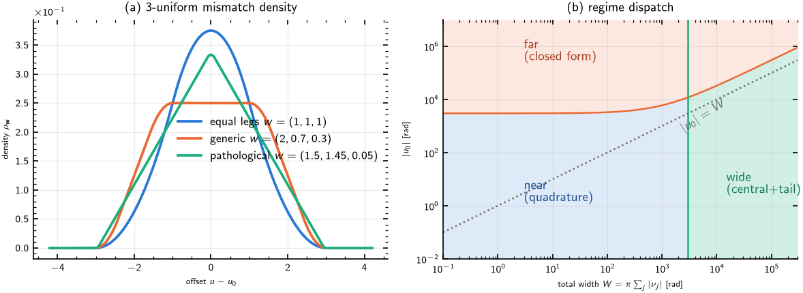

*Figure 1 — (a) The 3-uniform density $\rho_{\mathbf w}$ for equal, generic,
and pathological leg widths; note the near-triangular shape when two legs are
nearly equal and the third is small. (b) The production regime partition in
the $(W, |u_0|)$ plane (§6); the dotted line $|u_0| = W$ is the reachability
boundary of §9.*

## 5. Frequency matching: the output-support mask

The mixing product must fall in the target band:
$|x_d| = |x_a + x_b - x_c + d| < \pi$. Since $m = x_a + x_b - x_c$ is a sum
of three uniforms on $(-\pi,\pi)$, its density is Irwin–Hall on
$(-3\pi, 3\pi)$ and the **unconditional acceptance** — the total probability
that a tuple's mixing product lands in-band, irrespective of the mismatch —
is closed-form
([`support_acceptance`](../../src/pynlin/methods/td/fast_nlin.py)):

$$
A(d) = \Phi_3(\pi - d) - \Phi_3(-\pi - d), \qquad A(0) = \tfrac23,
$$

with $\Phi_3$ the 3-uniform cumulative distribution function. $A(d)$ vanishes
at $|d| = 4\pi$ (i.e. $|f_a+f_b-f_c-f_t| = 2B$), which is precisely the
*hard* enumeration cut in `fwm_tuple_variables` — the support pruning loses
nothing, exactly.

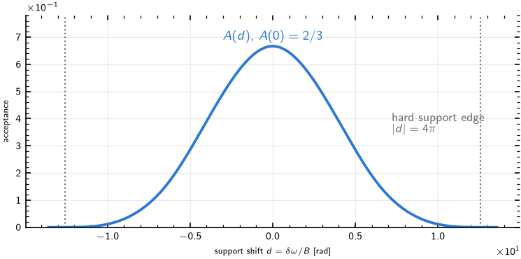

*Figure 2 — The unconditional acceptance $A(d)$: the fraction of in-channel
offset space whose mixing product lands inside the target band. The
enumeration keeps all tuples with $|d| < 4\pi$; outside, the contribution is
identically zero.*

The subtlety is that the mask **correlates with the mismatch**: both $u$ and
$m$ are linear functions of the same $(x_a, x_b, x_c)$, so conditioning on a
value of $u$ changes the distribution of $m$. The masked efficiency needs the
*conditional* acceptance $A(v) = P(|m + d| < \pi \mid u = u_0 + v)$:

$$
N\,T^2\!/L^2 = \int_{-W}^{W} \hat K(u_0+v)\,\rho_{\mathbf w}(v)\,A(v)\,dv .
$$

## 6. The conditional acceptance: exact zonotope law vs the cheap model

**Exact statement.** Let $M$ be the $3\times3$ matrix with rows
$c_u = (\nu_a, \nu_b, -\nu_c)$ (the coefficients of $u$), $c_m = (1,1,-1)$
(the coefficients of $m$), and $c_w = c_u \times c_m$ (any completion of the
basis; the result does not depend on this choice). The map
$\mathbf x \mapsto M\mathbf x$ sends the cube $(-\pi,\pi)^3$, on which
$\mathbf x$ is uniform, to a zonotope on which $(u_{\rm lin}, m, w)$ is
uniform with density $1/((2\pi)^3 |\det M|)$. The joint density of
$(u_{\rm lin}, m)$ is therefore *the length of the feasible interval of the
third coordinate*:

$$
\rho(u_{\rm lin}, m) \;=\;
\frac{\big|\{\,w : M^{-1}(u_{\rm lin}, m, w)^\top \in (-\pi,\pi)^3\,\}\big|}
     {(2\pi)^3\,|\det M|},
$$

computed in closed form per tuple by
[`_exact_joint_density`](../../src/pynlin/methods/td/fast_nlin.py) as an
interval intersection of six half-space constraints — no Fourier inversion,
no approximation. The conditional acceptance follows by a one-dimensional GL
integral over the mask window in $m$, divided by the marginal density of $u$
([`exact_conditional_acceptance`](../../src/pynlin/methods/td/fast_nlin.py)).
Consistency check: integrating $\rho(u,m)$ over $m$ reproduces the
independently derived Irwin–Hall marginal to 5 significant figures.

**Cheap model.** The bulk pass instead uses
[`pointwise_conditional_acceptance`](../../src/pynlin/methods/td/fast_nlin.py):
a linear regression of $m$ on $u$ (matching the exact conditional mean and
variance), with the conditional law *modeled* as a rescaled 3-uniform sum.
It is exact in both the fully-correlated and independent limits, and cheap
enough to run on every tuple.

**Where the cheap model fails — stably, not statistically.** "Stably wrong"
means the error does not shrink with more quadrature nodes or samples: the
model converges confidently to the wrong value because its *shape assumption*
is wrong. This happens when two leg widths are nearly equal and the third is
small — a geometry *common near the ZDW*, where two legs share nearly the
same walk-off:

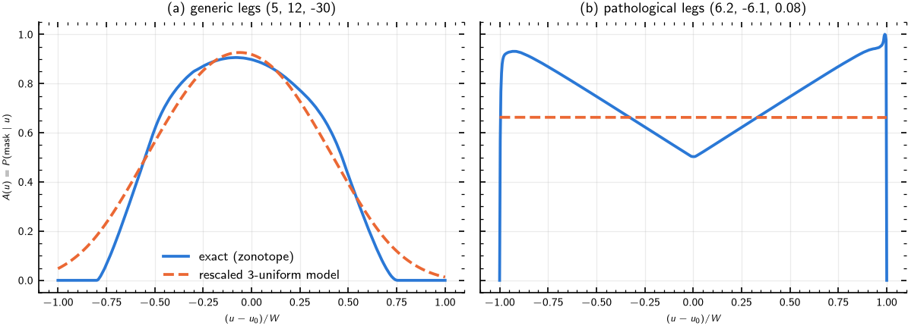

*Figure 3 — Conditional acceptance $A(u)$, exact (blue) vs cheap model
(dashed orange). (a) Generic legs, signed coefficients $(5, 12, -30)$: the
model is a serviceable smooth approximation. (b) Pathological legs
$(6.2, -6.1, 0.08)$: the true law is V-shaped with boundary spikes; the model
is a constant $2/3$. The resulting masked-$N\,T^2\!/L^2$ errors at $u_0 = W/2$: exact
$0.17\%$ / $0.03\%$ vs Sobol ground truth (i.e. at the reference's own noise
level), cheap model $7.8\%$ / $10.1\%$. Historically this defect reached
$81\%$ on a real near-ZDW tuple before the exact law replaced it in the
refinement tier.*

The production architecture uses the cheap model for the bulk (its errors
concentrate on low-mass tuples and were measured at $0.52\%$ mass-weighted
aggregate, §11) and the exact law in the mass-capped refinement tier (§8),
because the exact law costs roughly 5–8× more per tuple.

## 7. Regime dispatch

[`linear_tuple_estimate`](../../src/pynlin/methods/td/fast_nlin.py) partitions
tuples by $(|u_0|, W)$ (Figure 1b) and evaluates each class with a
specialized model:

**Near** ($|u_0| \le 3W + 3000$ and $W \le 3000$): direct $u$-space GL
quadrature of $\hat K(u_0+v)\,\rho_{\mathbf w}(v)\,A(v)$ over the compact
support $[-W, W]$. The integrand is *nonnegative* — no oscillatory
cancellation — so the node count only needs to resolve the kernel oscillation
(period $2\pi$) across the support: $n \approx 64 + 1.4\,W$, capped at 9000
(composite GL panels of order 256, since a single `leggauss(n)` call costs
$\mathcal O(n^3)$).

**Far** ($|u_0| > 3W + 3000$): closed form. Writing
$\hat K(u) = (2 - 2\cos u)/u^2$,

$$
\mathbb E[\cos u] = \cosu_0 \prod_j \operatorname{sinc}(w_j)
\quad\text{(exact)},\qquad
\mathbb E\!\left[\frac1{u^2}\right] \approx \frac1{u_0^2}
\left(1 + \frac{3\sigma^2}{u_0^2}\right),\ \ \sigma^2 = \tfrac13\sum_j w_j^2 ,
$$

where the first identity follows from the factorized characteristic function
at $t=1$ and the second is a second-order Taylor expansion of $1/u^2$ about
$u_0$, both combined multiplicatively — valid to $\mathcal O((W/u_0)^4)$
([`far_model`](../../src/pynlin/methods/td/fast_nlin.py)). The mask enters
through the plain $A(d)$: at $|u_0| \gg W$ the kernel value barely depends on
where in the cube the sample sits, so the mask–kernel correlation is a
second-order effect.

**Wide** ($W > 3000$, not far): the density spans thousands of kernel
oscillation periods. Split at $U = 48\pi$: the central window $|u| < U$ is
integrated exactly (kernel resolved at 8 nodes per period, with the pointwise
conditional acceptance); the tails use the oscillation-averaged kernel
$\langle\hat K\rangle = 2/u^2$ (the mean of $\hat K$ over one period, valid
because the density is nearly constant across each period there) against the
density on a logarithmically spaced grid
([`wide_model`](../../src/pynlin/methods/td/fast_nlin.py)).

**Verification against randomized-Sobol ground truth** (this document's
regeneration run; 60 synthetic tuples spanning $W \in [0.5, 300]$ rad,
$|u_0|/(W{+}50) \in [10^{-2}, 400]$, exact-mask linear-model QMC with
$6\times 2^{16}$ scrambled-Sobol points, reference kept only where its own
relative stderr is below $2\%$):

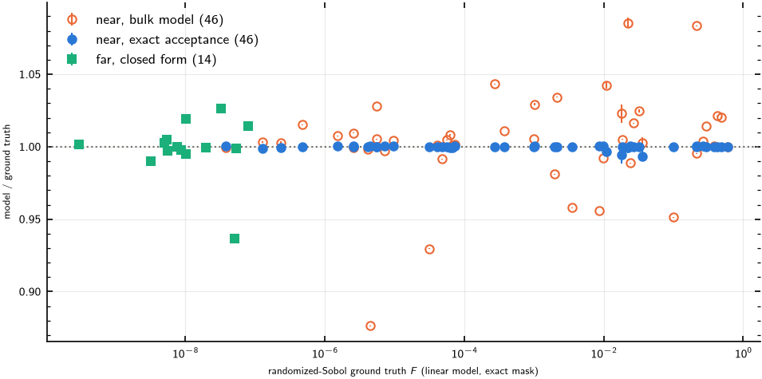

*Figure 4 — Model/ground-truth ratio per tuple. Bulk near-regime model (open
orange): median $0.89\%$, worst $12.4\%$ on pathological-leg geometries. The
same tuples re-evaluated with the exact conditional acceptance (blue): median
$0.026\%$, worst $0.65\%$. Far closed form (green squares): median $0.39\%$,
worst $6.3\%$ immediately at the regime boundary, where the $(W/u_0)$
expansion is weakest — these are simultaneously the smallest-$N\,T^2\!/L^2$ tuples, so
the error is mass-suppressed in aggregates. Widths are capped at 300 rad
because beyond that the Sobol reference itself loses effective samples (§8)
and cannot serve as ground truth; wide-regime validation is done by the
stratified S2 machinery instead.*

## 8. The refinement tier

Per target, [`target_fast_sums`](../../src/pynlin/methods/td/fast_nlin.py)
runs the cheap bulk pass on *every* support-surviving tuple, then re-evaluates
a selected subset with the exact conditional acceptance
([`refine_tuples_exact`](../../src/pynlin/methods/td/fast_nlin.py)):

* all near-regime tuples, capped to the top `max_near_refine = 16384` ranked
  by cheap value (near-ZDW targets can have $10^5$–$10^6$ near tuples; the
  mass is heavy-tailed enough that the cap retains over $99.9\%$ of near
  mass), plus
* the top `n_refine = 256` remaining narrow tuples ($W \le 300$ rad).

Design notes with their reasons:

* **Refinement is deterministic.** The earlier tier re-sampled selected
  tuples with QMC; it was replaced because for **wide tuples the kernel core
  (the region $|u| \lesssim \pi$ where $\hat K$ is appreciable) covers
  $\sim 10^{-4}$ of the sampling cube** — a 16k-point QMC batch then has
  single-digit effective samples and *corrupts* rather than refines (observed
  as $\pm 35\%$ probe outliers). This is the origin of the
  `REFINE_MAX_WIDTH = 300` rad gate, and equally the reason the Sobol
  reference in Figure 4 is restricted to $W \le 300$.
* **Far tuples are not refined**: the far closed form already uses the plain
  acceptance correctly (mask–kernel correlation is second order there).
* **Known omission**: the exact-acceptance tier evaluates the *linear* model;
  the in-channel quadratic-phase contribution (the $q_j$ terms) that the old
  QMC tier folded in incidentally is omitted. S2 measured this at
  $0.1$–$0.3\%$ aggregate — an order of magnitude below the acceptance defect
  it replaced.
* **Selection-proxy caveat**: the top-$K$ ranking uses the *cheap* values —
  the very model being corrected. Measured cheap-model errors reach tens of
  percent on pathological geometries, so a genuinely heavy tuple can be
  under-ranked by at most that factor; with heavy-tailed mass this is
  unlikely to matter in aggregate, but it is not yet *certified* (proven by
  an inequality rather than suggested by measurement). The selection stage of
  §9 closes this gap.

## 9. Certified efficiency bound and tuple selection (planned S3)

The enumeration keeps every frequency-matched tuple ($\sim 10^7$ per target);
almost all of them are strongly phase-mismatched and contribute negligibly.
The selection principle: prune on a **certified upper bound** of $N\,T^2\!/L^2$ — an
inequality that holds by construction, with no model or statistical
assumption — never on an *estimate* of $N\,T^2\!/L^2$, which can be wrong in the
dangerous direction.

**Theorem (envelope bound).** For every tuple, in the linear model,

$$
N\,T^2\!/L^2 \;\le\; A(d)\cdot\min\!\left(1,\ \frac{4}{g^2}\right),
\qquad g = |u_0| - W ,
$$

whenever $g > 0$, and $N\,T^2\!/L^2 \le A(d)$ otherwise.

*Proof.* (i) $\sin^2(u/2) \le 1$ and $|\sin(u/2)| \le |u|/2$ give the
envelope $\hat K(u) \le \min(1, 4/u^2)$. (ii) The linear offset is confined
to $[-W, W]$, so every realization has $u \in [u_0 - W, u_0 + W]$; if
$|u_0| > W$ then $|u| \ge g$ on the whole support and
$\hat K(u) \le 4/g^2$. (iii) The mask region has probability $A(d)$ and
$\hat K \ge 0$, so the masked mean is at most the supremum of the integrand
times the mask probability. $\square$

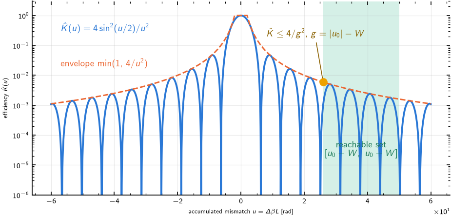

*Figure 5 — The link kernel, its envelope, and the reachable set of one
gapped tuple: the tuple's in-band frequency freedom can bring $u$ no closer
to phase matching than the gap $g = |u_0| - W$, so its efficiency is
certified below $A(d)\cdot 4/g^2$ regardless of how mask and kernel
correlate.*

Remarks:

* **Cost**: the bound needs only $(u_0, W, d)$ — plain grid arithmetic, no
  kernel or density evaluation. It is strictly cheaper than the cheap bulk
  model. The exact expression is already computed as the `far_bound_check`
  diagnostic in `target_fast_sums`.
* **Looseness**: the density of $u$ vanishes toward the support endpoints, so
  the bound overestimates the true $N\,T^2\!/L^2$ by a shape factor of order
  $2(u_0/g)^2$ for $u_0 \gg W$. Loose in the safe direction: pruning keeps
  somewhat more tuples than strictly needed, and never certifies away a heavy
  one.
* **Quadratic padding**: the confinement argument used the linear model. The
  quadratic terms shift $u$ by at most
  $P_q = \pi^2\,(|q_a| + |q_b| + |q_c| + |q_t|)$ (each $x_j^2 \le \pi^2$, and
  $x_d^2 \le \pi^2$ under the mask), so the certificate valid for the full
  quadratic model uses $g = |u_0| - W - P_q$. S2 measured the aggregate $q$
  effect at $0.07\%$, so the padding is small, but it is what makes the
  certificate exact rather than approximate.

**Selection rule.** Fix a minimum admissible efficiency $\varepsilon$; keep a
tuple iff its certified bound is $\ge \varepsilon$, and accumulate the *sum
of discarded bounds* per target as a truncation certificate:

$$
\underbrace{\sum_{\text{discarded}} (N\,T^2\!/L^2)_i}_{\text{true loss}}
\;\le\;
\sum_{\text{discarded}} A(d_i)\min(1, 4/g_i^2)
\;=\; \text{reported certificate}.
$$

Properties:

* $\varepsilon \to 0$ keeps every tuple — the exhaustive calculation is the
  continuous limit of the pruned one.
* **Band adaptivity is automatic.** Near the ZDW most tuples satisfy
  $|u_0| < W$ (they can *reach* phase matching somewhere in their in-band
  tuning range; their bound is order 1) and survive any $\varepsilon$ —
  correctly, since the O band genuinely has broadband phase matching. Away
  from the ZDW, $|u_0|$ grows quadratically as $c$ walks off and the $1/g^2$
  collapse discards almost everything — matching the full-grid S0 finding
  that the gapped (far) population is 99.1% of all tuples yet carries
  $< 10^{-4}$ of the mass, and a band-edge target's top 10 tuples already
  hold 28% of its mass. One number, no per-band tuning.
* **Every run self-certifies**: the output carries
  `discarded_bound / kept_sum` per target; convergence sweeps in
  $\varepsilon$ then check the *sharpness* of the bound rather than being the
  only source of confidence. Targets whose certificate breaches tolerance are
  rerun locally at $\varepsilon/10$.
* The refinement tier (§8) then ranks within survivors, largely defusing its
  selection-proxy caveat.

The dichotomy $g > 0$ vs $g \le 0$ is exactly the **gapped vs
surface-crossing classification** of
[`fwm_single_tuple_scaling.md`](fwm_single_tuple_scaling.md): a tuple with
$|u_0| < W$ has its phase-matched surface $\Delta\beta = 0$ crossing the
admissible spectral domain (that note's $x^{-1}$ scaling law), while a gapped
tuple ($|u_0| > W$) never reaches phase matching and follows the $x^{-2}$
law — of which the $4/g^2$ envelope is the certified, worst-case counterpart.
The reachability condition $|u_0| < W$ (bound $= A(d)$, no decay) is thus the
parameter-free *necessary* condition for phase matching identified in the
natural-coordinates analysis: on the full grid (2026-08-24 S0 run, 7 targets,
per-target normalized) it is satisfied by $\approx 0.0\%$ of tuples but
$99.1\%$ of mass.

**What $\varepsilon$-selection cannot fix: decimation.** Striding the channel
grid (`decimated_frequency_grid`) removes *interferers*, not just targets,
and therefore deletes tuples that would pass any efficiency test — it changes
the physics, not the sampling density. Measured consequence: at decimation 4
a specific window showed a 5-order-of-magnitude FWM collapse-and-recover
spike pattern that is completely smooth at full resolution. **Decimation
$\ge 4$ must not be used to judge FWM/XPM balance, FWM smoothness, or
absolute FWM level.** The two mechanisms are complementary: $\varepsilon$
thins tuples per target with a certificate; decimation may only thin the
*target list*.

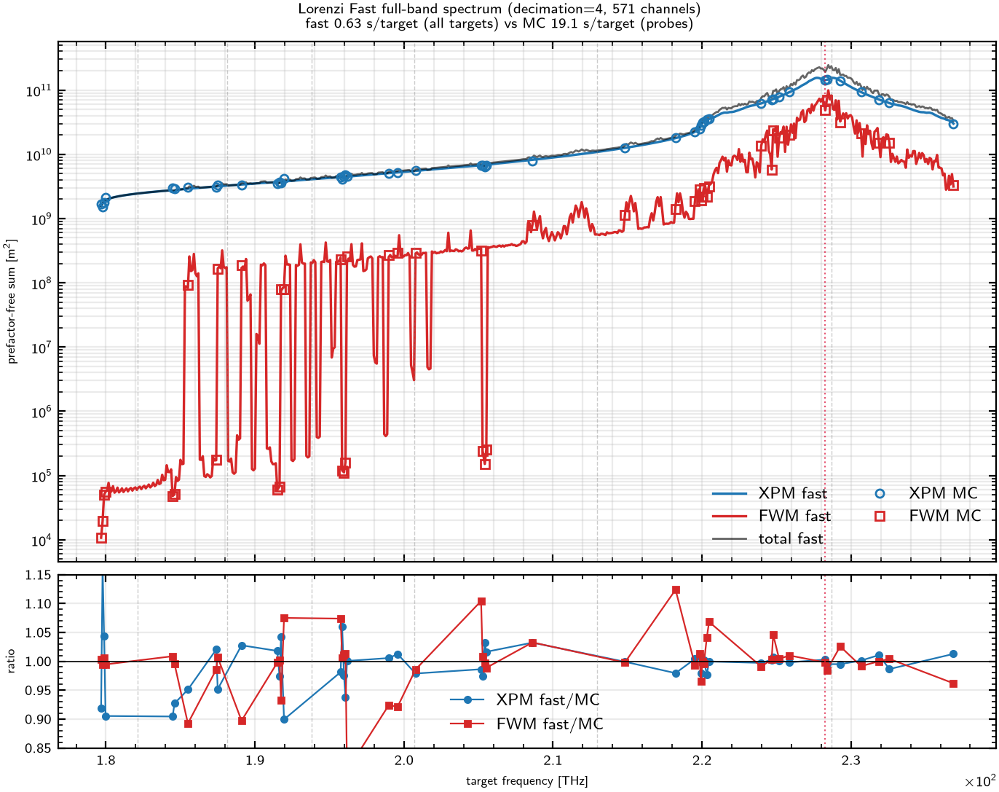

*Figure 6 — Cautionary figure: the S5 spectrum at decimation 4 (2026-07-20
run). The fine structure includes decimation artifacts —
grid-commensurability spikes that do not exist at full resolution — and must
not be read as physics.*

## 10. Territory: where the mass lives (S0)

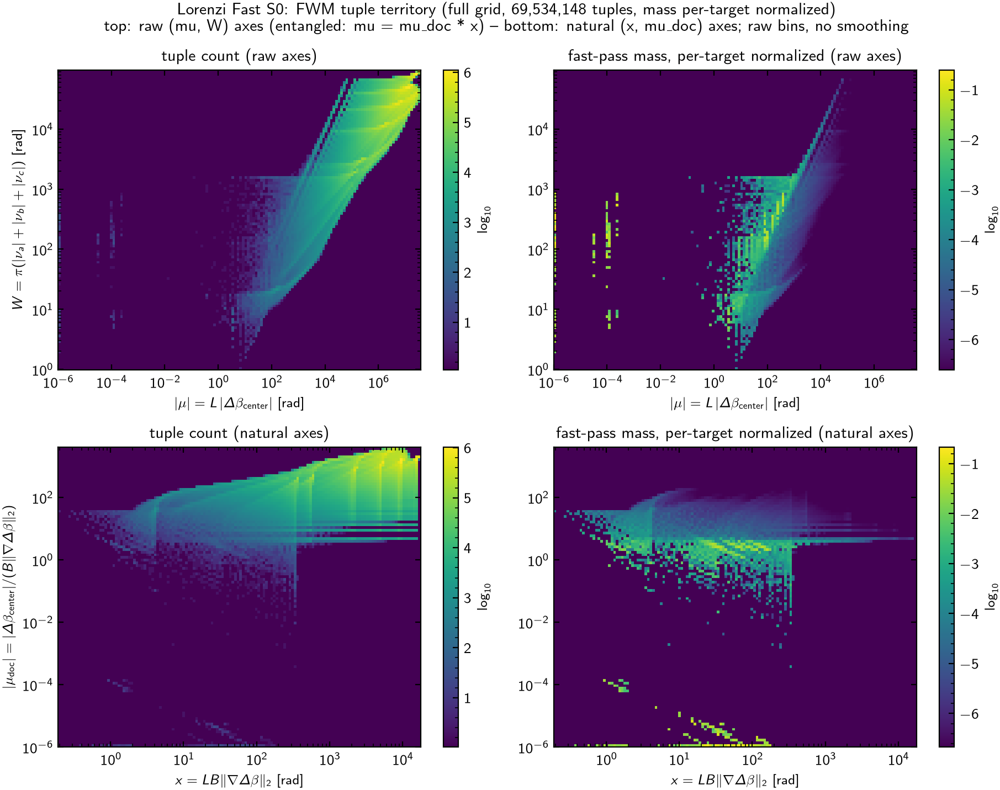

*Figure 7 — S0 census (2026-08-24 run: full 2284-channel grid, 7 targets,
69.5M tuples, mass per-target normalized so each target weighs equally):
tuple population and fast-pass mass in the raw $(|u_0|, W)$ axes (top,
visibly entangled along the diagonal because
$u_0 = \mu\,x_\nabla$) and in the natural
$(x_\nabla, |\mu|)$ axes (bottom), where the population
decorrelates and the mass concentrates at low $|\mu|$ across the
whole $x_\nabla$ range — the regime in which the phase-matched surface
crosses the integration domain, in the language of the single-tuple scaling
analysis. An earlier decimation-8 version of this census was strongly
pixelated and irregular: interferer decimation biased the surviving
population toward exact zero-sum combinations (59% with $|d| < 0.01$) and a
single near-ZDW target carried 99.7% of the unnormalized mass overlay.*

Quantitatively (full-grid 2026-08-24 run, 7 targets, per-target normalized
mass): the **near regime holds 99.95% of the mass in 0.5% of the tuples**
(the far population is 99.1% of the 69.5M tuples and carries $< 10^{-4}$ of
the mass); 50% of the equal-weighted mass sits in the top 380 tuples
($5.5\times 10^{-6}$ of all), 90% in 1962, 99% in 6547. Per-target top-10
shares run from 3% (near the ZDW, where the mass spreads over many
phase-matched tuples) to 28% (band edge, where a handful dominate) — the two
faces of the phase-matching condition that the $\varepsilon$-selection of §9
exploits. The earlier decimation-8 numbers (50% of one target's mass in
$\sim 13$ tuples) sampled the biased zero-sum-dominated population and are
superseded.

### 10.1 Factorization of the census: terrain × population

The census admits a factorization that separates interaction physics from
channel-plan combinatorics. Define the **synthetic kernel**
$(N\,T^2\!/L^2)_{\rm syn}(x_\nabla, \mu)$: the fast-model efficiency evaluated
on a by-hand mesh of the natural coordinates with the walk-off split equally
among the three legs and $d = 0$
([`analysis/fwm/fast_s0_synthetic.py`](../../analysis/fwm/fast_s0_synthetic.py)).
This is a property of the *interaction alone* — no channel plan, no
dispersion profile, no tuple population enters it. Validated against
randomized-Sobol ground truth at 0.1–2.5% across regimes, it reproduces the
$x_\nabla^{-1}$ (surface-crossing) and $x_\nabla^{-2}$ (gapped) laws of
[`fwm_single_tuple_scaling.md`](fwm_single_tuple_scaling.md) with fitted
exponents $-0.999$ and $-2.000$.

**Claim.** For the real system, per tuple $i$,

$$
(N\,T^2\!/L^2)_i \;\approx\; (N\,T^2\!/L^2)_{\rm syn}(x_{\nabla,i},\ \mu_{{\rm nat},i})
\cdot \frac{A(d_i)}{A(0)} ,
$$

i.e. the only tuple properties that matter beyond the two natural
coordinates are the discrete support shift $d_i$ (which on a regular grid
takes just a few quantized values — here essentially $\{0, 6.41\}$) — the
walk-off *direction split*, the remaining degree of freedom, is nearly
irrelevant. Measured on 400k sampled tuples of the full-grid census: raw
(uncorrected) real/synthetic ratios scatter around $0.17$–$0.24$ — exactly
the $A(6.41)/A(0)$ suppression of the majority $\lvert d\rvert = 6.41$
population — and after the acceptance correction the ratio collapses to
**median 1.000 with 99.7% of tuples within 2×** (residual tail: the
pathological near-equal-leg geometries of §6).

Consequently the whole S0 mass map factorizes:

$$
\text{mass}(x_\nabla, \mu) \;\approx\;
\underbrace{N(x_\nabla, \mu)}_{\text{population (grid combinatorics)}}
\times
\underbrace{(N\,T^2\!/L^2)_{\rm syn}(x_\nabla, \mu)}_{\text{interaction kernel}}
\times
\underbrace{\langle A(d)/A(0)\rangle}_{\text{support quantization}} .
$$

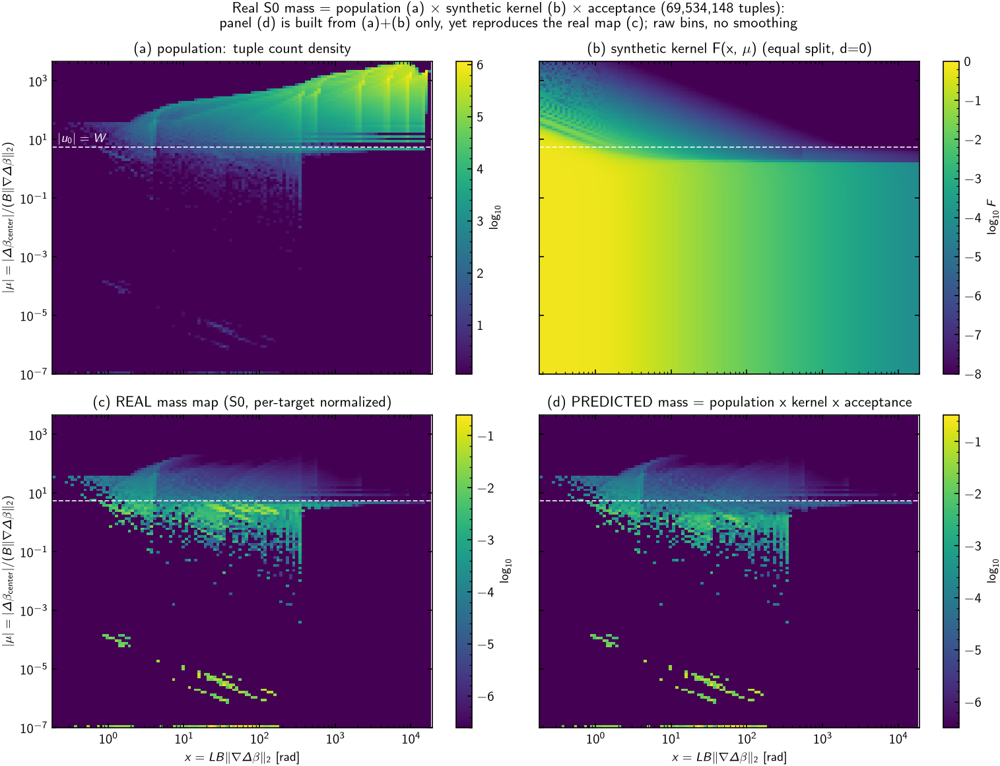

*Figure 8 — The factorization, verified
([`analysis/fwm/fast_s0_factorization.py`](../../analysis/fwm/fast_s0_factorization.py)):
panel (d) is computed from the population histogram (a), the synthetic
kernel (b), and the closed-form acceptance only — no real per-tuple
efficiency is used — yet it reproduces the real mass map (c) feature for
feature (bin-level median deviation $-0.031$ dex, IQR $[-0.07, +0.03]$ dex
on raw unsmoothed bins). Note the
two maps that* look *alike are (c) and (d), not (b) and (c): the kernel is
smooth and defined everywhere ("the terrain"), while the census is the
terrain sampled at the discrete, quantized tuple families the grid happens
to generate ("where the rain fell"). The apparent blobbiness and inverted
brightness ordering of the real map relative to the kernel are entirely
population effects.*

Why this matters: (i) it certifies that the fast model's per-tuple physics
has no hidden dependence on the direction split at the accuracy level that
matters; (ii) it makes the census *predictive* — the mass map of any future
channel plan follows from its population histogram alone, without evaluating
a single kernel; (iii) it explains the qualitative real-map features (the
bright band just below $\lvert u_0\rvert = W$ is where an enormous population
meets a still-order-1 kernel; the isolated bright families at
$\mu \lesssim 10^{-4}$ are exactly-phase-matched zero-sum isles
where the kernel saturates).

### 10.2 The $(s, |\mu|)$ phase diagram of the kernel

Plotting the synthetic kernel over $s = x_\nabla + |u_0|$ and $|\mu|$
(`fast_s0_synthetic.py`, dense rectangular grid, panel 6 and
`s0_synthetic_smu_dense.png`) exposes a four-region structure. This
subsection derives every law, boundary, and numerical constant from the base
expression of §2, for the equal split at $d = 0$; the summary table and the
assessment figures follow.

#### 10.2.1 Reduction of the base expression

Start from the general masked average — derived from the defining
collision integrals in §2.1 — in the linear model (§4):

$$
\frac{N T^2}{L^2}
= \mathbb E\big[\hat K(u)\,\mathbf 1_{|x_a+x_b-x_c|<\pi}\big],
\qquad
u = u_0 + \nu_a x_a + \nu_b x_b - \nu_c x_c,
\quad x_j \sim \mathcal U(-\pi, \pi).
$$

**Equal split.** Set $(\nu_a, \nu_b, -\nu_c) = \tfrac{x_\nabla}{\sqrt3}(1,1,-1)$,
so the linear offset $v = u - u_0$ and the mask variable
$m = x_a + x_b - x_c$ obey

$$
v \;=\; \frac{x_\nabla}{\sqrt3}\, m \qquad \text{exactly}
$$

— this is §15.1's degenerate direction ($c_u \parallel c_m$): mask and
mismatch are perfectly correlated, and the mask becomes a **hard cut on the
mismatch itself**,

$$
|m| < \pi \iff |v| < w, \qquad w \equiv \frac{\pi x_\nabla}{\sqrt3}
\;(=\; \text{each leg's width } w_j).
$$

The offset $v$ is a sum of three independent uniforms on $(-w, w)$; its
density is the scaled Irwin–Hall-3 law, whose **central piece** (all that the
mask retains) is

$$
\rho(v) = \frac{1}{2w}\left[\frac34 - \Big(\frac{v}{2w}\Big)^2\right],
\qquad |v| \le w,
$$

obtained from the standard $[1,2]$ piece $f(t) = -t^2 + 3t - \tfrac32$ of
Irwin–Hall via $t = \tfrac32 + v/2w$. The whole object is therefore the
**one-dimensional integral**

$$
\boxed{\;E(s,\mu) = \int_{-w}^{w} \hat K(u_0 + v)\,\rho(v)\,dv\;}
\qquad
x_\nabla = \frac{s}{1+\mu},\quad
u_0 = \frac{s\mu}{1+\mu},\quad
w = \frac{\pi s}{\sqrt3\,(1+\mu)} ,
$$

(taking $\mu, u_0 \ge 0$ w.l.o.g.). Two immediate exact facts: the total
retained probability is
$\int_{-w}^{w}\rho = \int_1^2 f(t)\,dt = \tfrac23$ — the mask acceptance
$A(0)$ — and the retained second moment is
$\int_{-w}^{w} v^2 \rho\,dv = w^2/5$. Everything below is asymptotics of
this one integral in the four corners of the $(s, \mu)$ plane.

#### 10.2.2 Region 1 — coherent plateau

If every accumulated phase in the window is small, expand
$\hat K(u) = 1 - u^2/12 + \mathcal O(u^4)$:

$$
E = \frac23 - \frac{1}{12}\int_{-w}^{w}(u_0+v)^2\rho(v)\,dv + \dots
= \frac23\left[1 - \frac{u_0^2 + \tfrac{3}{10}w^2}{12} + \dots\right]
\;\xrightarrow[\;s\to 0\;]{}\; \frac23 .
$$

The plotted plateau edge uses the order-one-phase criterion
$u_0+w=\pi$ (halfway to the kernel's first nonzero null at $2\pi$):

$$
s_1(\mu) = \frac{\pi(1+\mu)}{\mu + \pi/\sqrt3},
\qquad s_1(0) = \sqrt3, \quad s_1(\infty) = \pi .
$$

#### 10.2.3 Region 2 — sheet ($u_0 < w$, i.e. $\mu < \pi/\sqrt3$)

The kernel peak $u = 0$ lies *inside* the window iff $u_0 < w$; dividing by
$x_\nabla$ this is the **masked reachability boundary**

$$
\mu < \frac{\pi}{\sqrt3} \approx 1.814
$$

— a factor 3 below the unmasked $|u_0| < W \iff \mu < \pi\sqrt3$ of §9,
because the correlated mask cuts the support at $w = W/3$. When additionally
the window spans many kernel periods ($w \gg 2\pi$), $\hat K$ acts as a
delta of weight $\int_{\mathbb R}\hat K = 2\pi$ (§15.1's sheet branch):

$$
E \to 2\pi\,\rho(-u_0)
= \frac{2\pi}{2w}\left[\frac34 - \Big(\frac{u_0}{2w}\Big)^2\right]
= \frac{3\pi}{4w}\left(1 - \frac{\mu^2}{\pi^2}\right),
$$

using $u_0/w = \sqrt3\,\mu/\pi$. Substituting $w(s,\mu)$:

$$
\boxed{\;E = \frac{3\sqrt3}{4}\,\frac{(1+\mu)\,(1-\mu^2/\pi^2)}{s}\;}
$$

— the $s^{-1}$ law, with an $\mathcal O(1)$ prefactor ($\le 1.9\times$
variation over the region: the $(1+\mu)$ factor is the density narrowing,
the $(1-\mu^2/\pi^2)$ factor the peak sliding off the density's plateau).
At $\mu \to 0$ this reproduces $2\pi\rho(0) = \tfrac{3\sqrt3}{4s}$.

#### 10.2.4 Region 3 — gapped, dephased ($\mu > \pi/\sqrt3$, $x_\nabla \gg 1$)

Now $u = u_0 + v \ge u_0 - w > 0$ on the whole window. With $w \gg 2\pi$ the
window smears many kernel oscillations, so replace $\hat K$ by its period
average $\langle\hat K\rangle = 2/u^2$ (§7's far/wide tail):

$$
E \approx \int_{-w}^{w} \frac{2\rho(v)}{(u_0+v)^2}\,dv
\;\xrightarrow[\;u_0 \gg w\;]{}\;
\frac{2}{u_0^2}\cdot\frac23
= \boxed{\;\frac{4}{3}\,\frac{(1+\mu)^2}{\mu^2\,s^2}\;}
$$

— the $s^{-2}$ law, again with only an $\mathcal O(1)$ $\mu$-dependence
($(1+1/\mu)^2 \in [1, 2.6]$ over the region). For $u_0$ comparable to $w$
(just above the boundary) the full tail integral — elementary, since $\rho$
is piecewise quadratic — must be kept; this is the crossover strip visible
in the ratio map (Figure 10c).

#### 10.2.5 Region 4 — gapped, coherent ($x_\nabla \lesssim 1$)

When $w \lesssim \pi/\sqrt3$ the window is *narrower than one kernel
oscillation*: $\hat K$ is effectively constant across it,

$$
E = \frac23\,\hat K(u_0)\,\big[1 + \mathcal O(w^2)\big],
\qquad
u_0 = s\Big(1 - \frac1\mu + \mathcal O(\mu^{-2})\Big),
$$

so all $\mu$-dependence reduces to an $\mathcal O(s/\mu)$ fringe-phase
shift: **asymptotically exact $\mu$-independence**, with complete nulls at
$u_0 = 2\pi k$, i.e. $s_k = 2\pi k\,(1 + 1/\mu) \to 2\pi k$ — the vertical
fringes. The condition $w \lesssim \pi/\sqrt3$ is $x_\nabla \lesssim 1$ rad,
which on the map (where $s \gg 1$) reads $\mu \gtrsim s$. Envelope:
$\tfrac23\cdot 4/u_0^2 = \tfrac{8}{3}u_0^{-2}$, exactly twice the region-3
mean (since $\langle 2\sin^2\rangle = 1$), and consistent with §9's
certified $A(d)\cdot 4/g^2$.

#### 10.2.6 Fringe contrast across the 3↔4 crossover

The oscillatory correction in region 3 comes from the $-2\cos u/u^2$ part of
$\hat K$:

$$
E_{\rm osc} \approx -\frac{2}{u_0^2}\,\mathrm{Re}\Big[e^{iu_0}\Phi(1)\Big],
\qquad
\Phi(1) = \int_{-w}^{w} e^{iv}\rho(v)\,dv .
$$

Integrating by parts, the boundary term dominates because the *mask
truncates the density at nonzero height* $\rho(\pm w) = 1/4w$:

$$
\Phi(1) = 2\rho(w)\sin w + \mathcal O(w^{-2}) = \frac{\sin w}{2w} + \dots,
$$

so, dividing by the region-3 mean $4/3u_0^2$:

$$
\boxed{\;\text{contrast} \;=\; \frac{3\,|\sin w|}{4w}
= \frac{3\sqrt3}{4\pi x_\nabla}\,\Big|\sin\frac{\pi x_\nabla}{\sqrt3}\Big|\;}
\qquad (w \gtrsim 1;\ \text{contrast} \to 1 \text{ in region 4}).
$$

Two consequences, both verified in Figure 11e: (i) the envelope decays as
$1/x_\nabla$ — set by the **hard mask edge** — vastly slower than the
$|\!\operatorname{sinc}^3\!(w)| \sim w^{-3}$ of the unmasked $C^1$ density
(the sharp band edges of frequency conservation *preserve* fringe
visibility); (ii) sweeping one fringe period changes $x_\nabla$ by
$2\pi/\mu$ — at moderate $\mu$ the $|\sin w|$ factor is averaged toward its
envelope, at large $\mu$ it is *frozen*, producing the measured contrast
dips at $w = k\pi$ ($x_\nabla = k\sqrt3$).

#### 10.2.7 Summary table

All formulas
verified against `linear_tuple_estimate` to $\lesssim 1\%$ (2026-08-24):

| Region | Domain | Law | Verified |
|---|---|---|---|
| 1. coherent plateau | $s \lesssim s_1(\mu) = \pi(1+\mu)/(\mu + \pi/\sqrt3) \in [\sqrt3, \pi]$ | $N T^2\!/L^2 = 2/3$ $(= A(0))$ | 0.2–5% |
| 2. sheet | $s \gtrsim s_1$, $\lvert\mu\rvert < \pi/\sqrt3$ | $\dfrac{3\sqrt3}{4}\dfrac{(1+\mu)(1-\mu^2/\pi^2)}{s}$ | $\le 0.8\%$ |
| 3. gapped, dephased | $\lvert\mu\rvert > \pi/\sqrt3$, $x_\nabla \gg 1$ | $\dfrac{4(1+\mu)^2}{3\mu^2 s^2}$ (fringe-averaged) | $\le 0.8\%$ |
| 4. gapped, coherent | $\lvert\mu\rvert > \pi/\sqrt3$, $x_\nabla \lesssim 1$ (i.e. $\mu \gtrsim s$) | $\tfrac23 \hat K(u_0)$, $u_0 = s(1 - 1/\mu + \dots)$: full-contrast fringes, nulls at $u_0 = 2\pi k$ | 0.4% |

Notes. (i) All constants above are specific to the equal split at $d = 0$;
§10.2.8 derives the nonzero-$d$ equal-split problem. Generic directions keep
the same broad coherent/sheet/gapped structure, but require the conditional
mask law of §6 rather than a marginal $A(d)$ correction. (ii) In
span-length scaling the regions are $N \propto L^2$ (1: coherent build-up),
$L^1$ (2: coherent within a slice, incoherent between slices), $L^0$ (3, 4:
bounded by one coherence length — parametric back-conversion). (iii)
Cross-references: region 2 is the sheet branch of §15.1, region 3 the far
model of §7, region 4's envelope is consistent with the certified
$A\cdot 4/g^2$ of §9, the 2-vs-(3,4) split is the
$x_\nabla^{-1}$/$x_\nabla^{-2}$ classification of
[`fwm_single_tuple_scaling.md`](fwm_single_tuple_scaling.md), and the
region-4 fringes are the subject of
[`fwm_high_mu_oscillations.md`](fwm_high_mu_oscillations.md).

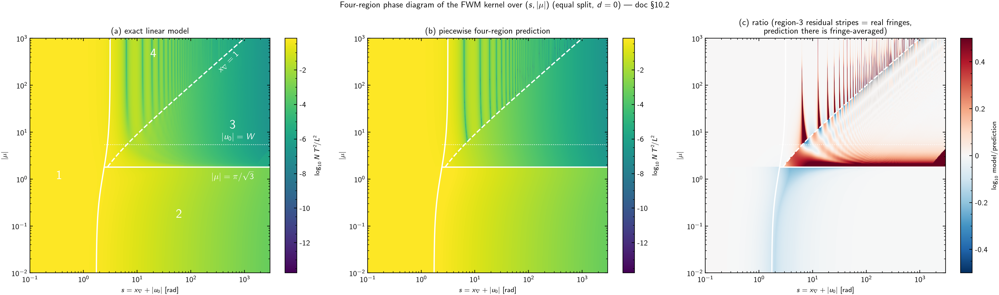

*Figure 10 — The phase diagram assessed
([`analysis/fwm/plot_smu_phase_diagram.py`](../../analysis/fwm/plot_smu_phase_diagram.py)):
(a) exact linear model on a dense $(s,|\mu|)$ grid with the region
boundaries $s_1(\mu)$ (solid), $|\mu| = \pi/\sqrt3$ (solid),
$x_\nabla = 1$ (dashed) and the unmasked $|u_0| = W$ reference (dotted);
(b) the piecewise four-region closed form — no model evaluation — which
reproduces (a) feature for feature including the fringes; (c) their ratio:
white $\approx$ exact agreement over all region interiors (median
$|\log_{10}|$ ratio $0.001$–$0.009$, i.e. $0.3$–$2\%$), with deviations
confined to the crossover strips and to the near-null fringe lines where
the region-3 prediction is deliberately fringe-averaged.*

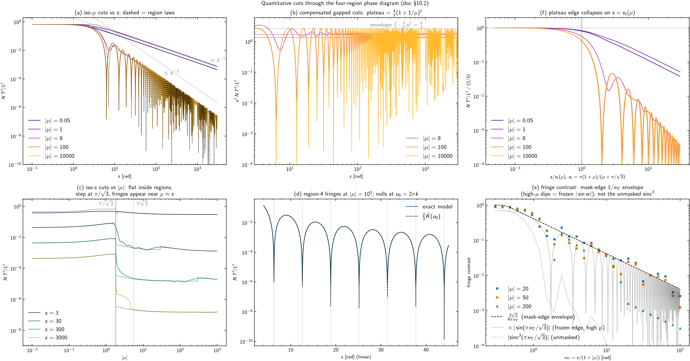

*Figure 11 — Line-plot assessment: (a) iso-$\mu$ cuts vs $s$ with the region
laws overlaid (dashed); (b) compensated $s^2 N T^2\!/L^2$ gapped cuts —
plateaus at $\tfrac43(1+1/\mu)^2$, envelope $8/3$; (c) iso-$s$ cuts vs
$|\mu|$ — flat inside regions, step at $\pi/\sqrt3$, fringe onset at
$\mu \approx s$; (d) region-4 fringes vs $\tfrac23\hat K(u_0)$ — visually
indistinguishable, nulls at $u_0 = 2\pi k$; (e) fringe contrast vs
$x_\nabla$: the mask-edge $1/x_\nabla$ envelope, with the high-$\mu$ points
dipping along the frozen edge factor $|\sin(\pi x_\nabla/\sqrt3)|$ and the
unmasked $\operatorname{sinc}^3$ shown for contrast; (f) the plateau edge
collapsing on $s = s_1(\mu)$ for $\mu$ spanning six orders of magnitude.*

#### 10.2.8 Moving the support window: the equal split at nonzero $d$

The preceding phase diagram is the center-aligned slice $d=0$. This section
changes only the support shift

$$
d=\frac{2\pi(f_a+f_b-f_c-f_t)}{B}
$$

while holding the linear mismatch parameters $(u_0,\boldsymbol\nu)$ fixed.
This is a controlled variation of the output-support mask, not a claim that a
physical change of carrier tuple leaves $u_0$ and $\boldsymbol\nu$ unchanged.
For a real tuple those quantities generally change together. In the canonical
notation of new code, $d$ is `support_shift` and $B$ here is the rectangular
Nyquist symbol rate `symbol_rate_baud`.

**Exact translated integral.** For the equal split,

$$
c\equiv\frac{x_\nabla}{\sqrt3},\qquad
v=c\,m,\qquad m=x_a+x_b-x_c,\qquad w=\pi c.
$$

The support condition no longer selects $|v|<w$. Instead,

$$
|m+d|<\pi
\iff
-c(\pi+d)<v<c(\pi-d).
$$

The unmasked variable $v$ is supported on $[-3w,3w]$, with full equal-width
Irwin--Hall density

$$
\rho_{\rm full}(v)=
\begin{cases}
\dfrac{3}{8w}-\dfrac{v^2}{8w^3}, & |v|\le w,\\[6pt]
\dfrac{(3w-|v|)^2}{16w^3}, & w<|v|\le3w,\\[6pt]
0, & |v|>3w.
\end{cases}
$$

Define the accepted mismatch interval

$$
I_d=[v_-(d),v_+(d)],
$$

$$
v_-(d)=\max[-3w,-c(\pi+d)],\qquad
v_+(d)=\min[3w,c(\pi-d)].
$$

The exact equal-split, linear-model efficiency is therefore

$$
\boxed{
E_d(u_0,x_\nabla)
=\int_{I_d}\hat K(u_0+v)\rho_{\rm full}(v)\,dv,}
\tag{10.8.1}
$$

where the integral is zero when $v_-\ge v_+$. Equation (10.8.1), rather than
$E_0A(d)/A(0)$, is the nonzero-$d$ continuation of the integral in §10.2.1.
The interval is
a translated copy of $[-w,w]$ for $|d|\le2\pi$; for $2\pi<|d|<4\pi$ it is
also clipped by an edge of the full $[-3w,3w]$ support.

**Acceptance and exact symmetries.** Integrating the density over $I_d$ gives
the marginal support acceptance of §5. Written explicitly,

$$
A(d)=
\begin{cases}
\dfrac23-\dfrac{r^2}{4}+\dfrac{r^3}{16},
&0\le r\le2,\\[6pt]
\dfrac{(4-r)^3}{48},&2<r<4,\\[6pt]
0,&r\ge4,
\end{cases}
\qquad r\equiv\frac{|d|}{\pi}.
\tag{10.8.2}
$$

Thus $A(0)=2/3$, $A(d)$ decreases with $|d|$, and every contribution
vanishes exactly at $|d|\ge4\pi$. Reflection of all in-channel coordinates
gives

$$
E_d(u_0,x_\nabla)=E_{-d}(-u_0,x_\nabla),
\tag{10.8.3}
$$

but in general $E_d(u_0,x_\nabla)\ne E_d(-u_0,x_\nabla)$. Consequently a
nonzero-$d$ diagram cannot be a function of $(s,|\mu|)$ alone. It requires at
least $(s,\mu,d)$, with

$$
x_\nabla=\frac{s}{1+|\mu|},\qquad
u_0=\frac{s\mu}{1+|\mu|}.
\tag{10.8.4}
$$

Only the simultaneous sign reversal $(\mu,d)\mapsto(-\mu,-d)$ is redundant.

**Region 1: shifted coherent plateau.** Introduce the unnormalized accepted
moments

$$
M_n(d)\equiv\int_{I_d}v^n\rho_{\rm full}(v)\,dv,
\qquad M_0(d)=A(d).
$$

Expanding the link power kernel at small accumulated phase gives

$$
E_d=A(d)-\frac1{12}
\left[A(d)u_0^2+2u_0M_1(d)+M_2(d)\right]
+\mathcal O\!\left(\max_{v\in I_d}|u_0+v|^4\right).
\tag{10.8.5}
$$

The plateau height is therefore $A(d)$, not $2/3$. At $d=0$, symmetry gives
$M_1=0$ and $M_2=w^2/5$, recovering §10.2.2. At $d\ne0$, $M_1$ is generally
nonzero, so the first correction contains a signed $u_0d$ coupling. The
order-one-phase edge convention used in §10.2.2 generalizes to

$$
\max\{|u_0+v_-(d)|,|u_0+v_+(d)|\}\simeq\pi.
\tag{10.8.6}
$$

This is a practical plateau criterion, not the location of a kernel zero: the
first nonzero null of $\hat K$ is at $|u|=2\pi$. Unlike $s_1(\mu)$ at $d=0$,
the criterion (10.8.6) depends on the signs of both $\mu$ and $d$ and changes
branch when the accepted interval is clipped.

**Exact sheet/gap boundary.** A sheet contribution exists when the
phase-matched point $v=-u_0$ lies inside both the unmasked density support and
the translated mask. Since $m=-u_0/c=-\sqrt3\mu$ at that point, the two exact
conditions are

$$
\boxed{
|\mu|<\pi\sqrt3,
\qquad
|d-\sqrt3\mu|<\pi.}
\tag{10.8.7}
$$

The second condition defines two tilted boundaries
$\mu=(d\pm\pi)/\sqrt3$. For $d=0$ it reduces to
$|\mu|<\pi/\sqrt3$ and automatically implies the first condition. For
$d\ne0$, positive $d$ moves the sheet territory toward positive $\mu$ and
negative $d$ moves it toward negative $\mu$. This is why taking $|\mu|$
before applying the mask loses physical information.

**Region 2: translated sheet.** Suppose (10.8.7) holds, the phase-matched
point stays away from the mask and density boundaries by many kernel widths,
and $x_\nabla\gg1$. Then the delta-kernel limit remains

$$
E_d\sim2\pi\rho_{\rm full}(-u_0).
\tag{10.8.8}
$$

The leading value has no additional factor $A(d)$: in this perfectly
correlated direction, changing $d$ determines whether the phase-matched slice
is accepted, rather than fractionally accepting that slice. In terms of
signed $\mu$ and $s=x_\nabla(1+|\mu|)$,

$$
E_d\sim
\begin{cases}
\dfrac{3\sqrt3}{4}\dfrac{1+|\mu|}{s}
\left(1-\dfrac{\mu^2}{\pi^2}\right),
&|\mu|\le\dfrac{\pi}{\sqrt3},\\[10pt]
\dfrac{\sqrt3}{8}\dfrac{1+|\mu|}{s}
\left(3-\dfrac{\sqrt3|\mu|}{\pi}\right)^2,
&\dfrac{\pi}{\sqrt3}<|\mu|<\pi\sqrt3.
\end{cases}
\tag{10.8.9}
$$

The second branch is absent from the $d=0$ sheet because the centered mask
cannot retain its phase-matched point. A nonzero shift can expose it. Exactly
on a mask boundary the delta peak is only partially retained; within a
kernel-width boundary layer, the finite-width integral (10.8.1) must be used.

**Region 3: translated gapped, dephased tail.** If (10.8.7) fails but the
accepted interval is nonempty, the kernel has no zero-mismatch point in the
domain. When the accepted interval covers many oscillations and remains away
from $u=0$,

$$
E_d\sim\int_{I_d}
\frac{2\rho_{\rm full}(v)}{(u_0+v)^2}\,dv.
\tag{10.8.10}
$$

Far enough that $|u_0|\gg\max_{v\in I_d}|v|$, this becomes

$$
E_d=\frac{2A(d)}{u_0^2}
-\frac{4M_1(d)}{u_0^3}
+\frac{6M_2(d)}{u_0^4}
+\mathcal O(|u_0|^{-5}).
\tag{10.8.11}
$$

The leading $s^{-2}$ law survives, with $2A(d)$ replacing $4/3$. The odd
$M_1/u_0^3$ correction vanishes only for the centered mask and is another
explicit manifestation of the signed $(\mu,d)$ dependence.

**Region 4: translated gapped, coherent fringes.** If $x_\nabla\lesssim1$,
the accepted mismatch interval is narrow on the kernel scale. Taylor
expansion across that interval gives

$$
E_d=A(d)\hat K(u_0)
+M_1(d)\hat K'(u_0)
+\frac{M_2(d)}2\hat K''(u_0)+\cdots.
\tag{10.8.12}
$$

Hence the limiting fringe law is $A(d)\hat K(u_0)$, but at finite
$x_\nabla$ a nonzero accepted mean

$$
\bar v_d=\frac{M_1(d)}{A(d)}
$$

shifts the fringes already at first order:
$E_d\simeq A(d)\hat K(u_0+\bar v_d)$ up to the conditional-variance
correction. The $d=0$ shift vanishes by symmetry. For large $|u_0|$, coherent
fringe maxima retain the envelope $4A(d)/u_0^2$, twice the dephased mean
$2A(d)/u_0^2$.

The leading relative fringe contrast in the gapped large-$|u_0|$ regime can
be written compactly as

$$
\text{contrast}_d\simeq
\frac{|\Phi_d(1)|}{A(d)},
\qquad
\Phi_d(1)=\int_{I_d}e^{iv}\rho_{\rm full}(v)\,dv.
\tag{10.8.13}
$$

For a wide interval, integration by parts gives the edge-controlled form

$$
\Phi_d(1)=
\frac{e^{iv_+}\rho_{\rm full}(v_+)
-e^{iv_-}\rho_{\rm full}(v_-)}{i}
+\mathcal O(w^{-2}).
\tag{10.8.14}
$$

At $d=0$, the two edge densities are equal and (10.8.14) reduces to
$\sin w/(2w)$, reproducing §10.2.6. At nonzero $d$ the edge densities and
phases differ, so the contrast remains generically of order
$x_\nabla^{-1}$ but no longer follows the single factor $|\sin w|$.

**Interpretation.** For every $|d|<4\pi$, the coherent, sheet, gapped
dephased, and gapped coherent mechanisms remain meaningful, and their
$s^0$, $s^{-1}$, and $s^{-2}$ exponents are unchanged. What changes are the
accepted volume, the sheet/gap boundary, the density branch sampled by the
sheet, the plateau edge, and the fringe phase and contrast. None of these
changes is represented exactly by multiplying the $d=0$ phase diagram by
$A(d)/A(0)$. That marginal replacement discards the perfect mask--mismatch
correlation used throughout this equal-split derivation; for generic walk-off
directions the corresponding calculation must instead retain the conditional
acceptance $A(v;d,\boldsymbol\nu)$ from §6.

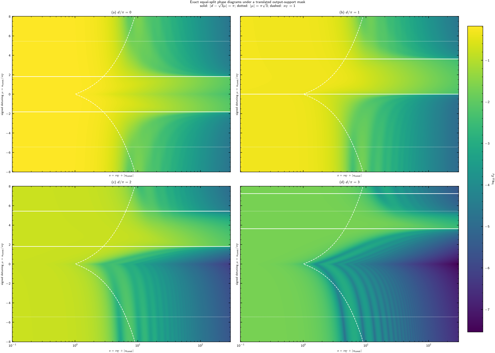

*Figure 12 — Exact nonzero-support-shift phase diagrams
([`plot_support_shift_phase_diagram.py`](../../analysis/fwm/plot_support_shift_phase_diagram.py)).
Each panel evaluates (10.8.1) analytically against the full piecewise-quadratic
Irwin--Hall density; it does not use the production estimator's marginal-mask
approximation. The solid lines are the translated mask boundaries
$|d-\sqrt3\mu|=\pi$, the dotted lines are the unmasked density boundaries
$|\mu|=\pi\sqrt3$, and the dashed curve is $x_\nabla=1$. As $d$ increases,
the sheet migrates toward positive detuning, the negative-detuning side
becomes gapped, and the outer Irwin--Hall sheet branch appears between
$\pi/\sqrt3<\mu<\pi\sqrt3$. The coherent plateau also falls from
$A(0)=2/3$ to $A(\pi)=23/48$, $A(2\pi)=1/6$, and $A(3\pi)=1/48$.*

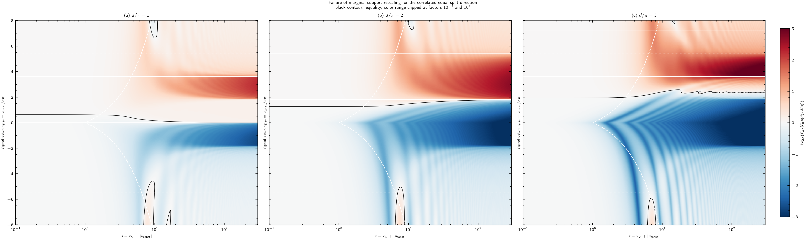

*Figure 13 — Failure of marginal support rescaling for the equal-split
direction, computed as
$\log_{10}\{E_d/[E_0A(d)/A(0)]\}$ using the same analytic evaluator as
Figure 12. White denotes agreement, red means that marginal rescaling
underestimates the exact efficiency, and blue means that it overestimates it;
the color range is clipped at factors $10^{-3}$ and $10^3$. The approximation
is correct on the small-$s$ coherent plateau because both expressions tend to
$A(d)$, but it cannot translate the sheet boundary or its fringes. It
therefore produces order-of-magnitude errors of opposite sign on the two
sides of the shifted phase-matched territory. The black contour marks exact
equality; white solid, dotted, and dashed lines have the meanings of
Figure 12.*

## 11. Validation gates (S2, S4) and production status (S5)

Recorded gate results (S2/S4 at decimation 8, OESCLU 1200-channel
configuration; these predate the 2026-07-20 band-alignment fix and are
scheduled for re-measurement on the corrected 2284-channel grid, but the
*structure* of the errors is grid-independent):

| Gate | Quantity | Result |
|---|---|---|
| S2 (a) | mask/regime model error, mass-weighted aggregate | $0.52\%$ |
| S2 (b) | quadratic ($\beta_2$) omission, aggregate shift | $0.07\%$ (despite $q_{\rm eff} \approx 2$ rad) |
| S2 (c) | end-to-end production per-tuple error | dominated by (a); no additional pathology |
| S4 | fast vs exhaustive-support MC, per-target ratio | $0.94$–$1.04$, deviations traced to MC noise (the MC converges onto the fast value at 5000 samples) |
| this doc | per-tuple Sobol sweep (60 tuples, $W \le 300$) | bulk median $0.89\%$; exact-refined median $0.026\%$, max $0.65\%$ |

Production S5 status: the full-resolution run (2284 channels, decimation 1)
is checkpointed at 735/2284 targets (2026-07-21, healthy, resumable); cost
about 1 minute per target, dominated by the near-ZDW zone. The preliminary
full-resolution finding from the earlier 1200-channel run — strict FWM
*exceeding* XPM over most of the band (up to 72% of the total), with deep
notches at the guard gaps — awaits confirmation on the corrected grid.

## 12. XPM pairs: exact one-dimensional reduction

For an XPM pair the mismatch involves only the interferer's frequency
*difference*: with target-in offset $x_{\rm in}$ and interferer pair
$(x_1, x_2)$, the output offset is $x_{\rm out} = x_{\rm in} - x_1 + x_2$,
the mask is $|x_{\rm out}| < \pi$, and $u = \nu\,(x_1 - x_2)$ with
$\nu = \Delta\beta_1 B L$ the pair walk-off. Integrating the mask over
$x_{\rm in}$ first gives the exact weight $1 - |y|/(2\pi)$ on
$y = x_1 - x_2$; the density of $y$ itself is triangular, so the masked law
of $y$ is $(2\pi - |y|)^2/(2\pi)^3$ on $(-2\pi, 2\pi)$, with the closed-form
cosine transform

$$
H(\theta) = \int_{-2\pi}^{2\pi} \frac{(2\pi-|y|)^2}{(2\pi)^3}\cos(\theta y)\,dy
= \frac{1}{\pi^2\theta^2} - \frac{\sin(2\pi\theta)}{2\pi^3\theta^3},
\qquad H(0) = \tfrac23,
$$

and the pair efficiency is the exact one-dimensional integral

$$
(N\,T^2\!/L^2)_{\rm XPM}(\nu) = 2\int_0^1 (1-t)\,H(\nu t)\,dt
$$

([`_xpm_mass_transform`](../../src/pynlin/methods/td/fast_nlin.py),
[`xpm_fast_batch`](../../src/pynlin/methods/td/fast_nlin.py); the smooth
$1/(\pi\nu t)^2$ tail is integrated analytically). Substituting $s = \nu t$
and using $\int_0^\infty H = \tfrac12$ gives the **sheet limit** (the
strong-walk-off asymptote, where the collision "sheet" sweeps through many
symbols):

$$
(N\,T^2\!/L^2)_{\rm XPM}(\nu) \xrightarrow{|\nu| \to \infty} \frac{1}{|\nu|},
$$

confirmed numerically: $\nu\,(N T^2\!/L^2)_{\rm XPM} = 0.9981$ at $\nu = 10^3$ and $0.99977$ at
$\nu = 10^4$.

This connects directly to the collision-sector language of
[`direct_sector_mc.md`](direct_sector_mc.md): the pair walk-off coincides
with the **Dar collision count**, $|\nu| = L\,B\,|\Delta\beta_1| = L/L_W$.
The sheet limit $(N\,T^2\!/L^2)_{\rm XPM} \to 1/|\nu| = L_W/L$ is the classic
leading-order Dar scaling — total XPM per pair decays inversely with the
number of walked-through symbols, and (per the corrected asymptotics of
2026-08-24, see [`publication_novelty.md`](publication_novelty.md) Claim A)
*every* collision sector individually shares this $1/|\nu|$ law at high
walk-off, the sector ratios tending to constants set by the
spacing-to-baud ratio $q$ — the earlier fitted $\mp 1/3$ ratio exponents
were pre-asymptotic transients of a short fit range. What this document
computes is the pair's *total* efficiency (all sectors summed, Gaussian
symbols); the sector-resolved decomposition 2PC/3PCa/3PCb/4PC of the same
quantity — needed for non-Gaussian constellations — is exactly the subject of
that note.

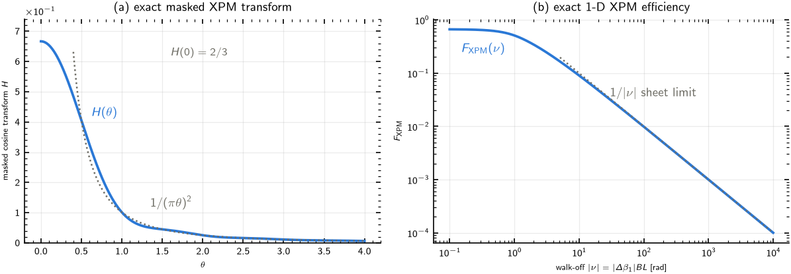

*Figure 9 — (a) The exact masked transform $H(\theta)$ with its
$1/(\pi\theta)^2$ tail. (b) $(N\,T^2\!/L^2)_{\rm XPM}(\nu)$ with the $1/|\nu|$ sheet
limit. No sampling, no regime dispatch: the XPM side of the fast method is
exact within the linear model.*

## 13. Physical layer (S6)

The prefactor-free sums convert to physical NLIN variances with the
SSFM-validated coefficient counting of
[`physical_nlin_spectrum`](../../src/pynlin/methods/td/fast_nlin.py)
(conventions of `analysis/methods/ssfm_interface.py`; SSFM = split-step
Fourier method, the direct numerical solver used as end-to-end truth). With
flat launch power $P$ per channel, Gaussian symbols (so the constellation
factor — the fourth-moment correction for non-Gaussian modulation — is
unity), and nonlinear coefficient $\gamma$:

$$
\sigma^2_{\rm XPM} = 4\,\gamma^2 P^3 \sum_{b \neq t} (N\,T^2\!/L^2)_{\rm XPM}(\nu_b)\,L^2,
\qquad
\sigma^2_{\rm FWM} = 2\,\gamma^2 P^3 \sum_{(a,b,c)} (N\,T^2\!/L^2)_{abc}\,L^2 ,
$$

where the XPM factor 4 is the squared field multiplicity 2 of the cross term
in the expansion of $|A|^2A$, and the FWM coefficient is $4\gamma^2P^3$ per
*unordered* $\{a,b\}$ pair — the fast path enumerates ordered pairs, halving
it to 2. The NSR follows as $\sigma^2/P$ per channel.

Documented extension points: per-channel launch powers, non-Gaussian
constellations (sector-resolved $X_{hkm}$ moments,
[`direct_sector_mc.md`](direct_sector_mc.md)), non-flat power profile along
the span via $\hat K = |\mathcal F[\rho(z)]|^2$ with $\rho(z)$ the normalized
power profile, and the degenerate-FWM sector $a = b$ (currently in neither
the XPM nor the strict-FWM population).

## 14. Summary of guarantees

* Frequency matching is handled **exactly** (hard support cut, closed-form
  acceptance, and the exact zonotope conditional law in the refinement tier).
* Phase matching is handled by regime-specialized models whose errors are
  **measured** (S2, and the per-tuple sweep here: sub-percent in bulk, below
  $0.1\%$ refined) and, for the far population, **bounded** by a certified
  envelope.
* Tuple pruning, once S3 lands, is governed by one physical number — the
  minimum admissible efficiency $\varepsilon$ — with a per-target truncation
  certificate and the exhaustive calculation as its $\varepsilon \to 0$
  limit.
* The one operation with no certificate is interferer decimation; it is
  banned from physical conclusions and should be restructured to thin targets
  only.

## 15. Outlook: an analytical production path (proposed)

The pipeline above *evaluates* every tuple (cheap quadrature bulk +
exact-acceptance refinement) after *enumerating* every frequency-matched
combination. This section records a proposed redesign in which both steps
become analytical: a closed-form/fitted function computes the production
per-tuple noise directly, and the tuple set itself is obtained from the
geometry of the phase map rather than by exhaustive enumeration. The
factorization result of §10.1 is what makes this credible: per-tuple mass is
already known to depend, to within 2× for 99.7% of tuples, on just
$(x_\nabla, \mu)$ and the quantized acceptance factor.

### 15.1 The per-tuple function $\hat N\,T^2\!/L^2$

Target: a function $\hat N\,T^2\!/L^2(u_0, w_a, w_b, w_c, d)$ (equivalently
$(x_\nabla, \mu$, split, $d)$) returning the production per-tuple
efficiency with a stated accuracy budget (proposed: $\le 5\%$ per tuple,
$\le 1\%$ mass-weighted), built from three **anchored branches** — each an
exact limit, no fitting — plus one fitted bridge:

**(i) Sheet branch** ($W \gg 2\pi$; the phase-matched surface crosses the
domain). Because $\int \hat K(u)\,du = 2\pi$ and the mismatch density is
locally flat over the kernel core, the masked average collapses to a
*density evaluation*:

$$
(\hat N\,T^2\!/L^2)_{\rm sheet} \;=\; 2\pi \; \rho_{\rm joint}(u = 0)
\;=\; 2\pi\,\rho_{\mathbf w}(-u_0)\; A_{\rm cond}(u = 0),
$$

with $\rho_{\mathbf w}$ the closed-form Irwin–Hall marginal (§4) and
$A_{\rm cond}$ the closed-form zonotope conditional acceptance (§6) — both
already implemented. Numerically verified (2026-08-24): for wide equal-split
tuples the ratio $(N T^2\!/L^2)/(\hat N\,T^2\!/L^2)_{\rm sheet}$ is $1.0$ to three digits once the
*conditional* acceptance is used. A cautionary measurement worth recording:
with the naive marginal factor $A(d)$ instead, the same test is off by
exactly $3/2$ at $d=0$ and by $\sim 250\times$ at $|d| = 6.41$ — the equal
split is the degenerate direction ($c_u \parallel c_m$, §6) where mask and
mismatch are perfectly correlated, so the conditional law is maximally far
from the marginal. The exact XPM sheet limit $(N\,T^2\!/L^2)_{\rm XPM} \to 1/|\nu|$ (§12)
is this same formula evaluated on the pair geometry, which it reproduces
exactly.

**(ii) Gapped branch** ($|u_0| > W$, the $x_\nabla^{-2}$ class): the far
closed form of §7,
$(\hat N\,T^2\!/L^2)_{\rm far} = 2A(d)\,\mathbb E[1/u^2]\,(1 - \cosu_0\prod_j
\operatorname{sinc} w_j)$, already exact to $\mathcal O((W/u_0)^4)$, with
the certified envelope $A\cdot 4/g^2$ (§9) as its rigorous ceiling.

**(iii) Narrow branch** ($W \lesssim$ a few rad): the exact
characteristic-function integral (§4) truncates to a short series — cheap
enough to count as closed form.

**(iv) Fitted bridge**: only the crossover region ($W \sim \pi$–$10^2$,
$|u_0| \sim W$) lacks an exact form. There, fit a correction factor
$C(x_\nabla, \mu)$ — constrained to $C \to 1$ on every anchored
limit — against the quadrature kernel, once. §10.1 bounds the neglected
split-dependence; the S2 protocol (per-tuple Sobol ground truth, stratified
by mass) is the acceptance gate for the fitted region.

The production value is then
$\hat N\,T^2\!/L^2 \cdot$ (acceptance handling as above) per tuple, with the
$q_j$ quadratic effect either ignored (measured $0.07$–$0.3\%$, §11) or
folded into the bridge fit.

### 15.2 Tuple sets from the stationary lines of the phase map

For a fixed target $t$ on a (near-)uniform grid, frequency matching leaves
two free indices: parametrize a tuple by the leg detunings
$\Omega_a = \omega_a - \omega_t$, $\Omega_b = \omega_b - \omega_t$ (then
$\omega_c \approx \omega_a + \omega_b - \omega_t$ up to the quantized $d$).
The center mismatch is a smooth field on this plane; in the constant-$\beta_2$
limit it is the classical Dar hyperbola,

$$
u_0(\Omega_a, \Omega_b) \;=\; -\,\beta_2\,\Omega_a\,\Omega_b\,L ,
$$

whose zero set — the **phase-matched (stationary) lines** — is the two axes
$\Omega_a = 0$, $\Omega_b = 0$. With the real $\beta(\omega)$ (global curve,
$\beta_3/\beta_4$, ZDW inside the O band) the effective $\beta_2$ is
frequency-dependent and an additional stationary line appears where the
tuple's mean frequency crosses the ZDW (approximately
$\Omega_a + \Omega_b = 2(\omega_{\rm ZDW} - \omega_t)$) — these lines are
precisely the bright zero-sum families ("isles") of the S0 census and the
per-band structure of §10.1's O-vs-C comparison.

The proposal: **instead of enumerating all $\mathcal O(N^2)$ tuples and
filtering, construct the survivor set directly as a tube around the
stationary lines.** The $\varepsilon$-selection of §9 already *is* this tube
in disguise: keep iff $A\cdot 4/g^2 \ge \varepsilon$, i.e.

$$
T_\varepsilon \;=\; \Big\{(\Omega_a, \Omega_b):\;
|u_0(\Omega_a, \Omega_b)| \;\le\; W(\Omega_a, \Omega_b) + P_q +
2\sqrt{A/\varepsilon}\Big\},
$$

so the geometric reasoning does not replace the certificate — it is the
*algorithm* for materializing exactly the certified set. Because $u_0$ is
monotone in $\Omega_b$ along almost every fixed-$\Omega_a$ row (piecewise,
between stationary points of the dispersion curve), the tube's row-wise
boundary indices are found by bisection: $\mathcal O(N \log N)$ per target
instead of $\mathcal O(N^2)$, and the tube population (not the full grid)
is all that is ever instantiated. This is the natural implementation of the
reserved S3 stage (§0, §9): S3 = tube construction + certificate
accumulation; the analytical $\hat N\,T^2\!/L^2$ of §15.1 then evaluates the tube.

### 15.3 v1 gate measurements (2026-08-24)

The v1 implementation
([`src/pynlin/methods/td/fast_analytic.py`](../../src/pynlin/methods/td/fast_analytic.py):
certified tube + sheet/far closed forms + exact-acceptance quadrature
fallback for the bridge; gate script
[`analysis/fwm/fast_s3_tube.py`](../../analysis/fwm/fast_s3_tube.py))
measured against the reference pipeline on full-grid probe targets:

| Target | $\varepsilon$ | kept / total | sum ratio | certificate / kept |
|---|---|---|---|---|
| O edge (236.9 THz) | $10^{-6}$ | 23.7k / 7.79M ($3.0\times10^{-3}$) | 0.9999 | $4.7\times10^{-4}$ |
| near-ZDW (227.4 THz) | $10^{-6}$ | 92.2k / 9.93M ($9.3\times10^{-3}$) | 0.9999 | $1.7\times10^{-4}$ |
| mid-E (208.3 THz) | $10^{-6}$ | 19.5k / 11.7M ($1.7\times10^{-3}$) | 0.9997 | $8.2\times10^{-4}$ |
| mid-C (193.8 THz) | $10^{-6}$ | 18.4k / 10.7M ($1.7\times10^{-3}$) | 0.9998 | $9.3\times10^{-4}$ |
| mid-C | $10^{-8}$ | 31.9k | 0.9999 | $1.1\times10^{-4}$ |
| mid-C | $10^{-10}$ | 204k | 0.9999 | $8.4\times10^{-6}$ |
| near-ZDW | $10^{-10}$ | 1.18M ($1.2\times10^{-1}$) | 1.0000 | $1.5\times10^{-7}$ |

Findings:

* **The certificate machinery works exactly as designed**: the kept sum plus
  the reported certificate always covers the exhaustive sum, the certificate
  tightens monotonically with $\varepsilon$, and at $\varepsilon = 10^{-6}$
  one tuple in $\sim$300–600 reproduces the full sum to $\le 3\times10^{-4}$
  relative with a self-certified truncation bound below $10^{-3}$.
* **The v1 economics are dominated by the fallback branch.** In practice the
  sheet branch fires rarely (0–200 tuples per target: the surviving
  population hugs the $|u_0| = W$ boundary, where the sheet validity margin
  excludes it) and $\sim$99.8% of kept mass flows through the
  exact-acceptance quadrature fallback at $\sim$5–15 ms per tuple. Net v1
  timing at $\varepsilon = 10^{-6}$: 1.2–7× faster than the reference on
  mid-band and band-edge targets (fastest on mid-E, 23 s vs 157 s at
  $\varepsilon = 10^{-4}$), but *slower* on the near-ZDW target (209 s vs a
  47 s reference — there the survivor set is largest at 92k while the
  reference's cheap bulk pass is at its cheapest); at
  $\varepsilon \le 10^{-8}$ the fallback cost overtakes the reference
  everywhere. The
  fitted bridge of §15.1(iv) — replacing the fallback — is therefore *the*
  optimization that converts the certified count reduction ($\sim$500×) into
  wall-time, together with the geometric enumeration of §15.2 (the
  enumeration itself is now a fixed $\sim$10–20 s/target overhead both paths
  share).
* Two library-level facts surfaced during implementation: the exact
  conditional acceptance was singular on the degenerate direction
  $c_u \parallel c_m$ (now handled in closed form: there $u$ determines $m$,
  so the conditional law is an indicator), and the sheet formula must demote
  tuples whose mask excludes the phase-matched point ($A_{\rm cond}(0)
  \approx 0$: kernel-tail dominated, unbounded relative error at negligible
  absolute mass).

### 15.4 Division of labor and validation

Nothing in §§4–13 is discarded: the quadrature pipeline becomes the
*reference implementation* against which the analytical path is gated
(S2-style stratified per-tuple checks for $\hat N\,T^2\!/L^2$; per-target sum
comparisons at S4 probes for the tube + $\hat N\,T^2\!/L^2$ combination), and the
refinement tier's exact conditional acceptance is *reused* inside
$(\hat N\,T^2\!/L^2)_{\rm sheet}$ rather than bypassed. The endpoint, if the gates pass,
is a production path whose per-target cost is dominated by rasterizing a
1-D contour — plausibly milliseconds — with every discarded contribution
covered by the $\varepsilon$ certificate and every kept contribution by a
measured error budget.
