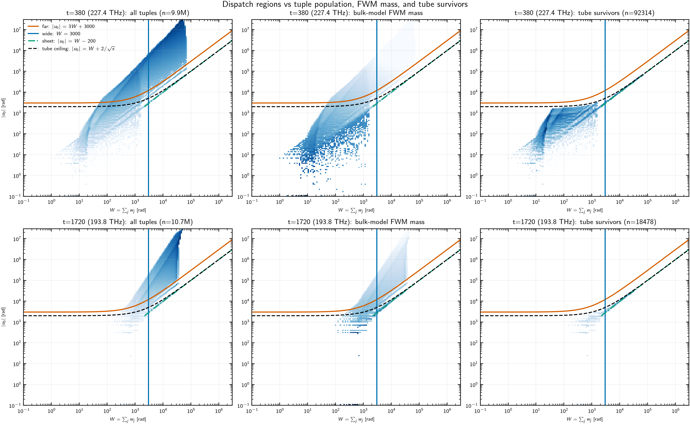

# Cost anatomy: reference pipeline vs the v1 analytic (tube) path

Measured comparison of the two per-target FWM evaluators of the Lorenzi Fast
method — the reference pipeline `target_fast_sums` and the v1 analytic path
`target_analytic_sums` — explaining, stage by stage, why the analytic path is
*not* currently faster than the reference despite pruning 99.8%+ of the
tuples, and what that implies for the [`lorenzi_fast_method.md`](../lorenzi_fast_method.md)
§15 roadmap. Companion to the GN-style ease-of-computation exploration
([`analysis/fwm/fast_gn_comparison.py`](../../../analysis/fwm/fast_gn_comparison.py),
`media/lorenzi-fast/gn_comparison.{npz,png}`), which produced the end-to-end
timings quoted here.

Measurement date: 2026-08-26. All numbers are single-process NumPy on the
full grid, no decimation. They were collected with the former unmasked-box
tube selector. The current mask-aware selector was added afterward; the
timing, survivor-count, branch-share, figure, and seam tables below have not
been regenerated and must not be quoted as current measurements.

## 1. The system at hand

The OESCLU case study of [`input/studies.toml`](../../../input/studies.toml):

| Parameter | Value |
|---|---|
| Fiber | SMF-28 (measured CSV dispersion, ZDW inside the O band), single span, 100 km, lossless kernel |
| Bands | O+E+S+C+L+U, 2284 channels, 179.6–236.9 THz |
| Grid | 25 GHz spacing, 24.5 GBaud Nyquist channels ($\Delta/B \approx 1.02$) |
| Tuples per target | 7.8M–11.7M support-surviving strict FWM tuples |
| Probe targets | 0 (O edge, 236.9 THz), 380 (near-ZDW, 227.4 THz), 1141 (mid-E, 208.3 THz), 1720 (mid-C, 193.8 THz), 2283 (U edge, 179.6 THz) |

Quantity evaluated: the per-target strict-FWM sum of the prefactor-free
per-tuple efficiency $N\,T^2\!/L^2 = \mathbb E[\hat K(u)\,\mathbb 1_{\rm mask}]$
in the normalized variables of
[`lorenzi_fast_method.md`](../lorenzi_fast_method.md) §3.

**Tuple-count arithmetic.** Where the 7.8M–11.7M per-target counts come
from, order of magnitude first:

* Free legs: frequency matching fixes one of the three legs, so the tuple
  set is parametrized by $(a, b)$ —
  $N^2 = 2283^2 \approx 5.2\times10^{6}$ ordered pairs (vs the naive
  $N^3 \approx 1.2\times10^{10}$ triples).
* $c$-window per pair: the support condition
  $|f_a + f_b - f_c - f_t| \le 2B$ admits
  $4B/\Delta f = 98/25 \approx 3.9$ candidate $c$ channels per $(a,b)$.
* Upper bound:
  $N^2 \cdot 4B/\Delta f \approx 5.2\times10^{6} \times 3.9
  \approx 2.0\times10^{7}$.
* In-grid landing: the required $c$-center $f_a + f_b - f_t$ must itself lie
  inside the transmitted bands. With $f_a, f_b$ ranging over a span $S$, the
  sum has a triangular distribution of width $2S$ and the grid intercepts a
  window of width $S$, capturing $1/2$ (target at a band edge) to $3/4$
  (target mid-span) of the pairs — further reduced by the inter-band guard
  gaps of the OESCLU comb. Measured landing factors: $0.38$ (both edges) to
  $0.57$ (mid-E), i.e. $7.8\times10^{6}$–$1.17\times10^{7}$ tuples.

The tube then keeps a fraction $1.2\times10^{-3}$–$9.3\times10^{-3}$ of
these ($9.3$k–$92$k survivors at $\varepsilon = 10^{-6}$).

## 2. Structure of the two procedures

### 2.1 REF — `target_fast_sums` (`src/pynlin/methods/td/fast_nlin.py`)

Design principle: *cheap everywhere, exact only where the mass is.*

1. **Enumeration** — `fwm_tuple_variables` builds the normalized variables
   $(u_0, \nu_j, q_j, d)$ for every support-surviving tuple via sorted
   searchsorted windows (no $N^3$ loop).
2. **Bulk pass** — `linear_tuple_estimate` evaluates *all* tuples with the
   regime dispatch of §7: `far_model` (closed form, $\mathcal O(1)$ flops,
   vectorized), `wide_model_masked`, and `near_model_masked`, the latter two
   with the *cheap* pointwise acceptance model (§6, "cheap model").
3. **Refinement** — `refine_tuples_exact` re-evaluates a **mass-capped**
   subset with `exact_conditional_acceptance` (the exact zonotope law of §6:
   48-node inner $m$-quadrature plus per-tuple $3\times3$ basis algebra per
   outer node): all near-regime tuples up to `max_near_refine = 16384`, plus
   the top `n_refine = 256` remaining narrow tuples by analytic value.

### 2.2 FAST — `target_analytic_sums` (`src/pynlin/methods/td/fast_analytic.py`)

Design principle (§15): *certified tube + closed forms per survivor.*

1. **Enumeration** — the same `fwm_tuple_variables` call (the §15.2 bisection
   construction of the tube is not implemented in v1; selection is
   post-enumeration).
2. **Tube selection** — `select_tube` projects the mismatch coefficients onto
   the output-mask normal, intersects that mask-derived phase interval with
   the unmasked cube interval, shrinks its distance from zero by $P_q$, and
   keeps tuples whose resulting certified envelope bound is
   $\ge \varepsilon$, accumulating the discarded bounds as the truncation
   certificate.
3. **Branch evaluation** — `analytic_tuple_values` dispatches survivors to:
   sheet closed form ($2\pi\rho_w(-u_0)A_{\rm cond}(0)$, guarded by
   `SHEET_MIN_WIDTH` = 2000 rad, `SHEET_CORE_MARGIN` = 200 rad,
   `SHEET_MIN_ACCEPTANCE` = 0.05), far closed form (`far_model`), or the
   **fallback bridge** — which is `refine_tuples_exact`, i.e. the exact
   quadrature of the refinement tier, applied to *every* fallback survivor.

## 3. Historical measured anatomy

End-to-end per target ($\varepsilon = 10^{-6}$; sums agree to 0.9997–0.9999
with certificates $10^{-4}$–$10^{-3}$):

| Target | tuples | REF | FAST | survivors | branch split (sheet/far/fallback) |
|---|---|---|---|---|---|
| O edge | 7.79M | 133 s | 161 s | 23.7k | 0 / 0 / 100% |
| near-ZDW | 9.93M | 63 s | 208 s | 92.3k | 0 / 0 / 100% |
| mid-E | 11.7M | 165 s | 86 s | 19.6k | ~0 / 0 / 99.95% |
| mid-C | 10.7M | 86 s | 73 s | 18.5k | ~0 / 0 / 99.8% |
| U edge | 7.77M | 21 s | 34 s | 9.3k | 0.8% / 0 / 99.2% |

Stage-level instrumentation, target 2283 (U edge, 7.77M tuples):

| Stage | REF | FAST |
|---|---|---|
| Enumeration | 2.7 s | 2.7 s |
| Bulk pass, all 7.77M tuples (cheap acceptance) | 8.4 s — regimes 996 near / 7.74M far / 34k wide | — |
| `select_tube` | — | 0.6 s → 9300 survivors |
| Exact-acceptance evaluation | 10.5 s on **996** capped near tuples | 32.3 s on **9228** fallback survivors |

Width statistics explain the per-tuple cost gap: the survivors' width sum $W$
has median **58k rad** (wide regime → 384-node central quadrature, each node
paying the exact acceptance), while REF's refined set has median 1.7k rad.

**Per-tuple work arithmetic** (same target, order of magnitude):

* Cheap far closed form: $\sim 10^{1}$ flops/tuple
  $\times\, 7.7\times10^{6}$ tuples $\approx 10^{8}$ flops for nearly the
  whole bulk pass.
* Exact fallback on a wide survivor: $384$ outer nodes $\times$
  ($48$ inner $m$-nodes $\times \sim 20$ flops $+$ basis algebra)
  $\approx 4\times10^{5}$ flops/tuple — a $\sim 4\times10^{4}\times$
  per-tuple premium.
* Fallback total: $4\times10^{5} \times 9.2\times10^{3}$ survivors
  $\approx 4\times10^{9}$ flops — roughly $50\times$ the entire cheap bulk
  workload despite $840\times$ fewer tuples.

The measured wall-clock gap (32.3 s vs 8.4 s) is smaller than the flop ratio
because the bulk pass is memory-bound (tens of full-length temporaries over
7.7M tuples) and itself carries the 34k wide-regime tuples through the
384-node cheap-acceptance quadrature.

## 4. Assessment of the historical run

1. **The far branch was structurally unreachable inside the former tube.** Surviving
   $\varepsilon$-selection means gap $g \le 2\sqrt{A/\varepsilon}$ ($= 2000$
   rad at $\varepsilon = 10^{-6}$), but the far dispatch requires
   $|u_0| > 3W + 3000$, i.e. $g \gtrsim 3000$ rad. Every tuple eligible for
   the far closed form was already discarded — for any
   $\varepsilon \gtrsim 4\times10^{-7}$. Measured: `n_far = 0` on all five
   targets in that run. The mask-aware bound is never looser than the former
   linear interval before quadratic padding, but no current branch census is
   reported here.
2. **The sheet branch barely fires.** Its guards ($W > 2000$,
   $|u_0| < W - 200$, $A_{\rm cond}(0) \ge 0.05$) pass for only 0–198 of
   9k–92k survivors; the acceptance guard demotes many wide survivors whose
   phase-matched point sits outside the mask.
3. **Therefore ~99.7–100% of survivors (by count *and* mass) land in the
   fallback**, which is the most expensive evaluator in the codebase. The
   asymmetry in one sentence: REF runs the exact machinery on a mass-capped
   $\le 16.6$k tuples and the cheap model on 10M; FAST runs the exact
   machinery on every survivor — and 9k–92k exact evaluations cost more than
   10M cheap ones (the 10M-tuple bulk pass is only ~8 s because 99.5% of
   tuples take the vectorized far closed form).

Consistently, FAST wins exactly where REF's refinement saturates its cap
while the survivor count stays comparable (mid-E: 86 vs 165 s; mid-C: 73 vs
86 s), and loses where survivors far exceed the cap (near-ZDW: 92k survivors,
208 vs 63 s) or where REF's near population is tiny (band edges).

Note the accounting asymmetry this creates: FAST is *more* exact than REF on
the mass it keeps (every survivor gets the exact conditional acceptance; REF
caps that at 16.6k tuples), and it alone carries a truncation certificate.
The comparison above is time-at-comparable-accuracy, not time-at-identical
work.

## 5. Dispatch-plane census and seam audit

The evaluator dispatch predicates are curves in the $(W, |u_0|)$ plane, but
the current tube predicate is not: it also depends on the signed mismatch
orientation, $d$, and $P_q$. The archived figure overlays the former
unmasked-box tube ceiling on the evaluator regions
([`analysis/fwm/plot_dispatch_regions.py`](../../../analysis/fwm/plot_dispatch_regions.py)):

*Dispatch-plane census for the near-ZDW (top) and mid-C (bottom) targets.
Columns: all tuples, bulk-model FWM mass, $\varepsilon$-tube survivors
($\varepsilon = 10^{-6}$). Lines: far boundary $|u_0| = 3W + 3000$ (orange),
wide boundary $W = 3000$ (blue), sheet line $|u_0| = W - 200$ (green),
former unmasked-box outer ceiling $|u_0| = W + 2/\sqrt{\varepsilon}$ (black
dashed, drawn for $A = 1$, $P_q \approx 0$). The current plotting script does
not draw this as a selector boundary; it plots mask-aware survivors directly.*

What the figure shows:

* **Historical far-branch observation**: the former outer ceiling
  $W + 2/\sqrt\varepsilon$ lies strictly below the far boundary $3W + 3000$
  for *every* $W$ (they never cross for
  $\varepsilon \gtrsim 4\times10^{-7}$), so the far region and the tube are
  disjoint. This explains the archived survivors panel; it is not a complete
  geometric description of the current selector.
* **The mass and the survivors' mass live in the near region**: the FWM-mass
  column concentrates at $W \sim 10^{1}$–$10^{3}$ and low $|u_0|$, left of
  the wide boundary. This is the crossover ("bridge") territory the
  §15.1(iv) fit must cover.
* **The expensive survivors are a mass-poor ridge**: for $W > 3000$ the
  survivors collapse onto a thin diagonal band hugging
  $|u_0| \approx W$ between the sheet line and the former tube ceiling — numerous
  (16.6k at mid-C), nearly massless, and each paying the 384-node exact
  quadrature in FAST's fallback.
* Near the ZDW the survivor cloud extends to very small $|u_0|$ at small
  $W$ — the broadband phase matching that makes the near-ZDW target keep
  92k survivors.

**Archived seam audit** ([`analysis/fwm/fast_dispatch_audit.py`](../../../analysis/fwm/fast_dispatch_audit.py);
mid-C target, 10 tuples per seam, ground truth = randomized-Sobol QMC of the
linear model with exact output mask, $2^{16}\times4$ replicates). The evaluator
seam ratios do not depend on tube selection, but survivor counts and sheet
demotions in this table use the former selector. The current script additionally
reports the mask-aware projected gap and must be rerun for current counts:

| Seam / check | Result (ratio to QMC truth) |
|---|---|
| far/near at $\lvert u_0\rvert = 3W + 3000$ | `far_model` 0.80–1.15 (second-order $1/u^2$ expansion degrades at $W/u_0 = 1/3$); near model 0.98–1.02 |
| wide/near at $W = 3000$ | `wide_model_masked` **0.58–10.9**; near model 0.99–1.13 |
| sheet closed form vs exact fallback (198 fired survivors) | sheet/exact median 0.962, p5 0.927, mass-weighted 0.979 |
| sheet demotion rate | **1396 of 1594** geometry-eligible survivors (88%) demoted by the $A_{\rm cond}(0) \ge 0.05$ guard |
| survivor placement | near: 1846 tuples, **99.85% of surviving mass**, $W$ median 916; wide: 16632 tuples, 0.15% of mass, $W$ median 26k |

Two caveats on the wide/near seam. First, the up-to-$10\times$ per-tuple
wide-model errors sit on low-mass tuples, so the aggregate exposure is small
— but FAST-vs-REF agreement does *not* validate this evaluator, because both
paths share the same wide machinery: their $0.9999$ agreement is blind to a
common-mode wide error. The only independent coverage is the S2/S4
mass-weighted QMC gates. Second, the audit is one target and 10 tuples per
seam; a mass-weighted wide-regime gate would settle it.

## 6. Implications for the §15 roadmap

* **In the historical run, the tube was not the bottleneck.** It took 0.6 s to
  certify away 99.8–99.9% of tuples. The §15.2 bisection construction would
  save only the ~3 s enumeration+bound cost per target; worthwhile, but
  second-order.
* **The fitted bridge of §15.1(iv) is the speedup, not a nicety.** The
  measured branch shares show the crossover region — where v1 falls back to
  exact quadrature — holds essentially *all* of the certified mass on every
  probe target. Until the bridge (and the demoted-sheet cases) have an
  $\mathcal O(1)$ closed/fitted form, the analytic path's per-survivor cost
  is quadrature-dominated and its total cost tracks the survivor count, not
  the closed-form promise.
* **Cheaper interim lever:** the §5 census shows FAST's exact-quadrature
  budget is spent almost entirely on the mass-poor wide ridge (mid-C: 16,632
  wide survivors carrying 0.15% of the surviving mass). Evaluating wide
  survivors with the bulk wide model (as REF does) and reserving the exact
  acceptance for the near survivors cuts the exact evaluations $10\times$
  (18,478 → 1,846 at mid-C) with a $1.5\times10^{-3}$ mass exposure — putting
  FAST strictly below REF at matched accuracy, since every other stage of
  FAST is already cheaper.
* The historical run did not exercise the far branch at production
  $\varepsilon$. Deletion should be based on a current mask-aware census, not
  inferred from the archived counts alone.
