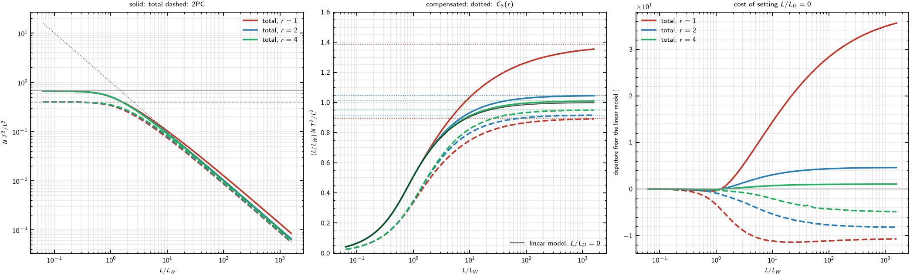

# XPM with in-channel curvature: exact two-variable closed form

This note states what can be established rigorously about the joint
$(L/L_W,\,L/L_D)$ dependence of the XPM pair efficiency, and where the
established chain stops. It extends §12 of
[`lorenzi_fast_method.md`](lorenzi_fast_method.md), which is exact within the
linear ($q_j = 0$) phase model, to the locally quadratic phase model of §16.5,
without leaving one dimension of quadrature.

Notation follows [`lorenzi_fast_method.md`](lorenzi_fast_method.md) §1.1.

## 1. Standing assumptions

Every statement below holds under, and only under:

- **A1** single span, flat power profile ($\alpha = 0$), lossless link kernel
  $\hat K(u) = 4\sin^2(u/2)/u^2$;
- **A2** rectangular (Nyquist) channel spectra of width $B$, so the in-channel
  normalized offsets $x_j = 2\pi f_j^{\rm off}/B$ are i.i.d.
  $\mathcal U(-\pi,\pi)$;
- **A3** Gaussian symbols — the quantity computed is the *total* pair
  efficiency $\mathbb E[\hat K(u)\mathbf 1_{\rm mask}]$, all collision sectors
  summed (see §8 for the sector-resolved case);
- **A4** the propagation constant is a polynomial in $\omega$ of degree
  $\le 3$ over the two channels involved (§2 makes this precise and quantifies
  the residual).

An XPM pair is the quadruplet $(a,b) \to (c,t)$ with $a$ = target-in,
$t$ = target-out in channel $t$, and $b$ = interferer-in, $c$ = interferer-out
in channel $b$; energy conservation is $f_a + f_b = f_c + f_t$, equivalently
$x_t = x_a + x_b - x_c$, and the output-support mask is $|x_t| < \pi$.

## 2. The mismatch is exactly bilinear

**Proposition 1.** Let $\beta(\omega) = \sum_{k\le 3}\beta_k(\omega-\omega_0)^k/k!$
and let $f_a + f_b = f_c + f_t$. Then, with no approximation,

$$
\Delta\beta \;=\; \beta_a + \beta_b - \beta_c - \beta_t
\;=\; -4\pi^2\,\beta_2(\bar\omega)\,(f_a - f_c)(f_b - f_c),
\qquad
\bar\omega = \pi (f_c + f_t) = \pi (f_a + f_b).
$$

*Proof.* Put $x_i = f_i - f_0$, $A = f_a - f_c$, $B' = f_b - f_c$, so
$x_t = x_c + A + B'$. Direct expansion gives
$x_a^2 + x_b^2 - x_c^2 - x_t^2 = -2AB'$ and
$x_a^3 + x_b^3 - x_c^3 - x_t^3 = -3AB'(x_c + x_t)$. The $\beta_0$ and $\beta_1$
terms cancel by energy conservation. Collecting,
$\Delta\beta = -(2\pi)^2 A B'\left[\beta_2 + 2\pi\beta_3\tfrac{f_c+f_t}{2}\right]
= -(2\pi)^2 A B'\,\beta_2(\bar\omega)$. $\square$

Two consequences:

1. **$\beta_3$ is not an independent effect for a single tuple.** It only
   relocates the evaluation point of $\beta_2$ to the mean of the two
   annihilated (equivalently, the two created) photons. The pairwise
   $\beta_{2,\rm eff}(f_i,f_j)$ convention already used by the PCFM path is
   therefore exact, not conventional.
2. **$\bar\omega$ fluctuates within the two bands.** Freezing
   $\beta_{2,\rm eff}$ at the pair centre $\bar f = (f_{b}^{(0)}+f_t^{(0)})/2$
   incurs a relative error on $\Delta\beta$ of order

$$
\epsilon_3 \;=\; \frac{\pi\,|\beta_3|\,B}{|\beta_2(\bar\omega)|},
$$

   which is $1.4\times10^{-3}$ for SMF-28 at $B = 100$ GBd
   ($\beta_3 = 10^{-40}\,\mathrm{s^3/m}$, $\beta_2 = -2.17\times10^{-26}\,\mathrm{s^2/m}$)
   and diverges at the ZDW. $\beta_4$ is the first coefficient that breaks
   bilinearity: the quartic term contributes
   $-\tfrac{(2\pi)^4\beta_4}{6}AB'\bigl[3x_c^2 + 3x_c(A{+}B') + A^2 + \tfrac32 AB' + B'^2\bigr]$,
   $x_c = f_c-f_0$, whose $A,B'$-dependent part is not absorbable into any
   $\beta_2(\bar\omega)$.

## 3. For an XPM pair the phase factorizes

Write the two factors of Proposition 1 in normalized offsets, with
$\Delta f = f_b^{(0)} - f_t^{(0)}$ the channel separation:

$$
f_a - f_c = -\Delta f + \frac{B}{2\pi}s,
\qquad
f_b - f_c = \frac{B}{2\pi}y,
\qquad
y \equiv x_b - x_c, \quad s \equiv x_a - x_c .
$$

**Proposition 2.** With $\nu = \Delta\beta_1 B L = 2\pi\beta_2 L B\,\Delta f$ and
$q = \tfrac12\beta_2 B^2 L$ (so $2q = L/L_D$, $\nu = 2\pi r\,(L/L_D)$,
$r = \Delta f/B$),

$$
\boxed{\;u \;=\; \Delta\beta\,L \;=\; y\,\bigl(\nu - 2q\,s\bigr)\;}
$$

exactly, under A4.

*Proof.* Substitute the two displays into Proposition 1. $\square$

The right-hand side is, up to sign conventions, the scalar-$\beta_2$ kernel
already implemented in
[`_direct_sector_kernel`](../../src/pynlin/methods/td/xhkm_mc.py) and written as
$\Delta\beta L = -\nu x\,g(u-x-a)$, $g(y) = 1 + y/2\pi q$, in
[`npc_sector_asymptotics.md`](npc_sector_asymptotics.md) §1. Proposition 2
states that this model is *exact* under A4, and Proposition 1 says through
which order.

The content of Proposition 2 is that the quadratic term does **not** add a
dimension. The per-leg form of §16.5, $u = \sum_j (\nu_j x_j + q_j x_j^2) $,
recombines for an XPM pair — using $x_t = x_a + x_b - x_c$ and a common
$\beta_2$ for both channels — into $y\times(\text{affine in }s)$. The mismatch
therefore remains a *product* of one variable and one effective walk-off,

$$
u = y\,\kappa(s), \qquad \kappa(s) = \nu - 2q\,s ,
$$

i.e. in-channel curvature acts as a *spread of the effective walk-off across
the band*, of full width $2\pi \cdot 2\cdot(L/L_D)$ around $\nu$.

If the two channels are assigned different curvatures $q_t \ne q_b$, the same
algebra gives $\kappa = \nu - 2q_t x_a + (q_b - q_t)x_b + (q_b + q_t)x_c$, still
affine in the offsets; Proposition 1 removes this case, since the correct
common value is $\beta_2(\bar\omega)$ for both legs.

## 4. The exact joint law under the mask

**Proposition 3.** Let $x_a, x_b, x_c \sim \mathcal U(-\pi,\pi)$ i.i.d.,
$y = x_b - x_c$, $s = x_a - x_c$, $x_t = x_a + x_b - x_c$. The joint density of
$(y,s)$ restricted to the mask $|x_t| < \pi$ is

$$
w(y,s) \;=\; \frac{\bigl(2\pi - |y| - |s|\bigr)_+}{(2\pi)^3}.
$$

*Proof.* The map $(x_a,x_b,x_c)\mapsto(y,s,x_t)$ is linear with unit
determinant, so the density in the new variables is $(2\pi)^{-3}$ on the image.
At fixed $(y,s)$ the four constraints $|x_t|<\pi$, $|x_t - y|<\pi$,
$|x_t - s|<\pi$, $|x_t - s - y|<\pi$ (these are $|x_a|,|x_b|,|x_c|,|x_t|<\pi$
re-expressed) intersect in an interval of length
$2\pi - \bigl(\max - \min\bigr)\{0,y,s,y+s\}$, and
$\max - \min = |y| + |s|$ for all signs. $\square$

Two checks: $\iint w = 2/3 = A(0)$, the unconditional mask acceptance; and
$\int w\,\mathrm ds = (2\pi-|y|)^2/(2\pi)^3$, the masked law of $y$ of §12.

## 5. The two-variable law and its one-dimensional reduction

**Theorem.** Under A1–A4, the XPM pair efficiency depends on the fiber, length,
baud rate and spacing only through $\nu = L/L_W$ and $2q = L/L_D$, and equals

$$
\bigl(N\,T^2\!/L^2\bigr)_{\rm XPM}(\nu,q)
=\frac{1}{(2\pi)^3}\iint_{|y|+|s|<2\pi}
\bigl(2\pi-|y|-|s|\bigr)\,
\hat K\!\bigl(y(\nu-2qs)\bigr)\,\mathrm dy\,\mathrm ds .
\tag{5.1}
$$

The inner integral is elementary in $\mathrm{Si}$ and $\mathrm{Cin}$: with

$$
J(\kappa,Y) \equiv \int_{-Y}^{Y}\bigl(Y-|y|\bigr)\hat K(\kappa y)\,\mathrm dy
= \frac{4}{\kappa^2}\Bigl[\,|\kappa Y|\,\mathrm{Si}(|\kappa Y|)
-\bigl(1-\cos \kappa Y\bigr)-\mathrm{Cin}(\kappa Y)\Bigr],
\qquad
J \xrightarrow[\kappa\to0]{} Y^2-\frac{\kappa^2Y^4}{72},
\tag{5.2}
$$

$\mathrm{Cin}(z) = \gamma + \ln z - \mathrm{Ci}(z)$, the efficiency is the
single quadrature

$$
\boxed{\;
\bigl(N\,T^2\!/L^2\bigr)_{\rm XPM}(\nu,q)
=\frac{1}{(2\pi)^3}\int_{-2\pi}^{2\pi}
J\bigl(\nu-2qs,\;2\pi-|s|\bigr)\,\mathrm ds \; }
\tag{5.3}
$$

*Proof.* (5.1) is Propositions 2 and 3. For (5.2), use
$\hat K(\kappa y) = 2(1-\cos\kappa y)/(\kappa y)^2$ and the antiderivatives
$\int (1-\cos\kappa y)y^{-2}\mathrm dy = -(1-\cos\kappa y)/y + \kappa\,\mathrm{Si}(\kappa y)$
and $\int_0^Y (1-\cos\kappa y)y^{-1}\mathrm dy = \mathrm{Cin}(\kappa Y)$.
(5.3) is (5.1) with the $y$-integral done at fixed $s$, using
$w(\cdot,s)$ triangular of half-width $2\pi-|s|$. $\square$

At $q = 0$, (5.3) reduces to the §12 result $2\int_0^1(1-t)H(\nu t)\,\mathrm dt$;
the cost is one dimension of quadrature in both cases.

## 6. Closed-form limits

Let $q > 0$ without loss of generality and define the single shape parameter

$$
r_{\rm eff} \;\equiv\; \frac{\nu}{2\pi\,(L/L_D)} \;=\; \frac{|\Delta\beta_1|}{2\pi|\beta_2|B},
$$

which equals $r = \Delta f/B$ for a single-mode interchannel pair. The
phase-matched point $\kappa(s) = 0$ lies at $s_\star = 2\pi r_{\rm eff}$ and is
therefore *reachable inside the band iff $r_{\rm eff} < 1$*.

**(a) Plateau.** Expanding $\hat K(u) = 1 - u^2/12 + O(u^4)$ and using the
moments of $w$, $\langle y^2\rangle = 2\pi^2/5$, $\langle y^2 s\rangle = 0$,
$\langle y^2s^2\rangle = 8\pi^4/105$:

$$
\bigl(N\,T^2\!/L^2\bigr)_{\rm XPM}
=\frac23\left[1-\frac{\pi^2}{30}\Bigl(\frac{L}{L_W}\Bigr)^{\!2}
-\frac{2\pi^4}{315}\Bigl(\frac{L}{L_D}\Bigr)^{\!2}\right]+O(\text{4th order}).
\tag{6.1}
$$

The two coefficients are $0.3290$ and $0.6186$; the curvature term is
$4.8\,\%/r_{\rm eff}^2$ of the walk-off term.

**(b) Strong walk-off ($r_{\rm eff} > 1$).** Using $J \to 2\pi Y/|\kappa|$:

$$
\bigl(N\,T^2\!/L^2\bigr)_{\rm XPM}\;\longrightarrow\;\frac{C(r_{\rm eff})}{|\nu|},
\qquad
C(r) = r\bigl[(r{+}1)\ln(r{+}1)+(r{-}1)\ln(r{-}1)-2r\ln r\bigr]
= 1+\frac{1}{6r^2}+O(r^{-4}).
\tag{6.2}
$$

This is $C_{N_1}(q)$ of [`npc_sector_asymptotics.md`](npc_sector_asymptotics.md)
§3, recovered here as the $\nu\to\infty$ limit of the finite-$\nu$ formula
(5.3). $C$ is the exact band-averaged analogue of the PCFM XCI log kernel
$r\ln\frac{r+1/2}{r-1/2} = 1 + \frac{1}{12r^2}+\cdots$ of
[`pcfm_td_scientific_spec.md`](stale/pcfm_td_scientific_spec.md); the two differ
because the PCFM kernel is the noise PSD at the target band centre while
(5.3) is averaged over the target support. $C(1) = 2\ln 2 = 1.386$ is finite;
$C'$ diverges logarithmically at $r = 1$.

**(c) Zero walk-off ($\nu = 0$, in-channel curvature only).** The efficiency
still decays, with a logarithmic correction to the sheet law:

$$
\bigl(N\,T^2\!/L^2\bigr)_{\rm XPM}(0,q)
=\frac{2\ln(L/L_D)+c}{2\pi\,(L/L_D)}\bigl[1+O(\ln^{-1})\bigr],
\qquad c = 2.5059\ \text{(numerical)},
\tag{6.3}
$$

fitted residual $<0.1\,\%$ for $L/L_D \ge 10^2$, $0.9\,\%$ at $L/L_D = 10$. The
constant $c$ has not been derived in closed form.

## 7. The 2PC collision sector

The sector decomposition of
[`direct_sector_mc.md`](direct_sector_mc.md) is an ANOVA of the masked kernel
over the two inner frequencies at fixed outer frequency $x = y$; the phase
enters only through Proposition 2, so every sector is a function of
$(\nu, L/L_D)$ alone. For 2PC the weight is also closed.

**Proposition 4.** At fixed $y$, the phase $u = y(\nu - 2qs)$ depends on the
target-in and interferer frequencies only through $s$, whose law under the two
masks is triangular of half-width $\ell = 2\pi - |y|$ and mass
$(\ell/2\pi)^2$. Hence, with $\hat\Lambda(\delta) = (e^{i\delta}-1)/(i\delta)$,

$$
N_{2\rm PC}(\nu,q)=\frac1\pi\int_0^{2\pi}\bigl|\,G(y)\,\bigr|^2\mathrm dy,
\qquad
G(y)=\frac{1}{4\pi^2}\int_{-\ell}^{\ell}\!\bigl(\ell-|s|\bigr)\,
\hat\Lambda\bigl(y(\nu-2qs)\bigr)\,\mathrm ds ,
\tag{7.1}
$$

and $G$ is elementary: with $\mathcal P(\tau) = \mathrm{Si}(\tau) + i\,\mathrm{Cin}(\tau)$,
$\mathcal Q(\tau) = -e^{i\tau} + i\tau$ the antiderivatives of $\hat\Lambda$ and
$\tau\hat\Lambda$, and $\tau_\pm = \nu y \pm 2q|y|\ell$,

$$
G(y)=\frac{1}{4\pi^2\,2q|y|}\Bigl\{
\ell\bigl[\mathcal P\bigr]_{\tau_-}^{\tau_+}
-\frac{1}{2q|y|}\Bigl(
\nu y\bigl[\mathcal P(\tau_+)+\mathcal P(\tau_-)-2\mathcal P(\nu y)\bigr]
-\bigl[\mathcal Q(\tau_+)+\mathcal Q(\tau_-)-2\mathcal Q(\nu y)\bigr]\Bigr)\Bigr\}.
$$

So the 2PC sector is one quadrature at finite $\nu$, as the total is. Two
consequences, both verified in §10:

**(a) Plateau.** Expanding $\hat\Lambda$ to second order,

$$
N_{2\rm PC}=\frac25\left[1-\frac{\pi^2}{63}\Bigl(\frac{L}{L_W}\Bigr)^{\!2}
-\frac{10\pi^4}{567}\Bigl(\frac{L}{L_D}\Bigr)^{\!2}\right]+O(\text{4th order}).
\tag{7.2}
$$

The plateau height is $2/5$, against $2/3$ for the total, so the 2PC share at
zero walk-off is exactly $3/5$. The curvature term is $27.8\,\%/r_{\rm eff}^2$
of the walk-off term — $5.8\times$ the ratio for the total, but still
subdominant.

**(b) The curvature moves 2PC and the total in opposite directions.** The
$\nu\to\infty$ limit of (7.1) is $C_{2\rm PC}(q)/\nu$ with $C_{2\rm PC}$ the
constant of [`npc_sector_asymptotics.md`](npc_sector_asymptotics.md) §3, which
is *below* 1, while $C_{N_1}(q) = C(r)$ is above 1. Setting $L/L_D = 0$
therefore **over**estimates 2PC and **under**estimates the total. Departure of
the $L/L_D=0$ model from (7.1) and (5.3), per cent:

| $\nu = L/L_W$ | total $r{=}1$ | 2PC $r{=}1$ | total $r{=}2$ | 2PC $r{=}2$ | total $r{=}4$ | 2PC $r{=}4$ |
|---|---|---|---|---|---|---|
| 0.3 | −0.13 | −0.38 | −0.03 | −0.10 | −0.01 | −0.02 |
| 1 | −0.34 | −3.30 | −0.08 | −0.86 | −0.02 | −0.22 |
| 3 | +5.09 | −8.86 | +1.34 | −2.77 | +0.34 | −0.75 |
| 10 | +14.42 | −11.18 | +3.06 | −5.34 | +0.73 | −2.07 |
| 100 | +28.35 | −11.11 | +4.37 | −7.67 | +1.01 | −4.22 |
| $10^3$ | +34.93 | −10.73 | +4.61 | −8.16 | +1.06 | −4.79 |
| $\infty$ | +38.63 | −10.62 | +4.65 | −8.28 | +1.07 | −4.93 |

The 2PC error saturates by $\nu \simeq 10$ and is non-monotonic; at $r = 4$,
where the total is within $1.1\,\%$ of the linear model, 2PC is off by
$4.9\,\%$. The mechanism is the one recorded as a negative result in
[`npc_sector_asymptotics.md`](npc_sector_asymptotics.md) §4: dropping the
in-band phase modulation $g$ collapses the residual sectors, so the weight it
carries is returned to 2PC.

The 2PC share of the total therefore runs from exactly $3/5$ at zero walk-off
to $C_{2\rm PC}/C_{N_1}$ at large walk-off — $0.650$, $0.877$, $0.941$ at
$r = 1, 2, 4$ — non-monotonically at $r = 1$ (maximum $0.723$ at
$\nu \simeq 10$).

*Figure — (a) total (solid) and 2PC (dashed) pair efficiency against
$L/L_W$ at $r = 1, 2, 4$, with the plateaus $2/3$ and $2/5$ and a $1/\nu$
guide; (b) the same compensated by $L/L_W$, with the asymptotic constants
$C_{N_1}(r)$ and $C_{2\rm PC}(r)$ dotted and the $L/L_D = 0$ model in black;
(c) departure from the $L/L_D = 0$ model. Produced by
[`verify_xpm_curvature_closed_form.py`](../../analysis/standalone_analytical/verify_xpm_curvature_closed_form.py).*

A single fitted function of $L/L_W$ for 2PC is therefore a one-parameter
section of a two-parameter family: over a band in which $r$ varies, the exact
high-walk-off branch moves by $5$–$11\,\%$ relative to the fit.

## 8. Magnitude, and when the second variable is an independent axis

For a single-mode interchannel pair $\nu$ and $L/L_D$ are not independent:
$\nu = 2\pi r (L/L_D)$ with $r = \Delta f/B \ge 1$. The admissible domain is
therefore the family of rays $r = $ const, and $r$ — not $L/L_D$ — is the second
axis. In particular **small $L/L_W$ forces smaller $L/L_D$**, so (6.1) shows the
plateau is never curvature-corrected in SMF; the correction is a
strong-walk-off, near-neighbour effect governed by (6.2).

Relative error of the linear ($q = 0$) model, $E(\nu,q)/E(\nu,0)-1$, in per cent,
from (5.3):

| $L/L_D$ \ $r$ | 1 | 2 | 4 | 8 | 16 |
|---|---|---|---|---|---|
| 0.01 | −0.01 | −0.01 | −0.01 | −0.00 | −0.00 |
| 0.1 | −0.39 | 0.04 | 0.26 | 0.13 | 0.05 |
| 0.3 | 2.00 | 1.72 | 0.66 | 0.20 | 0.06 |
| 1 | 10.81 | 3.30 | 0.90 | 0.24 | 0.06 |
| 3 | 19.04 | 4.05 | 1.00 | 0.25 | 0.06 |
| 10 | 26.20 | 4.42 | 1.04 | 0.26 | 0.06 |
| 30 | 30.78 | 4.56 | 1.06 | 0.26 | 0.07 |

The columns saturate at $C(r)-1$: $38.6\,\%$, $4.65\,\%$, $1.07\,\%$,
$0.26\,\%$, $0.06\,\%$.

For an **intermodal** XPM pair the same formulas apply with
$\nu = LB|\Delta\beta_1|$ set by the modal DGD and $L/L_D = |\beta_2|B^2L$ set by
the GVD, which are independent. The plane $(L/L_W, L/L_D)$ is then genuinely
two-dimensional, and $r_{\rm eff} = |\Delta\beta_1|/(2\pi|\beta_2|B)$ can fall
below 1, in which case (6.2) does not apply, the pair is phase-matched at an
interior band point, and the decay follows the (6.3) branch. With
$|\beta_2| = 2.17\times10^{-26}\,\mathrm{s^2/m}$ and $B = 100$ GBd,
$r_{\rm eff} = 1$ corresponds to a modal DGD of $13.6$ ps/km: uncompensated
step-index FMF ($\sim10^2$ ps/km, $r_{\rm eff}\simeq7$) stays in the (6.2)
regime, DGD-managed or strongly-coupled FMF does not.

## 9. What is not established here

1. **Sectors other than 2PC.** §7 closes 2PC. 3PCa, 3PCb and 4PC are the
   remaining ANOVA components; their inner projections
   $\mathbb E_a K$, $\mathbb E_u K$ are the one-sided integrals of §3 of
   [`npc_sector_asymptotics.md`](npc_sector_asymptotics.md), elementary in the
   same $\mathcal P, \mathcal Q$, so the same route should close them, but this
   has not been carried out at finite $\nu$.
2. **Loss.** The factorization $u = y\kappa(s)$ is a property of the phase, so
   (5.1) holds verbatim with $\hat K \to K_a$ of §10.6; only the closed form
   (5.2) of the inner integral must be redone.
3. **Pulse shape.** A2 is what makes $w$ the polytope density of Proposition 3.
   A non-rectangular spectrum keeps (5.1) with $w$ replaced by the
   corresponding convolution, and loses the closed form (5.2).
4. **$\beta_4$ and the ZDW.** See Proposition 1, consequence 2.
5. **Multi-span.** Single span only; the coherent $\chi_N$ kernels are untested
   against (5.3).

## 10. Numerical verification

Against a direct Monte-Carlo average of $\hat K(u)\mathbf 1_{\rm mask}$ over
$(x_a,x_b,x_c)$ with $u$ built from $\beta(f)$ itself, $N = 4\times10^6$:

| $\nu$ | $L/L_D$ | MC | Eq. (5.3) |
|---|---|---|---|
| 0 | 0 | 0.66695 | 0.66667 |
| 0.3 | 0.3 | 0.61703 | 0.61712 |
| 1 | 0.5 | 0.48988 | 0.49009 |
| 2 | 2 | 0.29751 | 0.29729 |
| 5 | 1 | 0.19114 | 0.19117 |
| 20 | 2 | 0.05024 | 0.05014 |
| 20 | 10 | 0.08277 | 0.08261 |
| 60 | 50 | 0.02763 | 0.02766 |
| 200 | 20 | 0.00536 | 0.00534 |

All checks below are automated in
[`verify_xpm_curvature_closed_form.py`](../../analysis/standalone_analytical/verify_xpm_curvature_closed_form.py)
(11/11 passing).

Equations (5.3) and (7.1) also agree with the library's independent direct CRN
sector estimator
[`estimate_xhkm_sectors_direct_mc`](../../src/pynlin/methods/td/xhkm_mc.py)
over $r \in \{1,2,4\}$, $\nu \in \{0, 1, 10, 10^2, 3\times10^2\}$ at
$1.5\times10^6$ samples: worst deviation $1.5\sigma$ on 30 comparisons. At
$\nu = 10^4$ the two closed forms reproduce the constants of
[`npc_sector_asymptotics.md`](npc_sector_asymptotics.md) §4 —
$C_{N_1} = 1.3860/1.0462/1.0104$ and $C_{2\rm PC} = 0.8938/0.9172/0.9507$ at
$r = 1/2/4$ — to better than $0.05\,\%$ at $r = 2, 4$ and to $0.9\,\%$
($C_{N_1}$) and $0.04\,\%$ ($C_{2\rm PC}$) at $r = 1$, where $C_{N_1}$ has a
known slow transient.

Proposition 2 holds to $3.6\times10^{-13}$ rad absolute against the exact
$\Delta\beta L$ (rms $|u| = 109$ rad); Proposition 1 with the fluctuating
$\bar\omega$ holds to $6.7\times10^{-15}$ relative in the presence of $\beta_3$.
At $q = 0$, (5.3) agrees with the §12 expression to 8 significant digits for
$\nu \in \{0, 0.5, 2, 7, 30, 120\}$. Equation (6.2) is confirmed by
$\nu\,E \to C(r)$ within $0.5\,\%$ at $\nu = 1.3\times10^3$, $r = 5$.
